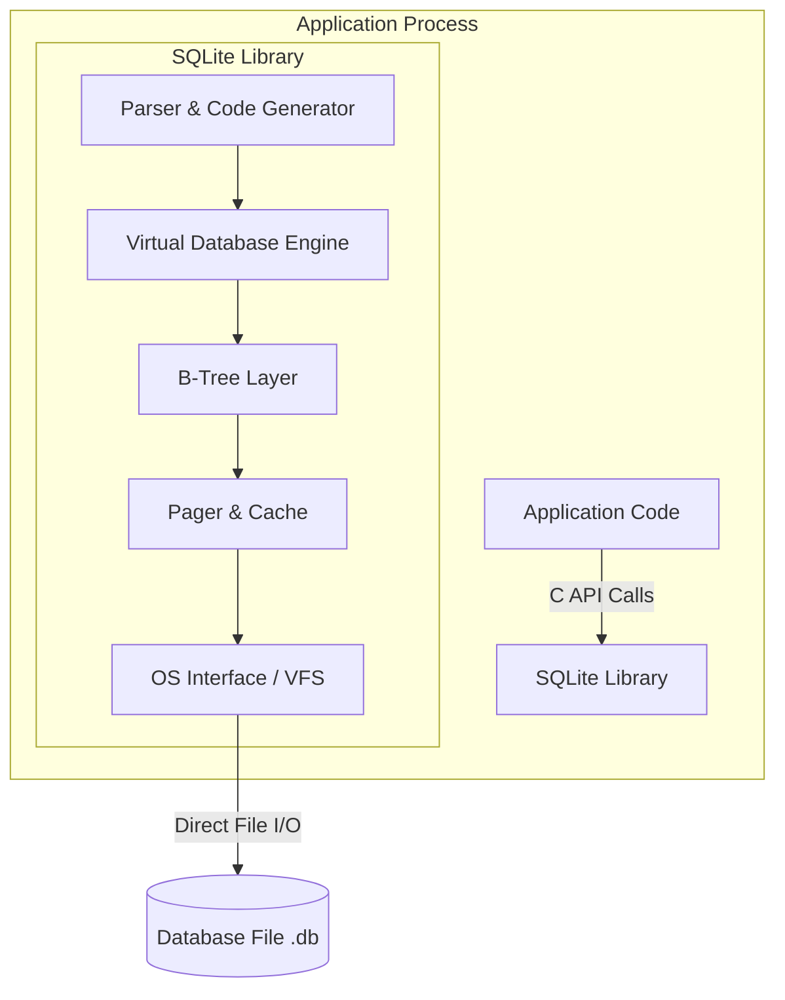
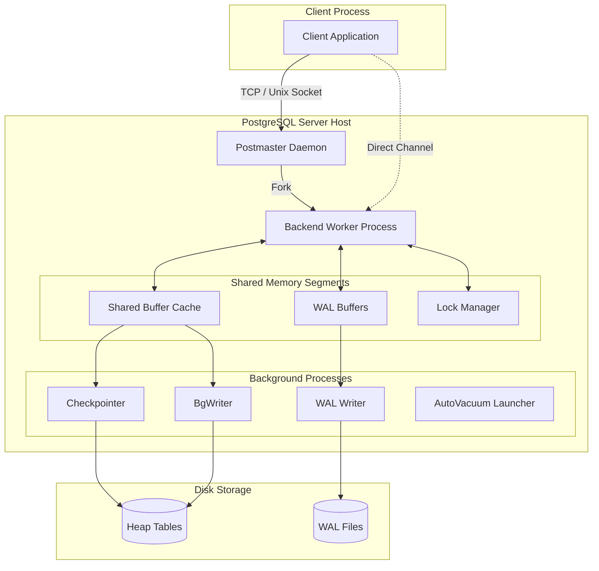

# Topic 1: PostgreSQL vs SQLite Architecture Comparison

## 1. Problem Background

### SQLite: The Zero-Admin Embedded Engine
SQLite was created in 2000 by D. Richard Hipp, who was developing software for US Navy guided-missile destroyers. The application relied on an IBM Informix database, but whenever the database server crashed or required configuration updates, the software became unusable. This friction motivated Hipp to build a serverless relational database engine. 

The primary design goal was absolute simplicity: a library that could be linked directly into an application's process without needing daemon setup, port configurations, or access controls. By storing the entire database (schema, tables, indexes) in a single cross-platform file, SQLite eliminated the role of the Database Administrator (DBA) for local applications. It brought structured SQL query capabilities to resource-constrained environments like mobile apps, web browsers, and desktop software where running a full database server is impractical.

### PostgreSQL: The Object-Relational Powerhouse
PostgreSQL began as the POSTGRES research project at UC Berkeley in 1986, led by Michael Stonebraker. It was designed to address the shortcomings of first-generation relational systems by introducing object-relational capabilities, user-defined types, rules systems, and deep extensibility. 

Unlike SQLite's focus on portability and low footprint, PostgreSQL was built from the ground up to solve complex enterprise problems. It was engineered for high concurrency, multi-user workloads, and strict compliance with ACID standards. It provides a platform where hundreds of clients can read and write data simultaneously without corrupting the state or locking each other out. Additionally, PostgreSQL allows developers to write custom types (like geometric or JSON types) and custom indexing methods (like GIN or BRIN), making it a highly customizable database engine.

---

## 2. Architecture Overview

The core architectural divide comes down to an **in-process library** vs. a **multi-process server**.

### SQLite: In-Process Database
SQLite has no network layer, daemon processes, or sockets. It is compiled directly into the application. When the app calls `sqlite3_open()`, the library opens the file and executes SQL bytecode within the application’s own thread.



When a query is executed, the SQL Compiler parses it and generates bytecode. The Virtual Database Engine (VDBE) then interprets this bytecode. The B-Tree layer structures the pages, the Pager handles caching and transactions, and the VFS (Virtual File System) maps the database calls directly to the host OS filesystem APIs.

---

### PostgreSQL: Multi-Process Server
PostgreSQL runs as a standalone network service. It relies on a process-per-connection architecture, initializing shared memory segments for communication between processes.



The master daemon, `postmaster`, listens on port `5432`. When a client connects, `postmaster` forks a dedicated `postgres` backend worker process to handle that client's queries. These backend processes read and write to a shared memory block containing the Shared Buffer Cache (which keeps database pages in RAM) and the WAL buffers. Background helper processes handle background writes (`bgwriter`), periodic synchronization (`checkpointer`), log writing (`walwriter`), and space cleanup (`autovacuum`).

---

## 3. Internal Design

### 3.1. File Layout and Table Storage
SQLite packs the entire database into a single file. By default, it stores tables as Index-Organized Tables (IOT). In this setup, the table is structured as a B+Tree where the keys are 64-bit integers (`rowid`). The leaf nodes of this B+Tree store the actual column values. If you do not specify a primary key, SQLite generates a hidden `rowid` automatically.

PostgreSQL uses a directory-based storage layout. Inside `$PGDATA/base/`, each table and index is assigned a unique file OID, and the OS stores them in separate files (split into 1GB segments). PostgreSQL uses Heap Tables, meaning rows (tuples) are appended to the table file in no particular order. The database indexes (B-Trees) do not contain raw table data; instead, they store Tuple Identifiers (TIDs) that point to the specific page and slot offset where the row lives in the heap.

### 3.2. Page Organization
SQLite pages default to 4KB (matching the standard OS block size). A B-Tree page contains a page header, an array of cell pointers growing downward, and the actual cells (keys and row payloads) growing upward from the bottom. If a row is too large to fit in a single page, SQLite creates an overflow page chain.

PostgreSQL pages are 8KB. The layout starts with a page header (which contains transaction info and free space offsets), followed by line pointers (ItemIds) pointing to the tuples. The free space is kept in the middle, and the heap tuples grow upward from the bottom of the page.

### 3.3. Transaction and Concurrency Controls
In SQLite's default rollback journal mode, writing to the database requires locking the entire file. Before a page is modified, its original state is saved to a separate rollback journal file. During a commit, the library locks the database exclusively, preventing any other reads or writes. 

SQLite also supports Write-Ahead Logging (WAL) mode. In WAL mode, updates are appended to a secondary `.db-wal` file. Readers pull data from both the main file and the WAL file, while the writer appends new pages to the end of the WAL. This setup allows multiple readers to run concurrently with a single writer, though only one write operation can run at any given time.

PostgreSQL uses a highly concurrent Multi-Version Concurrency Control (MVCC) model. It does not overwrite rows in place during updates. Instead, every row header contains two fields: `xmin` (the ID of the transaction that inserted the row) and `xmax` (the ID of the transaction that deleted or updated it). 

When a row is updated, PostgreSQL marks the old row's `xmax` as committed and inserts a new version of the row with its `xmin` set to the current transaction. Active queries use a transaction snapshot to determine which row versions are visible. This allows readers and writers to run simultaneously without blocking each other.

---

## 4. Design Trade-Offs

| Aspect | SQLite | PostgreSQL |
| :--- | :--- | :--- |
| **Process Model** | Runs inside client application process | Multi-process client-server daemon |
| **Concurrency** | Single active writer (db-level locks) | High concurrency (row-level locks via MVCC) |
| **Setup & Config** | Zero config, file-based | High configuration (requires port/user tuning) |
| **Memory Footprint** | Extremely low (few megabytes) | High (dozens of megabytes per active process) |
| **Data Types** | Dynamic typing (manifest typing) | Strict, extensible static typing |
| **Write latency** | Near-zero (no network round-trips) | Network socket round-trip overhead |

### Choosing SQLite for Local and Embedded Apps
For local applications, SQLite is often the best choice because it eliminates network overhead and administration. 
*   Since the library runs in-process, querying is essentially a direct memory copy and local disk read, bypassing TCP/IP socket serialization.
*   It requires no server management, which is critical for mobile applications (iOS/Android) and desktop software where users cannot be expected to manage a database daemon.
*   However, because writing requires a database-level lock, SQLite cannot scale to multi-user web applications where multiple users write to the database concurrently.

### Choosing PostgreSQL for Multi-User Web Services
PostgreSQL is designed for high-concurrency environments.
*   Its row-level locking and MVCC engine ensure that writing to one row does not block queries reading or writing to other rows.
*   It handles complex analytical queries, subqueries, and window functions using a cost-based optimizer that evaluates tables using deep stats.
*   The trade-off is the operational footprint: PostgreSQL consumes a significant amount of memory, requires connection pooling (like PgBouncer) to scale beyond a few hundred processes, and needs routine maintenance (such as `VACUUM` tuning) to manage table bloat.

---

## 5. Experiments / Observations

We compared SQLite3 and PostgreSQL performance and storage footprints on a local machine.

### SQLite3 Observations
We ran a test database (`test.db`) through the SQLite CLI:
```bash
sqlite3 test.db
PRAGMA page_size;
PRAGMA page_count;
PRAGMA mmap_size = 268435456; -- Attempting 256MB memory map
```
*   **Storage**: The database was written to a single `test.db` file, which measured **3.7 MB to 8.8 MB** depending on the row counts.
*   **Page Layout**: The default page size was **4096 bytes (4 KB)**, resulting in page counts between 931 and 2,242 pages.
*   **Memory Mapping**: Turning on memory mapping (`mmap_size`) did not yield noticeable speedups for full table scans. For small databases that easily fit inside the operating system's page cache, SQLite's normal file I/O is already buffered in RAM, making memory mapping redundant.
*   **Scan Performance**: A sequential scan of the table took **40–52 ms**.

### PostgreSQL Observations
We ran similar checks on our local PostgreSQL database:
```sql
SHOW block_size;
SELECT relpages FROM pg_class WHERE relname = 'users';
SELECT pg_size_pretty(pg_relation_size('users')) AS table_size;
EXPLAIN ANALYZE SELECT * FROM users;
```
*   **Storage**: The `users` table occupied **6.4 MB to 7.5 MB** on disk. This is larger than SQLite's file because PostgreSQL adds transaction headers to every row and maintains separate WAL segments.
*   **Page Layout**: PostgreSQL used an **8 KB block size** (double SQLite's size), spreading the table across 824 to 935 pages.
*   **Scan Performance**: Running `EXPLAIN ANALYZE SELECT * FROM users;` completed the scan in **6.5 ms to 37.8 ms**. Because PostgreSQL uses a dedicated shared buffer cache and background processes, it executed the query up to 6 times faster than SQLite on the same hardware.

---

## 6. Key Learnings

1.  **Architecture Dictates Performance**: SQLite's in-process model makes it fast and lightweight for single-user apps, but it cannot scale to heavy write concurrency due to its file-locking design. PostgreSQL's process-per-connection architecture allows high concurrency but introduces connection overhead.
2.  **The True Cost of MVCC**: PostgreSQL's append-only MVCC model enables lock-free reads and writes, but it results in larger table sizes on disk compared to SQLite's compact file-based format.
3.  **Caching Strategies**: SQLite relies on the OS page cache for performance, whereas PostgreSQL manages its own memory segment (Shared Buffers) using a Clock Sweep algorithm to optimize cache hits for database access patterns.
