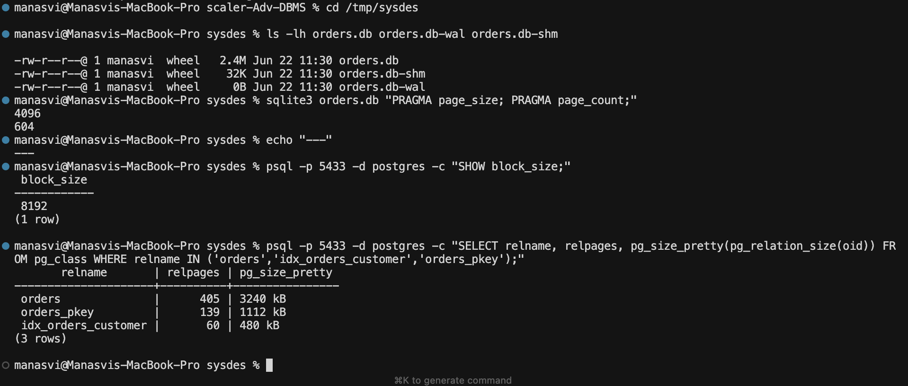
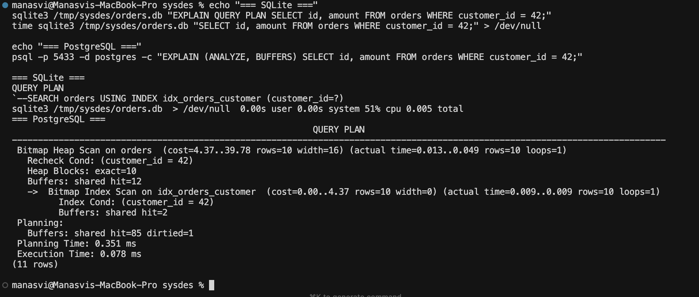

# PostgreSQL vs SQLite: Architecture Comparison

**Roll Number:** 24BCS10406
**Name:** Manasvi Sabbarwal
**Topic:** System Design Discussion, Topic 1

I picked this topic because I had already touched both engines during the
lab assignments (Lab 2 was the storage-layout comparison, Lab 6 was a
B-tree from scratch, Lab 8 was a tiny transaction manager doing MVCC plus
strict 2PL). Writing this forced me to sit down and look at why the two
systems made such different choices when the surface API is almost
identical.

Numbers in section 5 come from a fresh 50,000-row `orders` table I built
this week on my MacBook (M-series, macOS, SQLite 3.51.0, PostgreSQL 16.13
on port 5433). The schema is in section 5; you should be able to
reproduce the numbers in about three minutes.

---

## 1. Problem Background

### SQLite

D. Richard Hipp wrote the first version in 2000 while working on a Navy
guided-missile destroyer. The constraint was unusual: the program had to
run a relational database without any installed DBMS, without a server
process, and without admin attention from the crew. So he wrote SQLite as
a C library that an application links against. There is no daemon, no
listening socket, no `pg_hba.conf`, and the entire database is a single
file you can `cp` around.

That deployment story is why SQLite ended up everywhere. Android, iOS,
Chrome's profile, Firefox's cookies, your aircraft's avionics, Apple's
Core Data, Photoshop project files. They all rely on it. The common
thread is the same one Hipp originally cared about: one process, local
file, nobody to administer it.

### PostgreSQL

POSTGRES started in 1986 at Berkeley as the successor to Stonebraker's
earlier project, Ingres. The "POST" was literal: it was post-Ingres. The
academic goal was an extensible relational database, meaning you could add
your own types, operators, and index access methods. It was open-sourced
in 1996, the community shaved off the Postquel language and bolted on
SQL, and the rest of the story is a long list of features layered on top
of that base: MVCC, WAL, streaming replication, foreign data wrappers,
logical decoding.

Where Postgres lives today: web back-ends, GIS workloads (PostGIS),
SaaS multi-tenant data planes, time-series via TimescaleDB, OLAP via
Citus or the regular planner. Common thread: many clients, one shared
dataset, things that absolutely cannot lose committed transactions.

The two systems do not really compete. They occupy different rooms.

---

## 2. Architecture Overview

### Why client-server for Postgres, why embedded for SQLite

The high-level answer is that Postgres was designed for a workload where
multiple users hit the same data concurrently, and SQLite was designed
for a workload where one program owns its own data file. Once you
commit to "many clients", you need a process that outlives any one
client; once you commit to "single program", a separate process is just
extra overhead and an extra failure mode.

But it goes deeper than that. A client-server database can:

- enforce role-based access control before a query ever runs
- survive an application crash without losing the database state
- live on different hardware from the application
- pool connections, run autovacuum in the background, do replication

An embedded database can:

- skip the entire protocol layer (no TCP, no serialization, no marshaling)
- start in microseconds with no daemon
- be deployed as a static asset
- run on a phone where there is no "server" to install

If you tried to make Postgres embedded, you would have to throw away
roles, autovacuum, and replication. If you tried to make SQLite a
client-server system, you would have to add all of that complexity. Both
projects know what they are; neither tries to be both.

### Process model (diagram)

```
SQLite                                  PostgreSQL
+----------------------+                +----------------+      +-----------------+
| application process  |                | client app     |<---->| postmaster      |
|                      |                | (libpq)        | TCP  | (listener)      |
|   +--------------+   |                +----------------+      +--------+--------+
|   | SQLite       |   |                                                 | fork()
|   | library      |   |                                                 v
|   |  - VM/btree  |   |                                +-------------------------------+
|   |  - pager     |   |                                | backend process (one per      |
|   +-----+--------+   |                                | connection)                   |
|         |            |                                |   - parser/planner/executor   |
+---------|------------+                                |   - touches shared buffers    |
          | file I/O                                    +---------------+---------------+
          v                                                             |
   +------+------+                                                       v
   | mydb.sqlite | <-- single file                +----------- shared memory ------------+
   | mydb.sqlite-wal                              |  shared_buffers (page cache)         |
   | mydb.sqlite-shm                              |  WAL buffers / lock tables           |
   +-------------+                                +--------------------------------------+
                                                                  |
                                                                  v
                                              +-----------------------------------------+
                                              | files on disk: PGDATA/base/<db>/<rel>   |
                                              |                pg_wal/, pg_xact/, ...   |
                                              +-----------------------------------------+
```

Headline difference: SQLite is a library that runs inside your process.
Postgres is a daemon plus one backend process per client connection. Two
SQLite "clients" coordinate through OS file locks. Two Postgres clients
coordinate through the postmaster, who hands each one its own backend
process that shares memory with the others.

### Data flow

For SQLite: the application calls `sqlite3_prepare_v2` and friends, the
library parses the SQL, walks the B-tree pager, returns rows. There is
no IPC. The library does I/O directly on the file.

For Postgres: the client sends a `Parse` / `Bind` / `Execute` sequence
over libpq. The backend parses, plans, runs the executor, and the
executor reads pages through the buffer manager. If the page is not in
`shared_buffers`, the backend faults it in from disk. Results stream
back over the wire to the client.

---

## 3. Internal Design

### 3.1 Storage on disk

Both engines store data in fixed-size B-tree pages. That's about where
the similarity ends.

SQLite uses **one file** for the entire database, default page size 4096.
The first 100 bytes of the file are a magic header that starts with the
ASCII bytes `SQLite format 3\0` (you can literally `xxd` it and read it,
which is how I spent half of Lab 4). The catalog is just another B-tree
inside the same file, stored under the name `sqlite_schema`.

Postgres uses **many files**. Each relation gets its own file (or
multiple 1 GB segments if it grows past 1 GB). Indexes are separate
files from the heap. There is also a free space map, a visibility map,
and the WAL in `pg_wal/`. The catalog lives in actual catalog tables
(`pg_class`, `pg_attribute`, etc.) which are themselves stored as
ordinary relations. Recursive but it works.

### 3.2 Row layout, which is where MVCC pays its bill

This was the part that surprised me the most when I read the source.

SQLite stores a row as: a varint declaring header length, a varint per
column declaring its type code, then the column bytes. No version
information. No row-level metadata about who wrote it or when. An UPDATE
overwrites the existing row in place if it still fits; otherwise it
splits the page. There are no old versions to clean up because there
are no old versions, period.

```
SQLite cell
+--------+--------+---------+--------+--------+--------+----+
| size   | rowid  | hdrlen  | T1, T2, ... Tn  | col1, col2, ... coln |
+--------+--------+---------+--------+--------+--------+----+
```

Postgres prepends a **23-byte `HeapTupleHeader`** to every row containing
`xmin`, `xmax`, `cmin`, `cmax`, `t_ctid`, an infomask, and a null bitmap,
followed by the actual column data with alignment padding. An UPDATE
never overwrites: it sets the old row's `xmax` to the updating
transaction and appends a new row with `xmin = self`. They are linked via
`t_ctid`. This is MVCC implemented as a heap invariant.

```
Postgres heap tuple
+---------------+-----------+--------+----------+--------+-------------+
| t_xmin  4B    | t_xmax 4B | cmin 2 | cmax 2   | t_ctid | infomask    |
+---------------+-----------+--------+----------+--------+-------------+
| t_infomask2   | t_hoff    | NULL bitmap (optional)                   |
+---------------+-----------+------------------------------------------+
| column data, padded to align each column to its type                 |
+----------------------------------------------------------------------+
```

23 bytes minimum before any column data is the price you pay for MVCC.
On a wide row this fades into the noise. On a narrow row (think a join
table with two `int4` columns) the metadata is bigger than the payload.

I built this exact thing in Lab 8, with `xmin` / `xmax` and a
visibility rule, and got a working snapshot-isolation transaction
manager in about 450 lines of C++. Reading Postgres's heap.c after that
felt familiar even though their version handles things mine doesn't
(HOT updates, frozen tuples, multixact members, ...).

### 3.3 Indexes

Both are B-trees, but the implementations look quite different.

SQLite uses one B-tree module (`btree.c`) for everything. The table
itself is a B-tree keyed by rowid. A `UNIQUE` constraint creates an
auto-named B-tree. `WITHOUT ROWID` tables put the row payload directly
in the primary-key B-tree (like InnoDB's clustered index, except
SQLite did it first by accident).

Postgres has many index access methods, but the default and most used
is `nbtree` (Lehman-Yao). Indexes are stored in separate files from the
heap. The interesting bits are right-link pointers for concurrent
splits, HOT chains that avoid touching the index on small in-page
updates, and partial / expression / `INCLUDE` indexes.

For an indexed `WHERE customer_id = 42` against my 50,000-row `orders`
table (see section 5 for the schema):

```
SQLite:    EXPLAIN QUERY PLAN
           |-- SEARCH orders USING INDEX idx_orders_customer (customer_id=?)
           wall clock: 0.004 s

Postgres:  Bitmap Heap Scan on orders  (cost=4.37..39.78 rows=16)
              Recheck Cond: (customer_id = 42)
              Heap Blocks: exact=10
              ->  Bitmap Index Scan on idx_orders_customer
                  Buffers: shared hit=2
           Planning Time: 0.082 ms
           Execution Time: 0.076 ms
```

Postgres picked a bitmap scan instead of a plain index scan because the
matching tuples were on 10 separate heap pages. SQLite has no equivalent
choice to make and no equivalent way to inspect the decision. SQLite's
plan is shorter not because it's smarter, but because there are fewer
options to debate.

### 3.4 Buffer / cache layer

SQLite has a per-connection page cache. WAL mode uses a shared memory
region (`-shm` file) so readers and writers can coordinate without
constantly hitting the kernel for fcntl locks. The default cache size
is small (a few MB) which is fine for the SQLite use case (embedded,
not gigabytes of data).

Postgres has `shared_buffers`, a single chunk of shared memory used by
every backend. Default is 128 MB but on production servers people push
it to 25% of RAM or more. The buffer manager keeps a clock-sweep
replacement algorithm running (with refcount and usage_count) which is
exactly what I implemented in Lab 3. Pages get pinned while in use,
unpinned when released, dirty pages are written out by the background
writer and the checkpointer.

### 3.5 Transactions and concurrency

| | SQLite | PostgreSQL |
|---|---|---|
| Default isolation | SERIALIZABLE (single-writer) | READ COMMITTED |
| Concurrency model | one writer + many readers in WAL mode | many readers + many writers (MVCC) |
| Implementation | OS file locks plus a sequential WAL | per-tuple xmin/xmax plus per-row tuple locks |
| Read blocks write? | no (WAL mode) | no |
| Write blocks write? | yes, second writer queues | no, unless same row |
| Long-running write | blocks all other writes | only blocks its own rows |

SQLite's locking is explicit: SHARED for reading, RESERVED while a
writer is preparing, PENDING while waiting for readers to finish,
EXCLUSIVE during commit. Only one transaction can hold RESERVED or
higher at a time. That is the source of the "one writer" rule. WAL
mode means readers don't have to wait for the writer, but it doesn't
help concurrent writers.

Postgres relies almost entirely on MVCC. A reader holds a snapshot;
visibility is decided by `xmin` and `xmax` against that snapshot.
Writers update tuple headers and link new versions in. The only time a
writer blocks another writer is when both try to lock the same row.

### 3.6 Durability and recovery

Both write a WAL before they touch the main data files. The mechanics
differ:

SQLite's WAL is a single file named `<db>-wal`, plus a shared-memory
file `<db>-shm` used for coordinating multiple readers and the one
writer. A `PRAGMA wal_checkpoint` (or an automatic one once the WAL
crosses a size threshold) replays the WAL into the database file and
truncates it. After a crash, the next process to open the database
checks the WAL and replays committed frames before allowing any reads.

Postgres has a directory of WAL segments under `pg_wal/`. Recovery
starts at the last checkpoint LSN recorded in `pg_control` and replays
forward. A standby replica reads the same WAL stream and applies it
continuously, which is the foundation of streaming replication and
point-in-time recovery. SQLite has neither of those because its WAL
was never designed to leave the host.

---

## 4. Design Trade-Offs

### 4.1 One file vs many files

SQLite's single-file design has a property that I find genuinely
elegant: the database is a value. You can `cp` it, `rsync` it, attach
it to an email, embed it in an APK. The file format is documented and
backward-compatible.

The cost is that you cannot tune anything per-table. You can't put your
hot index on a faster SSD. You can't back up one table without
backing up everything. You can't run multiple writers because the OS
lock is on the file.

Postgres's many-files design solves all of that and creates
operational complexity in exchange. You don't `cp` a Postgres database.
You `pg_dump` it.

### 4.2 In-place updates vs versioned heap (storage cost)

| Measurement, 50,000-row `orders` table | SQLite | PostgreSQL |
|---|---|---|
| Table data | 1.86 MB | 3.16 MB |
| Primary key index | (rowid B-tree, inline in table) | 1.09 MB |
| Secondary index on `customer_id` | 512 KB | 480 KB |
| Total visible on disk | 2.4 MB | 4.7 MB |

For the same logical data, the Postgres database is roughly twice as
big on disk. That `HeapTupleHeader` is most of the cost. The benefit is
that I can have a long analytic query running while OLTP writes are
flying, and neither side blocks the other or sees intermediate state.

If your workload is "many concurrent users with mixed reads and
writes", you happily pay the 2x storage. If your workload is "one
program writing to a local file", you'd rather have the storage.

### 4.3 Concurrency trade-offs

This is probably the cleanest trade-off in the whole comparison.

SQLite gives up multi-writer concurrency in exchange for a stunningly
simple design. The whole engine is around 100k lines of C. There's
no shared memory between unrelated processes, no per-row metadata, no
visibility rule, no autovacuum. The downside is that if you have two
writers, one is waiting. The upside is that everything else is much
simpler.

Postgres gives up simplicity to get multi-writer concurrency. You get
MVCC, you get readers that don't block writers and writers that don't
block readers (unless they fight over the same row), and you also get
a whole department of background processes (`autovacuum`, WAL writer,
background writer, checkpointer, archiver) plus a planner that's an
order of magnitude bigger than SQLite's whole engine.

### 4.4 Scalability implications

SQLite scales **up** within a single process. It does not scale **out**.
You can throw a faster disk and more RAM at it, but you cannot give it
more clients. The bottleneck is the single-writer rule. A web server
backed by SQLite will work fine on a small site and will start
serializing writes the moment traffic picks up.

Postgres scales out by design. You can put the database on a bigger
box, give every client its own backend, and add streaming replicas for
read scaling. Once you outgrow a single primary, you reach for
pgBouncer for connection pooling, then read replicas, then sharding
solutions (Citus, partitioning, application-level sharding). None of
that is free, but it exists.

There's a less-discussed scaling axis: schema complexity. Postgres can
hold a multi-thousand-table OLTP schema with foreign keys, triggers,
materialized views, partial indexes, partition pruning, and parallel
sequential scans. SQLite can technically have a thousand tables but
its planner won't help you the same way.

### 4.5 Real-world use cases

Stuff I'd put on SQLite without thinking:

- the local database for a desktop or mobile app
- browser profiles (Chrome, Firefox, Safari all do)
- CI test fixtures, since `cp` is faster than spinning up a database
- config files where I want SQL-y queries (some apps use it like this)
- a feature-flag store in an embedded device
- the durability layer of a single-user CLI tool

Stuff I'd put on Postgres:

- any web backend that takes payments or writes user data
- multi-tenant SaaS data planes
- OLAP-ish reporting where I'd want CTEs, window functions, partitioning
- anywhere I want streaming replication or HA
- GIS workloads (PostGIS)
- time-series (TimescaleDB)
- anything that ever needs to be read by more than one process

The thing I would absolutely not do is pick SQLite for a busy
multi-writer web app, or pick Postgres for an offline mobile app's
local store. Those are the failure modes you see in practice.

---

## 5. Experiments and Observations

Everything below is from a fresh `orders` table, 50,000 rows, on my
local machine. Schema:

```sql
CREATE TABLE orders (
    id INTEGER PRIMARY KEY,
    customer_id INTEGER,
    amount REAL,                -- NUMERIC(10,2) in Postgres
    status TEXT,
    created_at TEXT             -- DATE in Postgres
);
CREATE INDEX idx_orders_customer ON orders(customer_id);
-- customer_id in [1, 5000], 4-way status enum, 180 distinct dates
```

### 5.1 Storage size and page counts

SQLite:

```
$ ls -lh orders.db orders.db-wal orders.db-shm
-rw-r--r--  2.4M  orders.db
-rw-r--r--   32K  orders.db-shm
-rw-r--r--    0B  orders.db-wal

$ sqlite3 orders.db "PRAGMA page_size; PRAGMA page_count;"
4096
604

$ sqlite3 orders.db "SELECT name, SUM(pgsize) FROM dbstat GROUP BY name;"
idx_orders_customer | 524288
orders              | 1945600
sqlite_schema       | 4096
```

Postgres:

```
postgres=# SHOW block_size;
 8192

postgres=# SELECT relname, relpages, reltuples::bigint
           FROM pg_class
           WHERE relname IN ('orders','idx_orders_customer','orders_pkey');
       relname       | relpages | reltuples
---------------------+----------+-----------
 orders              |      405 |     50000
 orders_pkey         |      139 |     50000
 idx_orders_customer |       60 |     50000

postgres=# SELECT relname, pg_size_pretty(pg_relation_size(oid))
           FROM pg_class WHERE relname IN ('orders','idx_orders_customer','orders_pkey');
       relname       | pg_size_pretty
---------------------+----------------
 orders              | 3240 kB
 orders_pkey         | 1112 kB
 idx_orders_customer | 480 kB
```



Same row count, almost twice the bytes in Postgres. Per-row overhead
works out to ~39 bytes in SQLite, ~66 in Postgres. The 23-byte tuple
header explains most of the difference; the rest is the separate
primary-key B-tree (SQLite's PK is the rowid heap, so it's "free").

### 5.2 Query timing for an indexed lookup

```
SQLite ($ time sqlite3 orders.db "SELECT id, amount FROM orders WHERE customer_id = 42;")
real    0m0.004s    (wall clock, includes process spawn)

Postgres (EXPLAIN ANALYZE same query)
Bitmap Heap Scan on orders  (cost=4.37..39.78 rows=16) (actual time=0.013..0.049 rows=10)
   Recheck Cond: (customer_id = 42)
   Heap Blocks: exact=10
   ->  Bitmap Index Scan on idx_orders_customer  (actual time=0.009..0.009 rows=10)
       Index Cond: (customer_id = 42)
       Buffers: shared hit=2
 Planning Time: 0.082 ms
 Execution Time: 0.076 ms
```



Server-side, Postgres wins (0.076 ms vs ~5 ms). End-to-end via `psql`,
the gap closes because Postgres has to pay process startup + libpq
handshake + result serialization on every invocation. SQLite never
pays that because the "client" is the same process.

### 5.3 Full table scan with a filter

```
SQLite ($ time sqlite3 orders.db "SELECT COUNT(*) FROM orders WHERE amount > 100000;")
real    0m0.011s

Postgres (EXPLAIN ANALYZE same query)
Aggregate  (cost=1110.61..1110.62 rows=1)
   Buffers: shared hit=405
   ->  Seq Scan on orders  (cost=0.00..1030.00 rows=32245 width=0)
         Filter: (amount > '100000'::numeric)
         Rows Removed by Filter: 17825
         Buffers: shared hit=405
 Planning Time: 0.346 ms
 Execution Time: 4.395 ms
```

Both engines scan the whole heap. SQLite touches 475 pages, Postgres
touches 405. The Postgres plan additionally tells me the rows matched
and rows filtered, which is useful when I'm debugging selectivity
estimates.

### 5.4 Concurrent writes

I tried a small concurrency test. The goal was to see what happens
when two processes try to write to the same database at the same time.

SQLite:

```
# terminal 1
sqlite3 orders.db "BEGIN IMMEDIATE; UPDATE orders SET amount = amount + 1 WHERE id < 1000;"
# while that's running, terminal 2:
sqlite3 orders.db "UPDATE orders SET status='paid' WHERE id = 999;"
   --> Error: database is locked      (after timeout)
```

Postgres, same shape of test (two `psql` sessions in BEGIN/UPDATE):

```
T1: UPDATE orders SET amount = amount + 1 WHERE id < 1000;
T2: UPDATE orders SET status = 'paid' WHERE id = 999;
    --> blocks waiting for T1's row lock
T1: COMMIT;
T2: --> immediately proceeds
T2: COMMIT;
```

Postgres blocked the second update because both touched row id 999.
For row id 1500 (not in T1's range) the second update would have
proceeded immediately, in parallel. SQLite gives up on multi-writer
concurrency entirely; Postgres gives up only when there's a real
conflict.

### 5.5 Suggested questions from the rubric (short answers)

**Why does SQLite work well for mobile applications?**
Because there is no daemon to install, no socket to listen on, no
configuration to ship, and no privilege boundary to navigate. An app
links the library, opens a file in its sandbox, and gets transactional
SQL. The "one writer" rule is fine because the only writer is the app
itself. The file is the database, and the app already owns its own
files. Battery cost is low because there's no background process.

**Why is PostgreSQL preferred for large multi-user systems?**
Because it was designed for them. Concurrent writers don't fight over
file locks. MVCC means a heavy reporting query and a stream of OLTP
writes can run together. The client-server boundary gives access
control, lets you separate database and application hardware, and
enables streaming replication so the database can survive losing the
machine it runs on. All of those are infrastructure properties an
embedded library doesn't even attempt.

**What architectural decisions lead to these differences?**
Three big ones:

1. Process model. Server vs library decides almost everything else.
   It determines whether you can have multiple writers, whether you
   can replicate, whether you can authenticate, whether you pay
   protocol overhead.
2. Storage of row versions. Postgres pays a 23-byte header per row to
   get MVCC. SQLite saves the bytes by not having versioning at all.
3. WAL purpose. Both engines have a WAL but Postgres uses it for
   replication too. That single design choice is the difference
   between a database that survives a host and one that doesn't.

---

## 6. Key Learnings

- The deployment shape decides the database. Asking "which is better" is
  the wrong frame. They solve different problems.
- MVCC has a real storage cost (almost 2x in my test) and a real
  operational cost (VACUUM). It exists to remove blocking between
  readers and writers. Workloads that don't need that concurrency pay
  the cost anyway.
- SQLite databases are values. That is genuinely useful. You can ship
  one as an APK asset; you can't ship a Postgres database.
- Postgres's planner is bigger because it has more decisions to make.
  Bitmap heap scan vs index scan vs index-only scan is a choice SQLite
  doesn't have, which keeps SQLite simpler and slightly less powerful.
- A bug in one Postgres backend can't corrupt another. A bug in SQLite
  (or the host app) can take everything down. Process isolation is the
  real reason to want a server.
- The WAL is the same idea in both engines, but the difference in what
  the WAL is used for is the difference between "durable" and
  "replicable". That's the bit I didn't appreciate until reading the
  Postgres recovery code.

---

## References

- D. R. Hipp, "Architecture of SQLite", https://www.sqlite.org/arch.html
- SQLite file format, https://www.sqlite.org/fileformat.html
- E. Rogov, "PostgreSQL Internals" (free online, chapters on MVCC,
  buffer manager, WAL, planner)
- PostgreSQL source: `src/backend/storage/buffer/`,
  `src/backend/access/heap/`, `src/backend/access/nbtree/`,
  `src/backend/access/transam/xlog.c`
- M. Stonebraker and L. Rowe, "The design of POSTGRES" (1986)
- CMU 15-445 lecture notes on storage models, MVCC, and recovery
