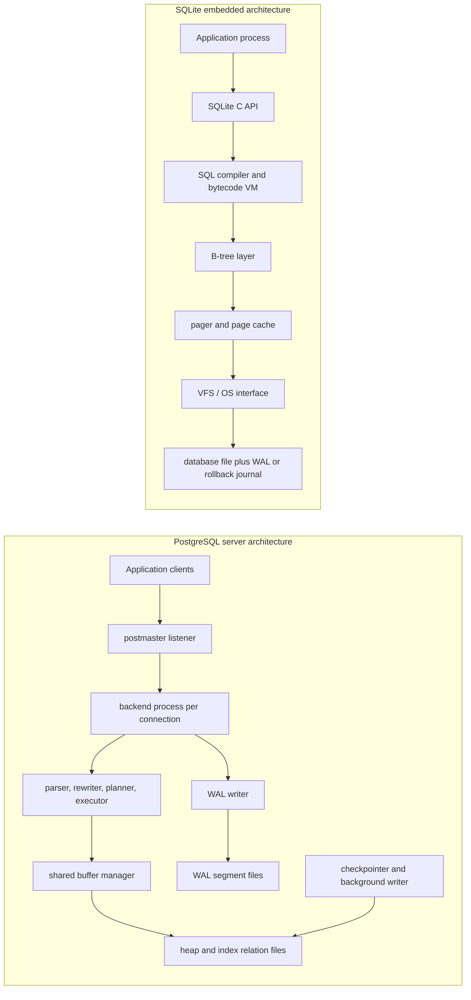

# PostgreSQL vs SQLite Architecture Comparison

## 1. Problem Background

PostgreSQL and SQLite both provide relational storage, SQL execution, indexing, transactions, and durability, but they were built for very different operating environments.

PostgreSQL exists to serve many concurrent users over a network. It is a full database server with its own long-running processes, shared memory, background workers, write-ahead log, query optimizer, access-control system, and extensibility surface. Its design assumes that the database is an independent service that many applications and sessions may use at the same time.

SQLite exists to put a reliable SQL database inside an application. It is linked as a library, runs in the caller's process, and stores the database in ordinary files. This makes it ideal for mobile apps, desktop applications, local caches, browsers, test fixtures, edge devices, and small services that need durable local state without operating a database server.

The architectural difference is not accidental. PostgreSQL optimizes for multi-user coordination, operational control, and server-side scalability. SQLite optimizes for zero administration, portability, low latency inside one process, and a small deployment footprint.

## 2. Architecture Overview



### Data Flow Summary

| Concern | PostgreSQL | SQLite |
| --- | --- | --- |
| Deployment model | Separate server process tree | Library embedded in the application |
| Connection model | Client-server protocol over socket/TCP | Function calls inside the application process |
| Storage unit | Relation files made of fixed-size pages, usually 8 KB | Single database file made of pages, commonly 4 KB |
| Execution model | Parser, planner, executor inside backend process | SQL compiled to bytecode and run by SQLite VM |
| Durability | WAL records flushed before data pages | Rollback journal or WAL coordinated by pager/VFS |
| Concurrency target | Many readers and writers | Many readers, usually one writer at a time |

PostgreSQL's write path usually flows from a backend process to shared buffers, emits WAL, and later writes dirty pages during checkpoints or background writes. SQLite's write path flows from the application through the B-tree and pager layers into the database file and its rollback journal or WAL file.

## 3. Internal Design

### Process Model

PostgreSQL is a client-server DBMS. A listener accepts connections and each session is handled by a server-side backend process. Those backend processes coordinate through shared memory structures such as shared buffers and lock tables. Background processes such as the checkpointer, WAL writer, autovacuum workers, and background writer help keep foreground transactions from doing all maintenance work themselves.

This model has overhead: starting connections, maintaining shared memory, managing processes, and operating a server. The payoff is strong isolation between application code and database internals, centralized resource control, and the ability to coordinate many users.

SQLite has no separate server. The application calls SQLite APIs directly. Query compilation, execution, page caching, locking, and disk I/O all happen inside the same process as the application. This removes network and server-process overhead, which is why SQLite works well for mobile and desktop apps. The trade-off is that concurrency control must be negotiated through file locks and the database cannot hide application crashes behind a server boundary.

### Storage Engine and File Organization

PostgreSQL stores each database inside a cluster directory. Tables and indexes are separate relation files. Internally, heap tables and indexes are divided into pages, usually 8 KB. A heap page contains a page header, line pointers, free space, and tuple data. Tuple headers include transaction metadata such as `xmin`, `xmax`, and `ctid`, which are essential to PostgreSQL MVCC.

PostgreSQL table rows are stored in heap pages independently of indexes. B-tree indexes contain key values plus tuple identifiers pointing back to heap tuples. Because heap and index storage are separate, PostgreSQL can support multiple access methods and avoids forcing table layout around the primary key. The cost is extra heap lookups unless an index-only scan is possible.

SQLite stores all B-trees in one database file. Rowid tables are normally represented as table B-trees where the rowid is the key and the row payload is stored in the B-tree. Secondary indexes are separate B-trees that point back to rowids. `WITHOUT ROWID` tables change this layout and store rows directly by primary-key B-tree. This design is compact and portable because the entire database can be copied as a file, but it makes the single file the central concurrency boundary.

### Page Layout and Disk Layout

PostgreSQL pages have a slotted-page layout. Line pointers are stable identifiers for tuples on the page, while tuple data can be moved within the page during pruning or compaction. That is why a PostgreSQL tuple pointer can refer to a page number and item offset rather than a physical byte address.

SQLite pages are managed by the pager. The B-tree layer asks the pager for pages, and the pager is responsible for caching, writing, journaling, and coordinating locks through the VFS. SQLite's database file format is stable and page-oriented, which is a major reason SQLite databases can be moved between machines and application versions.

### Index Implementation

Both systems commonly use B-tree indexes, but the surrounding design changes their behavior.

In PostgreSQL, a B-tree is an access method over separate index relation files. Leaf entries point to heap tuples. The planner may choose a sequential scan, index scan, bitmap index scan, index-only scan, nested loop, hash join, merge join, or other plan depending on statistics and cost estimates.

In SQLite, table and index storage are B-trees in the same database file. The query planner chooses access paths and emits bytecode for the virtual machine. For many local workloads, a composite index can make lookups extremely direct: seek into one B-tree, then seek into another.

### Transaction Management and Concurrency

PostgreSQL uses MVCC through tuple versioning. An update creates a new tuple version rather than overwriting the visible tuple in place. Each SQL statement sees a snapshot of committed data according to transaction IDs and visibility rules. Readers generally do not block writers, and writers generally do not block readers. The trade-off is dead tuples: old tuple versions must later be removed by VACUUM, and table or index bloat can appear if cleanup falls behind.

SQLite also provides ACID transactions, but its concurrency model is centered on file-level coordination. In rollback-journal mode, SQLite writes old page images to a journal so a failed transaction can be rolled back. In WAL mode, writers append changes to a WAL file and readers can continue using a prior snapshot. WAL mode improves read/write overlap, but SQLite still has a single-writer shape: it is excellent for many local workloads, but not meant to replace a high-concurrency network database server.

### Durability and Recovery

PostgreSQL uses write-ahead logging. Before changed data pages are allowed to reach durable storage, WAL records describing the changes must be flushed. After a crash, PostgreSQL replays WAL to bring data files back to a consistent state. Checkpoints limit how far WAL replay must go.

SQLite's durability is managed by the pager and VFS. In rollback-journal mode, SQLite can restore pages from the rollback journal if a transaction fails. In WAL mode, committed changes live in the WAL until checkpointed back into the main database file. SQLite's durability therefore depends heavily on correct filesystem locking and flush behavior, which is why the VFS abstraction is central to the design.

## 4. Design Trade-Offs

| Design Choice | PostgreSQL Benefit | PostgreSQL Cost | SQLite Benefit | SQLite Cost |
| --- | --- | --- | --- | --- |
| Client-server vs embedded | Centralized multi-user database service | Requires server administration | No server to install or operate | Database engine shares fate with application process |
| Separate heap and indexes | Flexible access methods and MVCC heap versioning | Extra heap fetches and VACUUM pressure | Compact rowid table design | More limited server-style concurrency |
| MVCC tuple versions | Readers and writers can proceed concurrently | Dead tuple cleanup is mandatory | Simpler local locking model | One-writer bottleneck under write-heavy concurrency |
| WAL/checkpoints | Strong crash recovery and high transaction throughput | More operational tuning | WAL mode is simple and file-based | WAL file and checkpoint behavior matter for long readers |
| Planner sophistication | Rich plans for joins and large data sets | Depends on statistics quality | Lightweight planning with low overhead | Fewer execution strategies than a server DBMS |

### Why SQLite Works Well for Mobile Applications

Mobile applications need local persistence, offline operation, simple deployment, and low startup overhead. SQLite fits because the database is just a file and the engine is a library. There is no server process to supervise, no network hop, and no separate database account or deployment lifecycle.

The limitations are acceptable for many mobile workloads because most writes come from one application process. Even when multiple threads read, the application usually controls access patterns.

### Why PostgreSQL Is Preferred for Large Multi-User Systems

Large systems need connection isolation, concurrent writes, operational monitoring, backups, permissions, replication, indexing options, server-side extensions, and predictable behavior under many sessions. PostgreSQL's heavier architecture exists to solve those problems. It is more complex than SQLite, but that complexity buys coordination and scale.

## 5. Experiments / Observations

I built a local experiment to compare planner behavior on the same logical workload.

Run it from the repository root:

```bash
./System_Design_Docs/PostgreSQL_vs_SQLite/experiments/run_experiments.sh
```

The script creates a temporary PostgreSQL cluster under `.local/postgresql-vs-sqlite`, builds a SQLite database in the same directory, loads matching data, runs the plans, writes [EXPERIMENT_RESULTS.md](./EXPERIMENT_RESULTS.md), and stops PostgreSQL.

### Workload

- 5,000 customers across five cities.
- 50,000 orders with deterministic customer, date, status, and amount values.
- Indexes on `customers(city)`, `orders(customer_id, order_date)`, and `orders(order_date)`.
- Query: total Bengaluru revenue for orders from `2026-01-01` onward.

### Observed PostgreSQL Plan

PostgreSQL 17.10 chose a bitmap heap scan on `orders(order_date)`, a bitmap heap scan on `customers(city)`, then a hash join and group aggregate. The estimated join output was 3,256 rows and the actual output was 3,238 rows, which is close enough to show that collected statistics were useful for this workload.

Important observation: PostgreSQL did not simply follow the composite `(customer_id, order_date)` index. It decided that filtering orders by date first and hashing the 1,000 Bengaluru customers was cheaper. This reflects a server optimizer that considers join order, selectivity, buffer reads, and multiple execution strategies.

### Observed SQLite Plan

SQLite 3.51.0 used:

```text
SEARCH c USING COVERING INDEX idx_customers_city (city=?)
SEARCH o USING INDEX idx_orders_customer_date (customer_id=? AND order_date>?)
```

This is a direct nested-loop style plan: find Bengaluru customers from the city index, then use the composite order index to find each customer's qualifying orders. The plan is compact and efficient for the dataset, and it matches SQLite's embedded design: low overhead, B-tree driven access, and no separate server-side execution process.

### Result Comparison

Both systems returned the same result:

```text
Bengaluru | 3238 orders | 161794.67 revenue
```

The interesting part is not the result but the path. PostgreSQL spent planning effort to choose a set-oriented hash join. SQLite chose a straightforward indexed lookup path. That difference mirrors their design goals: PostgreSQL optimizes across many possible execution strategies for server workloads, while SQLite keeps execution lightweight and tightly coupled to local B-tree access.

## 6. Key Learnings

1. Architecture follows deployment context. PostgreSQL is a database service; SQLite is an application component.
2. PostgreSQL's complexity mainly buys concurrency, independent operation, and recovery control for many users.
3. SQLite's simplicity is an architectural advantage, not a missing feature, when the workload is local and application-owned.
4. MVCC is not free. PostgreSQL avoids many read/write conflicts by keeping tuple versions, but then needs VACUUM and careful bloat management.
5. A single database file is powerful for portability but becomes the natural concurrency boundary.
6. Query plans reveal system philosophy. PostgreSQL exposed buffer activity, estimates, and join strategy; SQLite exposed concise B-tree access decisions.

## References

- PostgreSQL documentation: [Database Page Layout](https://www.postgresql.org/docs/current/storage-page-layout.html), [MVCC Introduction](https://www.postgresql.org/docs/current/mvcc-intro.html), [Write-Ahead Logging](https://www.postgresql.org/docs/current/wal-intro.html), [Using EXPLAIN](https://www.postgresql.org/docs/current/using-explain.html), [Routine Vacuuming](https://www.postgresql.org/docs/current/routine-vacuuming.html)
- SQLite documentation: [Architecture of SQLite](https://www.sqlite.org/arch.html), [Database File Format](https://www.sqlite.org/fileformat2.html), [File Locking and Concurrency](https://www.sqlite.org/lockingv3.html), [Write-Ahead Logging](https://www.sqlite.org/wal.html), [Atomic Commit in SQLite](https://www.sqlite.org/atomiccommit.html)
