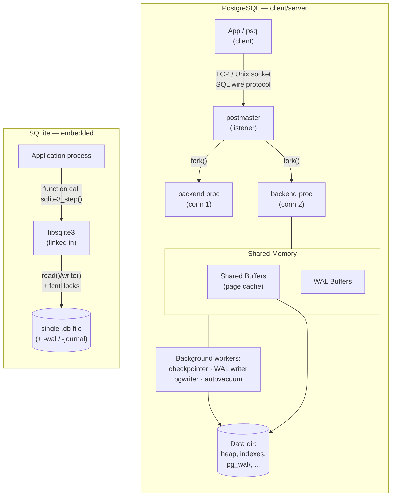
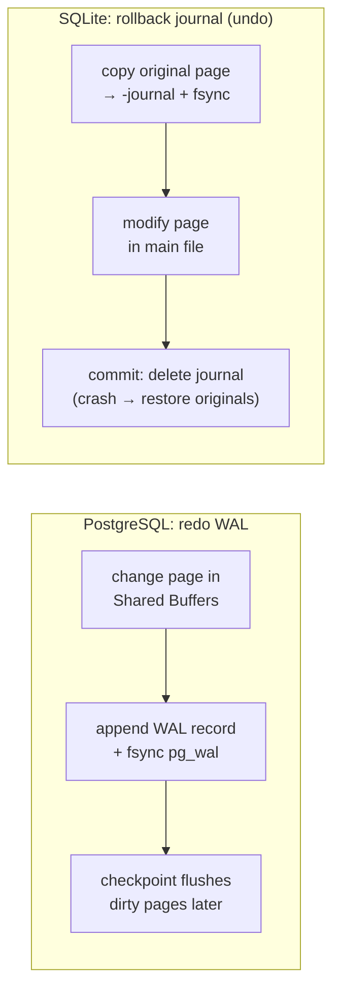

# PostgreSQL vs SQLite — An Architecture Comparison

> **Advanced DBMS – System Design Discussion**
> Author: Varun Mundada · Roll No: **SCALER_10326**
> Topic 1 — *Client–server vs embedded relational databases*

All measurements in the [Experiments](#5-experiments--observations) section were produced
on my own machine against **PostgreSQL 16.2** and **SQLite 3.45** and are reproducible from the
scripts shown inline.

---

## TL;DR

PostgreSQL and SQLite are both relational, ACID, SQL databases — and almost nothing else about
them is the same. The single decision *"is the database a **server** other processes talk to, or a
**library** linked into one process?"* cascades into every other part of the design: process model,
concurrency control, file layout, durability, and the workloads each is good at.

| Dimension | PostgreSQL | SQLite |
|---|---|---|
| Deployment | Client–server (separate daemon) | Embedded library (in-process) |
| Process model | 1 postmaster + 1 backend **process** per connection + background workers | No process; runs inside the host application's thread |
| Database = | A *cluster* of files in a data directory | **One** ordinary disk file |
| Concurrency | Many concurrent writers (row-level MVCC) | **One** writer at a time (database-level write lock) |
| Page size | 8 KB | 4 KB (default) |
| Table storage | Unordered **heap** + separate index files | Table **is** a B-tree (clustered on `rowid`) |
| MVCC | Yes — multiple on-disk row versions + `VACUUM` | No — single version; locking + journal |
| Typical scale | TB-scale, hundreds of connections, multi-core | Single app/device, GB-scale, single writer |
| "Hello world" cost | Install + run a server, tune config | `#include "sqlite3.h"` — zero config |

---

## 1. Problem Background

### Why PostgreSQL exists
PostgreSQL descends from the **POSTGRES** project led by Michael Stonebraker at UC Berkeley (1986),
itself a successor to Ingres. The goal was an *object-relational* server for **many concurrent users**
hitting **shared, long-lived, mission-critical data**: think banking, inventory, analytics. That goal
forces a **client–server** design — the data must outlive any one client, be protected from a
misbehaving client, and be safely shared by hundreds of them at once. SQL support and the modern
name arrived in 1996 (`Postgres95` → PostgreSQL).

### Why SQLite exists
SQLite was written by **D. Richard Hipp in 2000**, originally for a system that had to run with **no
database administrator and no server process available** (famously, software for a U.S. Navy
destroyer). Its design brief was essentially *"replace `fopen()`"*: give an application a real,
transactional, SQL store that is **just a function call away**, needs **zero configuration**, and
keeps the whole database in **one portable file**. That brief forces the opposite of PostgreSQL — an
**embedded, serverless library**. SQLite is today the [most widely deployed database engine in the
world](https://www.sqlite.org/mostdeployed.html) (every Android/iOS device, every major browser,
countless apps).

> **The thesis of this document:** *PostgreSQL optimizes for concurrent multi-user correctness at
> scale; SQLite optimizes for zero-friction single-process embedding.* Every architectural
> difference below is downstream of that one split.

---

## 2. Architecture Overview

### Client–server (PostgreSQL) vs embedded (SQLite)



The diagram captures the essential asymmetry:

* **PostgreSQL** is a **set of cooperating OS processes** sharing a big chunk of shared memory. A
  client never touches the files; it sends SQL over a socket to *its own* backend process. Crash
  isolation, authentication, and connection pooling all live at this boundary.
* **SQLite** has **no processes of its own**. The "database engine" is object code stitched into your
  binary. A query is a normal function call on the host thread; "talking to the database" is reading
  and writing a file with advisory locks.

### Main components

| PostgreSQL | Role | SQLite | Role |
|---|---|---|---|
| `postmaster` | Listens, authenticates, forks backends | *(host app)* | Drives the library directly |
| backend process | Parses/plans/executes one session's SQL | VDBE | Bytecode VM that executes one statement |
| Shared Buffers | Cluster-wide page cache in shared mem | Page cache | Per-connection cache of file pages |
| WAL + `pg_wal/` | Redo log for durability/replication | rollback journal **or** WAL file | Atomic-commit / crash recovery |
| checkpointer, bgwriter | Flush dirty pages | *(host thread)* | Flushes on commit/checkpoint |
| autovacuum | Reclaims dead MVCC tuples | *(n/a)* | No MVCC garbage to collect |

### Data flow for one `SELECT`
* **PostgreSQL:** client → socket → backend: **parse → rewrite → plan/optimize (cost-based) →
  execute** → pages pulled from Shared Buffers (or disk) → rows streamed back over the socket.
* **SQLite:** `sqlite3_prepare()` compiles SQL to **VDBE bytecode**; `sqlite3_step()` runs the
  bytecode opcode-by-opcode in the calling thread, pulling B-tree pages through the pager. No IPC,
  no network, no inter-process scheduling.

---

## 3. Internal Design

### 3.1 Storage structures & disk layout

**PostgreSQL** stores each table/index as one or more **1 GB segment files** under
`base/<db_oid>/`, divided into **8 KB pages**. Each relation also has *forks*: the main fork, the
**Free Space Map** (`_fsm`), and the **Visibility Map** (`_vm`). Large attribute values are pushed
out-of-line via **TOAST**. A table is a **heap**: rows ("tuples") are placed wherever there is free
space, in no particular order. Indexes are **separate** structures pointing back at heap tuples by
physical address (`ctid`).

**SQLite** keeps the **entire database in one file**, a flat array of equal-size **pages** (default
4 KB). The file *is* a forest of B-trees: a table is a B-tree keyed by an integer `rowid` (so the
table is effectively **clustered** on `rowid`), and each index is another B-tree. The first page
holds a 100-byte header plus the `sqlite_schema` table. There is no separate heap — **the table data
lives in the leaf pages of the rowid B-tree.**

```
PostgreSQL 8 KB heap page              SQLite 4 KB b-tree page
┌──────────────────────────┐          ┌──────────────────────────┐
│ PageHeader (24 B)        │          │ PageHeader (8/12 B)      │
│ ItemId array  ►►►        │          │ Cell-pointer array ►►►   │
│  (line pointers grow →)  │          │  (grows →)               │
│ ........ free space .....│          │ ....... free space ......│
│        ◄◄◄ tuples        │          │        ◄◄◄ cells         │
│  (heap tuples grow ←)    │          │  (key+payload grow ←)    │
│ Special space (indexes)  │          │                          │
└──────────────────────────┘          └──────────────────────────┘
 Tuple = HeapTupleHeader(23B:           Cell = varint rowid +
   xmin,xmax,ctid,infomask) + data        varint payload-len + record
```

Both engines use the same **slotted-page** idea — a pointer array growing down from the top, the
actual records growing up from the bottom, free space in the middle — but PostgreSQL's tuple header
is dominated by **MVCC bookkeeping** (`xmin`, `xmax`), which SQLite simply does not have.

### 3.2 Index implementation
Both default to **B-trees**. PostgreSQL additionally ships **GiST, GIN, BRIN, SP-GiST, Hash**, and
supports partial/expression/covering indexes and **index-only scans** via the visibility map.
SQLite offers B-tree indexes only (plus automatic `rowid` indexing and partial indexes). The big
structural difference: in SQLite a non-`WITHOUT ROWID` table is *already* clustered by `rowid`, so a
PK lookup is a single B-tree descent with **no heap indirection**; in PostgreSQL every index lookup
costs an extra hop to the heap (unless an index-only scan applies).

### 3.3 Transactions, concurrency control & MVCC

This is the deepest divergence.

* **PostgreSQL → MVCC.** An `UPDATE` does **not** overwrite a row; it writes a **new tuple version**
  and marks the old one's `xmax`. Each tuple records `xmin` (creating transaction) and `xmax`
  (deleting/superseding transaction); a transaction's **snapshot** decides which versions are
  visible. Result: **readers never block writers and writers never block readers**, and many
  transactions can write *different* rows concurrently with only row-level locks. The price is
  **dead tuples** that must be reclaimed by **`VACUUM`** (see experiments).

* **SQLite → one writer, file locks.** SQLite serializes writers with **database-level locking**.
  In the classic *rollback-journal* mode a writer takes an EXCLUSIVE lock, so **only one write
  transaction runs at a time** and it blocks readers during commit. **WAL mode** relaxes this:
  multiple readers can proceed against a consistent snapshot **while one writer appends** to the
  `-wal` file — but it is still **a single writer at a time**. SQLite's concurrency story is
  "great for one writer, not built for many."

### 3.4 Durability & recovery
* **PostgreSQL:** **Write-Ahead Logging.** Every change is logged to `pg_wal/` and `fsync`'d
  *before* the dirty data page is allowed to reach disk. A **checkpoint** periodically flushes dirty
  pages and records a safe restart point; crash recovery replays WAL from the last checkpoint. WAL
  is also the basis of streaming replication and PITR.
* **SQLite:** Atomic commit via either a **rollback journal** (copy original pages out *before*
  modifying them; on crash, copy them back = **undo**) or **WAL** (append new pages to `-wal`,
  leaving the main file intact until checkpoint = **redo**). Durability rests on `fsync` of the
  journal/WAL before the commit is reported.



---

## 4. Design Trade-Offs

### Advantages

| PostgreSQL | SQLite |
|---|---|
| True multi-user concurrency (row-level MVCC) | Zero configuration, no server to run/secure |
| Scales to large data, many cores, replication | Tiny footprint (~1 MB lib), in-process = no IPC |
| Rich types, extensions, many index/Join methods | Entire DB is one portable, `cp`-able file |
| Strong isolation levels incl. Serializable (SSI) | Astonishingly reliable; 100% branch-tested |

### Limitations

| PostgreSQL | SQLite |
|---|---|
| Operational weight: a server to install, tune, back up | Single writer → write-heavy multi-client = contention |
| Per-connection **process** is heavy → needs poolers (PgBouncer) | No network access; not a multi-machine server |
| MVCC produces **dead tuples / bloat** → `VACUUM` needed | Coarse (db-level) write locking |
| Connection/network latency for tiny queries | Limited types & a single (B-tree) index kind |

### Performance implications
* **Tiny, local, read-mostly queries:** SQLite wins on raw latency — there is no socket, no parser
  round-trip across processes, no MVCC visibility checks. It reads a page and returns.
* **Many concurrent writers / large working sets / analytics:** PostgreSQL wins decisively — MVCC
  keeps writers from blocking readers, the cost-based planner picks hash/merge joins and parallel
  plans, and Shared Buffers + OS cache serve a large hot set across sessions.
* **The crossover is about *contention*, not data size.** SQLite happily manages many-GB files for
  *one* writer; it degrades when *many* processes want to write the *same* file.

### Engineering decisions, stated plainly
SQLite deliberately accepts **single-writer** concurrency to gain **zero-config embedding and
single-file simplicity**. PostgreSQL deliberately accepts **operational weight and MVCC garbage** to
gain **concurrent multi-user correctness and horizontal features (replication, extensions)**. Neither
is "better" — they sit at opposite ends of the same trade-off curve.

---

## 5. Experiments / Observations

> Schema used for both engines: a small e-commerce dataset —
> `customers(5k)`, `products(1k)`, `orders(50k)`, `order_items(~125–150k)`.

### 5.1 SQLite (real output, `python ../experiments/sqlite_exp.py`)

**Page layout** — the file size is *exactly* `page_size × page_count`, confirming the flat-array-of-pages model:
```
page_size       = 4096
page_count      = 1182
file size       = 4,841,472 bytes (= 4096 * 1182)
```

**Query plans** — a PK lookup rides the `rowid` B-tree; an un-indexed filter is a full scan; adding
an index converts it to a B-tree search:
```
SELECT … WHERE id = 42         →  SEARCH orders USING INTEGER PRIMARY KEY (rowid=?)
SELECT … WHERE customer_id=99  →  SCAN orders                         -- before index
                               →  SEARCH orders USING INDEX idx_orders_cust (customer_id=?)  -- after
```

**Indexing pays off (measured, 200-run average):**
```
full table scan :   2107.1 us / query
index search    :     62.4 us / query
speedup         :     33.7x
```

**`WITHOUT ROWID` = clustered storage.** Storing the same 20 000 rows as an ordinary `rowid` table
*plus* a secondary index vs. as a `WITHOUT ROWID` (clustered) table:
```
rowid table + secondary index :  369 pages   1,511,424 bytes
WITHOUT ROWID (clustered PK)  :  310 pages   1,269,760 bytes   (~16% smaller)
```
The clustered table stores each key **once** (in the table B-tree itself) instead of duplicating it
in a separate index — the same idea InnoDB uses by default (see the MySQL/InnoDB topic).

**WAL durability + checkpointing.** With `journal_mode=WAL`, committed changes accumulate in the
`-wal` side file; the **main database file does not change** until a checkpoint folds them in:
```
after CREATE TABLE  : main=  4,096   wal=  8,272 bytes
after 5000 commits  : main=  4,096   wal=346,112 bytes   ← durable in WAL, not yet in main db
after wal_checkpoint: main=335,872   wal=      0 bytes   ← pages folded into main file
```

**The VDBE.** SQLite compiles SQL to bytecode for a register VM — `EXPLAIN` shows the opcodes:
```
addr opcode        p1  p2  p3  comment
  0  Init           0   8   0
  1  OpenRead       0   4   0
  2  Integer       42   1   0
  3  SeekRowid      0   7   1     ← seek the rowid B-tree to key 42
  4  Column         0   3   2
  6  ResultRow      2   1   0
```

### 5.2 PostgreSQL (real output, `python ../experiments/pg_exp.py`)

**Relation/page layout** (8 KB pages):
```
relname     | relpages | reltuples | size
------------+----------+-----------+--------
order_items |   956    |  150000   | 7648 kB
orders      |   319    |   50000   | 2552 kB
customers   |    32    |    5000   |  256 kB
```

**Cost-based planner picks a 3-level hash join** for the 4-table aggregate (abridged real plan):
```
Sort  (actual time=31.399..31.404 rows=5)
  ->  HashAggregate  Group Key: p.category
        ->  Hash Join  (Hash Cond: oi.product_id = p.id)        rows=18665
              ->  Hash Join  (Hash Cond: oi.order_id = o.id)    rows=18665
                    ->  Seq Scan on order_items  rows=150000
                    ->  Hash Join (Hash Cond: o.customer_id = c.id) rows=6113
                          ->  Seq Scan on orders  rows=50000
                          ->  Seq Scan on customers  Filter: city='Pune'  (rows 5000→629)
Execution Time: 31.547 ms   Buffers: shared hit=1315
```
Note the planner **estimated** `rows=6290` for Pune customers and **actually** got `6113` — the
estimate comes from `pg_statistic` (next experiment). It chose `Seq Scan`s because the query touches
a large fraction of every table — for which sequential reads beat random index lookups.

**Index turns a Seq Scan into a Bitmap Index Scan** for a selective predicate:
```
WHERE customer_id = 99   (15 of 50,000 rows)
before index:  Seq Scan on orders     Buffers: shared hit=319   Execution Time: 1.668 ms
after  index:  Bitmap Index Scan      Buffers: shared hit=15 read=2  Execution Time: 0.065 ms
```
~25× fewer buffers touched and ~25× faster — the planner switched strategy on its own once the index
made it cheaper.

**MVCC in action** — an `UPDATE` writes a *new* physical tuple (`ctid` moves, `xmin` advances); it
does **not** overwrite in place:
```
After INSERT : ctid=(0,1)  xmin=785  xmax=0  bal=100
After UPDATE1: ctid=(0,2)  xmin=786  xmax=0  bal=90    ← new version, new location
After UPDATE2: ctid=(0,3)  xmin=787  xmax=0  bal=80
After UPDATE3: ctid=(0,4)  xmin=788  xmax=0  bal=70
```

**This is why `VACUUM` exists.** A full-table `UPDATE` of 100 000 rows leaves the old versions behind,
**doubling** the heap; `VACUUM` reclaims them as free space that the *next* update **reuses**:
```
after load (100k rows) : size= 3544 kB
after UPDATE all rows   : size= 7080 kB   ← ~doubled: 100k dead versions left behind
after VACUUM            : size= 7080 kB   ← dead reclaimed; file kept as internal free space
after 2nd UPDATE all    : size= 7080 kB   ← space REUSED → no further growth
```

**Planner statistics** (`pg_stats`) — what drives those row estimates:
```
attname     | n_distinct | correlation | n_mcv
------------+------------+-------------+------
customer_id |   4986     |    0.00     | 100     (≈ 5000 distinct, as expected)
id          |     -1     |    1.00     |  -      (-1 ⇒ unique; perfectly correlated = PK order)
order_date  |    180     |    0.02     |  20
```

**WAL volume** generated by one bulk write:
```
CREATE TABLE wtest AS SELECT * FROM orders   (50,000 rows)  →  3925 kB of WAL
```

### 5.3 Head-to-head observations
| Observation | PostgreSQL | SQLite |
|---|---|---|
| PK point lookup | index → heap hop (or index-only via VM) | single rowid-B-tree descent (clustered) |
| Updating a row | new tuple version + later `VACUUM` | overwrite in place (rollback journal protects atomicity) |
| Durability log | redo WAL, replayed forward | undo journal (default) or redo WAL |
| Concurrent writers | many, row-level | one at a time, db-level |
| Cost of "hello world" | run a server | a function call |

---

## 6. Key Learnings

1. **One decision explains the whole system.** *Server vs library* predicts the process model,
   concurrency model, file layout, and durability strategy of each engine. Architecture is the
   shadow cast by the use case.
2. **Concurrency models are a genuine fork in the road.** PostgreSQL's MVCC buys non-blocking
   multi-writer concurrency at the cost of dead-tuple garbage and `VACUUM`; SQLite's single-writer
   locking buys radical simplicity at the cost of write concurrency. I *measured* both sides — the
   `ctid`/`xmin` march and the 3544→7080 KB bloat on one side; the single `-wal` writer on the other.
2. **"Clustered" storage is the same idea in two places.** SQLite's `WITHOUT ROWID` table shrank the
   same data by ~16% by storing keys once — exactly the clustered-index design InnoDB makes the
   default. Heap-plus-secondary-index (PostgreSQL/SQLite-default) trades space and an extra hop for
   flexibility.
3. **The optimizer earns its keep.** PostgreSQL changed a 1.67 ms Seq Scan into a 0.065 ms index
   scan *by itself*, driven entirely by `pg_statistic`. Good plans come from good statistics, not
   from the SQL text.
4. **Surprising bit:** both engines call their log "WAL," but they mean **opposite** things — SQLite's
   *rollback journal* is **undo** logging (save the old page) while PostgreSQL's WAL and SQLite's WAL
   mode are **redo** logging (save the new change). Same word, inverse mechanism.
5. **Pick by contention, not by size.** SQLite is not "the small one" — it manages large files fine.
   It is "the single-writer one." The moment many processes must write the same data, you want
   PostgreSQL.

---

## References
- PostgreSQL Documentation — *Internals* (Storage, MVCC, WAL): <https://www.postgresql.org/docs/16/internals.html>
- *The Internals of PostgreSQL*, Hironobu Suzuki: <https://www.interdb.jp/pg/>
- SQLite — *Database File Format*: <https://www.sqlite.org/fileformat2.html>
- SQLite — *Write-Ahead Logging*: <https://www.sqlite.org/wal.html>
- SQLite — *Architecture* and *Most Widely Deployed*: <https://www.sqlite.org/arch.html>, <https://www.sqlite.org/mostdeployed.html>
- J. Hellerstein, M. Stonebraker, J. Hamilton, *Architecture of a Database System* (2007).

*All experiment scripts (`sqlite_exp.py`, `pg_exp.py`) are reproducible; outputs above are copied verbatim from local runs on PostgreSQL 16.2 and SQLite 3.45.*
