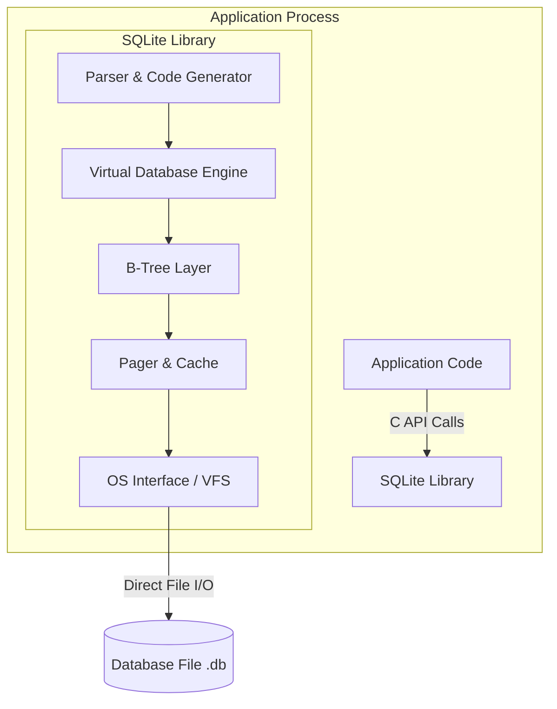
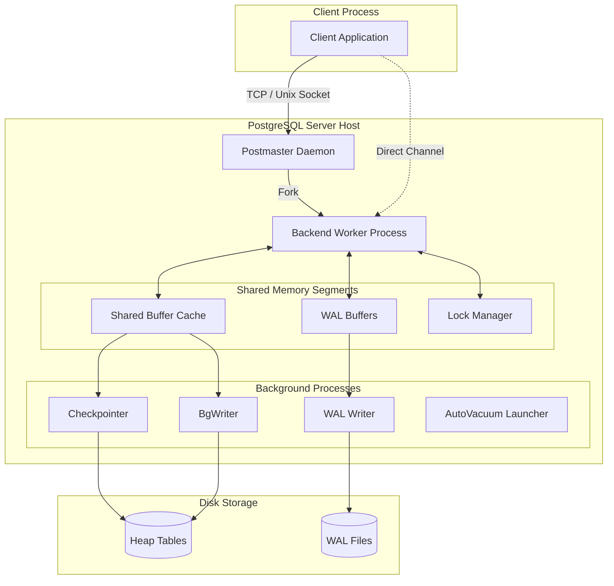

# Topic 1: PostgreSQL vs SQLite Architecture Comparison

## 1. Problem Background

### SQLite
SQLite was created in 2000 by D. Richard Hipp while working on a software system for military destroyers. The system used an IBM Informix database, but when the database went down, the software could not function. The primary goal was to design a database engine that did not require installation, setup, or administration—an embedded database that ran directly within the host application process, storing all data in a single, highly portable file. 

SQLite was built to solve the problems of:
*   **Zero Configuration**: Eliminate the overhead of Database Administrators (DBAs), port configurations, server daemons, and access controls.
*   **Portability**: Provide a database file format that could be copied across different operating systems and CPU architectures without modifications.
*   **Frictionless Integration**: Allow lightweight devices (smartphones, IoT, embedded systems, and desktop applications) to leverage SQL capabilities.

### PostgreSQL
PostgreSQL (originally POSTGRES) originated from a research project led by Michael Stonebraker at the University of California, Berkeley, starting in 1986. It was designed to succeed the INGRES database, addressing limitations in the relational model by supporting object-relational features, extensible data types, rules systems, and deep customizability. 

PostgreSQL was designed to solve:
*   **Reliability & ACID Compliance**: Provide absolute durability, crash-resilience, and transactional integrity for critical business applications.
*   **Extensibility**: Allow developers to define custom types, operators, index types (GIN, GiST, BRIN), and stored procedures in various languages (PL/pgSQL, Python, etc.).
*   **High Concurrency**: Support thousands of concurrent users executing complex transactions simultaneously without blocking each other.

---

## 2. Architecture Overview

The fundamental architectural difference between SQLite and PostgreSQL lies in **embedded library design** vs. **client-server process model**.

### SQLite Architecture
SQLite is an in-process library. It has no network socket, no daemon, and no communication protocol. All components run inside the memory space of the client application.



*   **SQL Compiler**: Parses the query, analyzes syntax, and compiles it into bytecode.
*   **Virtual Database Engine (VDBE)**: An interpreter that executes the bytecode instructions generated by the compiler. It is the heart of SQLite.
*   **B-Tree**: Organizes data pages into B+Trees (for tables) and B-Trees (for indexes) to support efficient lookups.
*   **Pager**: Manages memory caching, page transactions, locking, and rollback journals/WAL.
*   **VFS (Virtual File System)**: Provides an OS-independent interface to handle filesystem calls.

---

### PostgreSQL Architecture
PostgreSQL uses a multi-process client-server model. A single host process (`postmaster`) listens for incoming network connections and forks a new backend worker process for each client.



*   **Postmaster**: The master daemon process that initializes the shared memory segment, launches background daemons, and listens on port `5432` for connections.
*   **Backend Process**: A dedicated process spawned per connection. It parses, plans, optimizes, and executes queries for its respective client.
*   **Shared Memory**: A large pool shared by all PostgreSQL processes. It contains the **Shared Buffer Cache** (caching table pages), **WAL Buffers** (buffering write-ahead log records), and the **Lock Manager** (managing concurrency locks).
*   **Background Workers**: Dedicated helper processes:
    *   `BgWriter`: Periodically writes dirty shared buffers to disk to keep free buffers available.
    *   `Checkpointer`: Forces periodic checkpoints, writing all dirty buffers to disk and writing a checkpoint record to the WAL.
    *   `WALWriter`: Flushes WAL buffers to disk when transaction commits occur.
    *   `AutoVacuum Launcher`: Spawns autovacuum workers to reclaim space from deleted tuple versions and collect statistics.

---

## 3. Internal Design

### 3.1. Database File Organization & Table Storage
*   **SQLite**: 
    *   Uses a **single consolidated file** containing the schema, tables, indexes, and metadata.
    *   Uses **Index-Organized Tables (IOT)** by default. Every table (unless configured as `WITHOUT ROWID`) is a B+Tree where the key is a 64-bit integer `rowid` and the leaf nodes store the actual row columns.
*   **PostgreSQL**:
    *   Uses a **directory-based multi-file structure** under `$PGDATA/base/`. Each table and index is stored in one or more separate files (split at 1GB boundaries).
    *   Uses **Heap Tables**. Rows (tuples) are stored in an unordered structure (the "Heap"). Leaf nodes of indexes (B-tree, GIN, etc.) do not store row data; instead, they store **Tuple Identifiers (TIDs)**, which point directly to the physical page and line offset of the row in the Heap.

### 3.2. Page Layout
*   **SQLite**: Page size ranges from 512 to 65,536 bytes (default is 4096 bytes). Pages are divided into:
    *   *B-Tree Pages*: Contain a page header, a cell pointer array (growing downwards), and cells (keys/payloads, growing upwards).
    *   *Overflow Pages*: Used when a row is too large to fit in a single B-tree page.
*   **PostgreSQL**: Default block size is 8192 bytes (8 KB). The page layout consists of:
    *   *Page Header*: Stores metadata (LSN, flags, free space offsets).
    *   *Line Pointers (ItemIds)*: An array of 4-byte pointers that point to the actual tuples. Grow downwards.
    *   *Free Space*: Gap in the middle of the page.
    *   *Heap Tuples*: The actual data rows. Grow upwards from the bottom of the page.

### 3.3. Transaction Management & Concurrency
*   **SQLite**: 
    *   **Rollback Journal (default)**: Prior to modifying a page, the original page is written to a rollback journal file. If the transaction fails, the journal is played back to restore the original state. During writes, the entire database is locked using a hierarchical lock model (`SHARED`, `RESERVED`, `PENDING`, `EXCLUSIVE`), allowing only **one active writer** and blocking readers during commit.
    *   **Write-Ahead Log (WAL)**: Supported since version 3.7.0. Writes are appended to a separate `.db-wal` file. Readers read from the database file and the WAL file concurrently. Writers append to the WAL. Only one writer can write at a time, but **readers do not block writers, and writers do not block readers**.
*   **PostgreSQL**:
    *   **MVCC (Multi-Version Concurrency Control)**: PostgreSQL implements transaction isolation via tuple versioning. Every tuple header contains two key transaction fields: `xmin` (the ID of the transaction that inserted the row) and `xmax` (the ID of the transaction that deleted/superseded the row).
    *   **Append-Only Heap updates**: When a row is updated, PostgreSQL does not overwrite the row in place. Instead, it marks the old tuple's `xmax` as committed and inserts a new version of the row with a new `xmin`.
    *   **Visibility**: Transactions use a "snapshot" representing active transactions at a point in time. A tuple is visible to a transaction if its `xmin` has committed and its `xmax` is either uncommitted or has not yet started.
    *   **Locks**: Highly granular. Row-level locks are managed in the Shared Memory Lock Manager. Multiple transactions can write to different rows of the same table concurrently.

---

## 4. Design Trade-Offs

| Dimension | SQLite | PostgreSQL |
| :--- | :--- | :--- |
| **Operational Model** | In-process Library | Multi-process Client-Server |
| **Concurrency Scale** | Low (Single writer bottleneck) | High (Granular row-level locks, concurrent writers) |
| **Resource Footprint** | Low (Few MBs of RAM, zero daemon overhead) | High (Dozens of MBs baseline, memory per connection) |
| **Administration** | Zero config (Self-contained file) | High (Requires configuration, vacuum management, backups) |
| **Network Latency** | Zero (Direct memory copy/file reads) | Network roundtrip per query |
| **Extensibility** | Limited (Precompiled virtual machine) | High (User-defined functions, custom index types) |

### Why SQLite is preferred for Embedded/Mobile Applications
1.  **Low Resource Footprint**: Mobile devices have restricted memory and battery life. Running background daemons like PostgreSQL would drain resources. SQLite runs within the application thread, using minimal RAM.
2.  **No Administration**: Mobile apps cannot require users to install a database server, manage ports, or configure database users. SQLite's single-file, zero-config design is plug-and-play.
3.  **Low Latency for Single Users**: For local storage, crossing network boundaries or Unix sockets introduces unnecessary CPU context switches. SQLite accesses files directly via the OS Virtual File System (VFS).

### Why PostgreSQL is preferred for Large Multi-User Systems
1.  **Concurrent Writes**: In web apps with thousands of users, SQLite's single-writer limitation would cause immediate write contention and timeouts. PostgreSQL's row-level locking and MVCC allow simultaneous writes.
2.  **Sophisticated Query Planner**: PostgreSQL's cost-based optimizer handles complex joins, subqueries, and window functions on massive datasets using table statistics.
3.  **Data Safety & Replication**: PostgreSQL supports streaming replication, point-in-time recovery (PITR), and sophisticated access control, which are vital for enterprise services.

---

## 5. Experiments / Observations

An experimental comparison was run between SQLite3 and PostgreSQL locally. Below is the summary of observations.

### SQLite3 Configuration and Performance
To analyze SQLite's behavior, the database was configured using the command line:
```bash
sqlite3 test.db
PRAGMA page_size;
PRAGMA page_count;
PRAGMA mmap_size = 268435456; -- 256 MB memory map size
```

*   **Database footprint**: Stored in a single file (`test.db`). The file size ranged from **3.7 MB to 8.8 MB** depending on the dataset.
*   **Page Layout**: SQLite was configured with a default page size of **4096 bytes (4 KB)**, resulting in page counts between 931 and 2242.
*   **Memory-Mapped I/O (mmap)**: By default, `mmap_size` is 0 (disabled). Enabling `mmap_size` to 256 MB did not show a noticeable performance difference. Since the database fits entirely within the OS page cache, SQLite's normal page reads are already served from RAM, rendering mmap redundant.
*   **Sequential Scan Speed**: Running `SELECT * FROM users;` on SQLite took **40–52 ms** to scan the table.

### PostgreSQL Configuration and Performance
To investigate PostgreSQL, the following command queries were executed:
```sql
SHOW block_size;
SELECT relpages FROM pg_class WHERE relname = 'users';
SELECT pg_size_pretty(pg_relation_size('users')) AS table_size;
EXPLAIN ANALYZE SELECT * FROM users;
```

*   **Database footprint**: The `users` table occupied **6.4 MB to 7.5 MB** on disk. This is larger than SQLite because PostgreSQL maintains separate transaction metadata per row and WAL records.
*   **Page Layout**: PostgreSQL uses a default block size of **8192 bytes (8 KB)**. The table was spread across 824 to 935 pages.
*   **Sequential Scan Speed**: Running `SELECT * FROM users;` took **6.5 ms to 37.8 ms**. The query planner executed a sequential scan instantly. The query completed **up to 6 times faster** than SQLite. This is due to PostgreSQL's shared buffer caching and multi-threaded, optimized execution engine.

---

## 6. Key Learnings

1.  **Architecture Governs Use Case**: The design of SQLite as an embedded library and PostgreSQL as a client-server process segment dictates their sweet spots. An app with high concurrent traffic cannot use SQLite, while a mobile app cannot run PostgreSQL.
2.  **Page size influence**: PostgreSQL's larger 8KB block size is optimized for server environments where throughput and I/O efficiency for large rows are key, whereas SQLite's 4KB block size matches standard OS filesystem page boundaries, optimizing for local device page boundaries.
3.  **Shared Buffers vs. OS Cache**: SQLite relies heavily on the operating system page cache for performance, whereas PostgreSQL operates its own shared buffer pool to actively manage memory and replacement strategies (using the Clock Sweep algorithm) tailored to database query patterns.
