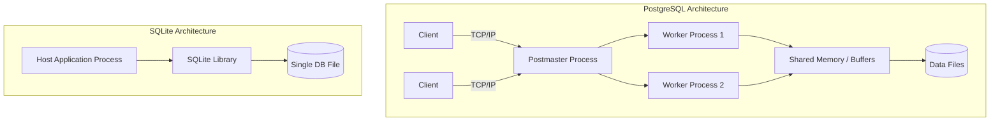

# PostgreSQL vs SQLite Architecture Comparison

## 1. Problem Background
Database systems exist to manage, store, retrieve, and update data reliably and efficiently. However, different applications have varying requirements for concurrency, scale, complexity, and deployment footprints.

**PostgreSQL** was born out of the POSTGRES project at UC Berkeley to solve the problems of complex data models and high concurrency in large, multi-user environments. It was designed from the ground up to be a robust, extensible, enterprise-grade relational database capable of handling heavy concurrent read and write operations across distributed clients.

**SQLite**, on the other hand, was created to address a completely different problem: the need for a simple, zero-configuration, serverless database that could operate seamlessly within constrained environments like mobile devices or desktop applications. The historical context of SQLite was to replace custom flat files with a structured SQL interface without the operational overhead of managing a database server. 

## 2. Architecture Overview
The fundamental divergence in their design lies in the **process model**.

### PostgreSQL: Client-Server Architecture
PostgreSQL uses a classical client-server model. The database runs as a background daemon process (`postmaster`). When a client connects (via TCP/IP or Unix sockets), PostgreSQL forks a dedicated worker process for that connection. 
- **Data Flow:** Client Request -> Connection Manager -> Parser/Planner -> Executor -> Buffer Manager -> Storage Engine.

### SQLite: In-Process (Embedded) Architecture
SQLite is a library statically or dynamically linked directly into the host application. There is no separate server daemon. The database engine shares the same process space as the application.
- **Data Flow:** Application Call (C/C++ API) -> SQLite Library -> VFS (Virtual File System) -> Disk.

## 3. Internal Design

### Storage Structures and Database File Organization
- **SQLite:** Stores the entire database (schema, tables, indexes) inside a single, cross-platform disk file. It uses a **page-based B-Tree** structure for its tables. Table data is generally clustered along with the primary key.
- **PostgreSQL:** Uses a **multi-file architecture** separated into a data directory (`PGDATA`). Tables are stored as **unordered heaps** (arrays of pages) rather than being clustered by default. 

### Page Layout
- Both use fixed-size pages (typically 4KB for SQLite, 8KB for PostgreSQL).
- **SQLite:** Page layout consists of a header, an array of cell pointers, and the cell content. If a row is too large, it spills over to overflow pages.
- **PostgreSQL:** Pages include headers that track tuple metadata such as `xmin` and `xmax` (transaction IDs for visibility), which is vital for its MVCC implementation.

### Index Organization
- **SQLite:** Defaults strictly to **B-Trees**. Since table data is physically stored in B-Trees, primary key lookups are inherently fast (Clustered Index approach).
- **PostgreSQL:** Since the main table data is an unordered heap, all indexes (including Primary Keys) are **secondary indexes**. They store logical pointers (Tuple IDs or TIDs) that point back to the specific heap page and offset. PostgreSQL supports B-Trees, but also advanced indexes like GIN, GiST, SP-GiST, Hash, and BRIN.

### Concurrency Control and Transaction Processing
- **PostgreSQL:** Implements **Multi-Version Concurrency Control (MVCC)**. Instead of locking a row when writing, PostgreSQL creates a new version of the row. Readers see a snapshot of the data that existed when their transaction began. This ensures that **readers do not block writers, and writers do not block readers**.
- **SQLite:** Uses file-level locking. While it allows concurrent readers, it restricts writes to a **single-writer** at any given time. If one process is writing, others must wait.

### Recovery Mechanisms (Durability)
- **PostgreSQL:** Uses robust **Write-Ahead Logging (WAL)**. Every change is appended to the WAL before being flushed to the actual data files. This guarantees durability in the event of a crash and is also the foundation for replication.
- **SQLite:** Historically used Rollback Journals, but now supports a **WAL mode**. In WAL mode, changes are appended to a `-wal` file instead of directly to the main database file, significantly improving concurrency as readers can read from the main file while a writer appends to the WAL.

## 4. Design Trade-Offs

### Advantages & Limitations
| Feature | PostgreSQL | SQLite |
| --- | --- | --- |
| **Setup & Maintenance** | Requires dedicated DBA, configuration, and tuning. | Zero-configuration. Works out of the box. |
| **Concurrency** | Excellent. High write concurrency due to MVCC. | Poor for heavy writes (Single-writer limit). |
| **Scalability** | Can scale horizontally (via partitioning/replication) and vertically. | Limited to the host machine's disk size/speed. |
| **Data Types** | Extensive (JSONB, GIS, Custom Types). | Dynamic typing, limited native types. |

### Performance Implications
- **SQLite** is exceptionally fast for read-heavy workloads local to the application due to the lack of network latency (no TCP/IP overhead). However, write-heavy workloads will bottleneck due to lock contention.
- **PostgreSQL** introduces network latency for every query, making single, tiny queries slightly slower than SQLite. However, for complex joins, aggregations, and concurrent transactions, its query planner and shared memory buffer pool vastly outperform SQLite.

## 5. Experiments / Observations

An interesting observation comes from examining query plans (via `EXPLAIN QUERY PLAN` in SQLite vs `EXPLAIN ANALYZE` in PostgreSQL) on a multi-table join.
- **PostgreSQL:** Evaluates complex statistics (from `pg_statistic`) to choose between Nested Loops, Hash Joins, or Merge Joins. It often prefers Hash Joins for large datasets because of its robust memory management (`work_mem`).
- **SQLite:** Predominantly relies on Nested Loop joins (often index-assisted). Because it runs in constrained environments, it avoids building large hash tables in memory, which alters how developers should index and structure queries. 
- **Write Amplification:** Under heavy writes, PostgreSQL requires frequent `VACUUM` operations to clean up dead tuples left behind by MVCC, resulting in write amplification. SQLite in WAL mode requires periodic "checkpointing" to merge the `-wal` file back into the main database, temporarily causing disk I/O spikes.

## 6. Key Learnings

1. **Architecture Dictates Use Case:** SQLite's in-process design is unmatched for edge devices, IoT, mobile apps, and local testing. PostgreSQL's client-server MVCC architecture is mandatory for web backends and concurrent analytical workloads.
2. **The Cost of MVCC:** While PostgreSQL achieves brilliant concurrency, it trades storage efficiency for it. Tracking `xmin`/`xmax` per tuple and relying on `VACUUM` to prevent table bloat introduces operational complexity that SQLite avoids.
3. **Storage Abstraction:** PostgreSQL's separation of logical indexes from physical heaps provides incredible flexibility for indexing strategies, whereas SQLite's clustered B-tree structure provides straightforward, predictable locality for standard lookups. 
4. **Surprising Observation:** Despite being an "embedded" DB, SQLite's WAL mode brings its concurrency capabilities surprisingly close to client-server databases for mixed read/write workloads, provided the write transactions are kept extremely brief.
