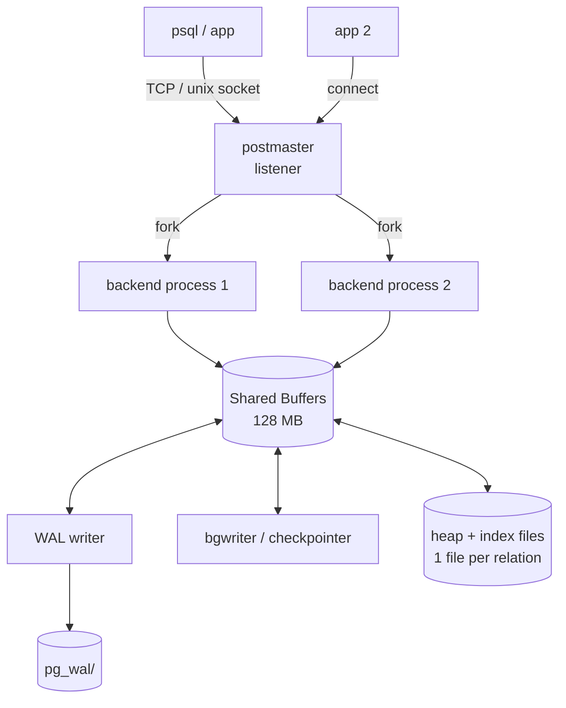

# PostgreSQL vs SQLite — Architecture Comparison

> Two relational engines that both speak SQL and both keep B-trees on disk, yet were designed for nearly opposite worlds. PostgreSQL is a multi-process server you reach over a socket; SQLite is a library you compile directly into your program. Nearly every architectural contrast below traces back to that single decision.

Every number in this document was measured locally on **PostgreSQL 18.3** and **SQLite 3.51** (macOS, Apple Silicon) over an identical schema (`students`, `enrollments`) loaded with 20,000 and 200,000 rows respectively. The reproduction scripts are in this folder (`sqlite_setup.sql`); the Postgres side reuses `../PostgreSQL_Internals/setup.sql` (the same schema).

---

## 1. Problem Background

**SQLite (2000, D. Richard Hipp).** Hipp was writing software for a US Navy destroyer and wanted a database that required neither a running server nor an administrator to set up — the program ought to just open a file. SQLite's slogan is *"a replacement for `fopen()`"*, not "a replacement for Oracle." The whole database is one file, and the engine is a C library executing inside the host process. No separate database process exists at all.

**PostgreSQL (1986 → POSTGRES at Berkeley, SQL support 1994).** PostgreSQL grew out of academic work on extensible, object-relational databases. Its goal was always the *shared* database: many users, many simultaneous connections, long-lived data that has to survive crashes and outlast any single client. That demands a process that stays running, owns the data files, and mediates between clients.

So each system answers a different question:
- SQLite: *"How do I give one application structured, transactional local storage with zero setup?"*
- PostgreSQL: *"How do I let hundreds of clients safely share one consistent dataset?"*

---

## 2. Architecture Overview

### SQLite — embedded / in-process

```
┌─────────────────────────────────────────┐
│           Application process            │
│                                          │
│   app code  ──►  SQLite library (C)      │
│                    │  SQL compiler       │
│                    │  VDBE (bytecode)    │
│                    │  B-tree layer       │
│                    │  Pager + cache      │
│                    ▼                      │
│                  OS file I/O              │
└────────────────────┬─────────────────────┘
                     ▼
              one file:  app.db
              (+ app.db-wal / -journal)
```
No IPC, no network, no server. A function call drops straight down to a `read()`/`write()` on the database file. Cross-process concurrency is coordinated solely through **file locks** on that one file.

### PostgreSQL — client-server, process-per-connection



Whenever a client connects, the **postmaster** forks a dedicated **backend process** for that connection. Every backend shares a single region of shared memory (**shared buffers**, the page cache) and coordinates through it. Background processes (WAL writer, checkpointer, autovacuum, background writer) take care of durability and cleanup. One connection maps to one OS process.

---

## 3. Internal Design

### Storage layout — measured

| Property | SQLite | PostgreSQL |
|---|---|---|
| Default page size | **4 KB** (`PRAGMA page_size`) | **8 KB** (`SHOW block_size`) |
| File organization | **one file** holds all tables + indexes + schema | **one file per relation** (table, index), plus `pg_wal/`, catalogs |
| `students`+`enrollments`+2 indexes | 1,482 pages in a single **6.07 MB** `lab.db` | `enrollments` heap alone = 1,274 × 8 KB ≈ **10 MB**, separate file |
| Schema storage | `sqlite_schema` table (page 1) | system catalogs (`pg_class`, `pg_attribute`, …) |
| File header | bytes 0–15 = `"SQLite format 3\000"` | per-file; cluster metadata in `PG_VERSION`, `pg_control` |

SQLite's `dbstat` virtual table reveals how that *single file* is carved up internally:

```
name             bytes     pages
enrollments      3.13 MB    764
idx_enr_student  2.19 MB    534
students         0.54 MB    133
idx_students_dept 0.20 MB    50
```

Identical logical data, two physical philosophies: SQLite folds every object into **one file** carrying its own page-allocation map, while PostgreSQL hands **each table and index its own file** so they can be locked, vacuumed, extended, and replicated on their own.

### Index implementation
Both rely on **B-trees** for ordered indexes. The structural difference worth noting is in the *primary table*:
- **SQLite**: a table with an `INTEGER PRIMARY KEY` becomes a B-tree *keyed on the rowid* — the table **is** a clustered B-tree (just like InnoDB). Other tables are kept as a B-tree on an implicit `rowid`.
- **PostgreSQL**: tables are **heaps** (unordered). Every index, the primary key included, is a *separate* B-tree pointing into the heap via `ctid`. Postgres has no clustered index at all (only the one-shot `CLUSTER` command, which reorders physically a single time).

### Query execution — measured

The same join, two distinct strategies:

```
-- SQLite (EXPLAIN QUERY PLAN)
SEARCH s USING COVERING INDEX idx_students_dept (dept=?)
SEARCH e USING COVERING INDEX idx_enr_student (student_id=?)   -- nested loop
```
```
-- PostgreSQL (EXPLAIN ANALYZE)
Parallel Hash Join  (Workers Launched: 1)
  Hash Cond: e.student_id = s.id
  -> Parallel Seq Scan on enrollments
  -> Bitmap Heap Scan on students (dept='CS')
```

SQLite always runs **nested-loop joins** driven off indexes — simple, low on memory, ideal when the working set is small. PostgreSQL carries a **cost-based planner** that chose a **hash join** and even launched a **parallel worker**, because across a 200k-row scan a hash join beats nested loops. SQLite offers no parallelism and a deliberately simpler planner; for an embedded engine that's a design choice, not a shortcoming.

### Transactions, concurrency & durability

| | SQLite | PostgreSQL |
|---|---|---|
| Concurrency unit | **whole database** (file-level locks) | **per-row** (MVCC) |
| Default isolation | Serializable | Read Committed |
| Writers | **one at a time** for the whole DB | many concurrent writers, blocked only on the same row |
| Readers vs writer | rollback-journal mode: reader blocks writer; **WAL mode: readers + 1 writer concurrent** | readers never block writers, writers never block readers (MVCC) |
| Durability log | rollback journal (default) or **WAL** (`-wal` file) | **WAL** (`pg_wal/`), `fsync=on`, `synchronous_commit=on` |
| Crash recovery | replay/rollback journal or WAL on next open | replay WAL from last checkpoint at startup |

SQLite's concurrency model is essentially *"the file is the lock."* Even in WAL mode (which I turned on — it produced `lab.db-wal` and `lab.db-shm`), it permits **many readers but only one writer** at any moment. PostgreSQL runs **MVCC**: every writer mints new row versions, so concurrent readers get a consistent snapshot without ever acquiring a read lock. That, more than anything, is why Postgres scales to many writers and SQLite doesn't.

---

## 4. Design Trade-Offs

**Why SQLite is embedded.** Zero configuration, zero IPC, the entire DB a single portable file you can copy or ship inside an app. The price: the file-level write lock makes it a poor fit for many concurrent writers, and running in-process means a crash in the host app is a crash of the database engine.

**Why PostgreSQL is client-server.** An always-on server process can arbitrate many writers through row-level MVCC, enforce permissions, run background vacuum/checkpoint, stream WAL to replicas, and keep a big shared cache warm across connections. The price: you have to run and administer a server, and every query absorbs IPC + planning + MVCC overhead.

**The overhead is visible even on tiny data.** From the earlier 10-row benchmark (`comparison.md`): a trivial `COUNT` took **~0.5 ms** in PostgreSQL versus **<0.05 ms** in SQLite — Postgres pays for the socket protocol, a real planner, and MVCC visibility checks on every query. SQLite, being just a function call, carries almost no fixed cost. On *large multi-user* workloads the order flips: Postgres's parallelism, MVCC concurrency, and shared cache win decisively.

**Process-per-connection is its own trade-off.** It's robust (one backend crashing doesn't drag the others down) and straightforward, but each connection costs an OS process (a few MB) — which is why high-connection Postgres deployments place a pooler (PgBouncer) out front.

---

## 5. Experiments / Observations

Schema: `students` (20k rows), `enrollments` (200k rows), two secondary indexes, loaded identically into both engines.

**Storage:**
- SQLite crammed *everything* into one **6.07 MB** file (1,482 × 4 KB pages).
- PostgreSQL scattered it across **multiple files**; the `enrollments` heap by itself is **1,274 × 8 KB pages ≈ 10 MB**, in its own file separate from its indexes.

**Same selectivity question, same verdict — different mechanics.** Both engines used the secondary index for the selective predicate (`student_id = 12345`, ~10 rows) and dropped to a **full scan** for the unselective one (`grade = 7`, ~18k rows = 9% of the table). Postgres's planner reached that decision from collected statistics (n_distinct=11 for `grade`); SQLite's simpler planner arrived at the same answer through its index/scan cost rules.

**Joins:** SQLite = index-driven nested loop. PostgreSQL = parallel hash join. The plans differ structurally because the planners aim at different things.

**Concurrency (conceptual, backed by the lock model):** Switching on WAL mode in SQLite (`PRAGMA journal_mode=wal`) lets readers run alongside a single writer, but a second writer still waits on the whole-database write lock. PostgreSQL's MVCC lets two transactions update *different* rows of the same table simultaneously with no waiting.

---

## 6. Key Learnings

1. **One architectural decision explains everything downstream.** "Library vs server" cascades into file-level vs row-level locking, one-file vs file-per-relation, nested-loop vs cost-based parallel plans, and single-writer vs MVCC.
2. **SQLite wins small and local; PostgreSQL wins shared and large.** SQLite's per-query cost is near zero, which is exactly what an embedded engine in a phone app or browser wants. Postgres's per-query overhead buys concurrency, durability machinery, and a planner that scales to big data.
3. **"Why SQLite for mobile?"** — no server to operate, one file to back up or ship, a tiny footprint, in-process speed, and with a single app the single-writer limit rarely bites. For exactly these reasons it's the most widely deployed database on earth.
4. **"Why PostgreSQL for large multi-user systems?"** — MVCC concurrency, per-relation storage that enables online vacuum and replication, a cost-based parallel planner, and a hardened durability path (WAL + checkpoints + fsync).
5. **Both are "correct" designs.** They optimize against different constraints. SQLite even documents that for many read-heavy sites it can beat a client-server DB *precisely because* it skips the network — the trade-off cuts both ways.
