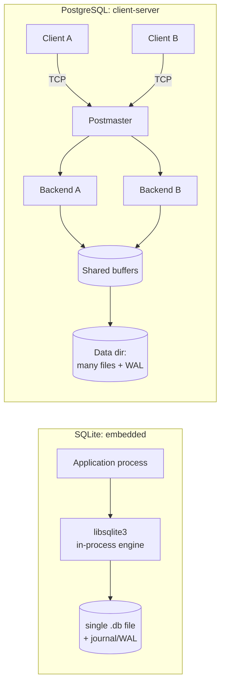

# PostgreSQL vs SQLite: Architecture Comparison

> Two first-rate relational databases designed for opposite worlds. PostgreSQL is a **client-server** engine meant for crowds of concurrent users; SQLite is an **embedded** library that runs inside your application's own process. This document lines up their architecture, storage, and concurrency side by side, with live experiments on **PostgreSQL 16.14** (Docker) and **SQLite 3.44**.

---

## 1. Problem Background

The two systems set out to solve different problems.

**SQLite** (D. Richard Hipp, 2000) was conceived as a database with *no separate server*, a self-contained library you compile into a program, with the entire database held in one ordinary file. The aim was to displace `fopen()`, not Oracle. That meant it had to be zero-administration, transactional, and small enough to ride along on phones and embedded gear.

**PostgreSQL** (Berkeley POSTGRES, 1986 →) was built as a *shared* database server: a long-lived process that many remote clients reach over a network, offering strong concurrency, rich types, and enterprise-grade durability and replication.

So the architectural fork comes down to **who owns the database process**: in SQLite the application *is* the engine, while in PostgreSQL the engine is a separate server the application talks to.

---

## 2. Architecture Overview



| Aspect | SQLite | PostgreSQL |
|---|---|---|
| Deployment | Library linked into app; no server | Separate server process(es) |
| Connection | Function calls (same address space) | Network protocol (libpq / TCP) |
| Concurrency unit | The whole database file | Individual rows |
| Storage | **One file** | A **directory** of many files |
| Page size (default) | **4096 B** (measured) | **8192 B** (measured) |
| Best at | Single-app, embedded, read-mostly | Many concurrent users, mixed R/W |

---

## 3. Internal Design

### 3.1 Process & connection model

**SQLite** owns no process at all. SQL runs on the calling thread inside `libsqlite3`; "connecting" amounts to opening a file. There's no IPC, no network layer, no background workers. That's the reason it needs *zero configuration* and has near-zero connection latency, but it's also why it can't serve remote clients or spread writes across cores.

**PostgreSQL** runs a supervisor (the postmaster) that forks one **backend process per connection**, all sharing a single buffer pool and WAL. That spends memory per connection (hence poolers like PgBouncer) but delivers genuine multi-user concurrency and process-level isolation.

### 3.2 Storage layout: one file vs a directory

**Experiment — SQLite really is a single file:**
```text
$ ls -la demo.db
-rw-------  8134656  demo.db        # entire DB: tables + indexes + catalog, ~8 MB
page_size  = 4096
page_count = 1986
```
Everything, every table, every index, and the schema catalog (`sqlite_master`), lives inside that one file as a tree of 4 KB pages. Each table is a **B-tree keyed by `rowid`** (at heart SQLite is a B-tree store), and indexes are their own separate B-trees. That's what makes a SQLite database trivially copyable and backup-able: `cp demo.db backup.db`.

**Experiment — PostgreSQL is a directory tree:**
```text
$ ls $PGDATA
base/  global/  pg_wal/  pg_xact/  pg_stat/  postgresql.conf  ...
$ ls $PGDATA/base          # one subdir per database (OID-named)
1  4  5  16384
$ ls -la $PGDATA/pg_wal    # WAL segments, 16 MB each
16777216  000000010000000000000001
16777216  000000010000000000000002
block_size = 8192
```
Each table or index is its own file (or a set of 1 GB segments) beneath `base/<dboid>/`, pages are 8 KB, and durability runs through a dedicated `pg_wal/` directory of 16 MB segments. Backups call for tooling (`pg_dump`, base backup + WAL), the cost of a multi-file, multi-user layout.

### 3.3 Table & index storage

- **SQLite:** rows live *inside* the rowid B-tree leaves (a clustered / index-organized layout). An `INTEGER PRIMARY KEY` *is* the rowid, so primary-key lookups are direct B-tree descents.
- **PostgreSQL:** rows sit in an unordered **heap**; every index (the primary key included) is a separate B-tree pointing at heap TIDs. Nothing is clustered by default. (PostgreSQL's MVCC and its `xmin/xmax` tuple model are dissected in the *PostgreSQL Internals* document.)

### 3.4 Concurrency control: the defining difference

This is where the two architectures part ways most dramatically.

**SQLite locks at the database level: one writer at a time, across the whole file.** In the default *rollback-journal* mode a writer grabs an EXCLUSIVE lock; in *WAL mode* readers stop blocking the writer, but **there's still only one writer**. A second writer is handed `SQLITE_BUSY` ("database is locked").

**Experiment — the second writer is turned away in both journal modes:**
```text
=== rollback journal ===          === WAL ===
journal_mode = delete             journal_mode = wal
writer A: holding write lock      writer A: holding write lock
writer B: BLOCKED -> database is locked   writer B: BLOCKED -> database is locked
reader : SUCCEEDED, sees v=0      reader : SUCCEEDED, sees v=0 (snapshot)
```
Even in WAL mode, writer B is stuck while A holds the write lock, SQLite serializes *every* writer globally. (What WAL mode wins you is that the *reader* never blocks.)

**PostgreSQL locks at the row level on top of MVCC: many writers run at once, colliding only on the same row.**

**Experiment — concurrent writers in PostgreSQL:**
```text
Writer A: BEGIN; UPDATE row 1; (holds txn ~2s)
Writer B: UPDATE row 2  (different row)  -> finished in 0.147 s   (no wait)
Writer C: UPDATE row 1  (same row)       -> finished in 1.485 s   (waited for A)
final: row1.v = 2 (A+C),  row2.v = 1 (B)   -- all three writers succeeded
```
Writer B hit a *different* row and sailed straight through; Writer C hit the *same* row as A and waited ~1.5 s for A to commit. PostgreSQL only serializes writers that genuinely conflict, everyone else runs in parallel.

### 3.5 Durability

Both are ACID and both write ahead, just at very different scales:
- **SQLite:** durability through a **rollback journal** (default: copy the original pages aside, restore on crash) or **WAL** (append changes, checkpoint later). One small file sitting next to the database.
- **PostgreSQL:** a full **WAL subsystem** with 16 MB segments, checkpoints, archiving, point-in-time recovery, and streaming replication to standby servers, engineered for continuous operation and HA.

---

## 4. Design Trade-Offs

| | SQLite | PostgreSQL |
|---|---|---|
| **Strength** | Zero-config, in-process, one-file, blazing for single-user/read-mostly | Massive concurrency, rich SQL/types, replication, extensibility |
| **Concurrency** | One writer at a time (whole DB) | Many concurrent writers (row-level + MVCC) |
| **Scalability** | Bounded by one machine/one writer | Scales to thousands of connections, multi-core, read replicas |
| **Operational cost** | None (it's a library) | Needs a server, tuning, pooling, backups |
| **Network** | None (can't serve remote clients) | Native client-server over TCP |
| **Footprint** | ~1 MB library, runs on a phone | Multi-process server, MBs of RAM minimum |
| **Failure isolation** | Shares the app's process | Backend crash is isolated by the postmaster |

**The core trade-off:** SQLite optimizes for *simplicity and locality* by collapsing the database into the application plus a single file, paying for it in write concurrency and remote access. PostgreSQL optimizes for *concurrency and scale* by running a shared server, paying for it in setup, memory, and operational overhead.

---

## 5. Experiments / Observations

All four experiments appear above; summarised here:

| # | What it shows | Result |
|---|---|---|
| 1 | SQLite storage footprint | Whole DB = **one 8 MB file**, 4096-B pages, 1986 pages |
| 2 | PostgreSQL storage footprint | A **directory tree**: per-DB dirs in `base/`, 16 MB WAL segments, 8192-B pages |
| 3 | SQLite write concurrency | Second writer **BLOCKED** ("database is locked") in *both* rollback & WAL modes |
| 4 | PostgreSQL write concurrency | Different-row writer: **0.147 s** (no wait); same-row writer: **1.485 s** (waited for lock), all succeeded |

**Query-plan note:** SQLite's `EXPLAIN QUERY PLAN` on the same join printed `SCAN o`, `SEARCH c USING INTEGER PRIMARY KEY`, `USE TEMP B-TREE FOR GROUP BY`, a straightforward nested-loop strategy. PostgreSQL's planner reached for **parallel hash joins** with 2 worker processes (see the *PostgreSQL Internals* document). SQLite has no parallel execution at all; PostgreSQL fans work out across backends, a direct consequence of the embedded-vs-server split.

---

## 6. Key Learnings

- **Architecture follows the deployment goal.** "Embedded library" dictates a single file and in-process execution; "shared server" dictates a directory layout, a process model, and a network protocol. Nearly every other difference falls out of that one choice.
- **Concurrency is the headline difference, and it's measurable.** SQLite serializes *all* writers (a database lock); PostgreSQL serializes only *conflicting* writers (a row lock + MVCC). The 0.147 s vs 1.485 s gap made that concrete.
- **WAL mode in SQLite helps readers, not writers.** It's a common misconception that WAL hands SQLite multi-writer concurrency, the experiment shows the second writer is still blocked.
- **"Which database is best?" is the wrong question.** SQLite wins on phones, browsers, edge devices, and read-heavy single-app workloads *precisely because* it has no server. PostgreSQL wins for multi-user backends *precisely because* it does.
- **Surprising observation:** SQLite duplicates its whole database with `cp` and tucks tables *inside* their primary-key B-tree (index-organized), while PostgreSQL keeps rows in an unordered heap with separate index B-trees, opposite storage philosophies that account for SQLite's fast PK lookups and PostgreSQL's flexible indexing.

### Why SQLite fits mobile apps
No server to keep running, the entire DB is one file the OS can sandbox per-app, the library is ~1 MB, and a phone app has essentially **one writer** (itself), which is exactly the workload SQLite's single-writer model is tuned for.

### Why PostgreSQL fits large multi-user systems
Hundreds of clients write at once; row-level MVCC lets them proceed in parallel, the client-server model serves them across the network, and WAL-based replication provides high availability, none of which an in-process single-writer library can offer.

---

### Reproducing
```bash
# PostgreSQL
docker run -d --name pg -e POSTGRES_PASSWORD=postgres -p 5439:5432 postgres:16
# SQLite (already on macOS)
sqlite3 demo.db   # then PRAGMA page_size; PRAGMA journal_mode; etc.
```
*Engines: PostgreSQL 16.14 (Docker), SQLite 3.44.4. The concurrency tests used the Python `sqlite3` module and `psql` with overlapping transactions. Sources: SQLite documentation ("How SQLite Is Tested", "Write-Ahead Logging", file-format spec) and PostgreSQL 16 documentation.*
