# PostgreSQL vs SQLite — An Architectural Comparison

> Advanced DBMS — System Design Discussion
> Focus: *why* each engine is built the way it is, not just *what* it does.

---

## 1. Problem Background

Both SQLite and PostgreSQL speak SQL and store relational data, but they were born to solve almost opposite problems. The comparison is interesting precisely because they sit at two extremes of the same design space.

**SQLite (2000, D. Richard Hipp).** SQLite was written to make a database *disappear into the application*. Hipp's original motivation came from working on guided-missile destroyer software, where the program had to keep running even if the database it talked to was unavailable. The conclusion was radical: get rid of the database *process* entirely. Instead of a server you connect to, SQLite is a C library you link into your program; a query is an ordinary function call against a single file on disk, not a request sent over a socket. The design target was *zero administration*: no install, no daemon, no configuration, no network port, no user accounts. This makes SQLite ideal wherever a database is an implementation detail of a single application — phones, browsers, embedded firmware, desktop apps, application file formats. SQLite explicitly does **not** compete with client-server databases; it competes with `fopen()`. Its job is to replace ad-hoc file parsing with transactional, queryable storage.

**PostgreSQL (POSTGRES → Berkeley → 1996+).** PostgreSQL descends from the POSTGRES research project led by Michael Stonebraker at UC Berkeley in the mid-1980s, which itself followed Ingres. POSTGRES was a research vehicle for ideas that relational systems of the era lacked: rich/extensible types, user-defined operators and functions, rules, and a novel no-overwrite storage model that kept old row versions instead of updating in place. When SQL was bolted on (Postgres95) and the project went open source, it became PostgreSQL. Its problem statement is the inverse of SQLite's: serve **many concurrent users** safely over a network, with strong durability, fine-grained concurrency, and extensibility, for OLTP and analytical workloads alike. That mandate forces a *client-server* architecture — a long-lived server process that owns the data and arbitrates between competing clients.

The one-line framing that drives everything below:

> **SQLite optimizes for a single application owning its data with zero setup. PostgreSQL optimizes for many clients sharing data safely and concurrently.** Every architectural difference is a consequence of that one divergence.

---

## 2. Architecture Overview

```mermaid
flowchart TB
    subgraph SQLITE["SQLite — in-process LIBRARY"]
        APP["Application process"]
        subgraph LIB["libsqlite3 linked in (function calls, no IPC)"]
            CMP["SQL Compiler<br/>(tokenizer → parser → code gen)"]
            VDBE["VDBE<br/>(bytecode virtual machine)"]
            BT["B-tree layer"]
            PG["Pager<br/>(cache, txn, journal/WAL)"]
            VFS["OS Interface (VFS)"]
        end
        APP --> CMP --> VDBE --> BT --> PG --> VFS --> DBFILE[("single .db file")]
    end

    subgraph PG_SRV["PostgreSQL — CLIENT-SERVER"]
        C1["Client A"] -->|TCP/socket| PM["postmaster<br/>(listener/supervisor)"]
        C2["Client B"] -->|TCP/socket| PM
        PM -->|fork| B1["backend process A"]
        PM -->|fork| B2["backend process B"]
        subgraph SHMEM["Shared Memory"]
            SB["shared_buffers"]
            WB["WAL buffers"]
            LOCKS["lock/proc tables"]
        end
        B1 --- SHMEM
        B2 --- SHMEM
        subgraph BG["Background processes"]
            CKPT["checkpointer"]
            BGW["bgwriter"]
            WALW["WAL writer"]
            AV["autovacuum"]
            WS["walsender → replicas"]
        end
        SHMEM --- BG
        SB --> DISK[("data files + WAL")]
        WB --> DISK
        BG --> DISK
    end
```



**SQLite data flow.** A SQL string is compiled by the *SQL compiler* into a program for the **VDBE** (Virtual Database Engine), a small bytecode virtual machine. VDBE opcodes manipulate cursors over **B-trees**; the **B-tree layer** turns those into page reads/writes; the **pager** caches pages, enforces transaction atomicity, and runs the journal/WAL protocol; and the **VFS** (Virtual File System) is the thin, swappable shim over the OS's `read`/`write`/`fsync`/locking primitives. The crucial point: *all of this runs inside the application's own address space and call stack*. There is no context switch, no serialization, no socket — calling SQLite is as cheap as calling any other library.

**PostgreSQL data flow.** The **postmaster** is a supervisor that listens on a port. For every connection it **forks a dedicated backend process** — one OS process per connection, sharing nothing in user space except an explicit **shared memory** region. That region holds `shared_buffers` (the page cache shared by all backends), `WAL buffers`, and the lock/transaction tables that let processes coordinate. A constellation of **background processes** keeps the system healthy: the *checkpointer* flushes dirty buffers and bounds recovery time, the *bgwriter* trickles dirty pages out ahead of demand, the *WAL writer* flushes the write-ahead log, *autovacuum* reclaims dead row versions, and *walsenders* stream WAL to replicas. The process-per-connection model is heavyweight but gives strong fault isolation: one crashing backend cannot corrupt another's memory, and the postmaster can reinitialize shared state after a crash.

The structural contrast in one sentence: **SQLite is a layered library you call; PostgreSQL is a society of processes that talk through shared memory and the WAL.**

---

## 3. Internal Design

### 3.1 On-disk storage structures

**PostgreSQL — the heap.** A table is a *heap*: an unordered collection of fixed-size pages. The page size is a compile-time constant `BLCKSZ`, **8 KB** by default. Because operating systems and filesystems historically struggled with very large files, each relation is physically stored as a chain of **1 GB segments** (`relfilenode`, `relfilenode.1`, `relfilenode.2`, …). Each relation also has multiple **forks**:

| Fork | Purpose |
|------|---------|
| Main | the actual table/index data |
| FSM (Free Space Map) | tracks free space per page so inserts find room quickly |
| VM (Visibility Map) | one bit per page: "all tuples here are visible to everyone" |

A page holds an array of **line pointers** at the front and **tuples** growing from the back. Each heap tuple carries a header with the MVCC bookkeeping that makes Postgres tick:

- `xmin` — the transaction ID (XID) that **inserted** this version.
- `xmax` — the XID that **deleted/superseded** it (0 if still live).
- `t_ctid` — a (block, offset) pointer, normally self-referential, but after an update it can point to the **newer version** of the row, forming an update chain.

The decisive design choice: **the heap is unordered and there is no clustered index by default.** Row identity is the physical `ctid` (block number + item offset). Indexes are stored in *separate files* and their leaf entries point back into the heap via that `ctid`/TID.

**SQLite — everything is a B-tree in one file.** A SQLite database is a **single file** divided into pages of a fixed size — default **4096 bytes**. The radical simplification: *every* table and *every* index is its own **B-tree** living inside that one file. The first page contains the file header and the root of `sqlite_master` (a.k.a. `sqlite_schema`), the catalog table that records, for each object, its name, type, and **rootpage** — the page number where that object's B-tree begins. To open a table, SQLite looks up its rootpage in `sqlite_master` and walks the tree from there.

Crucially, ordinary SQLite tables are **clustered B-trees keyed by `rowid`**. A 64-bit `rowid` is the primary key of the table B-tree, and declaring `INTEGER PRIMARY KEY` simply makes that column an **alias for `rowid`** — so the row data physically lives in the leaves of that tree, ordered by key. This is the same family as InnoDB's clustered index. `WITHOUT ROWID` tables go further and cluster on the declared primary key itself, eliminating the rowid indirection for tables where that helps.

> **The single most load-bearing difference:** SQLite tables are *clustered* (row data lives inside a key-ordered B-tree), while PostgreSQL tables are *unordered heaps* that always require a separate index plus a heap fetch. Section 5 shows this falling straight out of the query plans.

### 3.2 Index organization

- **PostgreSQL** default indexes are **nbtree**, an implementation of the **Lehman & Yao B-link tree**, which adds right-sibling links and "high keys" so that concurrent searches can proceed correctly while pages are being split, without holding locks across the whole structure. Index leaves store the indexed key plus a **TID** pointing into the heap. A lookup therefore costs an index descent *plus* a heap visit to fetch the row and check MVCC visibility. **Index-only scans** can skip the heap visit *if* the Visibility Map says the page is all-visible. **HOT (Heap-Only Tuple)** updates are an optimization: if an update doesn't change any indexed column and there's room on the same page, the new version is chained via `t_ctid` and **no index entry is added**, saving index churn.
- **SQLite** indexes are also B-trees, stored as separate trees in the same file. A non-covering index entry stores the indexed columns plus the `rowid`, and the engine then does a second lookup into the clustered table tree by that `rowid`. A **covering index** (one that contains every column the query needs) avoids that second lookup entirely — we'll see SQLite report exactly this.

### 3.3 Memory management

- **PostgreSQL** keeps a single shared buffer pool (`shared_buffers`) in shared memory so that *all* backends benefit from each other's cached pages, plus per-backend `work_mem` for sorts/hashes and `maintenance_work_mem` for housekeeping. Sharing the cache is only possible *because* it lives in shared memory reachable by every process.
- **SQLite** has a per-connection page cache inside the application's heap (sized by `PRAGMA cache_size`). There is no cross-process shared cache by design — there is usually only one process. WAL mode adds a small shared-memory index (`-shm`) so multiple processes can coordinate, but that's the exception, not the architecture.

### 3.4 Transactions, concurrency, and recovery

**PostgreSQL — MVCC + WAL.**
- *Concurrency:* **MVCC** at the row level. A writer creates a *new* tuple version rather than overwriting; a transaction sees a row if its `xmin` is committed-and-visible and its `xmax` is not. Each statement/transaction takes a **snapshot** (the set of in-progress XIDs, `xip`) and uses `xmin/xmax` against it. The headline property: **readers never block writers and writers never block readers.** `SERIALIZABLE` is implemented with **SSI** (Serializable Snapshot Isolation), which detects dangerous read-write dependency cycles rather than locking.
- *Durability/recovery:* the **WAL** (Write-Ahead Log, a redo log) is written and flushed *before* the corresponding data pages, so a committed transaction is durable even if its pages weren't yet on disk. **Checkpoints** periodically flush dirty buffers and record a known-good starting point. **Crash recovery** replays WAL forward from the last checkpoint. Commit visibility is tracked in the **commit log (clog/pg_xact)**.
- *The cost of MVCC:* old versions become **dead tuples**. `VACUUM` reclaims them, updates the FSM/VM, and — critically — **freezes** very old tuples to prevent **transaction-ID wraparound** (XIDs are 32-bit and conceptually circular; without freezing, ancient rows could appear to be from the future). Autovacuum automates this. *MVCC's elegance for concurrency is paid for by the need to garbage-collect.*

**SQLite — single writer + journaling.**
- *Concurrency:* locking is at the **database (whole-file) level**, escalating through `SHARED → RESERVED → PENDING → EXCLUSIVE`. There is **at most one writer at a time**. In the default rollback-journal mode, an active writer blocks readers. In **WAL mode**, readers can run concurrently *with* the single writer (they read a consistent snapshot from the main file + WAL), but it is still **one writer at a time**.
- *Durability/recovery — two strategies:*
  - **Rollback journal (DELETE mode, default):** before modifying a page, SQLite copies the *original* page into a separate `-journal` file. On commit it deletes the journal. If the process crashes mid-write, the leftover "**hot journal**" is detected on next open and the original pages are copied back — an **undo**-style recovery.
  - **WAL mode:** new page images are *appended* as frames to a `-wal` file; the original database file is left untouched until a **checkpoint** merges the frames back. This is a **redo**-style log, conceptually closer to PostgreSQL's WAL, and it's what enables concurrent readers.

The symmetry is instructive: PostgreSQL solves multi-writer concurrency with per-row versioning because it *must* serve many writers; SQLite serializes writers entirely because, for its single-application use case, that's dramatically simpler and almost always good enough.

---

## 4. Design Trade-Offs

### 4.1 Why SQLite is the right call for mobile / embedded apps

- **Zero-configuration & serverless.** No daemon to install, start, secure, or babysit. The "database" is a file the app already owns. For a mobile app shipping to millions of devices, having *no server* is not a limitation — it's the entire value proposition.
- **In-process = no IPC, no network.** Queries are function calls. There is no socket round-trip, no connection pool, no authentication handshake. On a phone, this means lower latency and far less code.
- **One file = trivial lifecycle.** Backup is `cp`. Ship-a-dataset is bundling a file. The database is **atomic and transactional**, so a crash mid-write leaves a consistent file (via the journal/WAL), which an ad-hoc file format can't promise.
- **Tiny footprint, single-user.** A few hundred KB of code, modest RAM. The single-writer model is a non-issue when one app instance owns the file.

### 4.2 Why PostgreSQL is the right call for large multi-user systems

- **Concurrent connections with real isolation.** Process-per-backend + shared memory + row-level MVCC let hundreds of clients read and write the same tables with minimal blocking. This is exactly what SQLite's whole-file lock cannot do.
- **Network and security model.** Listening on a port with roles, `pg_hba.conf` host-based auth, TLS, and `GRANT`/`REVOKE` is mandatory when many distinct users/services share the data — and meaningless for an embedded single-app file.
- **Extensibility and rich types.** The POSTGRES heritage shows: custom types, operators, functions, index access methods (GIN/GiST/BRIN), `JSONB`, arrays, ranges, extensions like PostGIS.
- **Durability and replication at scale.** WAL underpins point-in-time recovery and streaming replication via walsenders — operational features a multi-user system depends on and an embedded library doesn't need.

### 4.3 Which architectural decisions cause the differences

| Difference observed | Root architectural cause |
|---|---|
| SQLite needs no setup; PG needs a running server | **embedded library** vs **client-server** |
| PG handles many concurrent writers; SQLite one at a time | **row-level MVCC** vs **whole-file locking** |
| PG isolates faults across connections | **process-per-connection + shared memory** vs single in-process library |
| SQLite point lookups by PK are direct; PG always indexes into a heap | **clustered rowid B-tree** vs **unordered heap + separate index** |
| PG offers roles/TLS/network auth; SQLite offers none | a **network-facing server** vs a **local file** |
| PG needs VACUUM; SQLite barely does | MVCC's **dead-tuple garbage** vs in-place/journaled updates |

### 4.4 Head-to-head comparison

| Dimension | SQLite | PostgreSQL |
|---|---|---|
| Deployment model | In-process library (linked) | Client-server (daemon + port) |
| Communication | Function calls (no IPC) | TCP/Unix socket, process per connection |
| Storage unit | One file; every table/index a B-tree | Heap files in 1 GB segments + separate index files |
| Default page size | 4096 bytes | 8192 bytes (BLCKSZ) |
| Table physical order | **Clustered** by `rowid` | **Unordered heap** (`ctid`) |
| Index → row | leaf stores rowid → table B-tree | leaf stores TID → heap fetch |
| Concurrency | Single writer; DB-level locks (WAL allows concurrent readers) | Row-level MVCC; readers ⊥ writers |
| Isolation | Serializable (single writer) | Read Committed default; Serializable via SSI |
| Recovery log | Rollback journal (undo) or WAL (redo) | WAL (redo) + checkpoints + clog |
| Housekeeping | Occasional `VACUUM`/checkpoint | Autovacuum (dead tuples, XID freeze) |
| Multi-user/network/security | None (by design) | Roles, host auth, TLS, replication |
| Sweet spot | Embedded, mobile, single-app, edge | Multi-user OLTP/analytics, networked services |

---

## 5. Experiments / Observations

**Honesty note on what was actually run.** The SQLite results below were run **locally on SQLite 3.50.4** and are reproduced verbatim. I did **not** have a local PostgreSQL instance, so the PostgreSQL `EXPLAIN ANALYZE` in §5.3 is a **clearly-labeled representative example based on documented planner behavior**, not a local run.

### 5.1 SQLite — configuration and schema (run locally, SQLite 3.50.4)

```sql
PRAGMA page_size;     -- → 4096
PRAGMA journal_mode;  -- → delete   (default rollback journal)
PRAGMA journal_mode=WAL;  -- → wal   (switches to write-ahead log)
```

Schema and data:

```sql
authors(id INTEGER PRIMARY KEY, name TEXT)                 -- 1,000 rows
books(id INTEGER PRIMARY KEY, author_id INT, title TEXT, year INT)  -- 50,000 rows
CREATE INDEX idx_books_author ON books(author_id);
```

**Interpretation.** The defaults themselves are an architecture statement: a **4 KB** page (half of Postgres's 8 KB) and a **rollback journal** that does *undo* recovery. Flipping to `WAL` opts into *redo*-style logging and concurrent readers — the one knob that most changes SQLite's concurrency behavior.

### 5.2 SQLite — query plans, interpreted

**(a) Multi-table join with grouping**

```sql
EXPLAIN QUERY PLAN
SELECT a.name, count(*)
FROM authors a JOIN books b ON b.author_id = a.id
WHERE a.id < 50
GROUP BY a.name;
```
```
|--SEARCH b USING COVERING INDEX idx_books_author (author_id<?)
|--SEARCH a USING INTEGER PRIMARY KEY (rowid=?)
`--USE TEMP B-TREE FOR GROUP BY
```

*Reading it:* SQLite drives the join from `books` using `idx_books_author`, and labels it a **COVERING INDEX** — every column it needs (`author_id`) is in the index, so it never touches the table B-tree for `b`. For each qualifying book it then does `SEARCH a USING INTEGER PRIMARY KEY (rowid=?)` — a direct descent into the `authors` **clustered** tree by primary key. Finally, because results aren't already grouped, it builds a **TEMP B-TREE** to satisfy `GROUP BY`. Three small but telling facts: covering indexes avoid table access, PK lookups are direct clustered-tree descents, and grouping without a usable ordered index materializes a temporary B-tree.

**(b) No index → full scan**

```sql
EXPLAIN QUERY PLAN SELECT * FROM books WHERE year = 1980;
```
```
`--SCAN books
```
*Reading it:* there is no index on `year`, so SQLite scans the entire `books` clustered tree. `SCAN` (vs `SEARCH`) is the visible signature of a full table walk — exactly what you'd expect, and a reminder that clustering helps PK access but does nothing for an unindexed predicate.

**(c) Primary-key point lookup — the clustering proof**

```sql
EXPLAIN QUERY PLAN SELECT * FROM books WHERE id = 42000;
```
```
`--SEARCH books USING INTEGER PRIMARY KEY (rowid=?)
```
*Reading it:* the row is found by walking the table's **own** B-tree keyed on `rowid`. There is **no separate index** involved — the table *is* the index. This single line is the empirical proof that SQLite tables are clustered rowid B-trees (the InnoDB family), and it is precisely what a PostgreSQL heap **cannot** do: a PG primary-key lookup must descend a *separate* nbtree and then fetch the row from the unordered heap by TID.

**(d) Secondary-index lookup**

```sql
EXPLAIN QUERY PLAN SELECT * FROM books WHERE author_id = 7;
```
```
`--SEARCH books USING INDEX idx_books_author (author_id=?)
```
*Reading it:* here SQLite uses the secondary index. Since `SELECT *` needs columns not in the index, each match implies a follow-up lookup into the clustered table tree by `rowid` — the SQLite analogue of PostgreSQL's "index → heap fetch."

### 5.3 SQLite — physical layout and a timed join

```sql
SELECT type, name, rootpage FROM sqlite_master;
-- table | authors            | 3
-- table | books              | 4
-- index | idx_books_author   | 5

PRAGMA page_count;      -- → 460
PRAGMA freelist_count;  -- → 0
```

*Reading it:* `sqlite_master` shows each object as an independent B-tree with its **own root page** (authors→3, books→4, index→5), making "everything is a B-tree in one file" concrete and inspectable. `page_count = 460` at 4096 bytes ≈ a ~1.9 MB file; `freelist_count = 0` means no free pages — storage is compact with nothing to reclaim.

A real (not `EXPLAIN`) join:

```sql
SELECT count(*) FROM authors a JOIN books b ON b.author_id = a.id WHERE b.year = 1980;
-- → 714   (~0.005 s)
```
*Reading it:* ~5 ms over 50 K rows, in-process, with no server round-trip — a fair illustration of why SQLite feels instantaneous for app-scale data. There's no network or IPC tax to pay.

### 5.4 SQLite — WAL sidecar files (observed)

In WAL mode, opening a write transaction creates `-wal` (the log of new page frames) and `-shm` (the shared-memory index that lets multiple connections find the latest version of each page). On a **clean close**, SQLite **checkpoints** the WAL back into the main file and removes both sidecars. *Reading it:* this is the redo-log lifecycle made visible — frames accumulate in `-wal`, a checkpoint folds them into the database, and the temporary files vanish. It mirrors, in miniature, PostgreSQL's WAL-then-checkpoint discipline.

### 5.5 PostgreSQL — representative `EXPLAIN ANALYZE` (documented behavior, **not run locally**)

For an equivalent join, PostgreSQL's planner is *cost-based* and reports both estimated and actual rows:

```sql
EXPLAIN ANALYZE
SELECT a.name, count(*)
FROM authors a JOIN books b ON b.author_id = a.id
WHERE b.year = 1980
GROUP BY a.name;
```
```
HashAggregate  (cost=1287.50..1297.50 rows=1000 width=40)
                (actual time=12.3..12.9 rows=480 loops=1)
  Group Key: a.name
  ->  Hash Join  (cost=33.50..1283.93 rows=714 width=32)
                 (actual time=0.5..10.8 rows=714 loops=1)
        Hash Cond: (b.author_id = a.id)
        ->  Seq Scan on books b  (cost=0..1167 rows=706 width=4)
                                 (actual time=0.02..7.1 rows=714 loops=1)
              Filter: (year = 1980)
              Rows Removed by Filter: 49286
        ->  Hash  (cost=21..21 rows=1000 width=36)
              ->  Seq Scan on authors a  (cost=0..21 rows=1000 ...)
Planning Time: 0.3 ms
Execution Time: 13.2 ms
```

*Reading it:* with no index on `year`, the planner chooses a **Seq Scan** on `books` (reading the whole heap and discarding ~49 K rows via `Filter`), builds a hash on the small `authors` table, and joins with a **Hash Join** — a sensible plan when one side is small and the predicate is unindexed. Note the two row figures per node: `rows=706` (**estimate**) vs `rows=714` (**actual**). Those estimates come from **`pg_statistic`**, the per-column statistics (null fraction, n-distinct, most-common-values, histograms) gathered by `ANALYZE`. The planner multiplies selectivities from these stats to estimate cardinalities and then picks the lowest-cost plan. When estimates drift far from actuals — stale stats, skew, correlated columns — the planner can choose a bad plan (e.g., a nested loop where a hash join was warranted); that gap between **estimated and actual rows** is the first thing to inspect when a Postgres query misbehaves. SQLite's planner, by contrast, is deliberately simpler (its `ANALYZE` populates `sqlite_stat1`), reflecting its lighter mandate.

**Cross-engine observation.** The same logical query exposes the architectures: SQLite reports clustered-tree `SEARCH`es and covering-index decisions; PostgreSQL reports heap `Seq Scan`s, `Hash Join`s, and an explicit estimate-vs-actual contrast driven by `pg_statistic`.

---

## 6. Key Learnings

- **One root decision cascades into everything.** "Embedded library" vs "client-server" is not one feature among many — it *forces* the rest. No server ⇒ no network auth, no shared buffer pool, whole-file locking, single writer. A server ⇒ process-per-connection, shared memory, row-level MVCC, roles, replication. Reading the two architectures as consequences of one choice is the cleanest way to remember them.
- **The query plans don't lie about physical design.** SQLite's `SEARCH ... USING INTEGER PRIMARY KEY` is direct, visible proof that its tables are **clustered rowid B-trees**, while PostgreSQL's heap always pairs a separate index descent with a TID heap fetch. Storage layout is observable from the outside if you know what to look for.
- **Concurrency models are mirror images chosen on purpose.** PostgreSQL pays the cost of MVCC (dead tuples, VACUUM, XID freezing) to let many writers proceed without blocking readers. SQLite refuses that cost by allowing only one writer, because a single-app file simply doesn't need more. Neither is "better" — each is correct for its workload.
- **Logging strategy is a trade-off, not a default.** SQLite's rollback journal does *undo* (copy-out originals, restore on crash); WAL mode does *redo* (append frames, checkpoint later) and unlocks concurrent readers. PostgreSQL standardizes on WAL/redo because redo logs also enable replication and PITR — features a multi-user system needs and an embedded one doesn't.
- **"Simple" is an engineering achievement, not a lack of one.** SQLite's reliability comes from doing *less*: one file, one writer, one process. That restraint is exactly why it can run, untended, in billions of devices.
- **Databases are collections of engineering trade-offs.** There is no universally best DBMS — only the best fit for a set of constraints. PostgreSQL and SQLite are the same idea (transactional relational storage) pushed to opposite ends of the concurrency/footprint/administration axes. Understanding *why* each made its choices is more durable knowledge than memorizing *what* the choices were.

---

## References

- **SQLite official documentation** — *Architecture of SQLite*, *Database File Format*, *Write-Ahead Logging (WAL)*, *File Locking And Concurrency*, *The SQLite Query Optimizer / EXPLAIN QUERY PLAN*, and *Rowid Tables / WITHOUT ROWID*. (sqlite.org)
- **PostgreSQL documentation** — *Database Physical Storage* (page layout, forks, TOAST), *Concurrency Control / MVCC*, *Write-Ahead Logging (WAL) and checkpoints*, *Routine Vacuuming and XID wraparound*, and *Using EXPLAIN / The Statistics Used by the Planner (`pg_statistic`)*. (postgresql.org)
- Historical context: the **POSTGRES** project (M. Stonebraker et al., UC Berkeley) and SQLite's origin and design goals (D. Richard Hipp).
- **Experiments in §5.1–5.4 were run locally on SQLite 3.50.4.** The PostgreSQL `EXPLAIN ANALYZE` in §5.5 is a representative example based on documented planner behavior and was **not** executed locally.
