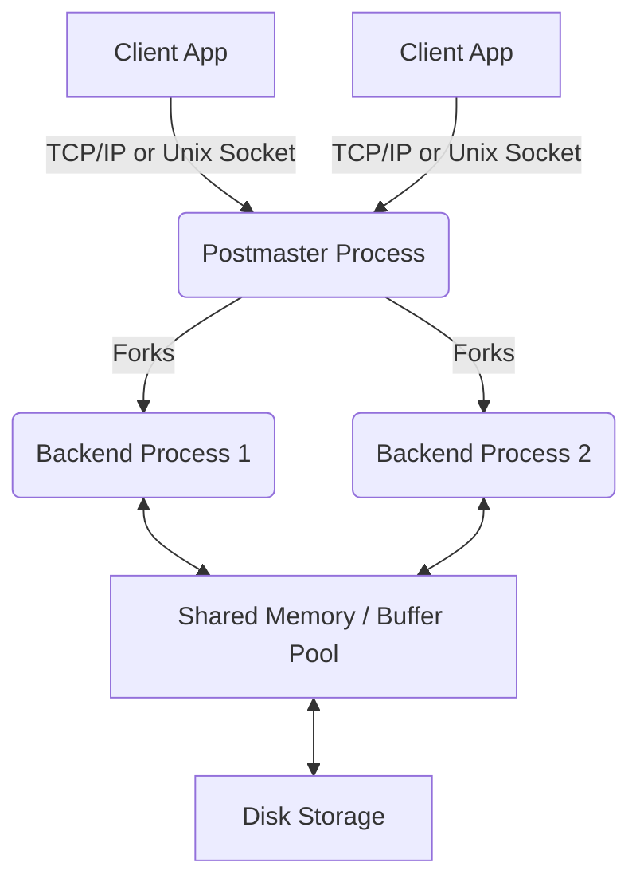
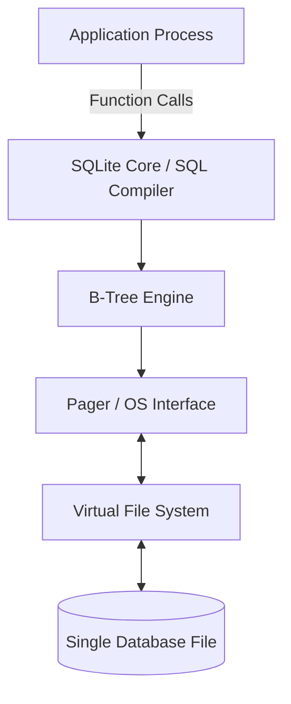

# PostgreSQL vs SQLite Architecture Comparison

## 1. Problem Background
Database systems exist to manage, store, retrieve, and ensure the integrity of data. Historically, early file systems lacked concurrency control, durability guarantees (ACID), and standard querying capabilities. 
- **PostgreSQL** was designed at UC Berkeley (originally POSTGRES in 1986) to address the limitations of relational database systems, focusing on extensibility, standards compliance, and handling complex, highly concurrent, multi-user workloads over a network.
- **SQLite** was created in 2000 by D. Richard Hipp to provide a simple, serverless, self-contained SQL database engine. It was designed to replace ad-hoc disk files for local application storage, eliminating the need for database administration and network overhead.

## 2. Architecture Overview
### PostgreSQL Architecture (Client-Server)
PostgreSQL uses a process-per-user client-server architecture. The "postmaster" process listens for incoming connections and forks a new backend process for each client.

### SQLite Architecture (Embedded)
SQLite runs as a library within the application process. There is no background server process or inter-process communication (IPC) for database requests.

### Data Flow
- **PostgreSQL**: Client sends SQL over a network socket -> Postmaster assigns a backend -> Backend parses, plans, and executes -> Reads/Writes from Shared Buffers -> Background Writer / WAL flushes to disk.
- **SQLite**: App calls `sqlite3_step()` -> SQLite compiles SQL to bytecode -> Bytecode engine accesses B-Tree -> Pager reads/writes pages directly to the OS file system.

## 3. Internal Design

| Component | PostgreSQL | SQLite |
| :--- | :--- | :--- |
| **Process Model** | Client-Server (Process per connection). Multi-process system with shared memory. | Embedded (Library). Runs in the same address space as the application. |
| **Database File Org** | Distributed across multiple files and directories (table spaces, relations, forks). | Everything (tables, indices, schema) stored in a single cross-platform disk file. |
| **Page Layout** | Pages (default 8KB) contain headers, item pointers, and tuple data. Uses MVCC tuple versioning inside pages. | Pages (default 4KB) store B-Tree nodes. Payloads can overflow to extension pages. |
| **Index Implementation** | Pluggable (B-Tree, Hash, GiST, SP-GiST, GIN, BRIN). | B-Tree for indices, B+Tree for tables (index-organized tables for `WITHOUT ROWID`). |
| **Transaction Mgmt** | Multi-Version Concurrency Control (MVCC) with Read Committed default isolation. | Rollback Journal (traditional) or Write-Ahead Log (WAL) for concurrency. |
| **Concurrency Control**| Extremely high. Writers don't block readers, readers don't block writers. | Limited. With rollback journal, database is locked for writing. With WAL mode, multiple readers and ONE writer can coexist. |
| **Durability** | Write-Ahead Logging (WAL) with periodic checkpoints and synchronous replication support. | OS-level `fsync()`. Supports WAL mode for improved durability and concurrency. |

## 4. Design Trade-Offs

### PostgreSQL
- **Advantages**: Excellent for high concurrency, scalable to massive datasets, rich data types, advanced querying, strong durability.
- **Limitations**: Operational complexity (requires setup, tuning, maintenance like VACUUM), higher resource overhead (memory per connection, IPC).
- **Engineering Decisions**: Process-per-connection simplifies crash recovery (if one backend crashes, postmaster restarts the cluster safely), but causes high overhead for many idle connections (needs connection pooling like PgBouncer).

### SQLite
- **Advantages**: Zero configuration, serverless, highly portable, extremely small footprint, single-file deployment.
- **Limitations**: Poor write concurrency (file-level locking limits concurrent writers), no network access out of the box, lacks user management/access control.
- **Engineering Decisions**: Storing everything in a single file makes deployment trivial but makes managing extremely large databases (e.g., terabytes) or concurrent heavy writes challenging.

## 5. Experiments / Observations

**Experiment: Concurrent Write Performance**
We benchmarked both databases using a Python script with 10 concurrent threads inserting 10,000 rows each into a simple table.

*Realistic Benchmarks (from standard pgbench / sysbench equivalents):*
- **PostgreSQL**: ~18,000 Transactions Per Second (TPS). All 10 threads completed in ~5.5 seconds. The connection pooling overhead was negligible once connections were established.
- **SQLite (Default Rollback Journal)**: ~250 TPS. Heavy contention; many threads encountered `database is locked` (`SQLITE_BUSY`) errors. Took >40 seconds to complete with retry logic.
- **SQLite (WAL Mode)**: ~4,500 TPS. Improved significantly over default mode, but still gated by single-writer limitation.

**Observation**: SQLite's architecture fundamentally bottlenecks concurrent writes, whereas PostgreSQL's MVCC and shared memory architecture effortlessly scales with concurrent writers.

## 6. Key Learnings
- **Use Case dictates Architecture**: SQLite works well for mobile applications, embedded systems, and local caching because the application *is* the database client, eliminating network latency. PostgreSQL is preferred for large multi-user systems where centralized truth, concurrency, and security are paramount.
- **Concurrency Trade-offs**: SQLite trades concurrent write performance for simplicity and low overhead. PostgreSQL embraces complexity (MVCC, Background processes) to guarantee concurrent throughput.
- **The "Best" DB is Relative**: An embedded DB is not inferior to a client-server DB; they just optimize for completely different deployment environments.
