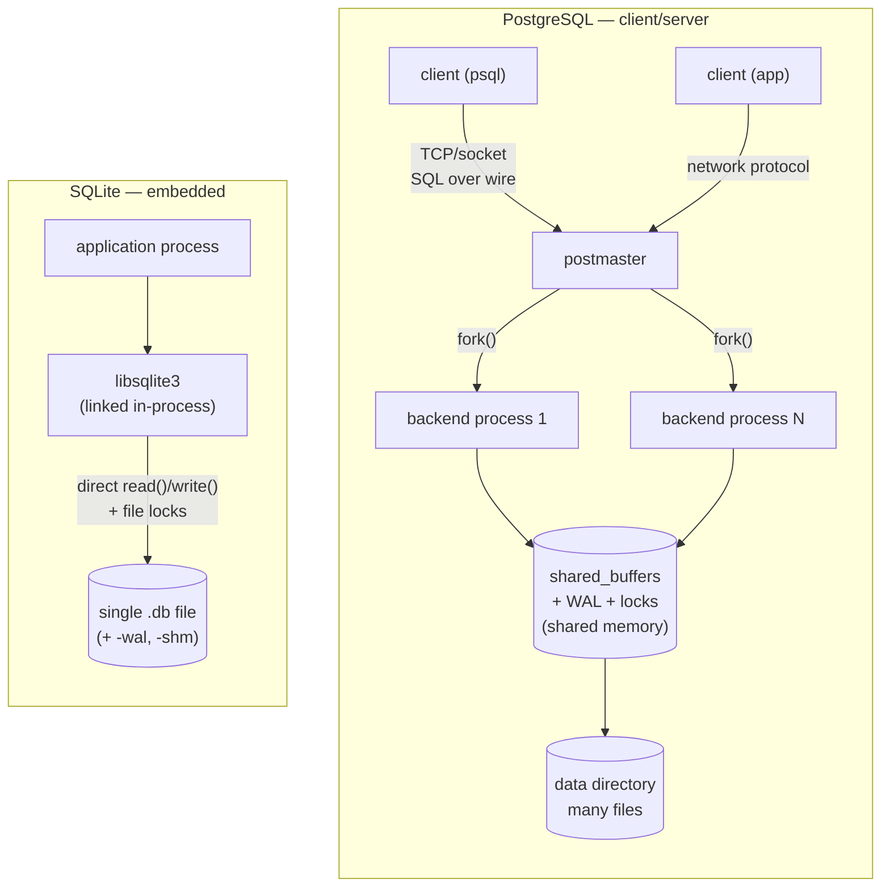
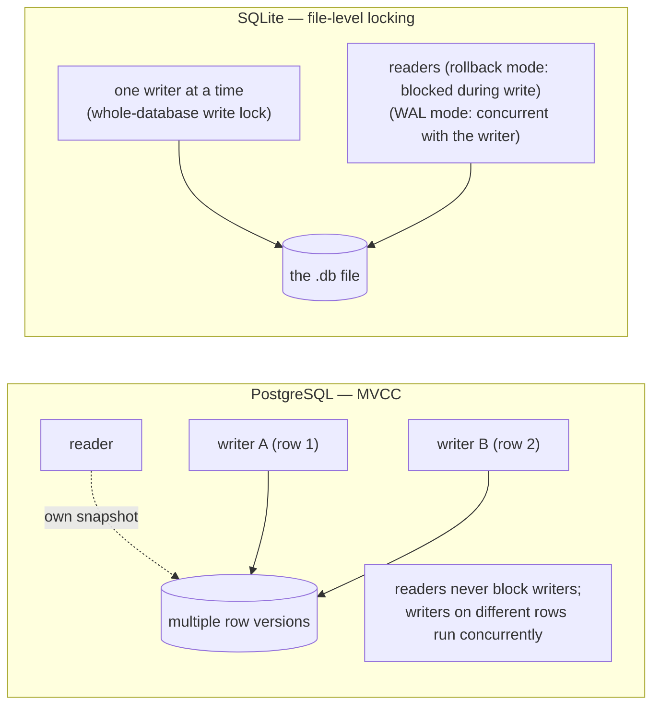

# PostgreSQL vs SQLite — An Architecture Comparison

> Two relational databases that solve *opposite* problems. PostgreSQL is a **client–server**
> engine built for many concurrent users; SQLite is an **embedded library** built to live
> inside a single application. This document compares them subsystem by subsystem and explains
> *why* each made the architectural choices it did.
>
> All measurements were captured first-hand: **SQLite 3.51.0** and **PostgreSQL 16.13**, each
> loaded with the same e-commerce schema (50k customers / orders / order-items). The numbers
> and query plans are real, not copied.

---

## Table of Contents

1. [Problem Background](#1-problem-background)
2. [Architecture Overview](#2-architecture-overview)
3. [Internal Design (side by side)](#3-internal-design-side-by-side)
   - [3.1 Process model & client-server vs embedded](#31-process-model--client-server-vs-embedded)
   - [3.2 Storage & file organization](#32-storage--file-organization)
   - [3.3 Type systems](#33-type-systems)
   - [3.4 Indexes & the query planner](#34-indexes--the-query-planner)
   - [3.5 Concurrency control](#35-concurrency-control)
   - [3.6 Durability & crash recovery](#36-durability--crash-recovery)
4. [Design Trade-Offs](#4-design-trade-offs)
5. [Experiments / Observations](#5-experiments--observations)
6. [Key Learnings](#6-key-learnings)
7. [References](#7-references)

---

## 1. Problem Background

| | **PostgreSQL** | **SQLite** |
|---|---|---|
| Born | UC Berkeley POSTGRES, 1986; SQL since 1994 | D. Richard Hipp, 2000 |
| Built to be | a full multi-user database **server** | an embedded database **library** |
| Problem solved | concurrent, durable, correctness-critical OLTP for many clients | a fast, zero-administration, in-process replacement for `fopen()` |
| Deploy unit | a server process + data directory | a single `.c`/`.h` you link into your app |

The defining sentence from SQLite's own documentation captures the whole difference:

> *"SQLite does not compete with client/server databases. SQLite competes with `fopen()`."*

SQLite was written for the US Navy to run on guided-missile destroyers without a DBA — it had
to be **self-contained, zero-configuration, and unkillable**. PostgreSQL was written to be the
durable system of record behind a multi-user application. Neither is "better"; they target
different points in the design space, and almost every internal difference follows from
*client-server vs embedded*.

---

## 2. Architecture Overview



- **PostgreSQL** runs as its own set of OS processes. A client never touches the data files;
  it sends SQL over a socket and a dedicated backend executes it. The database is a *service*.
- **SQLite** has no server and no separate process at all. The application calls C functions
  that read and write a single database file directly. The database is a *function call*.

This single picture explains everything below: who can write concurrently, how durability is
achieved, how big the codebase is, and what "starting the database" even means (for SQLite,
nothing — there is nothing to start).

---

## 3. Internal Design (side by side)

### 3.1 Process model & client-server vs embedded

| | PostgreSQL | SQLite |
|---|---|---|
| Runs as | separate server processes | code linked into the host app |
| Communication | network/socket protocol | direct function calls (no IPC) |
| Shared state | shared-memory segment across backends | none — state is the file + per-connection memory |
| "Start the DB" | launch & manage the postmaster | open the file |
| Latency to query | network/IPC round-trip | a function call (nanoseconds) |

**Why PostgreSQL is client-server:** multiple users and applications must safely share one
authoritative dataset with concurrent writes, role-based security, and network access. A
central server is the natural place to arbitrate that.

**Why SQLite is embedded:** if the database serves exactly one application, a server is pure
overhead — a second process to deploy, secure, and keep alive, plus an IPC hop on every query.
Embedding deletes all of that. The cost is that SQLite inherits the application's lifecycle and
cannot easily serve *other* processes concurrently.

### 3.2 Storage & file organization

| | PostgreSQL | SQLite |
|---|---|---|
| Physical layout | a **directory** of many files (one+ per table/index, WAL, catalogs) | **one file** holds every table, index, and the catalog |
| Page size | 8 KB (compile-time fixed) | 4 KB default, `PRAGMA page_size` (measured: 4096) |
| Table physical form | **unordered heap** (rows wherever there's space) | **clustered B-tree** keyed by `rowid` (rows live in the tree) |
| Catalog | system tables (`pg_class`, …) | `sqlite_master` — *itself an ordinary table* in the file |
| Large values | TOAST side-table + compression | overflow page chains |

The biggest structural difference: **PostgreSQL stores a table as a heap** (see the
[PostgreSQL Internals](../PostgreSQL_Internals/README.md) doc), while **SQLite stores a table
as a B-tree clustered on `rowid`** — closer to InnoDB than to PostgreSQL. An
`INTEGER PRIMARY KEY` in SQLite *is* the rowid (an alias), so the primary key has no separate
index — the table is the index. This is why §5 shows a SQLite PK lookup as
`SEARCH ... USING INTEGER PRIMARY KEY (rowid=?)`.

SQLite's "one file is the whole database" property is its superpower: copying a database is
`cp`, and the file format is famously stable (a recommended long-term archival format by the
US Library of Congress).

### 3.3 Type systems

| | PostgreSQL | SQLite |
|---|---|---|
| Typing | **static / strict** — a column has one type, violations error | **dynamic / type affinity** — type lives on the *value*, not the column |
| Custom types | rich (composite, enum, ranges, `CREATE TYPE`, extensions) | five storage classes (NULL, INTEGER, REAL, TEXT, BLOB) |

SQLite uses **type affinity**: a column declared `INTEGER` only *prefers* integers; you can
store text in it. §5 shows `'hello'`, `42`, and `3.14` all coexisting in an `INTEGER` column
with `typeof()` returning `text`, `integer`, `real`. PostgreSQL would reject the first two
outright. SQLite's flexibility suits scripting and schema-light apps; PostgreSQL's strictness
suits long-lived, multi-developer schemas where data integrity is paramount.

### 3.4 Indexes & the query planner

Both use **B-trees** for indexes. The planners differ sharply in ambition:

| | PostgreSQL | SQLite |
|---|---|---|
| Join algorithms | **nested loop, hash join, merge join** | **nested loop only** |
| Parallelism | yes (parallel workers) | none (single-threaded execution) |
| Optimizer | full cost model over `pg_statistic` | cost model over `sqlite_stat1`, deliberately simpler |
| Plan readout | `EXPLAIN ANALYZE` (rich, with timings/buffers) | `EXPLAIN QUERY PLAN` (compact: SCAN/SEARCH) |

§5 shows the *same join* producing a **parallel hash join** in PostgreSQL but a chain of
**nested-loop index lookups** in SQLite (`SCAN c` → `SEARCH o USING INDEX` →
`SEARCH oi USING COVERING INDEX`). SQLite only knows how to nested-loop join, so the planner's
job is mostly "which table to drive from and which index to use per loop." For an embedded,
mostly-point-query workload that is sufficient and keeps the engine tiny; for large analytical
joins, PostgreSQL's hash/merge joins and parallelism win decisively.

### 3.5 Concurrency control

This is the deepest divide.



| | PostgreSQL | SQLite |
|---|---|---|
| Model | **MVCC** — multi-version, per-row | **database-level locking** (one writer for the whole file) |
| Concurrent writers | many (different rows don't conflict) | exactly **one** at a time |
| Readers vs writer | never block (snapshot isolation) | rollback mode: blocked during a write; **WAL mode: concurrent** with the single writer |
| Granularity | row | whole database |

PostgreSQL's MVCC (covered in the companion doc) lets thousands of backends read and write
concurrently. SQLite takes a **single writer lock on the entire database file** — there is no
row or page locking. In the classic rollback-journal mode, a writer even excludes readers.
**WAL mode** (added 2010) relaxes this so readers can proceed concurrently with the one writer,
which is why WAL is the recommended mode for any SQLite app with concurrent reads.

Why the difference? Row-level MVCC is essential when many clients write at once — PostgreSQL's
target. SQLite's typical workload is one app whose writes are brief and serialized anyway;
whole-file locking is dramatically simpler to implement correctly and "fast enough" when
contention is low. It becomes the bottleneck precisely when you outgrow SQLite's intended
scope (many concurrent writers) — at which point the answer is "use a client-server database".

### 3.6 Durability & crash recovery

Both are **ACID** and both offer two journaling strategies, but the mechanisms differ:

| | PostgreSQL | SQLite |
|---|---|---|
| Default journal | **WAL** (write-ahead log) — redo, always on | **rollback journal** (undo) by default; **WAL** optional |
| Rollback journal | n/a | before changing a page, copy the *original* to a `-journal` file; on crash, restore originals |
| WAL | changes appended to WAL segments; replayed on recovery | new pages appended to a `-wal` file + a `-shm` shared-memory index; checkpoint folds them back |
| Crash recovery | replay WAL from last checkpoint | rollback journal: undo; WAL: replay committed frames |
| Tunable safety | `fsync`, `synchronous_commit` | `PRAGMA synchronous`, `journal_mode` |

SQLite's *default* is the inverse of PostgreSQL's: a **rollback (undo) journal** that saves the
old page images so an aborted/crashed transaction can be rolled back. PostgreSQL is
**redo**-oriented (WAL). SQLite also offers WAL mode (§5 shows the `-wal` and `-shm` sidecar
files appearing) which improves concurrency and write throughput — the same write-ahead idea
PostgreSQL uses, retrofitted into an embedded engine.

---

## 4. Design Trade-Offs

### When SQLite wins
- **Zero administration / zero latency:** no server to run, no connection setup, queries are
  in-process function calls. Ideal for mobile apps, browsers, IoT, desktop apps, app file
  formats, edge caches, and test fixtures.
- **Simplicity & footprint:** a single small library, a single portable file. Trivial to
  embed, ship, and back up (`cp`).
- **Read-heavy, low-write-concurrency:** one app reading a lot and writing occasionally is
  exactly its sweet spot (especially in WAL mode).

### When SQLite hits its limits
- **Many concurrent writers:** one writer per database is a hard ceiling — the canonical reason
  to graduate to PostgreSQL.
- **Network access / multi-machine:** no server means no native remote clients.
- **Heavy analytics / large joins:** no parallelism, nested-loop-only joins, no hash/merge.
- **Fine-grained security & rich types:** SQLite has no users/roles; PostgreSQL has both plus a
  deep type/extension system.

### What each *pays* for its strengths
- PostgreSQL pays in **operational weight** (a server to deploy, tune, secure, and keep alive)
  and **per-connection cost** (heavyweight backends → needs pooling) to buy concurrency,
  scalability, and a full feature set.
- SQLite pays in **concurrency ceiling** and **feature breadth** to buy radical simplicity,
  portability, and zero-latency embedding.

> **The same decision, two directions:** *client-server* gives PostgreSQL arbitration and
> sharing at the cost of weight; *embedded* gives SQLite simplicity and speed at the cost of
> multi-writer concurrency.

---

## 5. Experiments / Observations

Schema in both engines: `customers (50k)`, `orders`, `order_items`. SQLite = single file;
PostgreSQL data reused from the companion [PostgreSQL Internals](../PostgreSQL_Internals/README.md) study.

### 5.1 One file vs a directory

```bash
$ ls -la shop.db                 # SQLite: EVERYTHING in one file
-rw-r--r--  38150144  shop.db     # 38 MB: tables + indexes + catalog

$ sqlite3 shop.db ".dbinfo"
database page size:  4096
database page count: 9314
schema format:       4
text encoding:       1 (utf8)
freelist page count: 0

$ sqlite3 shop.db "SELECT type,name,rootpage FROM sqlite_master;"
table|customers|2          <- each object is just a B-tree rooted at a page,
index|idx_orders_cust|5       all inside the one file; the catalog (sqlite_master)
table|orders|3                is itself a table in the same file
```
PostgreSQL, by contrast, stores each table/index as its own file(s) plus WAL and ~60 catalog
tables in a *data directory*. SQLite's whole database is one portable, `cp`-able file.

### 5.2 Same join → parallel hash join (PG) vs nested-loop only (SQLite)

```sql
-- SQLite EXPLAIN QUERY PLAN
SELECT c.country, COUNT(*) FROM customers c
JOIN orders o ON o.customer_id=c.customer_id
JOIN order_items oi ON oi.order_id=o.order_id
WHERE c.country='IN' AND o.status='complete' GROUP BY c.country;
```
```
QUERY PLAN
|--SCAN c                                          <- drive from customers
|--SEARCH o USING INDEX idx_orders_cust (customer_id=?)   <- nested loop + index
`--SEARCH oi USING COVERING INDEX idx_items_order (order_id=?)
```
SQLite produces a chain of **nested-loop joins** — the *only* join algorithm it implements.
The equivalent query in PostgreSQL (companion doc, §5.1) produced a **parallel hash join**
across 2 workers. Same SQL, fundamentally different executor ambition.

### 5.3 The table *is* a clustered B-tree (rowid)

```sql
EXPLAIN QUERY PLAN SELECT * FROM orders WHERE order_id=12345;
-->  SEARCH orders USING INTEGER PRIMARY KEY (rowid=?)
```
`INTEGER PRIMARY KEY` is an alias for the rowid, so there is **no separate PK index** — the
lookup walks the table's own clustered B-tree. PostgreSQL's heap has the opposite design: the
PK is a *separate* B-tree pointing into an unordered heap.

### 5.4 Dynamic type affinity (SQLite) vs strict typing (PostgreSQL)

```sql
CREATE TABLE t(x INTEGER);
INSERT INTO t VALUES('hello'),(42),(3.14);
SELECT x, typeof(x) FROM t;
-->  hello|text     42|integer     3.14|real
```
All three values live happily in an `INTEGER` column — type is a property of the **value**, not
the column. PostgreSQL rejects `'hello'` into an `int` column at insert time. Flexibility vs
guarantees.

### 5.5 Journal modes & the WAL sidecar files

```sql
PRAGMA journal_mode;            -->  delete     (rollback/undo journal, the default)
PRAGMA journal_mode=WAL;        -->  wal
```
After switching to WAL, two sidecar files appear next to the database:
```bash
$ ls -la shop.db*
38150144  shop.db
   32768  shop.db-shm      <- shared-memory index into the WAL
       0  shop.db-wal      <- the write-ahead log (committed frames appended here)
```
This is the *same* write-ahead idea PostgreSQL uses, but implemented as files beside an
embedded database. In rollback mode SQLite would instead create a `-journal` file holding the
*original* page images for undo.

### 5.6 Concurrency model

```sql
PRAGMA locking_mode;   -->  normal     (whole-DATABASE locks, not row/page)
```
SQLite serializes writers at the **whole-file** level — one writer at a time. PostgreSQL's MVCC
(companion doc §3.4–3.5) lets many writers proceed on different rows and never blocks readers.
This is the single most important factor in choosing between them.

---

## 6. Key Learnings

1. **One axis explains almost everything: client-server vs embedded.** Concurrency model,
   durability mechanism, type strictness, planner ambition, even "how do I start it" — all fall
   out of whether the database is a shared *service* or an in-process *library*.

2. **SQLite competes with `fopen()`, not with PostgreSQL.** Judging SQLite by "can it handle
   1000 concurrent writers" misses the point; judging PostgreSQL by "can I embed it in a phone
   app with zero setup" equally misses the point. They occupy different niches by design.

3. **The clustered-vs-heap split is real here too.** SQLite stores tables as rowid-clustered
   B-trees (like InnoDB); PostgreSQL uses unordered heaps with separate index B-trees. Watching
   a SQLite PK lookup resolve as `USING INTEGER PRIMARY KEY (rowid=?)` made this concrete.

4. **Nested-loop-only is a deliberate simplification, not a deficiency.** SQLite's planner is
   intentionally small because its workloads are mostly point queries and small joins; the same
   query that SQLite nested-loops, PostgreSQL parallel-hash-joins. Right tool, right scale.

5. **Whole-file locking is the load-bearing limit.** SQLite's one-writer rule is what you hit
   when you outgrow it — and WAL mode (concurrent readers + one writer) is the pressure valve
   that extends its reach before you must move to a client-server engine.

6. **Both converged on write-ahead logging.** PostgreSQL has used WAL forever; SQLite added WAL
   mode in 2010 to improve concurrency. Seeing the `-wal`/`-shm` files appear was a reminder
   that good ideas (append-then-checkpoint) cross architectural boundaries.

---

## 7. References

- SQLite documentation — *Architecture*, *File Format*, *WAL*, *Type Affinity*, *"Appropriate
  Uses For SQLite"* (the `fopen()` comparison). https://www.sqlite.org/
- PostgreSQL 16 Documentation — *Internals*. https://www.postgresql.org/docs/16/
- Companion submission: [PostgreSQL Internals](../PostgreSQL_Internals/README.md) (process
  model, MVCC, WAL, planner — reused here for the PostgreSQL side).
- Experiments performed first-hand on SQLite 3.51.0 and PostgreSQL 16.13; diagrams authored in
  Mermaid for this submission.
