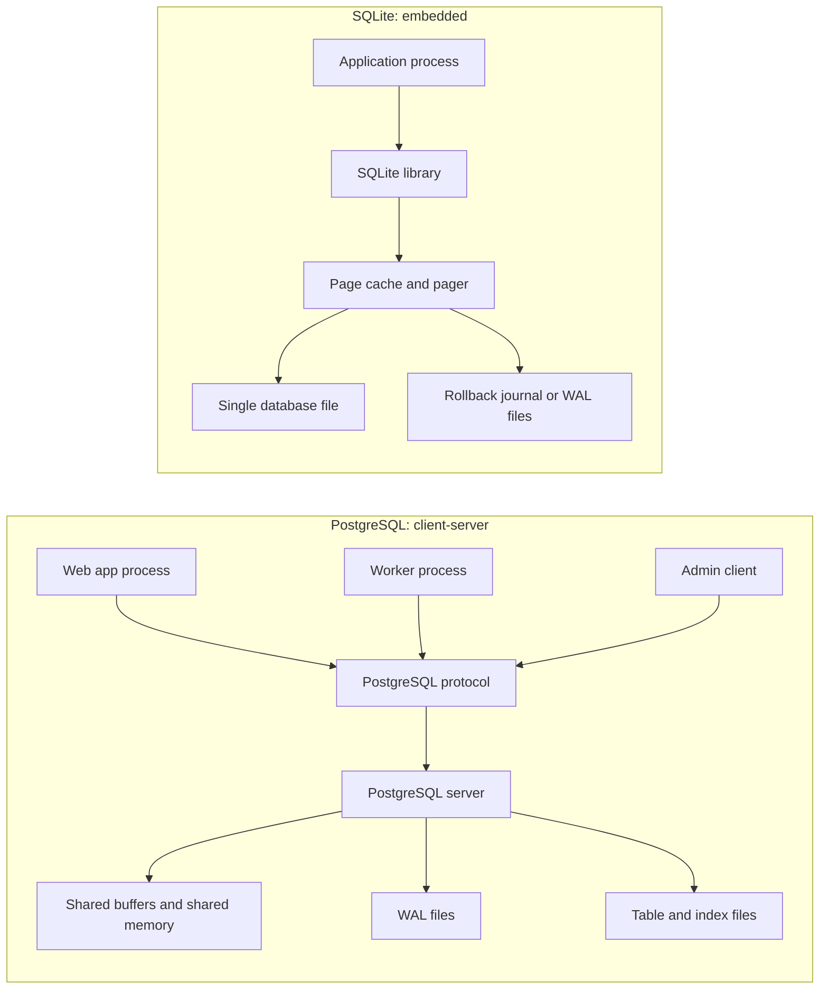
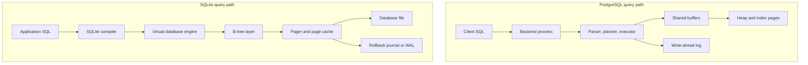
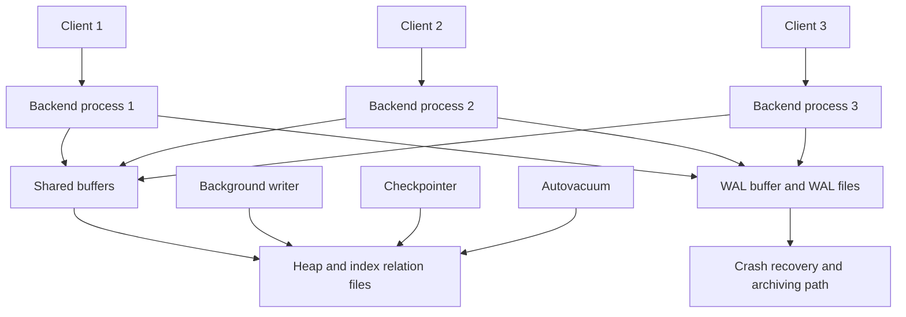
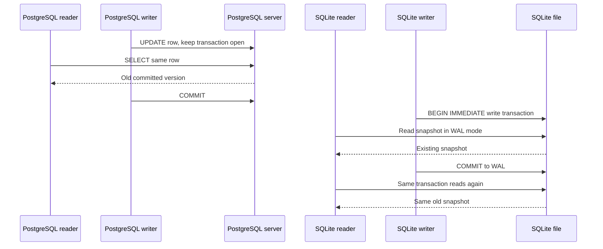

# PostgreSQL vs SQLite Architecture Comparison

## 1. Problem Background

PostgreSQL and SQLite both implement relational databases, but they optimize for different system boundaries.

PostgreSQL is a client-server database system. Applications connect to a long-running PostgreSQL server, and the server owns query execution, shared memory, background work, WAL, storage files, access control, and concurrency coordination. The official PostgreSQL architecture documentation states that the server handles multiple concurrent client connections by forking a new process for each connection, with a supervisor process waiting for incoming connections. This design fits systems where many application processes, users, jobs, dashboards, and services need coordinated access to the same database over a network or Unix socket.

SQLite is an embedded database library. The database engine is linked into the application process, and the database state is normally stored in a single ordinary file on disk. SQLite's own architecture documentation describes a stack of modules inside the library: SQL compiler, virtual machine, B-tree layer, pager, and OS interface. This design fits local-first and embedded systems where the application and the data live on the same device: mobile apps, desktop apps, test fixtures, edge devices, small tools, and single-node services.

The important design question is not "which database is better?" It is: where should the database engine live?

| System need | Better fit | Reason |
| --- | --- | --- |
| Many concurrent clients | PostgreSQL | A server process coordinates shared state, transactions, memory, locks, and WAL for many clients. |
| Local application file format | SQLite | The database is a compact library plus a database file, so deployment is simple. |
| Centralized operations, roles, backups, replicas | PostgreSQL | The database is a managed service boundary. |
| Offline-first or embedded storage | SQLite | No separate database service is required. |
| Heavy write concurrency | PostgreSQL | MVCC and the server architecture are designed for multi-user workloads. |
| Simple local persistence | SQLite | Fewer moving parts and lower operational cost. |

## 2. Architecture Overview

### Deployment Shape

PostgreSQL places the database engine behind a server boundary. SQLite places the database engine inside the application boundary.



### Request Flow

PostgreSQL receives SQL from a client, parses and plans it in a backend process, executes the plan, reads/writes shared buffers and table/index files, and records changes in WAL before dirty data pages need to reach disk. SQLite compiles SQL inside the application process into bytecode for its virtual database engine, which calls into the B-tree and pager layers to read/write pages in the database file.



### Main Components

| Area | PostgreSQL | SQLite |
| --- | --- | --- |
| Engine location | Separate server instance | In-process library |
| Connection model | Process-per-user backend model | Function calls inside the host process |
| Communication | PostgreSQL frontend/backend protocol over TCP/IP or Unix-domain sockets | No network protocol in the core engine |
| Memory | Shared buffers plus per-backend memory | Per-process page cache managed by SQLite |
| Storage | Cluster directory with per-database and relation files | Usually one main database file |
| Query execution | Planner/executor inside backend process | SQL compiled into VDBE bytecode |
| Concurrency | MVCC with readers and writers seeing transaction snapshots | File locking plus rollback journal or WAL mode |
| Durability | WAL records replayed after crash | Rollback journal or WAL restores/commits file-level changes |

## 3. Internal Design

### PostgreSQL Internal Coordination

PostgreSQL's server boundary matters because it gives the database a central place to coordinate many clients. Each client talks to a backend process, while shared buffers and WAL are common server resources. Background work such as writing dirty pages, checkpointing, and vacuuming exists because the server is a long-running owner of the database cluster.



### Storage Structures and Disk Layout

PostgreSQL stores a database cluster in a `PGDATA` directory. The official file-layout documentation describes subdirectories such as `base` for per-database directories, `global` for cluster-wide tables, and `pg_wal` for write-ahead log files. Tables and indexes are stored as relations made of fixed-size pages, usually 8 kB. A PostgreSQL page contains a page header, item identifiers, free space, item data, and optional special space used by indexes.

SQLite usually stores the complete database in one main database file. Its file-format documentation says the database file consists of pages, with page size being a power of two between 512 and 65,536 bytes. SQLite's B-tree documentation states that separate B-trees are used for each table and each index, and all of those B-trees are stored in the same database file.

Design implication: PostgreSQL treats storage as part of a managed database cluster. SQLite treats storage as an application-owned file format. PostgreSQL's layout is better for centralized operations and large server-side data management. SQLite's layout is better when the database should move, copy, back up, or ship as one file.

### Memory Management

PostgreSQL uses shared buffers as a server-level cache. The current documentation says `shared_buffers` controls the amount of memory used for shared memory buffers and is typically 128 MB by default. Backend processes can coordinate through shared memory, which is possible because the server owns the process model.

SQLite uses a pager and page cache inside the application process. The SQLite architecture documentation says the B-tree layer requests fixed-size pages and the page cache is responsible for reading, writing, caching, rollback, atomic commit abstraction, and database-file locking.

SQLite can also use memory-mapped I/O through `PRAGMA mmap_size`. SQLite's memory-mapped I/O documentation says `mmap_size` controls how many bytes of the database file SQLite tries to map into the process address space, and that memory-mapped I/O mostly benefits queries rather than database changes because updates are copied into heap memory before modification. This is different from PostgreSQL's primary path: PostgreSQL exposes a server-managed shared buffer pool that many backend processes coordinate through, while SQLite can let one process map database-file pages directly through the operating system.

Design implication: PostgreSQL can amortize cache and coordination across many clients. SQLite avoids a separate cache server and works well when the process that needs the data is already local to the file. SQLite `mmap_size` is useful when local read-heavy access benefits from OS-managed file mapping, but it is not a replacement for a multi-client shared buffer manager.

### Index Organization

PostgreSQL supports several index access methods, but B-tree is the general-purpose default for equality and ordered access. The PostgreSQL B-tree documentation describes it as a standard multi-way balanced tree. The PostgreSQL planner can combine table statistics, indexes, bitmap scans, joins, and cost estimates to choose an execution plan.

SQLite also relies heavily on B-trees. Its architecture documentation says every table and index has a separate B-tree inside the same database file. SQLite's query-planner documentation says `EXPLAIN QUERY PLAN` reports whether a query performs a full scan or uses an index search, and its optimizer documentation says the planner chooses an algorithm intended to minimize disk I/O and CPU overhead.

Design implication: both engines use B-tree indexes, but the surrounding system differs. PostgreSQL indexes are part of a server-managed relation system with MVCC visibility checks, background maintenance, and statistics. SQLite indexes are compact structures inside one file, selected by an in-process planner.

### Transaction Processing and Concurrency Control

PostgreSQL uses MVCC. The PostgreSQL MVCC introduction says read locks do not conflict with write locks, so reading does not block writing and writing does not block reading. PostgreSQL still has row and table locks for conflicts that truly need coordination, but normal reads can observe a consistent committed snapshot while writers continue.

SQLite serializes writes. Its isolation documentation says there can only be a single writer at a time for a database file, though multiple connections can take turns. In rollback mode, SQLite locks readers out while the writer flushes changes to the database file. In WAL mode, readers can continue reading the old database content while a writer appends to the WAL file, giving snapshot isolation for readers. SQLite WAL improves read/write overlap, but it still depends on same-host shared memory for normal WAL coordination and does not turn SQLite into a multi-writer server.



Design implication: PostgreSQL is built for multi-user contention. SQLite is built for local correctness with minimal machinery. SQLite WAL is a good fit for read-mostly local workloads with short writes, but server databases usually fit better when many independent writers are expected.

### Recovery and Durability

PostgreSQL uses write-ahead logging. The WAL documentation says changes to table and index files must be logged and flushed before the corresponding data-file changes are written. This means crash recovery can replay WAL records and roll the database forward to a consistent state. PostgreSQL also uses WAL for continuous archiving and point-in-time recovery.

SQLite uses rollback journals by default and can use WAL mode. The SQLite file-format documentation says the main database file is normally the complete state, while a rollback journal or WAL file contains information needed to recover a consistent state after a crash. SQLite WAL appends changes to a WAL file and later checkpoints them into the main database.

Design implication: both systems protect durability with logging, but the operational scope differs. PostgreSQL's WAL is part of a server recovery, replication, and backup story. SQLite's journal or WAL is a local-file consistency mechanism.

## 4. Design Trade-Offs

### PostgreSQL Trade-Offs

**Advantages**

PostgreSQL is a strong fit when the database is shared infrastructure. The server boundary lets it centralize authentication, permissions, connection handling, WAL, backups, replication, memory, statistics, and concurrency control. MVCC makes it practical for many users to read and write at the same time without turning every read into a blocking lock.

**Limitations**

The same server boundary adds operational cost. A PostgreSQL system needs a running server, data directory ownership, configuration, connection limits, upgrade planning, backups, monitoring, and tuning. For a small local app that only needs a private data file, this is often more machinery than the problem needs.

**Performance Implications**

PostgreSQL has more overhead per connection and per deployment, but it can coordinate work across clients and maintain shared caches and statistics. Its planner can choose richer plans, and its MVCC model is well-suited for mixed read/write workloads.

### SQLite Trade-Offs

**Advantages**

SQLite is a strong fit when data should live inside the application. There is no separate service to deploy, no network hop to reach the engine, and the database is usually one portable file. This is why SQLite is common in mobile, desktop, browser-adjacent, embedded, local-first, and test environments.

**Limitations**

SQLite's simplicity comes from using file-level coordination. It supports many readers, and WAL mode allows readers and a writer to overlap, but only one writer can hold the write path at a time. SQLite WAL also requires all processes using the database to be on the same host in normal operation, and checkpoint work can affect latency if the WAL grows. If an application has many independent write-heavy clients, SQLite's file-centered design becomes the bottleneck.

**Performance Implications**

SQLite avoids a server hop for local reads and short transactions. Its bottleneck appears when the workload needs a database service, not just a database file: many writers, centralized permissions, online operations, cross-host access, or large operational workflows.

### Decision Rules

Use PostgreSQL when:

1. The data is shared by multiple services or users.
2. Writes are frequent and come from independent clients.
3. You need server-side operations such as roles, backups, replicas, monitoring, and centralized tuning.
4. Query planning and indexing must handle larger, evolving workloads.

Use SQLite when:

1. The database is private to one application or device.
2. Deployment simplicity matters more than multi-client write throughput.
3. The data should be copied, shipped, backed up, or tested as a single file.
4. The workload is mostly local reads and short writes.

## 5. Experiments / Observations

I ran these observations locally on fake data. I treated them as small mechanism checks, not production benchmarks. The goal was to compare how PostgreSQL and SQLite behaved on one query shape and a small concurrency probe. Runtime versions below are the versions I observed on this laptop, not claims about the latest available releases.

### Environment

| Item | Value |
| --- | --- |
| SQLite runner | Python 3.14.5 `sqlite3` module |
| SQLite engine | 3.50.4 |
| PostgreSQL runner | Docker container `postgres:18-alpine` |
| PostgreSQL engine | PostgreSQL 18.4 |
| PostgreSQL `shared_buffers` | 128 MB |
| Dataset | 5,000 customers, 100,000 orders |
| Query | Filtered customer/order join by `country`, `status`, and `created_at` |

### Query Plan Observation

PostgreSQL query:

```sql
SELECT c.country, COUNT(*), ROUND(SUM(o.total), 2)
FROM orders o
JOIN customers c ON c.id = o.customer_id
WHERE c.country = 'US'
  AND o.status = 'paid'
  AND o.created_at = DATE '2026-06-05'
GROUP BY c.country;
```

SQLite query:

```sql
SELECT c.country, COUNT(*), ROUND(SUM(o.total), 2)
FROM orders o
JOIN customers c ON c.id = o.customer_id
WHERE c.country = 'US'
  AND o.status = 'paid'
  AND o.created_at = '2026-06-05'
GROUP BY c.country;
```

The SQLite table stored `created_at` as ISO-8601 text. SQLite does not have a dedicated date/time storage type; its date/time documentation describes accepted time-values such as ISO-8601 text, Julian day numbers, and Unix timestamps.

Indexes added:

```sql
CREATE INDEX idx_customers_country ON customers(country);
CREATE INDEX idx_orders_status_date_customer
  ON orders(status, created_at, customer_id);
```

| Engine | Before indexes | After indexes | Local result |
| --- | --- | --- | --- |
| SQLite | `SCAN o`; primary-key lookup on customers; temp B-tree for grouping | `SEARCH o USING INDEX idx_orders_status_date_customer`; primary-key lookup on customers; temp B-tree for grouping | Best observed time moved from 7.195 ms to 2.951 ms |
| PostgreSQL | `Seq Scan` on orders and customers, then hash join | Bitmap index scan on orders, bitmap index scan on customers, then hash join | Execution time moved from 9.811 ms to 3.824 ms |

I read this result as a planner comparison rather than a speed contest. For this local dataset and query, both engines benefited from an index that matched the selective `orders` table predicate. What I found interesting is that SQLite still drove the join from `orders` and used the customer primary key, while PostgreSQL chose bitmap scans on both indexed tables.

### Reproduction Notes

Logical schema used in both engines, with engine-specific type mapping noted below:

```sql
CREATE TABLE customers(
  id integer PRIMARY KEY,
  country text NOT NULL,
  tier integer NOT NULL
);

CREATE TABLE orders(
  id integer PRIMARY KEY,
  customer_id integer NOT NULL,
  status text NOT NULL,
  total numeric NOT NULL,
  created_at date NOT NULL
);
```

For SQLite, `total` was stored as `REAL` and `created_at` as ISO text. For PostgreSQL, `total` was stored as `numeric` and `created_at` as `date`.

Data shape:

- `customers`: ids `1..5000`, country chosen cyclically from `IN`, `US`, `UK`, `DE`, `SG`.
- `orders`: ids `1..100000`, `customer_id = (id % 5000) + 1`, `status = 'paid'` when `id % 5 = 0`, otherwise `pending`, and `created_at` spread over 28 June 2026 dates.
- SQLite timing used seven repeated reads through Python `time.perf_counter()`; the table reports the best observed time.
- PostgreSQL timing used `EXPLAIN (ANALYZE, BUFFERS, TIMING, SUMMARY)`.

Raw plan snippets:

```text
SQLite before: SCAN o
SQLite before: SEARCH c USING INTEGER PRIMARY KEY (rowid=?)
SQLite before: USE TEMP B-TREE FOR GROUP BY

SQLite after: SEARCH o USING INDEX idx_orders_status_date_customer (status=? AND created_at=?)
SQLite after: SEARCH c USING INTEGER PRIMARY KEY (rowid=?)
SQLite after: USE TEMP B-TREE FOR GROUP BY

PostgreSQL before: Seq Scan on orders o, Rows Removed by Filter: 99286
PostgreSQL before: Seq Scan on customers c, Rows Removed by Filter: 4000
PostgreSQL before: Execution Time: 9.811 ms

PostgreSQL after: Bitmap Index Scan on idx_orders_status_date_customer
PostgreSQL after: Bitmap Index Scan on idx_customers_country
PostgreSQL after: Execution Time: 3.824 ms
```

### Concurrency Observation

PostgreSQL MVCC probe:

1. Transaction A updated `mvcc_demo.val` from `0` to `1` and slept for five seconds before commit.
2. A concurrent reader selected the same row during the uncommitted update.
3. The reader returned `0` in 173.04 ms.
4. After Transaction A committed, the same read returned `1`.

SQLite WAL probe:

1. A reader started a transaction and read `mvcc_demo.val = 0`.
2. A writer updated and committed `val = 1` in WAL mode.
3. The reader, still in the same transaction, read `0`.
4. After the reader committed and opened a new snapshot, it read `1`.

SQLite writer contention probe:

1. Connection A opened `BEGIN IMMEDIATE`.
2. Connection B attempted another `BEGIN IMMEDIATE`.
3. Connection B failed with `OperationalError: database is locked`.

This part of the experiment clarified the concurrency trade-off for me. PostgreSQL and SQLite both provided snapshot behavior, but their write coordination differed in practice. PostgreSQL's server-side MVCC allowed a reader to see the previous committed row while a writer held an uncommitted update. SQLite WAL allowed a reader to keep an old snapshot while a writer committed, but a second immediate writer could not enter while one writer was active.

### Limitations

I kept this experiment intentionally small. It used one query shape, warm local caches, a Dockerized PostgreSQL instance, and Python's SQLite wrapper. I did not measure mixed-client throughput, crash recovery, fsync cost, network latency, replication, long-running vacuum/checkpoint behavior, or production-scale contention. The official documentation remains the source of truth for architectural claims.

## 6. Key Learnings

1. I now see the system boundary as the main difference. PostgreSQL is a database service, while SQLite is an embedded database library.
2. It was interesting to see that both systems use page-oriented storage and B-tree indexes, but the surrounding architecture changes the trade-off. PostgreSQL spreads responsibility across a server process model, shared buffers, relation files, WAL, and background maintenance. SQLite compresses the engine into an application library that manages one file through a pager.
3. Initially I expected concurrency to be the obvious dividing line, but the tests made the comparison more nuanced. PostgreSQL's MVCC is designed for multi-user read/write workloads. SQLite's locking and WAL design works well for local, short transactions and read-mostly embedded workloads, but serializes writers.
4. I learned that durability has different operational meanings in the two systems. PostgreSQL WAL supports crash recovery and larger workflows such as archiving and point-in-time recovery. SQLite rollback journals and WAL protect the consistency of a local database file.
5. My practical takeaway is that the best database choice follows deployment shape. If the application needs a shared database service, PostgreSQL usually fits the architecture better. If the application needs a reliable local data file, SQLite is often the simpler design.

## References

References were accessed on 2026-06-23. PostgreSQL links use `/docs/current/`, which resolved to PostgreSQL 18 documentation during this work.

- PostgreSQL Documentation: [Architectural Fundamentals](https://www.postgresql.org/docs/current/tutorial-arch.html)
- PostgreSQL Documentation: [How Connections Are Established](https://www.postgresql.org/docs/current/connect-estab.html)
- PostgreSQL Documentation: [Frontend/Backend Protocol](https://www.postgresql.org/docs/current/protocol.html)
- PostgreSQL Documentation: [Database File Layout](https://www.postgresql.org/docs/current/storage-file-layout.html)
- PostgreSQL Documentation: [Database Page Layout](https://www.postgresql.org/docs/current/storage-page-layout.html)
- PostgreSQL Documentation: [MVCC Introduction](https://www.postgresql.org/docs/current/mvcc-intro.html)
- PostgreSQL Documentation: [Write-Ahead Logging](https://www.postgresql.org/docs/current/wal-intro.html)
- PostgreSQL Documentation: [Continuous Archiving and Point-in-Time Recovery](https://www.postgresql.org/docs/current/continuous-archiving.html)
- PostgreSQL Documentation: [B-Tree Indexes](https://www.postgresql.org/docs/current/btree.html)
- PostgreSQL Documentation: [Resource Consumption / Shared Buffers](https://www.postgresql.org/docs/current/runtime-config-resource.html)
- PostgreSQL Documentation: [Using EXPLAIN](https://www.postgresql.org/docs/current/using-explain.html)
- PostgreSQL Documentation: [Statistics Used by the Planner](https://www.postgresql.org/docs/current/planner-stats.html)
- SQLite Documentation: [Architecture of SQLite](https://sqlite.org/arch.html)
- SQLite Documentation: [Database File Format](https://sqlite.org/fileformat.html)
- SQLite Documentation: [Write-Ahead Logging](https://sqlite.org/wal.html)
- SQLite Documentation: [Isolation in SQLite](https://sqlite.org/isolation.html)
- SQLite Documentation: [File Locking and Concurrency](https://sqlite.org/lockingv3.html)
- SQLite Documentation: [Memory-Mapped I/O](https://sqlite.org/mmap.html)
- SQLite Documentation: [Date and Time Functions](https://sqlite.org/lang_datefunc.html)
- SQLite Documentation: [Appropriate Uses for SQLite](https://sqlite.org/whentouse.html)
- SQLite Documentation: [EXPLAIN QUERY PLAN](https://sqlite.org/eqp.html)
- SQLite Documentation: [Query Planning](https://sqlite.org/queryplanner.html)
- SQLite Documentation: [Query Optimizer Overview](https://sqlite.org/optoverview.html)
- Python Documentation: [`sqlite3` module](https://docs.python.org/3/library/sqlite3.html)

Footnote: Mermaid diagrams drafted with Claude assistance.
