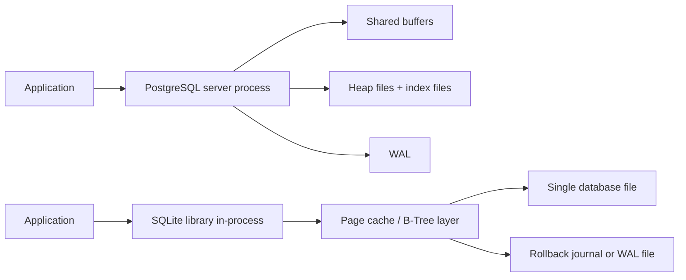

# PostgreSQL vs SQLite Architecture Comparison

## 1. Problem Background

PostgreSQL and SQLite both solve the problem of storing structured data reliably, but they were built for very different deployment models.

PostgreSQL exists for multi-user, networked, long-running systems where many clients need concurrent access, rich SQL support, strong transactional guarantees, and operational features such as replication, backup, and extensibility.

SQLite exists for the opposite end of the spectrum: local, embedded, zero-admin data storage. It is designed to be linked directly into an application process and store the whole database in a small number of files. That design is ideal for mobile apps, desktop apps, browsers, edge devices, and small local tools.

So the core comparison is not “which database is better?” but “which architecture makes sense for which problem?”

## 2. Architecture Overview

### High-level architecture

### Core difference

| Aspect | PostgreSQL | SQLite |
| --- | --- | --- |
| Deployment model | Client-server | Embedded library |
| Process model | Separate server with background processes | Runs inside the application process |
| Storage model | Multiple relation files, WAL, shared buffers | Single main DB file plus journal/WAL side files |
| Concurrency target | Large multi-user workloads | Simple local concurrency, especially read-heavy |
| Operational complexity | Higher | Very low |
| Best fit | Web backends, SaaS, analytics, multi-user systems | Mobile, desktop, local cache, offline-first apps |

## 3. Internal Design

### 3.1 Overall architecture

PostgreSQL is designed around a central database server. Clients connect over sockets, queries are parsed and planned by the server, and execution uses shared memory, background workers, WAL, and storage files managed by the database engine itself.

SQLite is designed as a library. There is no server to connect to. The application links the SQLite engine directly, and SQLite reads and writes the database file on behalf of that process.

This one design choice explains most later differences:

- PostgreSQL pays extra coordination cost, but gains stronger concurrency and richer runtime behavior.
- SQLite removes network and server overhead, but sacrifices multi-writer scalability.

### 3.2 Process model

PostgreSQL uses a postmaster-based server architecture with backend processes handling client sessions, plus helper/background processes for WAL writing, checkpoints, autovacuum, and other system tasks.

SQLite has no separate server process. The same process that issues SQL also runs the parser, planner, B-Tree layer, page cache, and file I/O logic.

That is why SQLite feels almost “filesystem-like,” while PostgreSQL feels like an operating system service.

### 3.3 Storage engine and file organization

PostgreSQL stores tables and indexes as separate relation files on disk. It also keeps WAL files for durability. Data pages typically move through the shared buffer cache before being flushed to disk.

SQLite stores all tables and indexes as B-Trees inside the same database file. In WAL mode, it also uses `-wal` and `-shm` side files.

### 3.4 Table storage and page layout

PostgreSQL stores table rows in heap pages and indexes separately. This gives flexibility for MVCC and indexing, but it means a secondary index lookup often needs a second trip to the heap.

SQLite also uses B-Trees, but because it is a single-file embedded engine, its table/index representation is tightly integrated with page-level file layout and page-cache logic.

### 3.5 Index implementation

PostgreSQL’s default general-purpose index is a B-Tree index. It uses index files separate from the heap.

SQLite also uses B-Trees for both tables and indexes, but all of them live inside the same database file.

### 3.6 Transaction management, concurrency control, and durability

PostgreSQL uses MVCC with tuple versions and WAL. Readers do not block writers in the common case, which makes PostgreSQL a strong fit for concurrent OLTP systems.

SQLite supports transactions and durable commits, but its concurrency model is file-oriented. In WAL mode it allows concurrent readers with a writer, but it still allows only one writer at a time.

This is the single biggest practical trade-off:

- PostgreSQL optimizes for many users doing work at once.
- SQLite optimizes for simplicity and low operational overhead.

## 4. Design Trade-Offs

### Advantages of PostgreSQL

- Handles large multi-user workloads well
- Strong concurrency model through MVCC
- Better separation between compute and storage management
- Rich operational ecosystem: replication, extensions, tuning, monitoring

### Limitations of PostgreSQL

- Requires setup, administration, and process management
- More memory and CPU overhead
- Less convenient for tiny embedded use cases

### Advantages of SQLite

- Extremely easy deployment: one library, one file
- Great for local storage and offline-first applications
- Very low operational complexity
- Fast enough for many single-user and read-heavy workloads

### Limitations of SQLite

- Single-writer model limits write concurrency
- Not intended for large server-side multi-user deployments
- Fewer operational features than PostgreSQL

### Why these trade-offs exist

PostgreSQL accepts architectural complexity to scale concurrency and feature depth.

SQLite accepts concurrency limits to keep the engine tiny, embeddable, and reliable with almost no administration.

## 5. Experiments / Observations

I ran small local experiments on both systems on comparable synthetic order-management datasets to see how the architectural differences show up in practice.

### 5.1 PostgreSQL observations

Environment used:

- PostgreSQL 18.4 on Ubuntu (WSL)
- `shared_buffers = 128MB`
- `wal_level = replica`

For a 3-table join with filtering, grouping, and ordering:

- `EXPLAIN (ANALYZE, BUFFERS)` completed in about `93 ms`
- The plan used:
  - `Bitmap Index Scan` on `idx_orders_status_date`
  - `Bitmap Heap Scan`
  - `Hash Join`
  - `HashAggregate`
- Buffer activity showed `shared hit=1120` and `read=16`

Interpretation:

- PostgreSQL could use shared buffers and an explicit planner to choose a join strategy.
- The storage engine and planner are clearly separated layers.
- The engine is optimized to keep many pages hot in memory and serve concurrent workloads.

### 5.2 SQLite observations

Environment used:

- SQLite 3.52.0 on Windows
- WAL mode enabled

File/layout observations:

- `journal_mode = wal`
- `page_size = 4096`
- `page_count = 1967`
- Main DB file size after load: `8,056,832 bytes`
- WAL file existed during activity and reached about `8,128,792 bytes`

Query-plan observations for the same logical join:

- SQLite used:
  - index search on `idx_orders_status_date`
  - rowid lookup into `customers`
  - index lookup on `idx_order_items_order`
  - temporary B-Trees for `GROUP BY` and `ORDER BY`
- End-to-end query time was about `0.3475 s`

Concurrency observation:

- One connection started `BEGIN IMMEDIATE` and held the transaction for 2 seconds.
- A second writer attempted another `BEGIN IMMEDIATE`.
- Result: the second writer failed with `database is locked` after about `1.17 s`.

Interpretation:

- SQLite can absolutely optimize with indexes, but concurrency is visibly file-lock oriented.
- WAL helps readers and writers coexist better, but it does not turn SQLite into a many-writer server.

### 5.3 What the experiments show

| Observation | PostgreSQL | SQLite |
| --- | --- | --- |
| Query planning | Rich planner with hash joins and buffer stats | Simpler plan output, still index-aware |
| Buffering | Shared server-managed buffer pool | In-process page cache |
| Concurrency | Built for multi-session workloads | One writer at a time |
| Durability path | WAL integrated with server internals | Rollback journal or WAL side files |
| Operational model | Service-oriented | File-oriented |

## 6. Key Learnings

The biggest lesson is that PostgreSQL and SQLite are not competing to be the same kind of system.

- PostgreSQL is a database server.
- SQLite is an embedded storage library.

SQLite works so well for mobile and desktop apps because it removes deployment complexity and keeps data local, simple, and durable.

PostgreSQL is preferred for large multi-user systems because its architecture is explicitly designed around concurrency, shared resource management, MVCC, and long-running server behavior.

The architectural decisions directly shape system behavior:

- Client-server design leads to better concurrency and scalability.
- Embedded design leads to lower overhead and easier deployment.
- Separate heap/index/WAL layers give PostgreSQL flexibility and robustness.
- Single-file B-Tree storage gives SQLite portability and simplicity.

In short: PostgreSQL wins when many users and operational features matter; SQLite wins when simplicity, embedding, and local-first access matter.

## References

- [PostgreSQL documentation](https://www.postgresql.org/docs/current/)
- [PostgreSQL MVCC](https://www.postgresql.org/docs/current/mvcc-intro.html)
- [PostgreSQL WAL](https://www.postgresql.org/docs/current/wal-intro.html)
- [SQLite architecture overview](https://sqlite.org/arch.html)
- [SQLite database file format](https://sqlite.org/fileformat.html)
- [SQLite WAL documentation](https://sqlite.org/wal.html)
