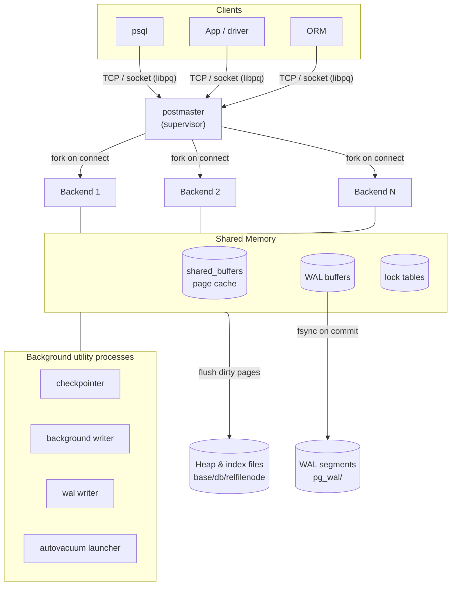
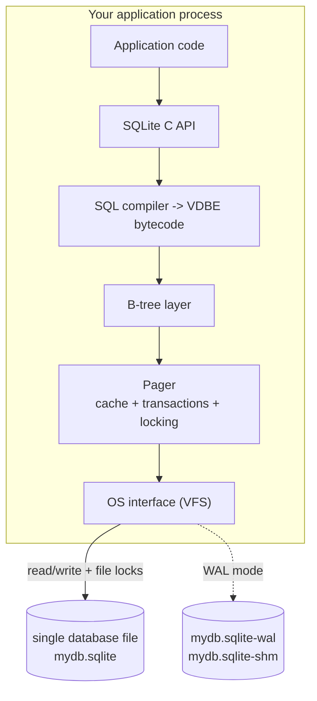
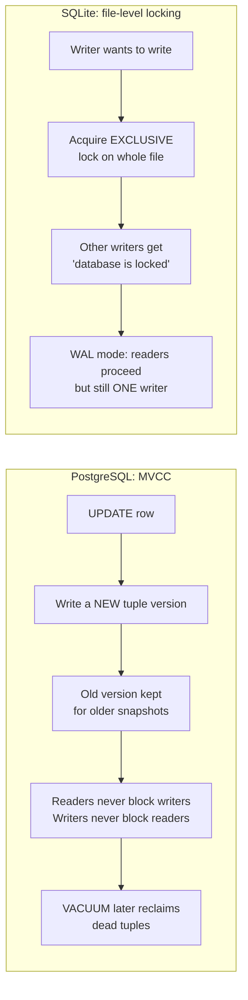

# PostgreSQL vs SQLite — Architecture Comparison

> A study of two relational databases that sit at opposite ends of the design spectrum:
> **PostgreSQL**, a client–server RDBMS built for many concurrent users, and **SQLite**, an
> embedded library built to live *inside* a single application process. Every section below
> ties an architectural decision back to an observable behaviour, and the **Experiments**
> section reproduces those behaviours on real instances (PostgreSQL 16.14 in Docker, SQLite
> 3.40.1 via Python's built-in `sqlite3`).

---

## Table of Contents

1. [Problem Background](#1-problem-background)
2. [Architecture Overview](#2-architecture-overview)
3. [Internal Design](#3-internal-design)
4. [Design Trade-Offs](#4-design-trade-offs)
5. [Experiments / Observations](#5-experiments--observations)
6. [Key Learnings](#6-key-learnings)
7. [References](#references)

---

## 1. Problem Background

Both systems are relational and both speak SQL, but they were built to answer **different
questions about *where the database runs***.

### Why PostgreSQL exists

PostgreSQL descends from the POSTGRES project led by Michael Stonebraker at UC Berkeley
(1986), which set out to extend the relational model with richer types, rules and
extensibility. The problem it solves is the **shared, long-lived, multi-user data store**:
many clients connect over a network, issue concurrent transactions, and expect the data to
survive crashes, hardware failures and decades of schema evolution. That goal forces a
server: a permanent process that owns the files, arbitrates concurrency, enforces
constraints centrally, and keeps running independently of any one client.

### Why SQLite exists

SQLite was written by D. Richard Hipp in 2000 for a context where running a *server* was the
wrong answer — originally for software on a guided-missile destroyer that had to keep working
with no DBA and no separate database process. Its problem statement is the inverse:
**give a single application transactional SQL storage with zero administration and zero
separate process.** SQLite is therefore a *library* you link into your program; "the
database" is just one ordinary file on disk. Its tagline — *"SQLite does not compete with
client/server databases. SQLite competes with `fopen()`"* — captures the design intent
exactly: it replaces ad-hoc application file formats, not Postgres.

### One sentence each

| | Built to be | Replaces |
|---|---|---|
| **PostgreSQL** | A shared database *server* for many concurrent clients | Oracle / a central data tier |
| **SQLite** | An embedded *storage engine* inside one application | `fopen()` / a custom file format |

Almost every concrete difference that follows — process model, locking granularity, file
layout, durability knobs — is a *consequence* of these two starting points.

---

## 2. Architecture Overview

### 2.1 PostgreSQL — client/server, process-per-connection



A single **postmaster** listens for connections and *forks a dedicated backend process* for
each client. Backends never talk to each other directly — they coordinate through a large
**shared-memory** region (`shared_buffers`, WAL buffers, lock tables) and through dedicated
**utility processes** (checkpointer, background writer, WAL writer, autovacuum). The database
is a *running system* that exists with or without any clients connected.

> Verified live (see Experiment 5): a fresh instance shows `checkpointer`, `background writer`,
> `walwriter`, `autovacuum launcher`, and `logical replication launcher` processes — the
> "always-on" machinery that an embedded database deliberately does not have.

### 2.2 SQLite — embedded, in-process library



There is **no server and no separate process**. SQLite compiles SQL into bytecode for a small
virtual machine (the **VDBE**), which drives a B-tree layer on top of a **pager** that handles
caching, transactions and locking. The pager talks to disk through a thin **VFS** abstraction.
Concurrency between *separate* processes opening the same file is coordinated entirely with
**OS file locks**, not a shared-memory arbiter — which is the root cause of its single-writer
behaviour.

### 2.3 The one-line mental model

```
PostgreSQL = a database that runs as a service you connect to.
SQLite     = a database that runs as a function call inside your program.
```

---

## 3. Internal Design

### 3.1 Storage layout

| Aspect | PostgreSQL | SQLite |
|---|---|---|
| On-disk unit | A **directory** (`base/<dboid>/`) with **one file per relation** (table, index, TOAST) | **One single file** for the whole database (all tables + indexes + schema) |
| Default page size | **8 KB** (`block_size`) | **4 KB** (`page_size`, configurable 512 B–64 KB) |
| Table physical form | **Heap** — unordered tuples; the primary key is a *separate* B-tree index pointing at heap tuples | **Clustered B-tree (`rowid`)** — table *is* a B-tree keyed by `rowid`; rows live in the leaves |
| Large values | **TOAST** (out-of-line, compressed overflow storage) | Overflow pages chained from the cell |
| Free-space tracking | Free Space Map (`_fsm`) + Visibility Map (`_vm`) sidecar forks | Freelist pages tracked in the file header |

Both verified live — PostgreSQL reported `block_size = 8192` and distinct files
(`base/16384/16400` for `orders`, `base/16384/16428` for its index); SQLite reported
`page_size = 4096` and a single `test.sqlite` whose first 16 bytes are the literal magic
string `SQLite format 3\000`.

A consequence worth noting: because SQLite's table *is* its primary-key B-tree (clustered),
a primary-key lookup needs **no second indirection**. PostgreSQL's heap is unordered, so even
a primary-key lookup is "probe the B-tree → get a `ctid` → fetch the heap page" — one extra
hop, but it makes the heap cheap to append to and keeps every secondary index symmetric with
the primary one.

### 3.2 Page layout

**PostgreSQL 8 KB heap page:**

```
+-------------------------------------------------------------+
| PageHeader (24 B)                                           |
+-------------------------------------------------------------+
| ItemId array (line pointers) ->  grows downward             |
|   [ptr0][ptr1][ptr2]...                                     |
+-------------------------------------------------------------+
|                  free space                                 |
+-------------------------------------------------------------+
|   ... tuples grow upward ...   [tupleN]...[tuple1][tuple0]  |
+-------------------------------------------------------------+
| (optional) special space (e.g. B-tree page pointers)        |
+-------------------------------------------------------------+
```

Line pointers (`ItemId`s) form an indirection layer so a tuple can be moved within its page
(e.g. by HOT updates) without invalidating index entries that reference it by `(page, slot)` —
the `ctid`.

**SQLite B-tree page** holds a header, a cell-pointer array, and variable-length cells
(key + payload). Interior pages store keys + child page numbers; leaf pages store the actual
records. The whole database is a forest of these B-trees rooted at page numbers recorded in
the `sqlite_schema` table.

### 3.3 Index implementation

Both default to **B-tree** indexes with very similar shape (interior pages route, leaf pages
hold entries). The architectural difference is what a leaf entry *points to*:

- **PostgreSQL**: secondary **and** primary indexes store a `ctid` (heap location). All
  indexes are "secondary" in structure; the heap is the source of truth. PostgreSQL also ships
  GiST, GIN, BRIN, SP-GiST and Hash access methods for non-B-tree workloads (full-text,
  JSONB, geospatial, very large append-only tables).
- **SQLite**: the primary key (integer `rowid`) index *is* the table. Secondary indexes store
  the indexed columns plus the `rowid`, then re-enter the table B-tree to fetch the row — the
  classic clustered-index "index → rowid → table" path, which we see directly in its query
  plan in Experiment 1.

### 3.4 Transaction management & concurrency control — the central difference



**PostgreSQL — MVCC (multi-version concurrency control).** Every row carries hidden system
columns `xmin` (creating transaction) and `xmax` (deleting/locking transaction). An `UPDATE`
does **not** overwrite in place — it writes a *new* tuple version and marks the old one's
`xmax`. A transaction's **snapshot** decides which versions are visible: a tuple is visible if
its `xmin` committed before the snapshot and its `xmax` did not. The result is the property
that gives Postgres its concurrency: **readers never block writers and writers never block
readers**, because they simply read different versions. The cost is *bloat* — obsolete
versions accumulate and must be reclaimed by **VACUUM** (and `autovacuum` runs it
automatically). We observe all of this directly in Experiments 3 and 6.

Postgres uses **row-level locks** only for write–write conflicts on the *same* row. Two
transactions writing *different* rows proceed in parallel; two writing the *same* row, the
second **waits** (it does not error) until the first commits — verified in Experiment 6.

**SQLite — coarse locking, no row versions.** SQLite's concurrency unit is essentially the
**whole database file**. In the default *rollback-journal* mode a writer takes locks that
escalate to `EXCLUSIVE`; while held, *any other writer fails immediately with
`SQLITE_BUSY` ("database is locked")*. There is at most **one writer at a time for the entire
database**. **WAL mode** (`PRAGMA journal_mode=WAL`) improves this: readers read a consistent
snapshot from the main file while a single writer appends to the `-wal` file — so
**readers and one writer can run concurrently**, but it is still *one* writer. Both behaviours
are reproduced in Experiment 7.

### 3.5 Durability & recovery

| | PostgreSQL | SQLite |
|---|---|---|
| Mechanism | **WAL (Write-Ahead Log)** in `pg_wal/`; changes are logged *before* the data pages are flushed | **Rollback journal** (default) or **WAL file** (`-wal`) |
| Commit | WAL record `fsync`-ed at commit (`synchronous_commit=on`) | Journal/WAL `fsync`-ed depending on `PRAGMA synchronous` (default `FULL`) |
| Crash recovery | Replay WAL forward from the last **checkpoint** | Roll back the incomplete journal, or replay/checkpoint the `-wal` file on next open |
| Torn-page protection | `full_page_writes` logs whole page images after each checkpoint | Page-level journaling protects against torn writes |
| Background flush | `checkpointer` + `background writer` write dirty pages out gradually | Checkpoint folds `-wal` back into the main file (every ~1000 pages by default) |

Both follow the **write-ahead principle**: the durability record reaches stable storage
*before* the in-place data does, so a crash can always be resolved to a consistent state by
replaying or undoing the log. Verified settings in Experiment 8.

### 3.6 Memory management

- **PostgreSQL** caches pages in a process-shared `shared_buffers` pool (a clock-sweep
  replacement policy), *plus* relies on the OS page cache underneath. Per-backend memory
  (`work_mem`) is used for sorts/hashes — visible as `Sort Method: quicksort  Memory: 1125kB`
  in Experiment 1.
- **SQLite** keeps a private per-connection page cache (`PRAGMA cache_size`, default ~2 MB)
  inside the application's own address space. There is no cross-process shared cache (the
  `-shm` file in WAL mode coordinates index-of-WAL-frames, not page data).

---

## 4. Design Trade-Offs

### 4.1 PostgreSQL

**Advantages**
- True multi-user concurrency: hundreds/thousands of simultaneous connections, MVCC so reads
  and writes rarely contend.
- Rich feature set: complex types, JSONB, full-text search, partitioning, extensions
  (PostGIS), multiple index types, parallel query (we saw `Workers Launched: 1`).
- Strong durability/HA story: WAL → streaming replication, point-in-time recovery.

**Limitations / costs**
- **Operational weight**: a server to install, configure, secure, back up and tune.
- **Connection cost**: process-per-connection makes many short-lived connections expensive →
  needs a pooler (PgBouncer) at scale.
- **MVCC bloat**: dead tuples must be vacuumed; neglected `autovacuum` causes table/index bloat
  and transaction-ID wraparound risk.
- Overkill for a single-user, single-process app — pure latency to a local SQLite call is lower
  (no socket, no protocol parsing).

### 4.2 SQLite

**Advantages**
- **Zero administration, zero separate process** — the database is a file; deployment is
  "ship the file."
- **In-process speed for reads**: no IPC, no network, no protocol; a query is a function call.
- **Portable & reliable**: a stable, documented single-file format; famously high test
  coverage; the file is trivially copyable/backupable.

**Limitations / costs**
- **One writer at a time for the whole database** — write-heavy multi-user workloads serialize
  and surface `SQLITE_BUSY`.
- **No network access built in** — it is a library, not a service; sharing means sharing a file
  (and a network filesystem can break its locking).
- Fewer enterprise features (no native replication, limited `ALTER TABLE`, dynamic typing by
  default, smaller built-in type system).
- Scales *up* with the host process, not *out* across machines.

### 4.3 Performance implications (concrete)

- For the **same analytical join** on identical 50k/200k/600k-row data, PostgreSQL chose a
  **parallel hash join + nested loop** and finished in **~118 ms**; SQLite ran a
  **single-threaded index nested-loop** in **~180 ms** (Experiment 1). PostgreSQL's planner and
  parallelism pay off as data and concurrency grow; SQLite's simplicity wins for small,
  single-user, latency-sensitive local access.
- Under contention the gap is *qualitative*, not just quantitative: PostgreSQL's concurrent
  writers on different rows both committed; SQLite's second writer was rejected outright.

### 4.4 Why these were the *right* engineering decisions

SQLite's "limitations" are PostgreSQL's "costs" inverted, and vice-versa. A single-file,
single-writer, in-process design is *exactly* what you want on a phone or inside a browser; a
forked-server, MVCC, WAL-replicated design is *exactly* what you want behind a busy web
service. Neither is "better" — they optimise different variables (administration & latency vs.
concurrency & scale).

---

## 5. Experiments / Observations

> **Setup.** PostgreSQL **16.14** in Docker (`postgres:16`); SQLite **3.40.1** via Python
> 3.10's built-in `sqlite3`. Identical logical schema in both: `customers` (50,000 rows),
> `orders` (200,000), `order_items` (600,000), with B-tree indexes on the foreign keys.
> All output below is copied from real runs.

### Experiment 1 — Same join, two very different plans

Query (run verbatim on both):

```sql
SELECT c.country, count(DISTINCT o.id) AS orders, sum(oi.qty*oi.price_cents) AS revenue
FROM customers c
JOIN orders o      ON o.customer_id = c.id
JOIN order_items oi ON oi.order_id  = o.id
WHERE o.status = 'paid' AND c.country = 'IN'
GROUP BY c.country;
```

Both returned the **identical result** — `('IN', 10000, 749550000)` — validating that we are
comparing like for like.

**PostgreSQL `EXPLAIN (ANALYZE, BUFFERS)` (abridged):**

```
 GroupAggregate  (actual time=113.673..117.695 rows=1)
   Buffers: shared hit=61165 read=1199
   ->  Gather Merge  (Workers Planned: 1, Launched: 1)
         ->  Sort  (Sort Method: quicksort  Memory: 1125kB)
               ->  Nested Loop  (actual rows=15000)
                     ->  Hash Join  (Hash Cond: o.customer_id = c.id)
                           ->  Parallel Seq Scan on orders  (Filter: status='paid';
                                                             Rows Removed by Filter: 75000)
                           ->  Hash  ->  Seq Scan on customers (Filter: country='IN')
                     ->  Index Scan using idx_items_order on order_items
                           (Index Cond: oi.order_id = o.id)  (loops=10000)
 Planning Time: 1.891 ms
 Execution Time: 118.068 ms
```

**SQLite `EXPLAIN QUERY PLAN`:**

```
SCAN c
SEARCH o USING INDEX idx_orders_customer (customer_id=?)
SEARCH oi USING INDEX idx_items_order (order_id=?)
USE TEMP B-TREE FOR count(DISTINCT)
-- elapsed ~180 ms (single-threaded)
```

**Observation.** PostgreSQL's cost-based planner picked a **parallel hash join** to combine
`customers`/`orders` and a **nested-loop index scan** for `order_items`, and split the work
across a worker process. SQLite used a **clustered-index nested loop** throughout
(`SCAN` the small driving table, then index-`SEARCH` into the others) with no parallelism —
simpler, and entirely adequate at this scale, but it leaves multicore performance on the table.

### Experiment 2 — Statistics the planner relies on

PostgreSQL's estimates come from `pg_statistic` (human-readable via `pg_stats`) and
`pg_class`:

```
 tablename |  attname    | n_distinct | most_common_vals
-----------+-------------+------------+-----------------------------------
 customers | country     |          5 | {DE,IN,JP,US,UK}
 orders    | status      |          4 | {paid,refunded,cancelled,pending}
 orders    | customer_id |   -0.24599 |    (ratio: ~distinct per row)

   relname   | est_rows | pages_8kb | heap_size
-------------+----------+-----------+-----------
 customers   |    50000 |       367 | 2936 kB
 orders      |   200000 |      1575 | 12 MB
 order_items |   600000 |      4412 | 34 MB
```

**Observation.** The planner *knew* `country` has 5 distinct values, so filtering
`country='IN'` should yield ~1/5 of `customers` (~10,000) — which matches the actual 10,000
rows. Accurate statistics (kept fresh by `ANALYZE`/autovacuum) are what let it confidently
choose the hash join. SQLite keeps a far simpler `sqlite_stat1` summary populated by `ANALYZE`
and a smaller set of heuristics.

### Experiment 3 — MVCC: an UPDATE creates a new version

```sql
INSERT INTO mvcc_demo VALUES (1,'A');
SELECT ctid, xmin, xmax, * FROM mvcc_demo;   -- (0,1) | 798 | 0 | 1 | A
UPDATE mvcc_demo SET v='B' WHERE id=1;
SELECT ctid, xmin, xmax, * FROM mvcc_demo;   -- (0,2) | 799 | 0 | 1 | B
```

**Observation.** Same logical row (`id=1`), but after the UPDATE the **physical location
changed** (`ctid` `(0,1)→(0,2)`) and a **new `xmin`** (`798→799`) appeared — PostgreSQL wrote a
brand-new tuple version rather than overwriting. The old version lingers until VACUUM. This is
MVCC made visible.

> Bonus observation: on the bulk-loaded `orders` table, rows showed a *non-zero* `xmax` even
> though nothing was deleted. That is the `SELECT FOR KEY SHARE` lock taken on parent rows by
> the foreign-key check from `order_items` inserts — a lock recorded in the tuple header, not a
> deletion. A neat reminder that `xmax` means "this version was deleted *or* locked."

### Experiment 4 — Dead tuples and VACUUM

```sql
UPDATE mvcc_demo SET v='C' WHERE id=1;
UPDATE mvcc_demo SET v='D' WHERE id=1;
VACUUM mvcc_demo;
-- pg_stat_user_tables: n_dead_tup drops, n_live_tup settles at 1
```

**Observation.** Repeated UPDATEs leave dead versions behind; `VACUUM` reclaims them so the
space can be reused. This is the housekeeping cost PostgreSQL pays for never blocking readers —
and exactly why neglected autovacuum leads to bloat. SQLite has no equivalent because it
overwrites in place (its `VACUUM` is a different thing — a whole-file defragment/rewrite).

### Experiment 5 — Process models side by side

```
# PostgreSQL — background utility processes always running:
postgres: checkpointer
postgres: background writer
postgres: walwriter
postgres: autovacuum launcher
postgres: logical replication launcher
```

**Observation.** Even with zero clients, PostgreSQL is a *running system* of cooperating
processes. SQLite, by contrast, has **no processes at all** until your application calls into
the library — it is code that executes on your thread.

### Experiment 6 — Concurrency: row locks (PG) vs file lock (SQLite)

**PostgreSQL** — session A holds an open transaction on `acct id=1`; meanwhile session B:

```
[t=1s] B updates row 2  -> "B committed row 2 without waiting"   (no contention)
[t=1s] B updates row 1  -> WAITS ~2.1s, then "B got row 1 AFTER A committed"
final balances: id1=95, id2=80   (both writes applied correctly)
```

**SQLite** (default rollback journal) — two connections, both try to write:

```
writer2 blocked while writer1 holds the DB: 'database is locked'
```

**Observation.** PostgreSQL locks at **row** granularity: different rows → full parallelism;
same row → the second writer *waits* (never errors) and proceeds once the first commits. SQLite
locks at **whole-file** granularity: a second concurrent writer is *rejected* outright with
`database is locked`. This single contrast is the practical heart of "why Postgres for many
users, why SQLite for one."

### Experiment 7 — SQLite WAL mode relaxes (but doesn't remove) the limit

```
set journal_mode -> wal
[writer has an open, uncommitted INSERT]
reader sees rows (uncommitted excluded): 1     <- reader proceeds, sees a snapshot
after writer commit, reader sees:        2
WAL sidecar files now exist: True True          <- mydb-wal and mydb-shm appear
```

**Observation.** In WAL mode a reader runs concurrently with an active writer and sees a
*consistent committed snapshot* (it does **not** see the writer's uncommitted row) — a
lightweight cousin of PostgreSQL's MVCC. But there is still only **one** writer, and the
characteristic `-wal`/`-shm` sidecar files appear next to the database.

### Experiment 8 — Durability knobs

```
PostgreSQL:  wal_level=replica | fsync=on | synchronous_commit=on | full_page_writes=on
             current WAL LSN: 0/BFA9760
SQLite:      synchronous=2 (FULL) | journal_mode | wal_autocheckpoint=1000
```

**Observation.** Both ship **durable by default** and both implement write-ahead logging.
PostgreSQL's WAL is a server-wide, continuously advancing log (note the live LSN) that doubles
as the basis for replication and PITR; SQLite's journal/WAL is per-database-file and exists
purely for crash recovery of that one file.

---

## 6. Key Learnings

1. **One decision cascades into everything.** "Server vs. library" is *the* root choice. Process
   model, lock granularity, file layout, durability scope, and feature set all fall out of it.
   You can predict most of the differences from that one fact.

2. **Concurrency granularity is the dividing line.** PostgreSQL's MVCC (row versions +
   snapshots) buys non-blocking reads/writes at the cost of bloat and VACUUM. SQLite's
   whole-file lock buys radical simplicity at the cost of one writer. WAL mode is SQLite
   borrowing just enough MVCC to let readers run alongside that one writer.

3. **`xmax ≠ 0` doesn't always mean "deleted."** Seeing FK `KEY SHARE` locks recorded in the
   tuple header (Experiment 3) was a genuinely surprising, instructive detail — MVCC metadata
   encodes locking *and* versioning in the same fields.

4. **The planner is only as good as its statistics.** PostgreSQL's accurate `n_distinct` for
   `country` directly produced a correct ~10,000-row estimate and a sensible hash-join choice.
   This is *why* `ANALYZE`/autovacuum matter — stale stats produce bad plans.

5. **Simplicity is a feature, and it has a ceiling.** SQLite's single-threaded nested-loop plan
   was only ~50% slower here and needs *zero* setup — superb for an embedded/local workload. But
   it doesn't use multiple cores and serializes writers, so it has a clear scaling ceiling that
   PostgreSQL's parallelism and MVCC are built to climb past.

6. **"Better" is the wrong question.** SQLite competes with `fopen()`; PostgreSQL competes with
   Oracle. Pick SQLite for embedded/edge/single-app/local-first; pick PostgreSQL for shared,
   concurrent, long-lived, scale-out data tiers. Their weaknesses are the exact price of each
   other's strengths.

### Real-world fit

| Use it when… | PostgreSQL | SQLite |
|---|---|---|
| Many concurrent users / network clients | ✅ | ❌ (one writer, no network) |
| Embedded in an app (mobile, desktop, browser, IoT) | ❌ (needs a server) | ✅ |
| Heavy writes from multiple sources | ✅ (row-level MVCC) | ⚠️ (serialized; WAL helps reads) |
| Zero-admin, ship-as-a-file deployment | ❌ | ✅ |
| Complex types, full-text, GIS, partitioning, replication | ✅ | ⚠️ (limited) |
| Local cache / app file format / test fixture | ⚠️ (overkill) | ✅ |

**Why SQLite works well on mobile:** one app, one user, local file, no server to run or keep
alive, in-process call latency, and a tiny dependency — exactly its design centre.
**Why PostgreSQL is preferred for large multi-user systems:** a permanent server with MVCC,
row-level locking, parallel query and WAL-based replication is built for exactly the concurrent,
durable, scale-out access pattern that breaks a single-file library.

---

## References

- SQLite documentation — *Architecture of SQLite*, *Write-Ahead Logging*, *File Format*,
  *Locking And Concurrency*, *"SQLite is not a toy database" / competes with fopen()*:
  https://www.sqlite.org/docs.html
- PostgreSQL documentation — *Internals: Database Physical Storage*, *MVCC*, *WAL*, *Routine
  Vacuuming*, *Statistics Used by the Planner*: https://www.postgresql.org/docs/16/internals.html
- *The Internals of PostgreSQL* (Hironobu Suzuki): https://www.interdb.jp/pg/
- POSTGRES historical background — Stonebraker & Rowe, *The Design of POSTGRES* (1986).

> *All experiment output in Section 5 was produced on the author's machine using PostgreSQL
> 16.14 (Docker `postgres:16`) and SQLite 3.40.1 (Python 3.10 `sqlite3`). Figures will vary
> by hardware; the relative behaviours are the point.*
