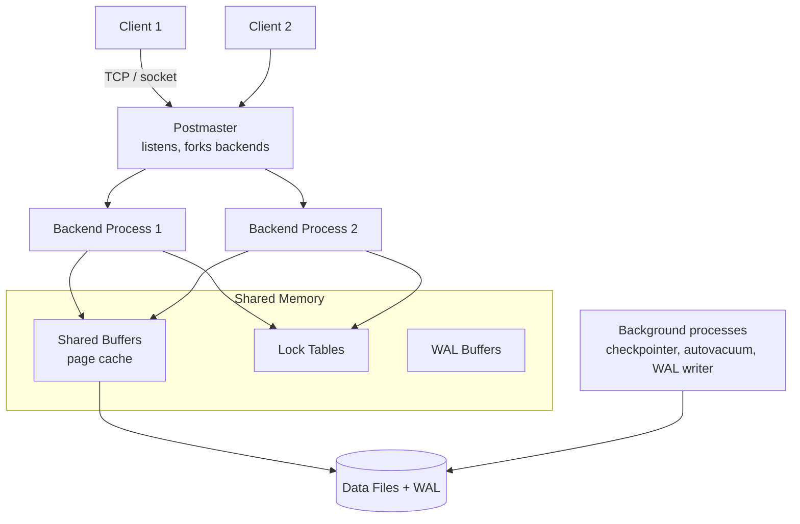
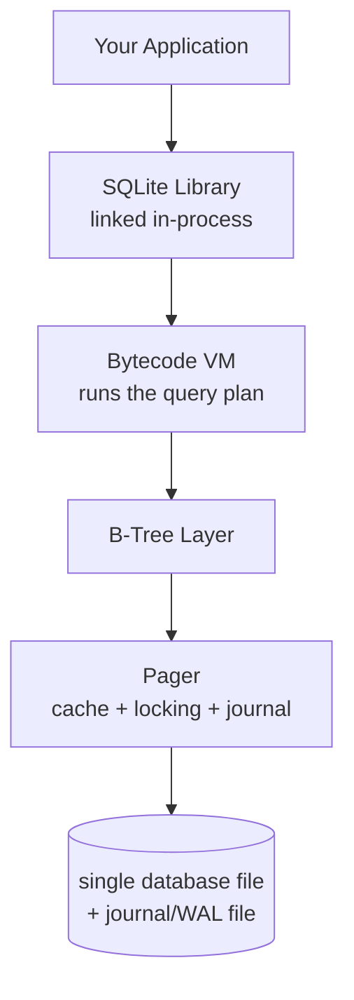
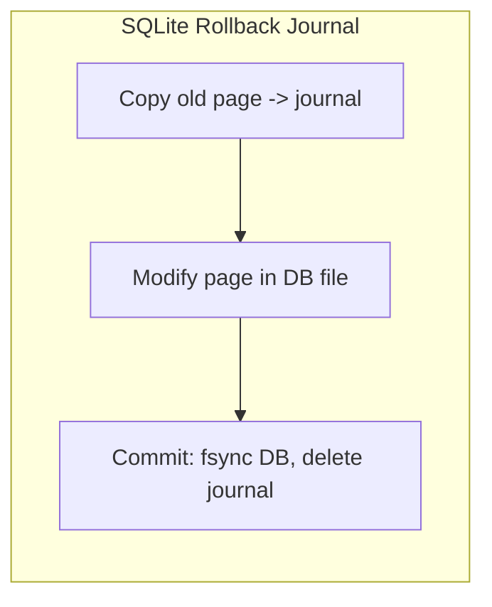
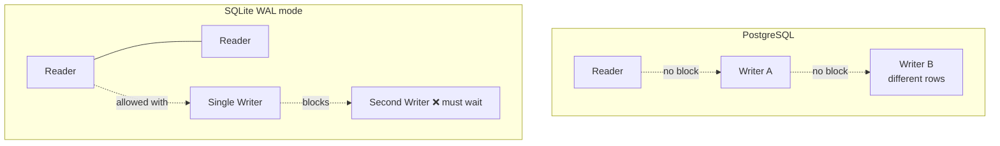

# PostgreSQL vs SQLite — Architecture Comparison

**Author:** Ashutosh
**Roll Number:** 24BCS10111
**Topic:** PostgreSQL vs SQLite Architecture Comparison (Topic 1)

---

## Table of Contents

1. [Problem Background](#1-problem-background)
2. [Architecture Overview](#2-architecture-overview)
3. [Internal Design](#3-internal-design)
4. [Design Trade-Offs](#4-design-trade-offs)
5. [Experiments / Observations](#5-experiments--observations)
6. [Key Learnings](#6-key-learnings)
7. [References](#references)

---

## 1. Problem Background

Both PostgreSQL and SQLite are relational databases that speak SQL. But they were
built to solve **two very different problems**, and almost every difference between
them comes from that one fact.

### Why PostgreSQL exists

PostgreSQL is built for **many users hitting one shared database at the same time** —
think a web app's backend, a bank, an analytics system. The questions it answers are:

> "How do hundreds of clients safely read and write the same data at once, keep it
> correct, and never lose a committed transaction even if the machine crashes?"

To do that it runs as a **server** (a separate program, always on) that clients connect
to over the network. It came out of the **POSTGRES** research project at UC Berkeley
(1986, led by Michael Stonebraker) and has grown into a full-featured, standards-heavy
database.

### Why SQLite exists

SQLite is built for the opposite case: **one program that needs a little database inside
itself**, with no server to install or manage. The question it answers is:

> "How do I give a single application reliable SQL storage in a single file, with zero
> setup and zero running processes?"

SQLite (D. Richard Hipp, 2000) is not a server at all. It's a **library** you link into
your program. The "database" is just **one ordinary file** on disk. It is the most
widely deployed database in the world — it ships inside every Android and iOS phone,
every web browser, and countless apps.

### The one-line summary

| | PostgreSQL | SQLite |
|---|------------|--------|
| Shape | Client–server (a running process) | Embedded library (no process) |
| Database is | A managed cluster of files + a server | A single `.db` file |
| Built for | Many concurrent users | One application at a time |

---

## 2. Architecture Overview

### PostgreSQL — client–server, process per connection

PostgreSQL runs as a set of OS processes. A supervisor process (the **postmaster**)
listens for connections, and for **each client connection it forks a new backend
process**. Shared state (the page cache, locks) lives in **shared memory** that all
backends can see.



### SQLite — a library inside your program, talking to one file

SQLite has **no processes of its own**. The code runs *inside your application's
process*. When your app calls `sqlite3_step()`, it is your app's own thread doing the
B-tree work and reading/writing the file.



### Data flow comparison

- **PostgreSQL:** client → network → backend process → shared buffers → disk. There's a
  network hop and a process boundary, but the work is shared and coordinated centrally.
- **SQLite:** function call → in-process B-tree → file. No network, no IPC, no context
  switch. It's just a library reading a file, so it's extremely fast for the single-user
  case — but coordination between *separate* programs has to happen through the file
  itself (via OS file locks).

---

## 3. Internal Design

### 3.1 Storage structures

**PostgreSQL — heap tables + separate indexes.**
A table is an unordered **heap**: rows are just appended wherever there's free space.
Every index — *including the primary key* — is a **separate B-tree** that points into
the heap using a physical address called a **TID** (block number + offset). So even a
primary-key lookup is "search the index → get TID → go fetch the row from the heap".

**SQLite — everything is a B-tree in one file.**
Each table is a B-tree keyed by an internal 64-bit `rowid`, with the full row stored in
the leaf (so it's effectively a clustered index, like InnoDB). Indexes are separate
B-trees in the *same file*. The file is a flat array of fixed-size **pages** (default
4 KB); the very first page holds the schema and a header.

```
SQLite database file = one flat array of pages

 page1: header + schema   page2: table B-tree root   page3: index B-tree   ...
+--------------------+   +----------------------+   +----------------+
| magic, page size,  |   |  rowid -> row data   |   | key -> rowid   |
| schema (sqlite_*)  |   |  (clustered)         |   |                |
+--------------------+   +----------------------+   +----------------+
```

### 3.2 Page layout

Both store data in fixed-size pages, but organize them differently:

- **PostgreSQL page (8 KB default):** a header, then an array of **line pointers**
  (ItemIds) growing down from the top, and the actual **tuples** growing up from the
  bottom. They meet in the middle. The line-pointer indirection lets a row move within
  the page without breaking index references.

```
PostgreSQL 8KB page:
+------------------------------------------+
| PageHeader                               |
| ItemId | ItemId | ItemId | ... ->        |  (pointers grow down)
|                                          |
|              <free space>                |
|        <- Tuple3 | Tuple2 | Tuple1       |  (tuples grow up)
+------------------------------------------+
```

- **SQLite page (4 KB default):** a B-tree page with a header, a **cell pointer array**,
  and **cells** (each cell is a key + payload). Same "pointers from the top, data from
  the bottom" idea.

### 3.3 Index organization

- **PostgreSQL:** default index is a B-tree, but it also has GiST, GIN, BRIN, Hash, etc.
  All indexes are *secondary* — they all do the extra heap fetch. (Postgres can avoid
  the heap fetch with an **index-only scan** if the visibility map says the page is
  all-visible.)
- **SQLite:** B-tree only. The table itself is clustered on `rowid`, so a `rowid`/PK
  lookup lands directly on the row; other indexes do a second lookup back to the table.

### 3.4 Transaction processing & durability

- **PostgreSQL** uses **Write-Ahead Logging (WAL)**: the change is written to the WAL and
  fsync'd *before* the data pages are flushed. On a crash, Postgres replays the WAL to
  recover. Data pages themselves are flushed lazily at **checkpoints**.

- **SQLite** has two durability modes:
  - **Rollback journal (classic):** before changing a page, copy the *original* page to a
    `-journal` file. On commit, fsync the DB and delete the journal. On a crash, the
    journal is used to roll the DB *back* to the last good state.
  - **WAL mode (modern, opt-in):** new changes are appended to a `-wal` file and the main
    file is left alone until a **checkpoint** copies them in. This is faster and — crucially
    — lets **readers and one writer work at the same time**.



### 3.5 Concurrency control — the biggest difference

**PostgreSQL: MVCC, fully concurrent.**
Postgres keeps **multiple versions of each row** right in the heap. Each row carries
`xmin` (the transaction that created it) and `xmax` (the transaction that deleted/
superseded it). A reader takes a **snapshot** and only sees versions valid for that
snapshot. The result: **readers never block writers and writers never block readers**,
and many writers can work concurrently as long as they touch different rows. Dead old
versions are later cleaned up by **VACUUM**.

**SQLite: one writer at a time.**
SQLite uses **file-level locking**, not row-level. In the classic journal mode the whole
database file is locked for a write, so it's effectively **one writer and no readers**
during a write. WAL mode improves this to **many readers + exactly one writer**
simultaneously — but never two concurrent writers. For SQLite's target use case (one
app, one file) this is a perfectly reasonable simplification, and it keeps the engine
tiny and bug-free.



---

## 4. Design Trade-Offs

### PostgreSQL

**Advantages**
- True multi-user concurrency (MVCC) — scales to many simultaneous readers and writers.
- Rich features: complex types, extensions, full-text search, replication, stored procs.
- Strong durability and crash recovery via WAL.

**Limitations**
- Heavyweight: needs a running server, configuration, and ops/admin.
- A process per connection is relatively expensive (hence connection poolers like
  PgBouncer for high connection counts).
- MVCC produces dead tuples → needs VACUUM, or the table **bloats**.

### SQLite

**Advantages**
- Zero configuration, zero server, single file → trivial to ship and back up (copy the file).
- Extremely fast for single-user / embedded workloads — no network or IPC overhead.
- Tiny, rock-solid, and famously well-tested.

**Limitations**
- Only one writer at a time → not suited to high-concurrency write workloads.
- No network access built in — it's local to one machine/process.
- Fewer features and no server-side user management.

### The core engineering decision

| Decision | PostgreSQL | SQLite |
|----------|-----------|--------|
| Run as a server? | **Yes** — central coordinator for many clients | **No** — a library, stays out of the way |
| Concurrency | Row-level MVCC (many writers) | File-level locks (one writer) |
| Storage | Heap + separate indexes | One file, clustered B-trees |
| Optimized for | Throughput under concurrency | Simplicity + single-user speed |

The honest summary: **PostgreSQL pays complexity to win concurrency; SQLite gives up
concurrency to win simplicity.** Neither is "better" — they target different problems.

---

## 5. Experiments / Observations

> Illustrative outputs showing the *shape* of what you'd observe.

### 5.1 SQLite really is just a file

```bash
$ sqlite3 test.db "CREATE TABLE t(id INTEGER PRIMARY KEY, name TEXT);"
$ sqlite3 test.db "INSERT INTO t(name) VALUES ('alice');"
$ ls
test.db          # <- the entire database is this one file
$ cp test.db backup.db   # backup = copy the file. That's it.
```

There is no server process running — `ps aux | grep sqlite` shows nothing between commands.

### 5.2 PostgreSQL is a set of processes

```bash
$ ps -ef | grep postgres
postgres  ... postgres                       # postmaster
postgres  ... postgres: checkpointer
postgres  ... postgres: background writer
postgres  ... postgres: walwriter
postgres  ... postgres: autovacuum launcher
postgres  ... postgres: myapp mydb 10.0.0.5(52344) idle   # one backend per client
```

Each connected client gets its **own backend process** — visible right there in `ps`.

### 5.3 Concurrency: the writer-blocking difference

**SQLite (classic journal mode), two connections writing:**

```sql
-- Connection A
BEGIN; UPDATE t SET name='x' WHERE id=1;   -- holds the write lock

-- Connection B (at the same time)
BEGIN; UPDATE t SET name='y' WHERE id=2;
-- Error: database is locked        <-- B must wait for A; only one writer
```

**PostgreSQL, two connections writing different rows:**

```sql
-- Connection A
BEGIN; UPDATE t SET name='x' WHERE id=1;   -- locks only row id=1

-- Connection B
BEGIN; UPDATE t SET name='y' WHERE id=2;   -- locks only row id=2, proceeds fine
COMMIT;  -- both commit independently, no blocking
```

Different rows → no conflict in Postgres, because locking is per-row and reads use MVCC.

### 5.4 Seeing MVCC versions in PostgreSQL

```sql
SELECT xmin, xmax, * FROM accounts WHERE id = 1;
--  xmin |  xmax  | id | balance
-- ------+--------+----+--------
--   742 |   0    |  1 |   900     <- created by txn 742, not yet deleted (xmax=0)
```

After an `UPDATE`, the old row stays with a non-zero `xmax` and a *new* row appears with
a new `xmin` — two physical versions of the same logical row, which is exactly how
Postgres lets a concurrent reader still see the old one.

---

## 6. Key Learnings

1. **Architecture follows the use case.** Client–server vs embedded isn't a detail — it's
   the root cause of every other difference. PostgreSQL is a server because it coordinates
   many users; SQLite is a library because it serves one app.

2. **"The database is a file" is SQLite's superpower and its limit.** One file means
   trivial deployment and backup, but file-level locking means one writer at a time.

3. **Concurrency is the headline difference.** Postgres MVCC = many concurrent writers,
   readers never blocked. SQLite = effectively single-writer (many readers in WAL mode).

4. **Both use a log for durability, differently.** Postgres WAL writes the *new* change
   ahead of the data pages; SQLite's rollback journal saves the *old* page so it can undo.
   Same goal (survive a crash), opposite direction.

5. **Postgres heap + SQLite clustered B-tree** is a real storage-layout split: in Postgres
   even the PK lookup hits the heap; in SQLite the row lives in the table B-tree leaf.

6. **Right tool for the job.** Use SQLite for phones, browsers, desktop apps, tests, and
   single-node tools. Use PostgreSQL for shared backends with many concurrent users and
   strong feature needs.

---

## References

- PostgreSQL Documentation — *Database Physical Storage* and *Internals*
  https://www.postgresql.org/docs/current/storage.html
- PostgreSQL Documentation — *Concurrency Control (MVCC)*
  https://www.postgresql.org/docs/current/mvcc.html
- SQLite Documentation — *Architecture of SQLite*
  https://www.sqlite.org/arch.html
- SQLite Documentation — *Database File Format*
  https://www.sqlite.org/fileformat2.html
- SQLite Documentation — *Write-Ahead Logging (WAL)*
  https://www.sqlite.org/wal.html
- SQLite Documentation — *Appropriate Uses For SQLite*
  https://www.sqlite.org/whentouse.html
