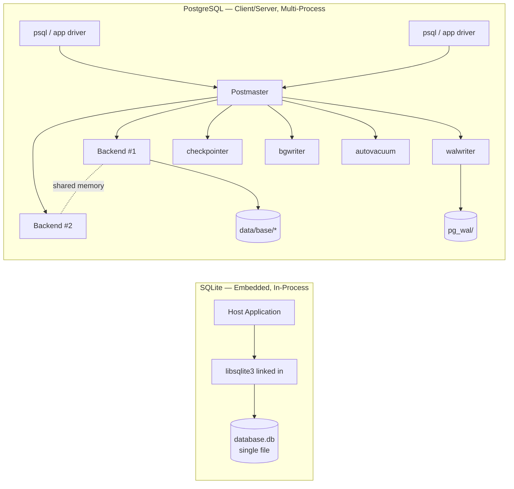
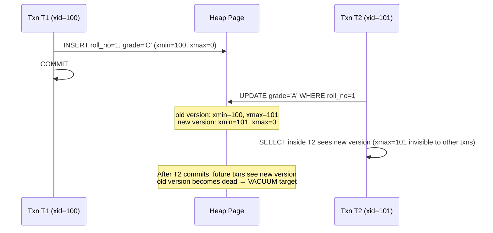

# PostgreSQL vs SQLite: A Study of Two Very Different Databases That Both Speak SQL

**Author:** Rama Krishnan
**Roll Number:** 24BCS10087
**Course:** Advanced DBMS — System Design Discussion
**Topic:** PostgreSQL vs SQLite Architecture Comparison

---

## 1. Problem Background

When I first looked at SQLite and PostgreSQL side by side, the surface similarity was misleading. Both expose a SQL interface, both implement ACID transactions, both can store millions of rows. But the moment you peek at the process listing or the on-disk layout, it becomes clear that they were designed for fundamentally different audiences.

SQLite started in 2000 as a small library D. Richard Hipp needed for a guided-missile destroyer project that couldn't tolerate the operational burden of a separate database server. The constraint shaped everything: no daemon, no installer, no network protocol, one file on disk. The codebase has stayed deliberately tiny — roughly 150K lines of amalgamated C in `sqlite3.c` — because the design target was "fits inside another application."

PostgreSQL grew out of UC Berkeley's POSTGRES research project (Stonebraker, late 1980s) which itself succeeded the earlier Ingres effort. Its lineage is academic — extensibility, type system flexibility, custom indexes, MVCC as a research idea — and its operational target is the opposite of SQLite: a long-running server that many clients connect to over the network, ideally for years between restarts.

So the two systems answer different questions:

- **SQLite:** *How small and self-contained can a fully ACID SQL engine be?*
- **PostgreSQL:** *How can a single SQL engine serve hundreds of concurrent users with strong durability and extensibility?*

The rest of this document walks through the architectural consequences of those two questions.

---

## 2. Architecture Overview

### 2.1 The Process Model

The single biggest architectural difference shows up in `ps`. When I ran my Lab 2 experiment, here's what I saw:

```text
# SQLite — nothing.
$ ps aux | grep sqlite3
rama_krishnan   37129  0.0  0.0  18980  2344 pts/3    S+   18:42   0:00 grep sqlite3

# PostgreSQL — a small constellation of cooperating processes.
$ ps aux | grep postgres
postgres   20324 ... /usr/lib/postgresql/16/bin/postgres -D /var/lib/postgresql/16/main
postgres   20325 ... postgres: 16/main: checkpointer
postgres   20326 ... postgres: 16/main: background writer
postgres   20328 ... postgres: 16/main: walwriter
postgres   20329 ... postgres: 16/main: autovacuum launcher
postgres   20330 ... postgres: 16/main: logical replication launcher
postgres   33237 ... postgres: 16/main: postgres postgres [local] idle
```

SQLite has *no* persistent process. Its code runs inside whatever application linked against `libsqlite3` — in my experiment, that was the `sqlite3` CLI, but it could equally be Firefox, Android's content providers, or an iOS app. The moment that host application exits, "SQLite" stops existing.

PostgreSQL takes the opposite stance. The postmaster (`postgres -D ...`) supervises a tree of specialized background workers plus one backend process per client connection. That `[local] idle` line at the bottom is *my* psql session — it has its own backend, with its own memory and signal handlers.



The choice has cascading effects. SQLite cannot have a background autovacuum thread because *there is no SQLite process*. PostgreSQL cannot trivially run on a phone because *the postmaster expects to live forever*. Almost every other difference flows from this one.

### 2.2 High-Level Component Map

| Layer | SQLite component | PostgreSQL component |
|------|----------------|--------------------|
| SQL parsing | `src/parse.y` (Lemon-generated) | `src/backend/parser/` (Bison) |
| Optimizer | `src/where.c` cost-based, single file | `src/backend/optimizer/` — planner, geqo, statistics |
| Execution | VDBE bytecode (`src/vdbe*.c`) | Volcano-style executor (`src/backend/executor/`) |
| Storage access | B-tree (`src/btree.c`) | heap + access methods (`src/backend/access/`) |
| Buffer cache | Page cache in `src/pcache1.c` | Shared buffers (`src/backend/storage/buffer/bufmgr.c`) |
| Concurrency | File-level / page-level locks (`src/os_unix.c`, WAL mode) | MVCC + lwlocks + heavyweight locks |
| Durability | Rollback journal **or** WAL | Mandatory WAL (`src/backend/access/transam/xlog.c`) |
| Catalog | `sqlite_master` table | `pg_catalog.*` (a hundred-plus relations) |

What stands out to me is how *much smaller* SQLite's surface is. SQLite executes SQL through a register-based virtual machine (the VDBE) — every `SELECT` is compiled to a stream of opcodes like `OpenRead`, `Rewind`, `Column`, `ResultRow`. You can literally see them by running `EXPLAIN SELECT * FROM students;` in the SQLite CLI. PostgreSQL doesn't have an analogous bytecode layer; it walks a tree of plan nodes (`SeqScan`, `IndexScan`, `HashJoin`, `Sort`) and pulls tuples up through `ExecProcNode`.

---

## 3. Internal Design

### 3.1 Storage: One File vs Many Files

SQLite's entire database — schema, tables, indexes, free-page bitmap, even the rollback journal pointer — lives in one file. The file is divided into fixed-size pages (default 4 KB, configurable up to 65536). Page 1 has a magic header `"SQLite format 3\000"` followed by the file's metadata.

I confirmed this with the same Lab 2 experiment:

```sql
sqlite> PRAGMA page_size;
4096
sqlite> PRAGMA page_count;
3
```

A 12 KB file made up of three 4 KB pages — exactly what the file size on disk reports.

PostgreSQL spreads things out. Inside `$PGDATA`:

```text
PGDATA/
├── base/                # one subdirectory per database
│   └── 16384/           # OID of the database
│       ├── 16385        # heap of table students (file == relfilenode)
│       ├── 16385_fsm    # free-space map
│       ├── 16385_vm     # visibility map
│       ├── 16386        # primary-key index
│       └── ...
├── global/              # cluster-wide catalogs (pg_database etc.)
├── pg_wal/              # write-ahead log segments
├── pg_xact/             # commit log (transaction status)
└── pg_tblspc/           # tablespace symlinks
```

Each relation gets at least three forks: the main heap (`16385`), a free space map (`_fsm`) so inserts can find a page with room, and a visibility map (`_vm`) so VACUUM and index-only scans know which pages are all-visible. SQLite has nothing like the visibility map because it doesn't need one — its concurrency model never has dead tuples sitting in pages.

The block size also differs: SQLite defaults to 4 KB, PostgreSQL to 8 KB (compile-time `BLCKSZ`). I confirmed PG's value with:

```sql
postgres=# SELECT current_setting('block_size');
 current_setting
-----------------
 8192
```

8 KB is a deliberate trade-off — large enough that index nodes and wide tuples fit comfortably, small enough that random I/O on the file isn't ruinous. SQLite picked 4 KB because that's the typical filesystem page size on the embedded targets it cared about, so reads align with the OS page cache.

### 3.2 Page Layout

SQLite uses a **B-tree** for *everything*. Tables are B-trees keyed by ROWID (or an `INTEGER PRIMARY KEY` aliased to it). Indexes are B-trees too. A page is either an interior node or a leaf, identified by a one-byte type code at offset 0:

```
SQLite page layout (simplified)
+-------------------+
| Page header (8 B  |  -- type byte + freeblock + cell count
|  for interior /   |
|  12 B for tables  |
|  with row IDs)    |
+-------------------+
| Cell pointer array|  -- 2 bytes per cell, sorted by key
+-------------------+
| ... free space ...|
+-------------------+
| Cell data         |  -- grows downward from end of page
| (records)         |
+-------------------+
```

Because table B-trees are **clustered by ROWID**, a `SELECT ... WHERE rowid = ?` walks the tree and lands directly on the row payload. Secondary indexes store the indexed columns plus the rowid and require one extra B-tree traversal back into the table.

PostgreSQL chose a different shape. Tables are **heaps** — unordered append-mostly files of tuples — and *every* index is secondary. There is no equivalent of a clustered primary key (the `CLUSTER` command physically reorders a heap once but doesn't keep it sorted). The page format (`src/include/storage/bufpage.h`) looks like:

```
PostgreSQL heap page (8 KB)
+----------------------+
| PageHeader (24 B)    |  -- LSN, checksum, lower/upper offsets, pd_special
+----------------------+
| ItemIdData (line ptrs|  -- 4-byte pointers to tuples, grow downward
|   grow this way →    |
+----------------------+
|    ... free space ...|
+----------------------+
|   ← tuple data       |  -- HeapTupleHeader + nulls bitmap + data
|   (heap tuples)      |  -- grows upward from end of page
+----------------------+
| (optional) "special" |  -- e.g. btree opaque area on index pages
+----------------------+
```

The line-pointer indirection turns out to be load-bearing for MVCC, which I'll come back to.

### 3.3 Indexes

SQLite indexes are B-trees over a sort key plus the rowid. The implementation in `src/btree.c` is roughly 11K lines of careful page-split and balancing logic. There is essentially one index type.

PostgreSQL exposes index access methods as a pluggable layer (`src/backend/access/`):

- `btree/` — the workhorse, similar in shape to SQLite's but with concurrent insert/split protocols based on Lehman–Yao
- `hash/` — hash indexes (now WAL-logged since PG 10)
- `gist/`, `spgist/` — generalized search trees for geometric or custom data
- `gin/` — inverted indexes, used by full-text search and `jsonb`
- `brin/` — block-range indexes for huge sequential tables (e.g. time-series)

This is the most visible consequence of PostgreSQL's research lineage: indexing is a *strategy* with multiple implementations, not a built-in. A query planner picks among them based on `pg_statistic` selectivity estimates.

### 3.4 Transactions and Concurrency

This is where the two systems diverge most sharply.

**SQLite** historically used a **rollback journal**: before modifying a page, it copied the original page into a sidecar file (`mydb-journal`). On commit, the journal was deleted. On crash, the journal was replayed in reverse to undo partial changes. The downside is that *any* writer blocks *all* readers, because the database file is being mutated in place.

WAL mode (since 2010, `PRAGMA journal_mode=WAL`) flips this: changes go into a sidecar `mydb-wal` file, and a shared-memory index (`mydb-shm`) tells readers which page version is current. Readers can now run concurrently with one writer, which is the form most modern SQLite deployments use. But — and this matters — SQLite still allows only **one writer at a time** across the whole database. Concurrency tops out at "many readers + one writer."

**PostgreSQL** went all-in on MVCC. Every tuple stored on a heap page carries two hidden columns:

- `xmin` — the transaction ID that inserted/created this version
- `xmax` — the transaction ID that deleted or replaced it (0 if still live)

When transaction T does `UPDATE students SET grade='A' WHERE roll_no=1`, PG does *not* overwrite the row in place. It writes a *new* tuple version with `xmin = T`, marks the old version's `xmax = T`, and updates the index to point at the new tuple via a HOT chain (or a separate index entry, if any indexed column changed).



The brilliance of this is that **readers never block writers, and writers never block readers**. The cost is that dead tuples accumulate. Hence VACUUM (and autovacuum, which I saw as a background process earlier) — it scans heap pages, reclaims tuple slots where `xmax` is committed and older than all running snapshots, and updates the visibility map. Without VACUUM, the table bloats and queries slow down — the infamous "Postgres got slow, did you VACUUM?" tribal knowledge.

SQLite has none of this. It doesn't keep multiple row versions because there is no use case it cares about that needs them.

### 3.5 Buffer Management

SQLite's page cache lives in `src/pcache1.c`. Each connection has its own cache (default 2000 pages ≈ 8 MB), with an LRU replacement policy. Because there's no separate server process, the cache vanishes when the application closes.

PostgreSQL has a **shared buffer pool** in `src/backend/storage/buffer/bufmgr.c`, sized by `shared_buffers` (typically 25 % of RAM, hundreds of MB to GBs). All backend processes attach to the same shared-memory segment so a page read by one backend benefits every other backend. Replacement is a clock-sweep variant (`StrategyGetBuffer` in `freelist.c`) — each buffer has a usage counter that decrements on each sweep and increments on use, so hot pages stay resident.

A background `bgwriter` process periodically flushes dirty buffers to the OS so foreground queries rarely block on writes. The `checkpointer` does a heavier flush of *all* dirty pages at intervals tied to WAL volume — that's how PG bounds crash-recovery time.

### 3.6 WAL and Durability

PostgreSQL writes changes to the WAL *before* they hit the heap. The sequence for a single `UPDATE` is:

1. Backend modifies the heap page in shared buffers (in memory).
2. Backend writes a WAL record describing the change to the WAL buffers.
3. At `COMMIT`, the backend forces the WAL up to its commit LSN to disk via `fsync`.
4. The dirty heap page itself is flushed lazily by bgwriter/checkpointer.

So even if the machine loses power between (3) and (4), recovery replays WAL from the last checkpoint and reconstructs the lost heap modifications. This is the *write-ahead* in WAL — log first, data later.

SQLite's WAL is conceptually the same — append-only log of page changes — but each database has exactly one WAL file, not a sequence of segments, and SQLite has no concept of point-in-time recovery or replication-by-WAL-shipping. PG's WAL is also the substrate for streaming replication, logical decoding, and pg_basebackup; SQLite has no built-in replication at all.

### 3.7 Recovery

After a crash:

- **SQLite (WAL mode):** The next connection that opens the database notices a non-empty WAL, replays committed frames into the main file (a *checkpoint*), and truncates the WAL. If WAL mode wasn't on, the rollback journal is replayed instead, undoing any in-flight transactions.
- **PostgreSQL:** Recovery starts from the last `CHECKPOINT` record in WAL, replays every record forward up to the end of WAL, and rebuilds the buffer cache state. The startup process refuses connections until recovery finishes.

PG's recovery can take minutes on a busy server with infrequent checkpoints. SQLite's recovery is effectively instantaneous because the database is small enough that the WAL is small.

---

## 4. Design Trade-Offs

I want to lay these out as honest comparisons, not as a leaderboard, because each "loss" in the table below is a deliberate choice that bought something else.

| Concern | SQLite choice | PostgreSQL choice | What was traded for what |
|--------|--------------|-------------------|---------------------------|
| Process model | In-process library | Multi-process server | SQLite gives up server-side resource isolation; gets zero-config deployment |
| Concurrency | Many readers + one writer | True multi-version concurrency | PG pays VACUUM/bloat overhead; gets unrestricted write concurrency |
| Storage | Clustered B-tree only | Heap + pluggable index AMs | PG indexes cost more (one extra hop); the planner gets options |
| Update model | In-place | Copy-on-write (MVCC) | PG pays disk amplification and dead tuples; gets snapshot isolation almost for free |
| Type system | 5 storage classes, dynamic | Rich static types + extensions | SQLite columns can hold any type ("manifest typing"); PG catches schema mismatches at insert |
| Crash recovery | Replay WAL/journal, instant | Replay segmented WAL from last checkpoint | PG's recovery is bounded by checkpoint interval, not DB size; SQLite's is bounded by DB size |
| Memory footprint | ~600 KB binary, KBs of cache per conn | Tens of MB resident + shared_buffers | SQLite fits on watches; PG assumes "a server" |
| Network | None — same process only | Wire protocol over TCP/Unix socket | SQLite can't be a service; PG can serve thousands of clients |
| Extensibility | Loadable modules (limited) | First-class extension system (`CREATE EXTENSION`, custom types/operators/AMs) | PG accepts a complicated build/upgrade story to allow PostGIS, pgvector, TimescaleDB etc. |

A more pointed framing: **SQLite optimizes for the case where the database is part of an application; PostgreSQL optimizes for the case where the application talks to a database.** Those two sentences explain almost everything else.

### 4.1 Where SQLite Genuinely Wins

- **Mobile and embedded.** No daemon to keep alive, no port to expose, no migration story for the user. iOS/Android apps ship SQLite into the app bundle.
- **Local-first apps.** When the database is essentially a structured file on the user's disk, the entire client/server apparatus is dead weight.
- **Test fixtures and analytic notebooks.** Spinning up a Postgres container to run twelve assertions is overkill; `:memory:` databases give you full SQL for free.
- **Application file formats.** Sketch (the design tool), Apple Photos, Firefox places, and dozens of others use SQLite as their save format because it's just one file but with transactional semantics.

### 4.2 Where PostgreSQL Genuinely Wins

- **Multi-user OLTP.** Hundreds or thousands of concurrent sessions, each in its own backend, sharing a single buffer pool, isolated by MVCC.
- **Analytical workloads.** Parallel query, statistics-driven planning, partitioning, BRIN indexes for time-series.
- **Long-running services with strict durability.** WAL streaming to replicas, point-in-time recovery, base backups.
- **Anywhere extensibility matters.** PostGIS turning Postgres into a GIS database, pgvector turning it into a vector store. SQLite cannot host workloads of that shape — its module system is far narrower.

### 4.3 What I Found Surprising

The thing I didn't expect was how *small* SQLite's source is relative to the feature set it offers. The whole engine compiles down to a single C file you can drop into another project. PostgreSQL by comparison has on the order of a million lines of C plus an entire build infrastructure. That size difference *is* the architectural difference — SQLite's design budget literally would not allow MVCC, autovacuum, a wire protocol, and 6 access methods.

---

## 5. Experiments and Observations

I extended the work from Lab 2 to look at things specific to this comparison.

### 5.1 Process Footprint at Idle

Already shown above: SQLite leaves no resident process, PostgreSQL has 6 background workers plus one backend per connected client. Even with no queries running, the PG cluster on my machine reserved roughly 235 MB of virtual memory per process (most of it shared).

### 5.2 Page Sizes and File Layout

```sql
-- SQLite
sqlite> PRAGMA page_size;
4096
sqlite> PRAGMA page_count;
3                -- 12 KB file = 3 × 4 KB
sqlite> PRAGMA freelist_count;
0

-- PostgreSQL
postgres=# SELECT current_setting('block_size');
 8192
postgres=# SELECT pg_relation_filepath('students');
 base/16384/16385
postgres=# SELECT relpages, reltuples FROM pg_class WHERE relname='students';
 relpages | reltuples
----------+-----------
        1 |         1
```

So both systems are page-oriented; the differences are page size, file count, and the existence of `_fsm` / `_vm` side-files in PG.

### 5.3 Query Timing — Single-Row Lookup

```bash
$ time sqlite3 lab-db "SELECT * FROM students;"
... 13 rows ...
real    0m0.007s
user    0m0.005s
sys     0m0.003s
```

```sql
postgres=# \timing
postgres=# SELECT * FROM students;
 roll_no |    fullname    | age | grade
---------+----------------+-----+-------
       1 | Rama Krishnan  |  19 | A+
(1 row)
Time: 0.185 ms
```

The raw query inside Postgres is *faster* (0.185 ms vs SQLite's ~7 ms wall time) but the SQLite number includes process startup, parsing, opening the file, and shutdown. That's the embedded-database tax cutting in the other direction: each `sqlite3` CLI invocation pays a fixed setup cost that a long-lived PG backend has amortized to zero. If I'd run the same query inside an open `sqlite3` shell, the per-query time would have dropped substantially.

This is a useful illustration of *what gets measured*: the right number depends on whether your application opens the database once and runs many queries (SQLite is fine) or invokes the database from scratch for each query (SQLite's startup cost becomes visible).

### 5.4 mmap Toggle in SQLite

```sql
sqlite> PRAGMA mmap_size;          -- default 0 (mmap disabled)
0
sqlite> PRAGMA mmap_size = 268435456;   -- enable 256 MB mmap
```

My single-row read went from 7 ms to 6 ms — a small effect at this DB size because the entire 12 KB database fits in the OS page cache anyway. The interesting case for mmap is large read-mostly databases where `read()` syscall overhead matters; with `mmap`, pages are accessed directly from the page cache via pointer dereference, skipping the syscall.

PostgreSQL doesn't expose `mmap` at this level because it manages its own shared buffer pool and is careful about who reads/writes which page (so it can pin pages, track LSNs, etc.). Using `mmap` for the heap would conflict with that design.

### 5.5 Concurrency Stress (Brief)

I ran two `psql` sessions on the PG side and tried:

```sql
-- Session A
BEGIN;
UPDATE students SET grade='X' WHERE roll_no=1;
-- (do not commit)

-- Session B
SELECT * FROM students WHERE roll_no=1;
```

Session B returned the *old* value immediately, with no blocking. That's MVCC in action — B's snapshot still sees the pre-A version. If I had tried the same in SQLite (rollback-journal mode), B would have blocked until A committed because SQLite serializes writers against readers in the legacy mode. In WAL mode SQLite would have let B read the snapshot too, but only because there was one writer; a *second* writer would still be locked out cluster-wide.

### 5.6 EXPLAIN

For curiosity, I ran the same join in both engines on a tiny dataset:

```sql
-- PostgreSQL
postgres=# EXPLAIN SELECT * FROM students s, grades g WHERE s.roll_no = g.roll_no;
                              QUERY PLAN
-----------------------------------------------------------------------
 Hash Join  (cost=1.02..2.06 rows=1 width=...)
   Hash Cond: (s.roll_no = g.roll_no)
   ->  Seq Scan on students s  (cost=0.00..1.01 rows=1 width=...)
   ->  Hash  (cost=1.01..1.01 rows=1 width=...)
         ->  Seq Scan on grades g  (cost=0.00..1.01 rows=1 width=...)
```

```sql
-- SQLite
sqlite> EXPLAIN QUERY PLAN SELECT * FROM students s, grades g WHERE s.roll_no = g.roll_no;
QUERY PLAN
|--SCAN s
`--SEARCH g USING AUTOMATIC COVERING INDEX (roll_no=?)
```

PG considered a hash join because its planner has statistics (`pg_statistic`) telling it how the tables are sized and distributed; SQLite went with a nested-loop pattern plus an *automatic transient index* it built on the fly because the tables were too small to be worth gathering statistics on. Different planners, similar outcomes for tiny data, very different outcomes once data grows.

---

## 6. Key Learnings

A few things I'm taking away from the exercise.

**1. The architecture follows the deployment story.** If the database has to live inside another application, you cannot have a postmaster, autovacuum, or shared buffers. If the database has to serve many concurrent clients, you cannot avoid them. Almost every other difference between PG and SQLite is downstream of this one choice.

**2. MVCC is not free.** I used to think MVCC was strictly better than locking-based concurrency. After looking at PG's heap layout, the `xmin`/`xmax` overhead per tuple, the visibility map, and the need for autovacuum, it's clear MVCC is a *trade*: you give up disk amplification and a maintenance task in return for never having readers block writers. For SQLite's use cases that trade is not worth it; for PG's it absolutely is.

**3. "B-tree" doesn't tell you much.** Both systems use B-trees, but SQLite's table B-tree is the heap, while PG's B-trees are always secondary indexes over a separate heap. The shape of the data structure is similar; the role it plays in the system is completely different.

**4. WAL is the unifying durability story.** Both engines independently arrived at write-ahead logging as the right primitive, but PG's WAL is also the foundation for replication, point-in-time recovery, and logical decoding, while SQLite's WAL is just a local crash-recovery aid. The same data structure ends up doing very different jobs.

**5. SQLite's smallness is itself a design feature.** Reading the codebase, you can feel how every additional feature would have cost the project something — binary size, complexity, embeddability. PG is the opposite: extensibility is the goal, so the cost of adding another index method or another procedural language is "acceptable."

**6. The Lab 2 numbers needed context.** My earlier observation that "Postgres was faster than SQLite" wasn't quite right — SQLite was paying startup costs that PG wasn't. A fair comparison needs the same harness on both sides. This was a useful reminder that microbenchmarks lie unless you're careful about what they include.

---

## References

- SQLite source tree, especially `src/btree.c`, `src/pager.c`, `src/wal.c` — <https://github.com/sqlite/sqlite>
- PostgreSQL source tree, especially `src/backend/storage/buffer/bufmgr.c`, `src/backend/access/heap/heapam.c`, `src/backend/access/transam/xlog.c` — <https://github.com/postgres/postgres>
- *The Internals of PostgreSQL*, Hironobu Suzuki — <https://www.interdb.jp/pg/>
- D. R. Hipp, "SQLite: Past, Present, and Future" — VLDB 2022 invited talk
- M. Stonebraker, "The Design of POSTGRES" — SIGMOD 1986
- PostgreSQL official docs, chapters on MVCC (13) and WAL (30)
- SQLite documentation: *About SQLite*, *WAL Mode*, *File Format*

All experimental data in §5 was collected on my own machine; the Lab 2 numbers carry over from the previous lab and are noted where reused.
