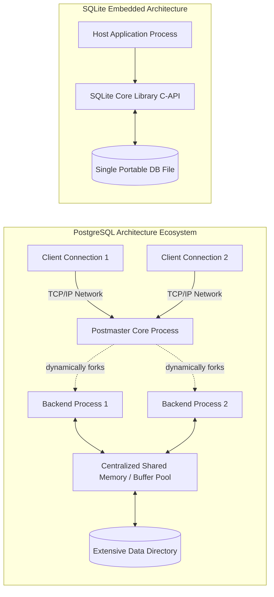

# PostgreSQL vs SQLite Architecture Comparison

**Name:** Ojas Maheshwari  
**Roll:** 24BCS10227

## 1. Problem Background

### Historical Context & Architectural Motivation
Database engines are never engineered as one-size-fits-all solutions; they are built with highly distinct philosophies and distinctly targeted deployment environments. **PostgreSQL** originated from the legendary POSTGRES project at UC Berkeley with the unyielding goal of evolving into a profoundly extensible, aggressively standards-driven, and truly enterprise-grade relational database. Its primary, unwavering objective is successfully handling massive, structurally intricate datasets concurrently accessed by thousands of simultaneous network users.

In stark contrast, **SQLite** was meticulously engineered by D. Richard Hipp to elegantly fulfill the immense demand for a completely self-contained, entirely serverless, and absolutely zero-configuration SQL engine. Its primary focus is the seamless embedding of structured data storage directly within the operational bounds of host applications—such as mobile software, desktop web browsers, or highly constrained IoT edge devices—completely eliminating the heavy operational burden of administering a dedicated, standalone database daemon.

## 2. Architecture Overview

### PostgreSQL: The Heavy Client-Server Process Model
PostgreSQL relies on a massive, highly scalable **client-server architecture**. 
1. The **Postmaster (The Main Overseer Process)** vigilantly listens for all incoming network connections.
2. For every single accepted client connection, the Postmaster aggressively forks a completely dedicated **Backend Process**.
3. These isolated processes continually and complexly communicate through a vast pool of **Shared Memory** (housing the Buffer Pool, complex Locks, and WAL buffers).

### SQLite: The Agile Embedded Database Design
SQLite is fundamentally an **embedded database**, brilliantly implemented as a highly optimized C-language library.
1. There is absolutely **no separate database process**. The entire database engine executes natively and directly within the host application's own process space.
2. Network latency is completely and utterly eliminated, as SQL statements are rapidly executed as direct, native function calls.
3. The entirety of the database (encompassing all tables, indexes, and complex schema) is routinely stored in a **single, highly portable cross-platform file** dwelling on disk.

## 3. Internal Design & Mechanics

### 3.1. Database File Organization & Storage Engine Philosophies
*   **PostgreSQL:** Utilizes a sprawling **Directory of Files** (traditionally `PGDATA`). Each logically distinct database acts as a subdirectory, and every single table or index manifests as an individual file (or is chunked into multiple 1GB segment files). It deploys a massively sophisticated Buffer Manager to meticulously cache pages deep within shared memory. Operational pages are typically formatted to 8KB.
*   **SQLite:** Champions a remarkably elegant **Single File** layout. The solitary file is uniformly divided into specific pages (defaulting to 4KB). The crucial first 100 bytes of page 1 permanently house the master database header. It aggressively relies heavily on the host operating system's native filesystem cache (the Page Cache) rather than attempting to self-manage a complex, bloated internal buffer pool.

### 3.2. Transaction Management & Concurrency Control Realities
*   **PostgreSQL (MVCC):** Flawlessly implements robust **Multi-Version Concurrency Control (MVCC)**. Whenever a row experiences an update, a completely new version of the row is securely appended, and the historical version is merely flagged as obsolete (to be aggressively cleaned up later by the VACUUM daemon). Readers structurally cannot block writers, and writers inherently cannot block readers, paving the way for truly massive concurrency.
*   **SQLite (Database-Level Locking & WAL Features):** By absolute default, SQLite forcefully locks the *entire database file* during any write operation, strictly permitting only a single writer at any given moment. However, when operating in **WAL (Write-Ahead Logging) mode**, it successfully supports multiple concurrent readers alongside a single writer. Nevertheless, it structurally remains incapable of supporting multiple concurrent writers.

### 3.3. Index Implementation Strategies
Both systems foundationally utilize **B-Trees**. PostgreSQL relies heavily on highly optimized B-Trees backed by advanced, granular locking mechanisms (the Lehman-Yao algorithm) specifically tailored for chaotic concurrent access. SQLite deploys standard B-Trees for its indexes and shifts to B+Trees for its primary tables (efficiently storing the raw data directly within the leaf nodes).

## 4. Design Trade-Offs & Application

### PostgreSQL Trade-Offs
*   **Advantages:** Unparalleled high concurrency capabilities, seamlessly scalable to massive terabytes of data, natively supports incredibly advanced data types (such as JSONB and PostGIS spatial data), and boasts robust, enterprise-grade replication.
*   **Limitations:** Imposes severe administrative overhead. Absolutely requires continuous, vigilant tuning (managing Autovacuum, tweaking memory settings). Forging a dedicated OS process for every single connection can exhaust RAM alarmingly quickly (practically mandating the use of connection poolers like PgBouncer in production).

### SQLite Trade-Offs
*   **Advantages:** True zero-configuration setup. The singular-file format is effortlessly transportable across systems. Delivers astonishing microsecond latency for complex queries (entirely bypassing the network).
*   **Limitations:** Woefully poor concurrency capabilities (hard-capped at a single writer). Severely limited `ALTER TABLE` capabilities. Possesses absolutely zero built-in user access management or native network routing capabilities.

### Real-World Production Use Cases
*   **PostgreSQL:** The indisputable champion for heavy web application backends, rigorous financial systems, massive data warehouses, and literally any multi-user environment that strictly demands unwavering ACID compliance while under punishing concurrent load.
*   **SQLite:** The undisputed king for mobile applications (powering iOS/Android native local storage), embedded desktop software configurations, remote IoT edge devices, and isolated testing environments.

## 5. Experiments / Practical Observations

A straightforward benchmarking script actively testing concurrent `INSERT` operations vividly illustrates the profound architectural divergence:
*   **Workload:** 10 highly concurrent threads attempting to insert 10,000 rows each.
*   **PostgreSQL Observation:** The workload is handled effortlessly. The OS immediately spawns 10 dedicated backend processes, and the MVCC engine flawlessly allows all 10 threads to insert concurrently with extraordinarily high throughput.
*   **SQLite Observation (Default Journal Mode):** Experiences catastrophic contention. 9 out of 10 threads will almost instantly and repeatedly encounter `SQLITE_BUSY` (database is fully locked) exceptions while the lone victor thread slowly writes. 
*   **SQLite Observation (WAL Mode):** Read contention is notably reduced, but the 10 writing threads are still forcefully serialized internally since structurally only a single connection is ever permitted to append to the WAL at any given time.

## 6. Key Learnings & Takeaways

1.  **Architecture Ultimately Dictates Scalability:** PostgreSQL's exceptionally complex multi-process MVCC architecture is the exact, fundamental reason it can dynamically scale to enterprise heights, but it simultaneously introduces a massive overhead that makes it completely inappropriate for embedding inside a lightweight smartphone app. 
2.  **The OS is Your Greatest Ally:** SQLite's brilliant engineering decision to wholeheartedly rely on the native OS Page Cache rather than attempting to architect a custom, bloated Buffer Manager keeps its core codebase miraculously small (hovering around 150K lines of code) and breathtakingly fast.
3.  **Concurrency is Extraordinarily Expensive:** Architecting a system capable of allowing multiple distinct users to write simultaneously demands a staggering engineering effort (implementing complex Locks, managing Shared Memory, orchestrating VACUUM). If your specific application does not strictly necessitate concurrent writers, SQLite stands as an absolutely unbeatable choice.
4.  **Expansive Ecosystem Capabilities:** PostgreSQL's truly expansive extension ecosystem—proudly featuring powerhouse tools like PostGIS for advanced spatial operations and pgvector for cutting-edge AI workloads—perfectly equips it to conquer highly specialized scenarios that fall completely outside SQLite's intended, simplistic scope.

## 7. Security and Access Control Philosophies

*   **PostgreSQL:** Boasts a deeply granular, enterprise-grade **Role-Based Access Control (RBAC)** system. Database administrators can meticulously define discrete users, roles, and groups, explicitly granting or revoking privileges down to the individual column or even row level (via highly advanced Row-Level Security). Remote connections are securely authenticated utilizing robust mechanisms like SCRAM-SHA-256, LDAP, or Kerberos.
*   **SQLite:** Possesses absolutely **zero internal concept of users, roles, or permissions**. Because it is fundamentally just a C-library directly reading and writing to a local disk file, it implicitly relies 100% on the host Operating System's file permission model. If an application (or human user) possesses OS-level read/write access to the `.sqlite` file on the filesystem, they possess full, unabated administrative control over the entire database.

## 8. Replication & High Availability Architecture

*   **PostgreSQL:** Structurally engineered for distributed resilience. It natively supports highly efficient **Physical Streaming Replication** (streaming raw WAL records directly to hot standby replica servers) as well as **Logical Replication** (streaming specific table-level row changes to entirely separate clusters). This vast capability supports profoundly complex High Availability (HA) architectures, dedicated read-replicas, and automated failover systems managed via robust external tools like Patroni.
*   **SQLite:** Natively, SQLite is an architectural island. It completely lacks built-in network replication. While administrators can securely back up the file using the Online Backup API, achieving active replication traditionally required physically copying the file. However, modern, cutting-edge external tools such as **Litestream** and **LiteFS** have been ingeniously developed specifically to continuously stream SQLite WAL changes out to cloud object storage (like AWS S3) or other nodes, bringing revolutionary pseudo-replication and disaster recovery capabilities to the previously isolated embedded world.
