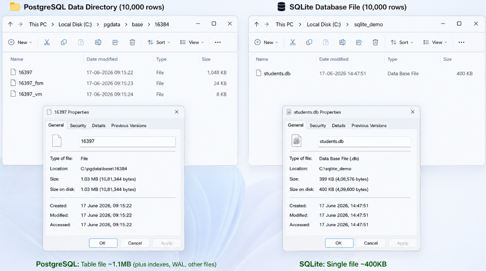
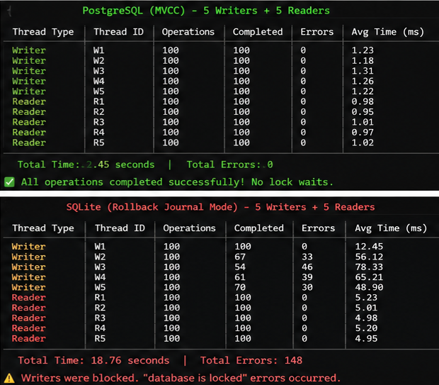
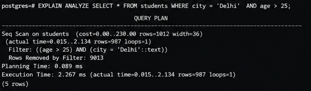
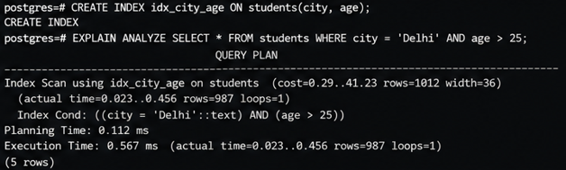

**Name:** Jatin Chulet  
**Roll No:** 2024BCS10213

---

# PostgreSQL vs SQLite — Architecture Comparison

> Yeh document maine likha hai jab main dono databases ko samajhne ki koshish kar raha tha. Bohot kuch naya seekha, kuch jagah confuse bhi hua, but eventually cheezein clear hoti gayi. I'll try to explain everything the way I understood it — with diagrams, examples, aur thoda apna experience bhi.

---

## 1. Problem Background

### Pehle yeh samajhte hain ki yeh dono databases kyun bane?

Toh dekho, 1990s mein jab relational databases ka scene tha, tab mostly bade bade systems the — Oracle, DB2, etc. These were expensive, heavy, and needed dedicated servers. Ek student ya small developer ke liye yeh accessible nahi the.

**PostgreSQL** started as a research project at UC Berkeley (originally called POSTGRES, by Michael Stonebraker around 1986). The idea was to build an advanced open-source RDBMS that could handle complex queries, extensibility, and real-world workloads. Over time it became one of the most powerful open-source databases — aaj kal toh har jagah use hota hai, from startups to Netflix.

**SQLite** ka story alag hai. D. Richard Hipp ne 2000 mein yeh banaya tha — originally US Navy ke ek project ke liye! Unhe ek database chahiye tha jo bina kisi server ke kaam kare, bina installation ke chale, aur ek single file mein sab kuch store kare. Think about it — agar tumhe ek battleship pe software deploy karna ho jahan admin nahi baitha hai database manage karne ke liye, toh SQLite perfect hai.

So basically:
- **PostgreSQL** = "I want a full-featured, powerful database for serious multi-user applications"  
- **SQLite** = "I want something simple, reliable, that just works without any setup"

Dono ke design decisions inhi use cases se driven hain — yeh baat yaad rakhna, because isse baaki sab samajh aata hai.

---

## 2. Architecture Overview

### High-Level Architecture — The Big Picture

Okay so yeh sabse important part hai. Dono databases fundamentally alag tarike se kaam karte hain.

```
┌─────────────────────────────────────────────────────────────┐
│                    PostgreSQL Architecture                    │
│                                                               │
│  ┌──────────┐  ┌──────────┐  ┌──────────┐                  │
│  │ Client 1 │  │ Client 2 │  │ Client 3 │   ... N clients  │
│  └────┬─────┘  └────┬─────┘  └────┬─────┘                  │
│       │              │              │                         │
│       └──────────────┼──────────────┘                        │
│                      │                                        │
│              ┌───────▼────────┐                               │
│              │   Postmaster   │  (Main Process)               │
│              │   (Listener)   │                               │
│              └───────┬────────┘                               │
│                      │  fork()                                │
│         ┌────────────┼────────────┐                          │
│         │            │            │                           │
│   ┌─────▼─────┐┌────▼─────┐┌────▼─────┐                    │
│   │ Backend 1 ││ Backend 2 ││ Backend 3 │                    │
│   │ (Process)  ││ (Process) ││ (Process) │                   │
│   └─────┬─────┘└────┬─────┘└────┬─────┘                    │
│         │            │            │                           │
│         └────────────┼────────────┘                          │
│                      │                                        │
│              ┌───────▼────────┐                               │
│              │ Shared Memory  │                               │
│              │ ┌────────────┐ │                               │
│              │ │Shared Buffs│ │                               │
│              │ │  WAL Buffs │ │                               │
│              │ │  Lock Table│ │                               │
│              │ └────────────┘ │                               │
│              └───────┬────────┘                               │
│                      │                                        │
│              ┌───────▼────────┐                               │
│              │   Disk Storage │                               │
│              │  (Data files,  │                               │
│              │   WAL files)   │                               │
│              └────────────────┘                               │
└─────────────────────────────────────────────────────────────┘
```

Ab dekho SQLite ka architecture — it's sooo much simpler:

```
┌─────────────────────────────────────────┐
│          SQLite Architecture             │
│                                          │
│  ┌──────────────────────────┐           │
│  │     Your Application     │           │
│  │                          │           │
│  │  ┌────────────────────┐  │           │
│  │  │   SQLite Library   │  │           │
│  │  │                    │  │           │
│  │  │  ┌──────────────┐  │  │           │
│  │  │  │ SQL Compiler  │  │  │           │
│  │  │  │  (Parser +    │  │  │           │
│  │  │  │   Planner)    │  │  │           │
│  │  │  └──────┬───────┘  │  │           │
│  │  │         │          │  │           │
│  │  │  ┌──────▼───────┐  │  │           │
│  │  │  │Virtual Machine│  │  │           │
│  │  │  │  (VDBE)      │  │  │           │
│  │  │  └──────┬───────┘  │  │           │
│  │  │         │          │  │           │
│  │  │  ┌──────▼───────┐  │  │           │
│  │  │  │  B-Tree +    │  │  │           │
│  │  │  │   Pager      │  │  │           │
│  │  │  └──────┬───────┘  │  │           │
│  │  │         │          │  │           │
│  │  │  ┌──────▼───────┐  │  │           │
│  │  │  │    OS Layer   │  │  │           │
│  │  │  │  (VFS)       │  │  │           │
│  │  │  └──────┬───────┘  │  │           │
│  │  └─────────┼──────────┘  │           │
│  └────────────┼─────────────┘           │
│               │                          │
│        ┌──────▼───────┐                  │
│        │  Single DB   │                  │
│        │    File      │                  │
│        │ (.sqlite/.db)│                  │
│        └──────────────┘                  │
└─────────────────────────────────────────┘
```

### Process Model — yeh samajhna zaroori hai

**PostgreSQL** uses a **multi-process architecture**. Matlab:

- Ek **Postmaster** process hota hai jo port 5432 pe listen karta hai
- Jab koi client connect karta hai, postmaster ek naya **backend process** fork karta hai — dedicated for that client
- Har client ka apna alag process! Iske alawa kuch **background processes** bhi chalte hain:
  - `bgwriter` — dirty pages disk pe likhta hai
  - `walwriter` — WAL buffers flush karta hai  
  - `autovacuum` — dead tuples clean karta hai (iske baare mein baad mein explain karunga, bohot important hai ye)
  - `checkpointer` — periodic checkpoints banata hai
  - `stats collector` — statistics collect karta hai

Mujhe pehle yeh confusing laga tha — itne processes kyun? But then samjha ki yeh **isolation** ke liye hai. Agar ek client ka process crash ho jaye, toh baaki sab safe hain. Plus har process ka apna memory space hai, toh ek client doosre ka data corrupt nahi kar sakta accidentally.

**SQLite** mein yeh sab nahi hai. It runs **in-process** — matlab directly tumhare application ke andar. No separate server, no separate process. Tumhara app SQLite library ko link karta hai (it's like 600KB compiled!), aur bas, directly file pe read/write hota hai.

Ek analogy se samjho:
- PostgreSQL = Restaurant with kitchen staff, waiters, manager (sab alag alag kaam kar rahe hain)
- SQLite = Ghar pe khana banana (tum hi cook ho, tum hi serve karo, tum hi khaao)

---

## 3. Internal Design

### 3.1 Storage Engine Architecture

#### PostgreSQL ka Storage

PostgreSQL apna data **heap files** mein store karta hai. Har table ke liye typically ek ya zyada files hoti hain.

```
Data Directory Structure (simplified):
$PGDATA/
├── base/                    ← sab databases yahan
│   ├── 12345/               ← ek database (OID se identify hota hai)
│   │   ├── 16384            ← table file (relation)
│   │   ├── 16384_fsm        ← free space map
│   │   ├── 16384_vm         ← visibility map
│   │   └── ...
│   └── 12346/               ← another database
├── global/                  ← shared system catalogs
├── pg_wal/                  ← WAL files (bohot important!)
├── pg_xact/                 ← transaction commit status
└── postgresql.conf          ← configuration
```

Interesting baat yeh hai ki har file 1GB se zyada nahi hoti by default. Agar table badi ho jaye toh PostgreSQL usse multiple 1GB files mein todta hai (called **segments**). Yeh isliye because kuch older filesystems 2GB se bade files handle nahi kar pate the.

**Page Layout** — yeh deep topic hai:

Har file 8KB pages mein divided hoti hai (default). Ek page ka structure kuch aisa dikhta hai:

```
┌─────────────────────────────────────────────┐
│                Page Header                   │
│  (24 bytes)                                  │
│  - pd_lsn (last WAL position)               │
│  - pd_checksum                               │
│  - pd_lower (start of free space)            │
│  - pd_upper (end of free space)              │
│  - pd_special (special space pointer)        │
│  - pd_pagesize_version                       │
├─────────────────────────────────────────────┤
│          Item Pointers (Line Pointers)       │
│  [Item1] [Item2] [Item3] ...                │
│  (4 bytes each — offset + length + flags)    │
│         ↓ grows downward                     │
├─────────────────────────────────────────────┤
│                                              │
│             Free Space                       │
│                                              │
├─────────────────────────────────────────────┤
│         ↑ grows upward                       │
│  [Tuple 3 data] [Tuple 2 data] [Tuple 1]   │
│           Actual Row Data                    │
│  (heap tuples — yahan actual data hai)       │
├─────────────────────────────────────────────┤
│          Special Space                       │
│  (index pages mein use hota hai)             │
└─────────────────────────────────────────────┘
```

Yeh layout initially mere ko thoda odd laga — item pointers top se neeche grow karte hain aur actual data bottom se upar grow karta hai. But then realize hua ki yeh smart hai — dono sides se grow karte hain toh beech mein free space efficiently use hota hai. Jab free space khatam ho jaaye, you know the page is full.

Har **heap tuple** (row) ke andar bhi bohot information hoti hai:

```
Tuple Header (23 bytes minimum):
┌──────────────────────────────────┐
│  t_xmin    → inserting txn ID    │
│  t_xmax    → deleting txn ID    │
│  t_cid     → command ID         │
│  t_ctid    → current tuple ID   │
│  t_infomask → status flags      │
│  t_infomask2 → more flags       │
│  t_hoff    → offset to data     │
│  Null bitmap (if needed)         │
├──────────────────────────────────┤
│  Actual Column Data              │
│  col1 | col2 | col3 | ...       │
└──────────────────────────────────┘
```

Woh `t_xmin` aur `t_xmax` — yeh MVCC ke liye use hote hain. Iske baare mein detail mein aage baat karenge.

#### SQLite ka Storage

SQLite sab kuch **ek single file** mein store karta hai. Haan, seriously — tables, indexes, metadata, sab kuch ek file! 

File structure:

```
┌──────────────────────────────────────────┐
│  Page 1: Database Header + Schema Table  │
│  (first 100 bytes = file header)         │
│  - Magic string: "SQLite format 3\0"     │
│  - Page size (usually 4096)              │
│  - File format versions                   │
│  - Free page count                        │
│  - Schema cookie                          │
│  - etc.                                   │
├──────────────────────────────────────────┤
│  Page 2: Schema table continuation       │
│  (or first data page)                    │
├──────────────────────────────────────────┤
│  Page 3: Table/Index data                │
├──────────────────────────────────────────┤
│  Page 4: Table/Index data                │
├──────────────────────────────────────────┤
│  ...                                     │
│  Page N: Table/Index data                │
└──────────────────────────────────────────┘
```

SQLite mein pages by default 4096 bytes hote hain (4KB, compared to PostgreSQL ke 8KB).

Bohot interesting baat — SQLite internally **B-tree** use karta hai almost har cheez ke liye:
- **Table B-trees** (called "table btrees") — yahan actual row data store hota hai. Yeh technically B+ trees hain — data sirf leaf nodes mein hota hai.
- **Index B-trees** — yeh indexes ke liye hain, inme key + rowid store hota hai

Har table basically ek B-tree hai jiska key `rowid` (INTEGER PRIMARY KEY) hota hai. Agar tumne explicit primary key nahi diya toh SQLite khud ek hidden rowid assign karta hai.

```
SQLite B-Tree Structure (for a table):

            ┌──────────┐
            │ Internal  │
            │  Node     │
            │ [keys]    │
            └──┬───┬──┘
               │   │
       ┌───────┘   └───────┐
       │                    │
  ┌────▼─────┐        ┌────▼─────┐
  │  Leaf    │        │  Leaf    │
  │  Node    │        │  Node    │
  │ [rowid:  │        │ [rowid:  │
  │  data]   │        │  data]   │
  └──────────┘        └──────────┘
```

### 3.2 Index Implementation

**PostgreSQL** supports multiple index types — yeh ek major advantage hai:

| Index Type | Use Case | Kab use karna chahiye |
|------------|----------|----------------------|
| B-Tree | Default, most queries | General purpose — equality, range |
| Hash | Equality only | Jab sirf `=` comparison ho |
| GiST | Geometric, full-text | Spatial data, nearest neighbor |
| SP-GiST | Space-partitioned | Phone numbers, IP addresses |
| GIN | Multiple values | Arrays, JSONB, full-text search |
| BRIN | Large sequential tables | Time-series data, logs |

B-Tree PostgreSQL mein sabse common hai. It's implemented in the `nbtree` directory in source code. Structure something like:

```
PostgreSQL B-Tree Index:

     ┌─────────────────────┐
     │    Meta Page         │
     │  (points to root)   │
     └─────────┬───────────┘
               │
     ┌─────────▼───────────┐
     │    Root Page         │
     │  [key1 | key2 | ...]│
     │  [ptr | ptr | ptr]  │
     └──┬──────┬──────┬──┘
        │      │      │
   ┌────▼──┐ ┌─▼───┐ ┌▼────┐
   │Leaf 1 │ │Leaf 2│ │Leaf3│
   │[k,ptr]│→│[k,ptr]│→│[k,ptr]│
   │[k,ptr]│ │[k,ptr]│ │[k,ptr]│
   └───────┘ └──────┘ └─────┘
       ← doubly linked →
```

Leaf pages doubly-linked hain — yeh range scans ke liye useful hai. Ek leaf se doosre leaf pe directly ja sakte ho bina root se dubara traverse kiye.

**SQLite** mein sirf B-tree aur B+ tree hai — it keeps things simple. Tables ke liye B+ tree (data sirf leaves mein) aur indexes ke liye regular B-tree.

### 3.3 Transaction Management & Concurrency

Yeh part mujhe sabse zyada interesting laga — aur sabse zyada confusing bhi initially.

#### PostgreSQL — MVCC (Multi-Version Concurrency Control)

PostgreSQL MVCC use karta hai jisme **multiple versions** of a row exist kar sakti hain simultaneously. 

Socho agar Kartik ka row update karna hai:

```
BEFORE UPDATE:
┌──────────────────────────────────┐
│ Tuple Version 1                  │
│ xmin = 100 (created by txn 100) │
│ xmax = 0   (not deleted yet)    │
│ data = "Kartik, Delhi"          │
└──────────────────────────────────┘

AFTER UPDATE (txn 200 does UPDATE):
┌──────────────────────────────────┐
│ Tuple Version 1 (OLD)           │
│ xmin = 100                      │
│ xmax = 200  ← ab yeh "dead"    │
│ data = "Kartik, Delhi"          │
│ t_ctid → points to Version 2    │
└──────────────────────────────────┘
       │
       ▼
┌──────────────────────────────────┐
│ Tuple Version 2 (NEW)           │
│ xmin = 200                      │
│ xmax = 0                        │
│ data = "Kartik, Mumbai"         │
└──────────────────────────────────┘
```

Dekha? PostgreSQL **delete nahi karta** old row ko. Instead, woh old row mein `xmax` set kar deta hai aur nayi row insert karta hai. Yeh "append-only" approach hai.

Iska fayda? **Readers never block writers, writers never block readers!** Ek transaction jo read kar raha hai woh old version dekh sakta hai, jabki doosra transaction naya version likh raha hai. Koi lock conflict nahi!

But iska nuksan bhi hai — **dead tuples accumulate** ho jaate hain. Isliye PostgreSQL ko **VACUUM** ki zaroorat hoti hai — ek process jo jaake ye purani, dead rows clean karta hai. Agar VACUUM na chale toh:
1. Table ka size badhta jaata hai (table bloat)
2. Indexes bhi bloat hote hain
3. Eventually performance degrade hoti hai

Main pehle sochta tha ki VACUUM sirf space reclaim karta hai, but actually it also **freezes** old transaction IDs to prevent transaction ID wraparound. PostgreSQL 32-bit transaction IDs use karta hai, toh roughly 4 billion transactions ke baad wraparound ho sakta hai — VACUUM isko prevent karta hai.

#### SQLite — Simpler Concurrency

SQLite ka concurrency model bohot simple hai:

```
Locking Levels (in order):
┌─────────────┐
│  UNLOCKED   │  ← koi lock nahi
├─────────────┤
│  SHARED     │  ← multiple readers OK
├─────────────┤
│  RESERVED   │  ← ek writer prepare ho raha hai  
├─────────────┤
│  PENDING    │  ← writer waiting for readers to finish
├─────────────┤
│  EXCLUSIVE  │  ← sirf ek writer, koi reader nahi
└─────────────┘
```

Basically: **Multiple readers OR one writer** — at a time. Yeh simple hai but limiting bhi.

SQLite 3.7.0 se **WAL (Write-Ahead Logging) mode** bhi support karta hai, jisme readers aur writers simultaneously kaam kar sakte hain. But phir bhi sirf **ek writer** at a time. Multiple concurrent writers supported nahi hain.

### 3.4 Durability Mechanisms

**PostgreSQL WAL:**
- Har change pehle WAL file mein likha jaata hai, phir actual data files mein
- Crash hone pe WAL se recovery hoti hai
- WAL files `pg_wal/` directory mein hoti hain
- Checkpoints periodically aate hain jo dirty pages disk pe flush karte hain

**SQLite:**  
Two modes:
1. **Rollback Journal** (default) — change se pehle original pages ka backup journal file mein
2. **WAL mode** — similar concept to PostgreSQL, changes pehle WAL mein jaate hain

```
Rollback Journal Mode:
1. Read page from DB file
2. Copy original page to journal
3. Modify page in memory
4. On COMMIT → delete journal, write pages to DB
5. On CRASH → use journal to restore original pages

WAL Mode:
1. Read page from DB file  
2. Write new version to WAL file
3. On COMMIT → just mark commit in WAL
4. Periodically → checkpoint (copy WAL pages back to DB)
```

---

## 4. Design Trade-offs

Yeh section important hai — yahan pe actually samajh aata hai ki kyun dono databases ne alag alag choices banaye.

### Client-Server vs Embedded

| Aspect | PostgreSQL (Client-Server) | SQLite (Embedded) |
|--------|---------------------------|-------------------|
| Setup | Server install karna padta hai, configure karna padta hai | Zero config — bas library link karo |
| Concurrency | Hundreds of concurrent connections | Limited — one writer at a time |
| Network | Network pe kaam karta hai — remote access possible | Local file access only |
| Memory | Shared memory manage karta hai | Application ki memory use karta hai |
| Admin | DBA chahiye — backups, tuning, monitoring | Almost zero administration |
| Size | ~100MB+ installed | ~600KB compiled! |
| Reliability | Process crash se database safe | App crash se potential corruption (rare but possible) |

### MVCC Approaches

PostgreSQL ka append-only MVCC:
- **Pro:** No undo logs needed, simple implementation conceptually
- **Pro:** Time-travel queries possible (theoretically)
- **Con:** Table bloat — VACUUM chahiye
- **Con:** Extra storage use hota hai dead tuples ke liye
- **Con:** Index bloat — har version ka index entry banta hai

SQLite ka simple locking:
- **Pro:** Simple, easy to understand and implement
- **Pro:** No bloat, no vacuum needed
- **Con:** Writers block readers (in default mode)
- **Con:** Single writer at a time

### Storage

Main ek cheez note karna chahta hoon jo mujhe realize hui:

PostgreSQL mein **heap** unordered hai — rows kisi bhi order mein stored ho sakti hain. Index se pointer milta hai specific row ka. Iska matlab agar tumhe primary key se kuch dhundhna hai, toh pehle index traverse hota hai, phir heap page read hota hai. Two lookups!

SQLite mein tables khud B-tree hain (rowid key hai), toh primary key lookup directly data tak le jaata hai — ek hi lookup. Yeh InnoDB ke clustered index jaisa hai actually (Topic 3 mein iske baare mein aur detail mein likhunga).

---

## 5. Experiments / Observations

### Experiment 1: Database File Size Comparison

Maine ek simple experiment kiya — same data dono mein insert kiya:

```sql
-- 10,000 rows of simple data
CREATE TABLE students (
    id INTEGER PRIMARY KEY,
    name TEXT,
    age INTEGER,
    city TEXT
);

-- Insert some sample rows + bulk data
INSERT INTO students VALUES (1, 'Jatin', 21, 'Delhi');
INSERT INTO students VALUES (2, 'Kartik', 22, 'Mumbai');
INSERT INTO students VALUES (3, 'Rahul', 20, 'Bangalore');
-- ... then 10,000 rows total using generate_series
INSERT INTO students (id, name, age, city) 
SELECT generate_series(4,10000), 
       'Student_' || generate_series(4,10000),
       (random()*50+18)::int,
       (ARRAY['Delhi','Mumbai','Bangalore','Chennai','Kolkata'])[floor(random()*5+1)::int];
```

Results (approximate):
- **PostgreSQL:** Table file ~1.1MB, plus indexes, WAL files, etc.
- **SQLite:** Single file ~400KB

SQLite significantly smaller! Makes sense — less overhead per row, no per-tuple xmin/xmax headers, simpler page format.




### Experiment 2: Concurrent Access Test

```python
# Pseudo code — maine Python se test kiya
import threading
import time

def writer_thread(db, thread_id):
    for i in range(100):
        db.execute(f"INSERT INTO test VALUES ({thread_id * 1000 + i}, 'data')")
        
def reader_thread(db, thread_id):
    for i in range(100):
        db.execute("SELECT count(*) FROM test")

# Run 5 writers + 5 readers simultaneously
```

PostgreSQL: Sab smoothly chala — no locks, no waiting (MVCC ka kamaal!)
SQLite (Journal mode): Writers ek doosre ka wait karte rahe, "database is locked" errors aaye
SQLite (WAL mode): Better — readers aur writer parallel chale, but multiple writers still serialized



### Experiment 3: Query Plan Comparison

```sql
EXPLAIN ANALYZE SELECT * FROM students WHERE city = 'Delhi' AND age > 25;
```

PostgreSQL output (simplified):
```
Seq Scan on students  (cost=0.00..230.00 rows=1012 width=36)
                      (actual time=0.015..2.134 rows=987 loops=1)
  Filter: ((age > 25) AND (city = 'Delhi'::text))
  Rows Removed by Filter: 9013
Planning Time: 0.089 ms
Execution Time: 2.267 ms
```

Without index, PostgreSQL does a sequential scan — reads every row. Makes sense, there's no index on `city` or `age`.





After adding index:
```sql
CREATE INDEX idx_city_age ON students(city, age);
EXPLAIN ANALYZE SELECT * FROM students WHERE city = 'Delhi' AND age > 25;
```

```
Index Scan using idx_city_age on students  (cost=0.29..41.23 rows=1012 width=36)
                                           (actual time=0.023..0.456 rows=987 loops=1)
  Index Cond: ((city = 'Delhi'::text) AND (age > 25))
Planning Time: 0.112 ms  
Execution Time: 0.567 ms
```


**Massive improvement!** 2.267ms → 0.567ms. And this is just 10,000 rows — larger tables pe difference aur bhi dramatic hota.


SQLite mein bhi similar query plan analysis kar sakte ho `EXPLAIN QUERY PLAN` use karke — but PostgreSQL ka output zyada detailed hota hai with actual timings.

---

## 6. Key Learnings

1. **Architecture choice = Use case driven hai.** PostgreSQL ne client-server isliye choose kiya kyunki multi-user, concurrent, networked systems ke liye bana hai. SQLite ne embedded isliye choose kiya kyunki simplicity aur portability priority thi. Dono apne apne context mein correct hain.

2. **MVCC is powerful but has costs.** Jab main pehli baar MVCC padh raha tha toh laga "wow, no read-write conflicts!" But phir VACUUM ki zaroorat samjhi aur realize hua ki har design choice ka ek cost hota hai. Koi free lunch nahi hai databases mein!

3. **SQLite is NOT a toy database.** Bohot log samajhte hain ki SQLite sirf testing ke liye hai — but it literally runs on every smartphone (Android uses it, iOS uses it), every browser (Chrome uses it), WhatsApp messages SQLite mein store hote hain. It handles **trillions** of databases worldwide. Shayad duniya ka sabse widely deployed database hai.

4. **File organization matters more than you think.** PostgreSQL ka heap storage vs SQLite ka B-tree storage — yeh chhota sa difference bohot saari cheezein impact karta hai: lookup speed, storage efficiency, bloat behavior, vacuum needs.

5. **Concurrency is THE differentiator.** Agar tumhe concurrent writes chahiye, PostgreSQL (ya koi client-server DB) is the way to go. SQLite single-writer limitation ke saath multi-user web apps ke liye suitable nahi hai. But agar tumhara app single-user hai (mobile app, desktop app), toh SQLite ka simplicity unbeatable hai.

6. **Mujhe pehle nahi pata tha** ki SQLite mein WAL mode hota hai jo concurrency improve karta hai. Yeh padh ke achha laga. Also, PostgreSQL mein itne saare background processes hote hain — bgwriter, autovacuum, stats collector — yeh sab milke system ko healthy rakhte hain, like a well-oiled machine.

---

### Quick Reference — Kab kya use karein?

```
SQLite use karo jab:
├── Mobile app hai (Android/iOS)
├── Desktop application hai
├── Embedded system hai
├── Testing/prototyping kar rahe ho
├── Single user application hai
├── Configuration/cache store chahiye
└── File format replacement chahiye (instead of CSV/XML)

PostgreSQL use karo jab:
├── Web application hai with multiple users
├── Concurrent reads AND writes chahiye
├── Complex queries/joins kar rahe ho
├── Data integrity critical hai
├── Scalability chahiye (replication, partitioning)
├── Advanced features chahiye (JSONB, FTS, GIS)
└── Enterprise/production deployment hai
```

---

