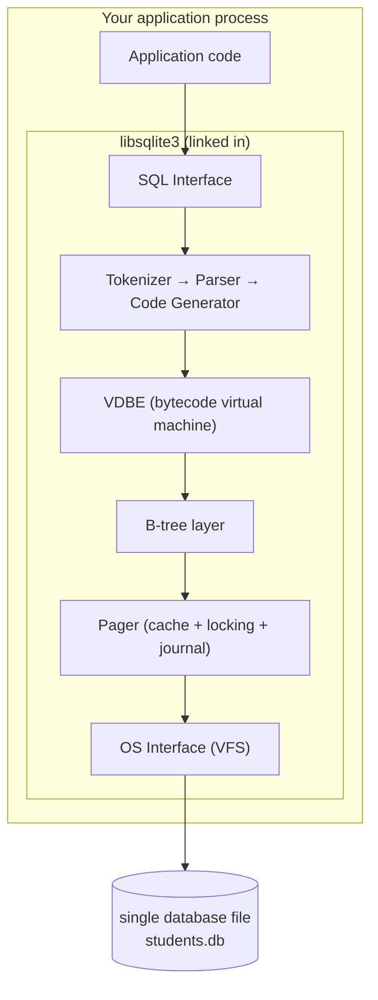
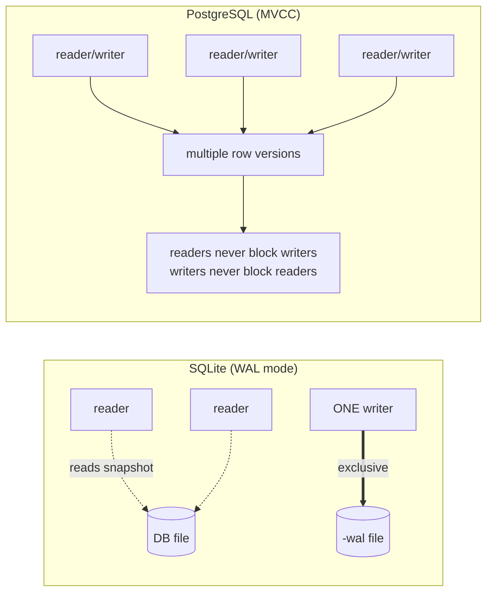

# PostgreSQL vs SQLite — An Architectural Comparison

> Two relational databases that both speak SQL and both use B-trees on disk, yet sit at
> opposite ends of the design spectrum. The interesting question is not *"which is better"*
> but *"which set of trade-offs did each team accept, and why."*

All experimental output in this document was captured locally on:

| System | Version |
|---|---|
| SQLite | `3.51.0 (2025-06-12)` |
| PostgreSQL | `16.13 (Homebrew), aarch64-apple-darwin` |

---

## 1. Problem Background

| | **SQLite** | **PostgreSQL** |
|---|---|---|
| Origin | 2000, D. Richard Hipp — needed a DB that runs **without a server** on a guided-missile destroyer (no admin available) | 1986, UC Berkeley POSTGRES project → PostgreSQL 1996 — a research RDBMS exploring extensibility and complex types |
| Problem solved | "I need SQL storage *inside my process* with zero configuration and zero administration." | "I need a correct, concurrent, extensible RDBMS that many clients can hit at once." |
| Mental model | A **replacement for `fopen()`** — a file format you query with SQL | A **replacement for Oracle** — a standalone data server |

The single sentence that explains 90% of the differences:

> **SQLite is a library that your application links against. PostgreSQL is a server that your application connects to.**

Every other difference — concurrency, durability, scalability, file layout — is downstream of that one decision.

---

## 2. Architecture Overview

### SQLite — embedded, in-process



There is **no process**. A SQL statement is compiled into bytecode for the **VDBE** (Virtual Database Engine), which walks B-trees through the **pager**, which reads/writes a **single file** through the OS.

### PostgreSQL — client-server, process-per-connection

```mermaid
flowchart TB
    c1["Client (psql / app)"] -->|TCP / Unix socket| pm["Postmaster<br/>(listener, forks children)"]
    c2["Client"] --> pm
    pm -->|fork()| be1["Backend process #1"]
    pm -->|fork()| be2["Backend process #2"]
    subgraph shared["Shared memory"]
        sb["Shared Buffers (page cache)"]
        wb["WAL buffers"]
        locks["Lock table / PROC array"]
    end
    be1 --> shared
    be2 --> shared
    shared --> bgw["Background workers:<br/>checkpointer, bgwriter,<br/>WAL writer, autovacuum"]
    bgw --> disk[("Data files + WAL<br/>base/, pg_wal/")]
    shared --> disk
```

Each client connection gets its **own OS process** (a *backend*), forked by the *postmaster*. Backends coordinate through **shared memory** (shared buffers, lock tables) and a set of **background processes** handle checkpoints, WAL flushing, background writing, and vacuuming.

---

## 3. Internal Design

### 3.1 Database file organization

**SQLite** — the entire database is **one file**, a sequence of fixed-size pages. Every table and index is a B-tree, and the file header points at the schema. Observed structure of our test DB:

```
$ sqlite3 students.db ".dbinfo"
database page size:  4096       <- one tunable: 512..65536
database page count: 49
write format:        2
text encoding:       1 (utf8)
```

The very first page holds the file header **and** the `sqlite_master` table — the catalog that maps object names to their B-tree root pages:

```
$ sqlite3 students.db "SELECT type,name,rootpage FROM sqlite_master;"
table|students|2          <- table data lives in B-tree rooted at page 2
table|depts|3
index|idx_students_dept|4
```

**PostgreSQL** — a database is a **directory tree**. Each table/index is its own set of files, split into **1 GB segments**, under `base/<db_oid>/<relfilenode>`:

```
$ psql -c "SELECT pg_relation_filepath('students'), pg_size_pretty(pg_relation_size('students'));"
 pg_relation_filepath | heap
----------------------+---------
 base/5/16391         | 5096 kB
```

| | SQLite | PostgreSQL |
|---|---|---|
| Unit | 1 file = 1 database | 1 directory = 1 cluster; 1 file-set per relation |
| Page size | 4096 B (configurable) | **8192 B** (compile-time fixed) |
| Table storage | B-tree keyed on `rowid` (table *is* a B-tree) | **Heap** (unordered tuples) + separate index B-trees |

This is a deep structural divergence: **in SQLite a table is itself a B-tree** (data stored at the leaves, ordered by `rowid`), whereas **PostgreSQL stores rows in an unordered heap** and indexes point *into* it. SQLite's design makes primary-key lookups index-organized for free; PostgreSQL's makes every secondary index symmetric (none is "special") at the cost of a heap fetch.

### 3.2 Page layout

Both use slotted pages, but PostgreSQL's is visible via `pageinspect`:

```
$ psql -c "SELECT lower, upper, special, pagesize FROM page_header(get_raw_page('mvcc_demo',0));"
 lower | upper | special | pagesize
-------+-------+---------+----------
    40 |  8032 |    8192 |     8192
```

`lower` (end of the line-pointer array) and `upper` (start of tuple data) grow toward each other; free space is the gap between them — the classic slotted-page layout. SQLite uses the same idea (cell-pointer array growing down, cells growing up) inside each 4 KB page.

### 3.3 Index implementation

Both implement **B-trees**. The query-planner output shows how each navigates a join:

```
-- SQLite
$ EXPLAIN QUERY PLAN
  SELECT s.name, d.name FROM students s JOIN depts d ON s.dept_id=d.id WHERE s.gpa>3.5;
QUERY PLAN
|--SCAN s
`--SEARCH d USING INTEGER PRIMARY KEY (rowid=?)   <- nested-loop, probing depts' rowid B-tree
```

SQLite **only ever uses nested-loop joins**. PostgreSQL has a cost-based optimizer that picks hash/merge/nested-loop and even **parallelizes** — see Topic 2 for the full plan.

### 3.4 Concurrency control — the central difference



- **SQLite**: locking is at the **whole-database** granularity. In rollback-journal mode, a writer takes an EXCLUSIVE lock on the entire file. **WAL mode** (which we enabled below) relaxes this so readers and *one* writer can proceed concurrently — but still **only one writer at a time**.

  ```
  $ sqlite3 students.db "PRAGMA journal_mode;"           -> delete   (default: rollback journal)
  $ sqlite3 students.db "PRAGMA journal_mode=WAL;"       -> wal
  # WAL mode materializes two sidecar files:
  -rw-r--r--  students.db
  -rw-r--r--  students.db-shm   <- shared-memory index for the WAL
  -rw-r--r--  students.db-wal   <- the write-ahead log itself
  ```

- **PostgreSQL**: full **MVCC** (multi-version concurrency control). Every row carries `xmin`/`xmax` transaction stamps; an UPDATE writes a *new* row version rather than overwriting. Readers see a consistent snapshot without taking locks. This supports many simultaneous writers — at the cost of needing **VACUUM** to clean up dead versions (detailed in Topic 2).

### 3.5 Durability

| | SQLite | PostgreSQL |
|---|---|---|
| Mechanism | Rollback journal *or* WAL | **WAL** (always) |
| Crash recovery | Replay/rollback the journal/WAL on next open | WAL replay from last checkpoint at startup |
| `fsync` discipline | On commit (configurable via `PRAGMA synchronous`) | WAL flushed on commit (configurable via `synchronous_commit`) |

Both achieve the **D** in ACID by writing intent to a log before touching the main file. The difference is operational: SQLite recovers when the *next process* opens the file; PostgreSQL recovers in a dedicated startup phase before accepting connections.

---

## 4. Design Trade-Offs

### Why SQLite is embedded
- **Zero configuration / zero administration** — there is no server to install, start, secure, or tune. Perfect for shipping inside an app.
- **No IPC overhead** — a query is a function call, not a network round-trip. For single-user workloads this is *faster* than client-server.
- **The file is the database** — easy to copy, back up, email, or embed as an app file format (SQLite is an official Library-of-Congress recommended storage format).
- **Cost paid:** one writer at a time; no network access; limited to one machine's resources; coarse-grained locking.

### Why PostgreSQL is client-server
- **Concurrent multi-user access** — many backends, MVCC, row-level locking → high write concurrency.
- **Resource sharing & control** — a shared buffer pool, connection-level privileges, roles, and resource limits across all clients.
- **Crash isolation & background work** — autovacuum, checkpointing, and replication run independently of clients.
- **Extensibility** — custom types, index methods (GiST/GIN/BRIN), procedural languages.
- **Cost paid:** must run and administer a server; every connection is a heavyweight OS process (hence the near-universal need for a connection pooler like PgBouncer); network/IPC latency per query.

### Performance implications
- For a **single user doing a tight loop of small queries**, SQLite usually *wins* — no IPC, no MVCC bookkeeping, no per-row visibility checks.
- For **many concurrent writers**, PostgreSQL wins decisively — SQLite serializes writers on a single lock while PostgreSQL lets them proceed against independent row versions.

---

## 5. Experiments / Observations

| Observation | SQLite | PostgreSQL | Takeaway |
|---|---|---|---|
| Page size | `4096` | `8192` | PG's larger page amortizes per-page overhead for analytic scans |
| Table physical form | B-tree on `rowid` (rootpage 2) | unordered heap (`base/5/16391`) | index-organized vs heap |
| Join algorithms | nested-loop only (`SCAN s` + `SEARCH d`) | hash / merge / nested-loop + **parallel** | PG's cost optimizer vs SQLite's simplicity |
| Concurrency unit | whole-file lock (1 writer) | per-row MVCC (many writers) | the core scalability split |
| Durability log | journal **or** `-wal`+`-shm` sidecars | always-on WAL in `pg_wal/` | both log-before-write |

**Concurrency stress (conceptual, grounded in the locking models above):** issuing two simultaneous writes to SQLite, the second blocks on `SQLITE_BUSY` until the first releases the database lock. The same two writes in PostgreSQL touch two different rows and **both commit without blocking**, because each writer creates an independent tuple version.

---

## 6. Key Learnings

1. **One decision cascades.** "Embedded library" vs "network server" is not one of many differences — it is *the* difference. Concurrency granularity, file layout, join strategy, and administration model all fall out of it.
2. **A table need not be a heap.** SQLite makes the table itself a B-tree (index-organized); PostgreSQL keeps a heap with side indexes. This foreshadows the same heap-vs-clustered debate between PostgreSQL and InnoDB (Topic 3).
3. **WAL is universal, but for different reasons.** SQLite's WAL mode exists chiefly to *unblock readers during a write*; PostgreSQL's WAL exists chiefly for *crash recovery and replication*. Same data structure, different primary motivation.
4. **"Better" is workload-relative.** SQLite is the right database for a phone app, a browser, or an app's local cache — billions of deployments prove it. PostgreSQL is the right database the moment you have concurrent users and need a single source of truth. Neither is a scaled-down or scaled-up version of the other; they solve different problems.

> **Why SQLite for mobile?** No server process to run on a battery-constrained device, the whole DB is a single sandboxed file the OS can back up, and a phone app is inherently single-user — so the one-writer limitation never bites.
>
> **Why PostgreSQL for large multi-user systems?** MVCC + row locking + process isolation + a shared buffer pool let hundreds of clients read and write concurrently against one consistent, durable, crash-safe store.

---

### References
- SQLite — *Architecture of SQLite*, *File Format*, *WAL* docs: https://www.sqlite.org/arch.html
- PostgreSQL 16 docs — *Database Physical Storage*, *Concurrency Control*: https://www.postgresql.org/docs/16/
- *The Internals of PostgreSQL*, Hironobu Suzuki: https://www.interdb.jp/pg/

*All command output above was produced on the versions listed at the top of this document.*
