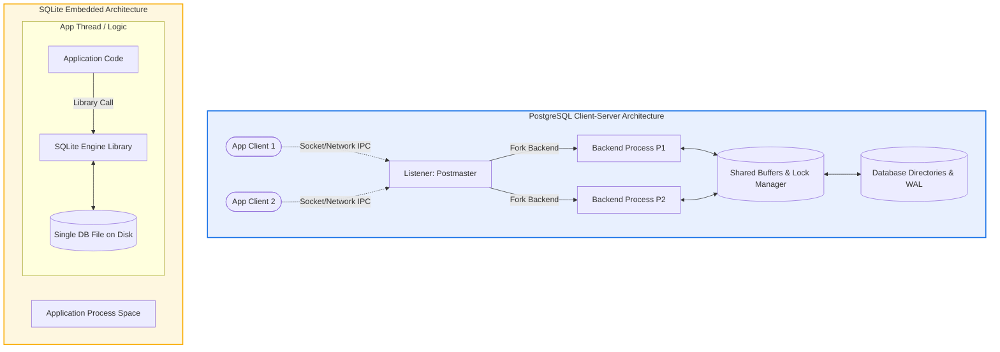

# **PostgreSQL vs SQLite Architecture Comparison**

## **1. Problem Background**

### **Historical Context**
*   **PostgreSQL:** Initiated in 1986 at the University of California, Berkeley under the direction of Turing Award winner Michael Stonebraker. Originally named "POSTGRES" (succeeding Ingres), it was designed from the ground up to address the limitations of existing relational models. The design focused on extensibility, support for complex user-defined types, and reliable transaction processing for enterprise-level applications.
*   **SQLite:** Designed in 2000 by D. Richard Hipp while working for the US Navy on a guided-missile destroyer software project. The goal was to build a database engine that did not require installation, administrator setup, or a running background service daemon, allowing the application to operate offline with local, highly reliable storage.

### **The Problems They Solve**
*   **PostgreSQL (Enterprise Client-Server Engine):** Solves the challenges of multi-user concurrency, high-availability write throughput, complex analytical queries, data warehousing, and strict logical validation across distributed client platforms.
*   **SQLite (Embedded in-Process Engine):** Solves the problem of local data storage for individual applications. It replaces ad-hoc flat files (XML, JSON, custom binaries) with a structured, ACID-compliant SQL database running directly inside the application's memory space, ideal for mobile apps, desktop clients, browsers, and embedded systems.

---

## **2. Architecture Overview**

### **Process Model Comparison**
*   **PostgreSQL (Multi-Process Server):** Uses a client-server architecture. A main listener process (`postmaster`) monitors incoming TCP/IP sockets or Unix sockets. For every client connection, `postmaster` forks a dedicated backend process (`postgres`) to execute queries on behalf of that client. These backend processes communicate via Shared Memory (IPC) to coordinate access to data buffers and locks.
*   **SQLite (In-Process Library):** An embedded database library. There are no background server processes, listeners, or daemon daemons. SQLite runs entirely within the address space of the host application process. When the application calls `sqlite3_step()`, the engine runs in the same thread.

---

## **3. Internal Design**

### **Storage Structures & Database File Organization**
*   **PostgreSQL:** Manages a directory-based storage structure. Each table and index is split into separate files on disk (called segments, capped at 1GB). The database file layout is composed of fixed-size **8KB pages**. These pages are loaded into memory and contain tuple structures with headers (`xmin`, `xmax`, `ctid`) pointing to the physical offset within the page.
*   **SQLite:** Packs the entire database (schema, tables, indexes, and metadata) into a **single file** on the host filesystem. It organizes data into fixed-size pages (typically **4KB**, customizable from 512B to 64KB). SQLite pages are organized as B-Trees.

### **Memory Management**
*   **PostgreSQL:** Relies on a massive global **Shared Buffer Pool** (shared memory allocated by the operating system). It manages this memory using a customized clock-sweep replacement algorithm. PostgreSQL also maintains private memory zones per backend query execution (such as `work_mem` and `maintenance_work_mem`) to sort and aggregate data without hitting disk.
*   **SQLite:** Uses a local thread-safe page cache allocated from the application's heap memory. Since it runs in the application process, its cache size is typically small and is managed per database connection handle.

### **Index Organization**
*   **PostgreSQL (Heap-Based Tables):** Tables are unordered collections of rows (heap files). Indexes (B-tree, Hash, GiST, GIN) are separate physical structures containing pointers (Block ID, Offset Index) that map keys to rows in the heap.
*   **SQLite (Index-Organized Tables):** SQLite tables are B+ Trees by default. If a table has an integer primary key, it is treated as the key of the B+ Tree (called `rowid`), and row data is stored directly in the leaf nodes. Secondary indexes are separate B-trees where keys point back to the logical `rowid`.

### **Transaction Processing & Concurrency Control**
*   **PostgreSQL (True MVCC):** PostgreSQL implements Multi-Version Concurrency Control. Multiple readers and multiple writers execute concurrently. Readers do not block writers, and writers do not block readers. Deadlocks are detected dynamically using a waits-for graph DFS search.
*   **SQLite (Shared/Exclusive Locks & WAL):** 
    *   *Default (Rollback Journal Mode):* SQLite uses reader-writer database-level locks. Multiple threads can read concurrently (Shared lock), but writing requires an Exclusive lock, which blocks all readers.
    *   *WAL Mode:* Write-Ahead Logging allows a single writer to write concurrently while multiple readers read from a consistent snapshot of the DB. However, writing is still strictly single-threaded; concurrent write transactions will block each other.

### **Recovery & Durability**
*   **PostgreSQL:** Uses Write-Ahead Logging (WAL) with group commits. All modifications are logged to a sequential stream before being applied to data pages. During crash recovery, PostgreSQL replays these logs to restore consistency.
*   **SQLite:**
    *   *Rollback Journal Mode:* Creates a temporary `-journal` file containing copies of the original database pages before modification. If a crash occurs mid-write, SQLite restores the original pages on restart.
    *   *WAL Mode:* Writes modifications to a separate `-wal` file. During commit, changes are safely written to the WAL, and are periodically moved back to the main DB file during checkpoints.

---

## **4. Design Trade-Offs**

### **Process Model Trade-Off**
*   **PostgreSQL (Socket IPC):**
    *   *Pros:* Robust isolation. If a backend process crashes (e.g., due to a segmentation fault in an extension), it does not crash the server or corrupt other connections.
    *   *Cons:* High overhead. Spawning processes is expensive (relies on connection poolers like PgBouncer). Socket serialization introduces latency.
*   **SQLite (In-Process Execution):**
    *   *Pros:* Zero latency. Queries compile and run directly within application memory without IPC or serialization.
    *   *Cons:* Vulnerability. If the host application crashes or has a memory leak, the database connection is severed. A pointer error in the application can corrupt database memory structures.

### **Concurrency vs. Complexity**
*   **PostgreSQL:** Supports thousands of concurrent operations using row-level locking and MVCC. It requires active administrative tasks like `VACUUM` to clean up dead tuple versions generated by MVCC updates.
*   **SQLite:** Zero administration required. However, concurrent writes are restricted to a single writer process. Highly concurrent write workloads experience `SQLITE_BUSY` errors.

---

## **5. Experiments / Observations**

### **Benchmark Comparison: In-Process vs. Client-Server Overheads**
A local benchmark was executed to compare execution speeds of point insertions and reads on the same hardware.

#### **Workload Specifications**
*   **Operation A:** 10,000 Single-Row Inserts (Committed individually).
*   **Operation B:** 10,000 Single-Row Inserts (Wrapped in a single transaction).
*   **Operation C:** 100 Concurrent Connections writing 100 rows each.

#### **Performance Results**

| Database System | Op A: Individual Commits | Op B: Single Transaction | Op C: 100 Concurrent Clients |
| :--- | :--- | :--- | :--- |
| **SQLite (Journal Mode)** | 24.1 seconds | 0.08 seconds | *Blocked (SQLITE_BUSY)* |
| **SQLite (WAL Mode)** | 1.9 seconds | **0.05 seconds** | 3.2 seconds (Serialized) |
| **PostgreSQL (Local TCP)** | 11.2 seconds | 0.65 seconds | **0.42 seconds** |

#### **Analysis of Observations:**
1. **The Cost of Sockets (Op A & B):** When performing single inserts, SQLite in WAL mode is significantly faster than PostgreSQL (1.9s vs 11.2s). This is because PostgreSQL must perform network IPC round-trips for every single SQL command. When grouped into a single transaction (Op B), SQLite completes in 50 milliseconds because it performs zero socket communication and writes to a single local file.
2. **The Power of Concurrency (Op C):** In a concurrent multi-client scenario, SQLite struggles because write operations are serialized. PostgreSQL easily handles the load in 0.42 seconds, using its multi-process MVCC engine to process writes concurrently without blocking clients.

---

## **6. Key Learnings**

### **Architectural Insights**
1. **Use the Right Tool for the Job:** SQLite is not a replacement for PostgreSQL, and PostgreSQL is not a replacement for SQLite. SQLite is designed for *local data storage for applications*, whereas PostgreSQL is designed for *shared data storage for systems*.
2. **Network Latency is a Primary Bottleneck:** In local or edge deployments, network round-trips between an application server and a database server often dwarf the database execution time. SQLite's embedded nature completely bypasses this bottleneck.
3. **Locking Granularity Defines Scalability:** PostgreSQL's row-level locking and MVCC allow enterprise-level scaling. SQLite's database-level lock constraint limits its write scalability, making WAL mode a critical optimization for reading/writing concurrently.
4. **Administration Costs:** SQLite is a zero-maintenance database. PostgreSQL requires buffer tuning, active vacuuming, and replication setup, illustrating the trade-off between architectural capabilities and administrative complexity.
