# Topic 1: PostgreSQL vs. SQLite Architecture Comparison

This document provides a professional, deep-dive system design analysis comparing **PostgreSQL**, a sophisticated enterprise-grade object-relational client-server database, and **SQLite**, a highly optimized, lightweight, zero-configuration embedded database.

---

## 1. Problem Background

### Why They Exist & Historical Context

*   **PostgreSQL**:
    *   **Origin**: Initiated in 1986 under the name *Postgres* at UC Berkeley by Michael Stonebraker, the pioneer of relational database technology (Ingres).
    *   **Problem Solved**: Built to address the limitations of contemporary relational systems (specifically Ingres). Stonebraker sought to support complex user-defined types, rule systems, object inheritance, and custom extensibility while maintaining complete relational integrity and strict ACID transactions.
    *   **Focus**: Designed from day one to operate as a high-reliability, multi-user database server capable of handling massive enterprise workloads.

*   **SQLite**:
    *   **Origin**: Conceived in 2000 by D. Richard Hipp while designing software for guided missile destroyers for the U.S. Navy.
    *   **Problem Solved**: Hipp wanted a database that did not require a separate database daemon or server administration. The existing DBMS engines required configuration, crashed due to network connections, or suffered from complex maintenance tasks. 
    *   **Focus**: Designed to be a self-contained, serverless, zero-configuration database library that reads and writes directly to ordinary disk files. The goal was to provide an in-process, embedded engine with minimal memory footprint and zero external dependencies.

---

## 2. Architecture Overview

The fundamental architectural difference lies in their execution models. PostgreSQL runs as an independent cluster of cooperative processes, whereas SQLite is an in-process library compiled directly into the client application.

### High-Level Architecture Diagram

```mermaid
graph TD
    subgraph PostgreSQL Client-Server Model [PostgreSQL Client-Server Architecture]
        Client([Client Application]) <-->|TCP/IP Socket / Unix Domain| Postmaster[Postmaster Process]
        Postmaster -->|forks| Backend[Backend worker process]
        Client <-->|Query/Results| Backend
        Backend <--> SharedMem[Shared Memory: Buffer Pool, Lock Table, WAL Buffer]
        SharedMem <--> WAL[WAL Writer Process]
        SharedMem <--> BGWriter[Background Writer]
        SharedMem <--> Checkpointer[Checkpointer Process]
        SharedMem <--> AutoVac[AutoVacuum Launcher / Workers]
        WAL -->|writes| PGDisk[(Postgres Disk Tablespaces / base/ / pg_wal/)]
        BGWriter -->|writes| PGDisk
    end

    subgraph SQLite Embedded Model [SQLite Embedded Architecture]
        App[Host Application Process] -->|Direct Function Calls API| SQLiteLib[SQLite Library C API]
        subgraph SQLite Engine Internals [SQLite In-Process Engine]
            SQLiteLib --> SQLComp[SQL Compiler: Parser, Code Generator]
            SQLComp --> VM[Virtual Machine: VDBE Bytecode]
            VM --> BTreeEngine[B-Tree / Pager Engine]
            BTreeEngine --> BlockCache[In-Memory Pager Cache]
        end
        BlockCache <-->|OS System Calls / File Lock| OSFile[OS File System Cache]
        OSFile <--> SQLiteDisk[(Single Database File .db / WAL file)]
    end
```



### Main System Components

#### PostgreSQL
1.  **Postmaster (Main Daemon)**: Listens for client connections, manages process allocations, forks backend processes, and coordinates cluster startup and recovery.
2.  **Backend Processes (`postgres`)**: Dedicated single-threaded processes assigned to each client connection to parse, compile, plan, and execute SQL statements.
3.  **Shared Memory**: A large pool shared by all backend processes containing:
    *   *Shared Buffer Pool*: Caches data and index pages.
    *   *Lock Table*: Tracks concurrent locks across all backends.
    *   *WAL Buffers*: Temporary storage for Write-Ahead Log records.
4.  **Auxiliary Processes**:
    *   *WAL Writer*: Commits WAL buffers to disk sequentially.
    *   *Background Writer*: Flushes dirty pages from shared buffers to disk gradually to ensure free pages are always available.
    *   *Checkpointer*: Periodically coordinates checkpoints to flush all dirty buffers and record a safe crash-recovery point.
    *   *AutoVacuum*: Cleans up dead tuples (tombstones) and updates optimizer statistics.

#### SQLite
1.  **SQL Compiler**: Parses SQL strings, runs semantic analysis, and compiles them into a custom bytecode format.
2.  **Virtual Database Engine (VDBE)**: A register-based virtual machine that executes the compiled bytecode, controlling the program flow and invoking B-Tree operations.
3.  **B-Tree Module**: Manages the logical structure of pages, keys, and values. Keeps pages sorted and navigates table/index structures.
4.  **Pager Module**: Responsible for transaction control, caching, and read/write operations to the disk file. It manages the in-memory cache and coordinates rollback journals or Write-Ahead Logs (WAL) using system calls.
5.  **OS Interface (VFS - Virtual File System)**: A thin abstraction layer providing cross-platform file I/O interfaces, allowing SQLite to work seamlessly across Windows, Unix, RTOS, or custom memory layers.

---

## 3. Internal Design

### Process Model and Client-Server vs. Embedded Design

*   **PostgreSQL**:
    *   **Multi-process Model**: Each connection has a distinct OS process. While this isolates crashes (a crash in one backend doesn't take down other connections), it suffers from high memory consumption per connection (typically 10-20 MB overhead) and slow connection establishment (relieved by connection poolers like PgBouncer).
    *   **IPC**: Extensive usage of shared memory and semaphores for synchronization.
*   **SQLite**:
    *   **Embedded In-process Model**: Runs entirely within the host application process space. There are zero socket connections, network protocols, or inter-process communication overheads. Calling SQLite is as fast as calling a local C function.
    *   **Isolation**: No process isolation; if the host application crashes, the database transaction is rolled back safely by the pager on the next boot, but a corrupted application pointer can theoretically corrupt SQLite's in-memory structures.

### Storage Engine & Database File Organization

#### PostgreSQL
*   **Directory Structure**: A cluster contains a directory structure (`data/`). Inside `data/base/`, each database has a folder, and each table and index is stored as a distinct file, named after its system-defined *relation OID* (Object Identifier).
*   **Segmented Files**: PostgreSQL limits physical files to **1 GB** segments to remain compatible with legacy filesystems. If a table grows beyond 1 GB, a new segment (e.g., `12345.1`, `12345.2`) is created.
*   **TOAST (Oversized-Attribute Storage Technique)**: Individual rows cannot span multiple pages. If a row exceeds the page limit (8 KB), large attributes are compressed and stored out-of-line in a separate physical TOAST table, leaving only a 24-byte pointer in the original row.

#### SQLite
*   **Single-File Database**: The entire database (schema, tables, indices, metadata) is packed into a single cross-platform file.
*   **Variable Page Size**: Configurable during creation from 512 bytes to 65,536 bytes (default is 4,096 bytes).
*   **Payload Overflow**: If a row's payload exceeds a threshold calculated dynamically from the page size, SQLite allocates a chain of overflow pages and stores a pointer to the overflow chain in the main page cell.

---

### Table Storage and Page Layout

#### PostgreSQL
*   **Heap Table Organization**: Tables are stored as unsorted piles of rows (heaps). Rows are inserted into any page with free space. Indexes map keys to physical row locations (*TIDs - Tuple IDs*, consisting of block number and offset).
*   **Page Layout (8 KB Default)**:
    ```
    +-----------------------------------------------+
    | PageHeaderData (24 bytes metadata)            |
    +-----------------------------------------------+
    | Line Pointers (itemId array, grows downward)  |
    | [ptr1] [ptr2] [ptr3] ...                      |
    +-----------------------------------------------+
    |                  <Free Space>                 |
    +-----------------------------------------------+
    | ... [Tuple 3] [Tuple 2] [Tuple 1]             |
    | Heap Tuples (grows upward)                    |
    +-----------------------------------------------+
    | Special Space (optional, for indexes)         |
    +-----------------------------------------------+
    ```
    *   *Line Pointers*: Small 4-byte indexes pointing to the start of the tuples on the page.
    *   *Heap Tuple Header*: Each row contains metadata including `t_xmin` (inserting transaction ID), `t_xmax` (deleting/updating transaction ID), and visibility flags.

#### SQLite
*   **B-Tree Organization**: SQLite stores tables as B+Trees. Keys are 64-bit signed integer rowIDs. If a table is defined without `WITHOUT ROWID`, the key is the implicit `rowid`. Data rows are stored as leaf cells in the B+Tree.
*   **Page Layout**:
    *   A page can be a Table B-Tree Leaf Page, Table B-Tree Internal Page, Index B-Tree Leaf Page, or Index B-Tree Internal Page.
    *   **Cell-Based Format**:
        *   *Page Header*: 8 or 12 bytes containing flags (page type), start of cell content area, number of cells, and start of freeblock list.
        *   *Cell Pointer Array*: Array of 2-byte integers containing offsets to the individual cells, growing downward.
        *   *Cells (grows upward)*: Variable-sized structures containing payloads (keys and values).
    ```
    +-----------------------------------------------+
    | Page Header (8/12 bytes)                      |
    +-----------------------------------------------+
    | Cell Pointers Array (grows downward)          |
    | [offset1] [offset2] [offset3] ...             |
    +-----------------------------------------------+
    |                  <Free Space>                 |
    +-----------------------------------------------+
    | ... [Cell 3] [Cell 2] [Cell 1]                |
    | Cells (grows upward)                          |
    +-----------------------------------------------+
    ```

---

### Index Implementation

*   **PostgreSQL**:
    *   Supports multiple index types: B-Tree, Hash, GiST, GIN, BRIN, and SP-GiST.
    *   **B-Tree implementation** follows the **Lehman & Yao** algorithm. Pages are connected horizontally via right-links. During a split, a parent lock isn't strictly held; readers can follow the right-link to retrieve data that has migrated to a new page, significantly improving concurrent write throughput.
*   **SQLite**:
    *   Only supports B-Tree indexes.
    *   Indexes are organized as B-Trees where the key is the index key concatenated with the rowid. To find a row, SQLite performs a search on the index B-Tree, retrieves the rowid, and then performs a secondary lookup on the primary Table B+Tree (unless the index is covering).

---

### Transaction Management and Concurrency Control

#### PostgreSQL (MVCC)
*   **Multi-Version Concurrency Control**: When an update occurs, PostgreSQL does not overwrite the row in place. Instead, it inserts a new version of the row (tuple) with `t_xmin` set to the updating transaction ID and sets `t_xmax` of the old tuple to the same transaction ID.
*   **Snapshots**: Each transaction gets a snapshot of active transaction IDs. Visibility is calculated dynamically: if a tuple's `t_xmin` is committed and not in the snapshot, and its `t_xmax` is either uncommitted, aborted, or active, it is visible.
*   **Vacuum**: Old, dead tuple versions (where `t_xmax` is older than the oldest active transaction) must be cleaned up to prevent bloat. This is done by the background `VACUUM` daemon.

#### SQLite (Locking & WAL)
*   **Rollback Journal Mode (Traditional)**: SQLite uses coarse-grained locking on the database file. Transactions acquire states:
    1.  *UNLOCKED*: No active read/write.
    2.  *SHARED*: Read-only locks. Multiple connections can read.
    3.  *RESERVED*: A connection intends to write. Only one RESERVED lock is allowed. Readers can continue.
    4.  *PENDING*: Writer is waiting to acquire EXCLUSIVE lock. No new SHARED locks are allowed.
    5.  *EXCLUSIVE*: Writer is active. No readers or other writers are allowed.
    *   *Result*: Readers block writers, and writers block readers.
*   **WAL Mode (Write-Ahead Log)**:
    *   Writes are appended to a separate `.db-wal` file.
    *   Readers read from the main database file combined with index lookups in a shared-memory mapped file (`.db-shm`) to find the latest version in the WAL.
    *   *Result*: Readers do not block writers, and writers do not block readers. However, there is only ever **one writer** at any time. Multi-user concurrent writes are serialized.

---

### Durability Mechanisms

*   **PostgreSQL**:
    *   **Write-Ahead Log (WAL)**: Every modification is recorded sequentially in the WAL buffer before writing to the heap files. The WAL buffer is flushed to disk (in `pg_wal`) on transaction commit.
    *   **Crash Recovery**: During boot, if PostgreSQL crashed, it plays back the WAL records from the last recorded checkpoint (REDO phase) to rebuild the correct state.
    *   **Fuzzy Checkpointing**: Dirty pages are flushed slowly in the background by the checkpointer.
*   **SQLite**:
    *   **Rollback Journal**: Before writing to the database file, SQLite creates a journal file (`.db-journal`) containing copies of the original pages. If a crash occurs mid-write, SQLite reads the journal and restores the original pages.
    *   **WAL Mode**: Writes are appended directly to the `.db-wal` file. At checkpoints, SQLite reads pages from the WAL file and merges them back into the main database file (checkpointing).

---

## 4. Design Trade-Offs

The contrasting architectural goals yield clear engineering trade-offs:

| Feature | PostgreSQL | SQLite |
| :--- | :--- | :--- |
| **Concurrency** | **High**: Excellent concurrent read/write throughput using row locks, table locks, and MVCC. | **Low**: Coarse-grained concurrency. Even in WAL mode, writes are serialized (single writer). |
| **Network Overhead** | **High**: Incurs socket/TCP handshakes, context switching, and serialization delays. | **Zero**: Direct function calls within the process memory. |
| **Configuration & Admin** | **Complex**: Requires tuning memory limits (shared buffers, work_mem), vacuum parameters, and user permissions. | **Zero**: No installation, daemon configuration, or system administration needed. |
| **Feature Richness** | **Extensive**: User-defined types, procedural languages (PL/pgSQL), foreign data wrappers (FDW), partitioning, JSONB. | **Minimal**: Standard SQL, basic data typing (manifest typing), simple functions. |
| **Scalability** | **Vertical & Horizontal**: Handles multi-terabyte databases, read replicas, and connection pools. | **Limited**: Best suited for databases < 100 GB. File locking bottlenecks under high write volume. |
| **Memory Footprint** | **Large**: Spawns multiple OS processes. Demands significant RAM (often gigabytes for buffer cache). | **Tiny**: Library size is < 1 MB. Memory overhead is minimal, scales down to kilobytes. |

### Key Architectural Questions Answered

#### Why does SQLite work well for mobile applications?
1.  **Zero Administrative Overhead**: Mobile applications are distributed to millions of client devices. Installing, configuring, or maintaining a background database daemon on iOS/Android is impossible. SQLite is just a library inside the app.
2.  **Resources Constraints**: SQLite has a highly optimized memory footprint (consumes under 250 KB of RAM for typical workloads) and minimal CPU overhead.
3.  **Single-User Focus**: Mobile apps are inherently single-user. They rarely require concurrent writes from thousands of users; write serialization is a non-issue.
4.  **Reliability & Durability**: It is completely ACID compliant. It ensures data isn't corrupted even if the mobile device runs out of battery or the OS kills the process.

#### Why is PostgreSQL preferred for large multi-user systems?
1.  **Concurrency Support (MVCC)**: In a large web application, hundreds of users may write data simultaneously. PostgreSQL uses row-level locking and MVCC, ensuring writes do not block reads and writes block each other only on the same row.
2.  **Process Isolation**: PostgreSQL forks a new process per connection. If a client query crashes due to a bug or memory allocation issue, the process terminates cleanly without bringing down the database engine or other connections.
3.  **Advanced Planner & Optimizer**: PostgreSQL's query optimizer handles highly complex analytical joins, subqueries, and partitioning across massive datasets, compiling statistics to choose optimal plans (Hash Joins, Parallel Scans).
4.  **Extensive Feature Set**: It supports advanced indexing (GIN, GiST, partial, expression), user management, schemas, horizontal replication, and connection pooling.

---

## 5. Experiments / Observations

To illustrate the behavioral differences, let's observe how each database executes query planning and handles concurrent writes.

### Query Planning (EXPLAIN) Comparison

Consider a multi-table join between `orders` and `customers`:

```sql
SELECT c.name, o.total 
FROM customers c 
JOIN orders o ON c.id = o.customer_id 
WHERE o.total > 500;
```

#### PostgreSQL Query Plan (`EXPLAIN ANALYZE`)

PostgreSQL generates a detailed, statistical execution plan selecting from its optimizer options (e.g. Hash Join, Index Scan, Sequential Scan):

```text
Hash Join  (cost=13.15..28.50 rows=150 width=45) (actual time=0.121..0.854 rows=145 loops=1)
  Hash Cond: (o.customer_id = c.id)
  ->  Index Scan using idx_orders_total on orders o  (cost=0.15..15.20 rows=150 width=16) (actual time=0.015..0.312 rows=145 loops=1)
        Index Cond: (total > 500)
  ->  Hash  (cost=10.50..10.50 rows=200 width=37) (actual time=0.092..0.092 rows=200 loops=1)
        Buckets: 1024  Batches: 1  Memory Usage: 18kB
        ->  Seq Scan on customers c  (cost=0.00..10.50 rows=200 width=37) (actual time=0.005..0.045 rows=200 loops=1)
Planning Time: 0.185 ms
Execution Time: 0.912 ms
```

#### SQLite Query Plan (`EXPLAIN QUERY PLAN`)

SQLite compiles queries to bytecode and outputs a simple, clear execution loop summary:

```text
QUERY PLAN
|--SEARCH o USING INDEX idx_orders_total (total>?)
`--SEARCH c USING INTEGER PRIMARY KEY (rowid=?)
```

*Observation*:
*   **PostgreSQL** computes costs, tracks active memory usage (18KB hash bucket), and counts physical loop operations. It uses Hash Joins when joining large sets.
*   **SQLite** selects nested loop searches. It utilizes indexes where available but does not dynamically compute complex execution options (like parallel workers or bucketed hash joins) to keep its memory footprint extremely small.

### Concurrency and Lock Contention Simulation

If 10 concurrent threads try to write to a single table simultaneously:

```text
Thread 1: INSERT INTO txn_test VALUES (1, 'A');
Thread 2: INSERT INTO txn_test VALUES (2, 'B');
...
```

*   **PostgreSQL**:
    *   All 10 queries write to the physical heap file in parallel. They acquire exclusive locks on their specific newly created rows, but write to separate slots on the heap page.
    *   Total execution time: ~10ms (high concurrency).
*   **SQLite (WAL Mode)**:
    *   Thread 1 acquires the single write lock (via `.db-shm` mapping) and writes to `.db-wal`.
    *   Threads 2 through 10 are blocked and must wait, or they fail immediately returning `SQLITE_BUSY`.
    *   Total execution time: ~80ms (serialized writes).

---

## 6. Key Learnings

1.  **Design for the Environment**: SQLite demonstrates that when network overhead, setup complexity, and memory footprints are eliminated, local read/write transactions are insanely fast. PostgreSQL demonstrates that when safety, concurrent write scaling, and complex data models are paramount, a multi-process architecture with deep memory structures is worth the overhead.
2.  **Page Layout Drives Access Patterns**: PostgreSQL uses heap storage (flexible, index-agnostic inserts) which requires index mapping to physical TIDs. SQLite uses B+Trees (clustered by default on rowid) which optimizes primary-key lookups at the expense of secondary index searches.
3.  **MVCC Trade-offs**: MVCC is powerful because readers never block writers, but it requires a garbage collector (VACUUM in PostgreSQL) or an undo logging mechanism to clean up dead rows. Coarse file locks (as in SQLite) avoid bloat cleanup but kill write concurrency.
