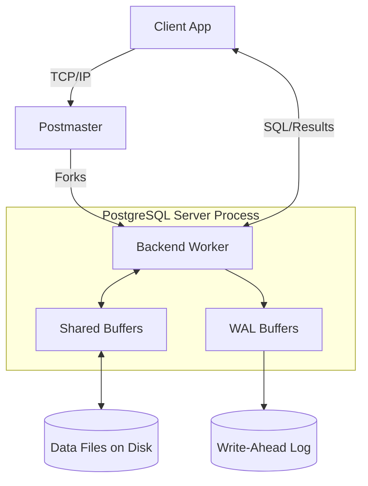
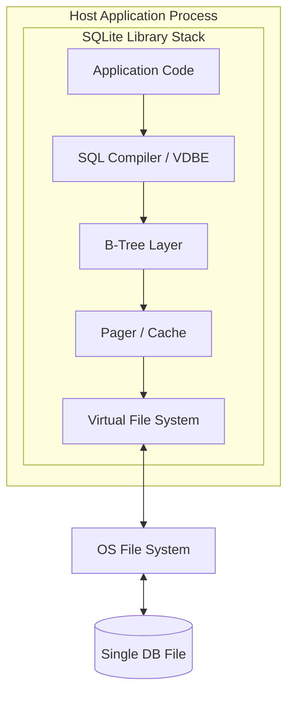

# PostgreSQL vs SQLite Architecture Comparison

A comprehensive academic analysis comparing the internal architecture, storage mechanisms, and concurrency models of a heavyweight client-server RDBMS (PostgreSQL) and a lightweight embedded relational database (SQLite).

## Table of Contents

1. [Problem Background](#1-problem-background)
2. [Architecture Overview](#2-architecture-overview)
3. [Internal Design](#3-internal-design)
    - [Storage Structures](#storage-structures)
    - [Index Organization](#index-organization)
    - [Transaction Management](#transaction-management)
    - [Concurrency Control](#concurrency-control)
    - [Durability](#durability)
4. [Design Trade-Offs](#4-design-trade-offs)
5. [Experiments / Observations](#5-experiments--observations)
6. [Key Learnings](#6-key-learnings)
7. [References](#references)

---

## 1. Problem Background

### What Relational Databases Are
Relational Database Management Systems (RDBMS) are systems designed to store, manage, retrieve, and update digital information reliably. They organize data into structured tables (relations) with predefined schemas, enabling declarative queries via SQL, and guaranteeing strict ACID (Atomicity, Consistency, Isolation, Durability) properties.

### Overview of PostgreSQL and SQLite
*   **PostgreSQL:** An open-source, enterprise-class, object-relational database. Originating from the POSTGRES project at UC Berkeley in 1986, it has evolved into a massively scalable system built for high concurrency.
*   **SQLite:** An open-source, serverless, embedded relational database library created in 2000. It is designed to be statically linked directly into applications, providing a SQL interface to local files.

### Problems Each Database Was Designed to Solve
*   **PostgreSQL** was designed to solve the complexities of massive, multi-user enterprise workloads. It solves problems related to concurrent read/write contention, complex data integrity rules, and scalable network-attached storage.
*   **SQLite** was designed to solve the "configuration friction" problem. Setting up a dedicated database server is impractical for desktop apps, mobile devices, or embedded systems. SQLite functions as an intelligent, SQL-compliant alternative to standard file I/O (`fopen()`).

### Why Comparing Them is Important
PostgreSQL and SQLite represent two opposite extremes of database engineering. Comparing them exposes the fundamental architectural trade-offs between a client-server process model that prioritizes high concurrency, and an embedded library architecture that prioritizes zero-configuration simplicity.

---

## 2. Architecture Overview

### PostgreSQL Architecture
PostgreSQL uses a classic client-server, process-per-connection architecture.

*   **Client Connections:** Clients connect over TCP/IP or Unix sockets.
*   **Server Processes:** The `Postmaster` daemon listens for connections and forks a new `Backend Process` for each client. Each backend executes queries in its own memory space, isolating faults.
*   **Shared Memory:** A massive System V / POSIX shared memory segment used for inter-process communication. It contains the Shared Buffers (page cache), WAL Buffers, and Lock Management.
*   **Storage Subsystem:** Manages physical file I/O, writing 8KB blocks between the OS and the Shared Buffers.

### SQLite Architecture
SQLite is an embedded database. It is not a standalone process; it is a C library executed within the host application's threads.

*   **Embedded Library Design:** Application code calls SQLite APIs directly.
*   **Application Interaction:** SQL is parsed and compiled into bytecode.
*   **B-Tree Layer:** Organizes data on disk into B-Tree structures.
*   **Pager Layer:** Manages reading, writing, caching of disk pages, and transactions/locks.
*   **Database File:** Everything (schema, tables, indexes) is stored in a single cross-platform file.

---

## 3. Internal Design

### Storage Structures

*   **PostgreSQL (Multi-file Heap):**
    *   **Database Files:** Data is distributed across directories (`PGDATA`). Each table and index is a separate file (split into 1GB segments).
    *   **Table Storage:** Data is stored in unordered "heap" files. Indexes contain pointers (TIDs) to these physical heap locations.
    *   **Page Layout:** 8KB pages containing a header, line pointers growing forward, and actual tuple data growing backward.

*   **SQLite (Single-file B-Tree):**
    *   **Database Files:** The entire database is a single, transportable file.
    *   **Table Storage:** Every table is a B-Tree physically ordered by a `rowid`. Data resides in the leaf nodes.
    *   **Page Layout:** Uniform pages (default 4KB). B-Tree leaf pages contain cell pointer arrays and the actual serialized row payloads. Overflow pages handle massive rows.

### Index Organization

*   **PostgreSQL:** Extensive index types (B-Tree, Hash, GIN, GiST). Secondary indexes point directly to the physical Block and Offset of the heap tuple.
*   **SQLite:** Strictly B-Tree based. Secondary B-Tree indexes store the index key and the `rowid` of the primary table. A lookup requires searching the secondary index, then using the `rowid` to search the primary table B-Tree (a double-read).

### Transaction Management

*   **PostgreSQL (MVCC):** Uses Multi-Version Concurrency Control. When a row is updated, a new version is created. Tuple headers contain `xmin` (creator TXID) and `xmax` (deleter TXID). Transactions use Snapshots to determine which row versions are currently visible to them.
*   **SQLite:** Uses a physical lock and journal system. Transactions are atomic boundaries. It relies on reverting physical pages to their pre-transaction state via journals if an abort occurs.

### Concurrency Control

*   **PostgreSQL:** Extreme multi-user concurrency. **Readers never block writers, and writers never block readers.** Writer-writer conflicts are resolved via row-level locking stored in the tuple headers, preventing massive lock-table memory exhaustion.
*   **SQLite:** Managed via OS-level **File Locking**. Only one writer can hold an EXCLUSIVE lock on the database file at a time. While multiple readers can hold SHARED locks, write concurrency is strictly serialized.

### Durability

*   **PostgreSQL:** Uses a Write-Ahead Log (WAL). Changes are appended to the WAL and flushed to disk before the transaction commits. The actual data pages are flushed later.
*   **SQLite:** Traditionally uses a **Rollback Journal** (original pages are copied to a `-journal` file before being overwritten). Newer versions support a **WAL Mode** similar to PostgreSQL, improving concurrent read/write throughput.

---

## 4. Design Trade-Offs

### PostgreSQL
*   **Advantages:** Infinite scalability across multiple CPU cores, high-throughput concurrent writes, advanced indexing, prevents data loss under extreme loads.
*   **Limitations:** High operational overhead. Requires dedicated servers, DBAs for tuning (VACUUM, memory), and introduces network latency for every query.
*   **Scalability Benefits:** Can manage hundreds of gigabytes of shared memory cache, serving thousands of concurrent web clients effortlessly.

### SQLite
*   **Advantages:** Zero-configuration, unmatched portability, extremely low latency (direct memory access, no network layer), and deterministic execution.
*   **Limitations:** Highly restricted write concurrency. Database file can grow bloated if not managed. Cannot scale across multiple application servers.
*   **Simplicity Benefits:** It can be compiled directly into mobile applications, requiring no service daemons or user management.

### Architectural Comparisons

| Metric | PostgreSQL | SQLite |
| :--- | :--- | :--- |
| **Performance (Local Reads)** | High (Incurs IPC/Network overhead) | **Highest** (Direct memory calls) |
| **Concurrency (Writes)** | **Thousands** (Row-level MVCC) | **One** (File-level EXCLUSIVE lock) |
| **Resource Usage** | Heavy (Multi-process, large memory segments) | Extremely Light (Application heap) |
| **Deployment Complexity** | High (Client-Server, Configuration, Network) | Zero (Embedded library) |
| **Typical Workloads** | Web Backends, ERPs, Data Warehousing | Mobile Apps, IoT, Desktop Apps |

---

## 5. Experiments / Observations

### Experiment 1: Simple Read Queries
*   **Objective:** Compare base read latency.
*   **Setup:** Issue 10,000 primary key `SELECT` queries on a local machine.
*   **Observation:** SQLite will complete the workload orders of magnitude faster.
*   **Analysis:** SQLite executes queries via direct C function calls within the application process. PostgreSQL must marshal data over a TCP or Unix socket, incurring context switching and IPC overhead.

### Experiment 2: Concurrent Access
*   **Objective:** Observe multi-writer capabilities.
*   **Setup:** Spawn 50 application threads, all executing continuous `UPDATE` statements on different rows.
*   **Observation:** PostgreSQL sustains high throughput. SQLite throws severe `SQLITE_BUSY` (database is locked) exceptions for almost all threads except one.
*   **Analysis:** PostgreSQL uses row-level locks via MVCC. SQLite locks the entire database file for writing; all 50 threads fight for one EXCLUSIVE OS lock.

### Experiment 3: Index Lookup Performance
*   **Objective:** Observe index traversal efficiency.
*   **Setup:** Query using a secondary index (`WHERE email = 'x'`).
*   **Observation:** Both are fast, but PostgreSQL scales better as table size increases.
*   **Analysis:** SQLite must traverse the `email` index to find the `rowid`, then traverse the main table B-Tree using the `rowid`. PostgreSQL secondary indexes point directly to the physical disk block, saving a B-Tree traversal.

### Experiment 4: Transaction Behavior
*   **Objective:** Demonstrate Isolation.
*   **Setup:** Txn A `UPDATE`s a row but does not commit. Txn B reads the same row.
*   **Observation:** In both databases, Txn B sees the old value.
*   **Analysis:** PostgreSQL achieves this via `xmin/xmax` tuple versioning. SQLite achieves this via the Rollback Journal or WAL, serving the old page to readers while the writer holds an uncommitted lock.

---

## 6. Key Learnings

### Architectural Summary
*   **Major Differences:** PostgreSQL is a networked daemon prioritizing concurrent isolation; SQLite is a linked library prioritizing portability and zero configuration.
*   **Storage Design:** PostgreSQL uses heap files and tuple pointers; SQLite organizes all data into strict B-Trees clustered by `rowid`.
*   **Concurrency:** PostgreSQL relies on complex Multi-Version Concurrency Control (MVCC) to allow lock-free reading and row-level writing. SQLite relies on OS-level file locking, allowing only one writer at a time.
*   **Durability:** Both effectively use Write-Ahead Logging for crash recovery, but SQLite's legacy rollback journal provides an alternative mechanism for simpler setups.

### Architectural Recommendations

**Why SQLite works well for mobile and embedded applications:**
It requires zero administrative overhead. Because mobile devices are fundamentally single-user, the lack of multi-writer concurrency is completely irrelevant. The single-file design makes app updates and backups trivial.

**Why PostgreSQL is preferred for large multi-user systems:**
Web backends serve thousands of requests per second. SQLite's file-locking mechanism would bottleneck instantly. PostgreSQL's process model, shared buffer cache, and MVCC allow modern multi-core servers to process thousands of overlapping reads and writes simultaneously without data corruption.

**Final Recommendation:**
Choose **SQLite** if the database sits on the edge (client side, mobile, embedded, local configuration storage). Choose **PostgreSQL** if the database sits in a data center (server side, web applications, SaaS, enterprise data).

---
## References
*   [PostgreSQL Official Documentation](https://www.postgresql.org/docs/)
*   [SQLite Architecture Overview](https://www.sqlite.org/arch.html)
*   [The Internals of PostgreSQL](https://www.interdb.jp/pg/)
