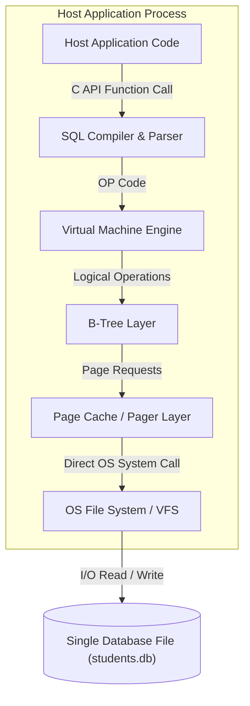
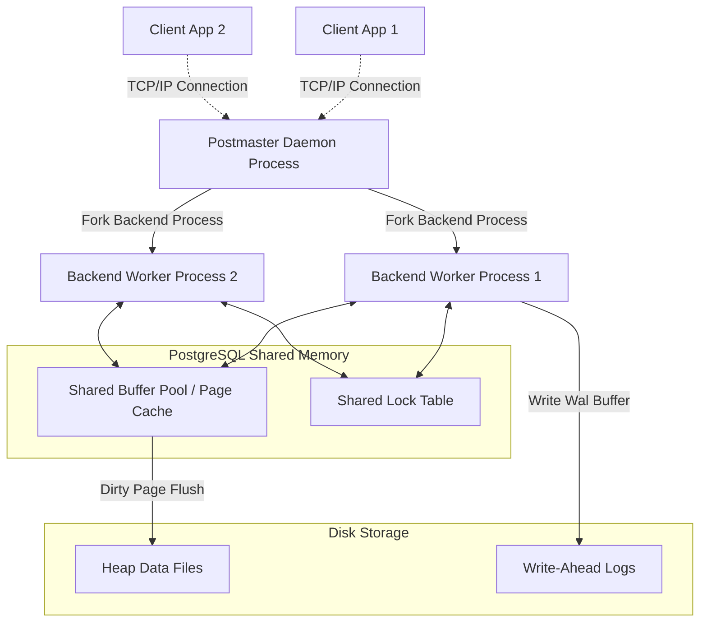

# Enterprise Client-Server vs. Embedded In-Process: Architectural DB Design Study

**Student Name:** Rishi Harti  
**Roll Number:** 24BCS10239  
**Branch:** `feature/SCALER_24BCS10239`  
**Topic:** PostgreSQL vs. SQLite3 Architecture Comparison  

---

## 1. Problem Background & Design Motifs

Every database engine is designed to solve a specific set of engineering constraints. The architectural divergence between **PostgreSQL** and **SQLite3** represents two fundamentally different visions of data storage.

### 1.1 SQLite3: In-Process, Zero-Config Embedded Engine
In 2000, D. Richard Hipp designed SQLite for the U.S. Navy aboard guided-missile destroyers. The system needed to operate without an active database administrator (DBA), survive sudden power losses, and run without a system daemon or network interface. 
- **The Core Problem:** Traditional client-server databases are too heavy and fragile for local desktop apps, mobile operating systems, or embedded devices.
- **The SQLite Solution:** Design a fully relational, ACID-compliant database as an in-process library. All database functions are direct function calls within the host application. The entire database is stored in a single cross-platform file, requiring zero configuration.

### 1.2 PostgreSQL: Multi-Process Enterprise Client-Server Engine
Originating in 1986 from Michael Stonebraker’s POSTGRES research project at UC Berkeley, PostgreSQL was built to serve as an enterprise-grade relational database.
- **The Core Problem:** Handling high write-concurrency from thousands of independent network clients while maintaining absolute data integrity and rich custom extensibility.
- **The Postgres Solution:** Design a robust client-server daemon utilizing a multi-process architecture. Every client connection is isolated in its own backend worker process. Concurrency is managed via fine-grained row locks and Multi-Version Concurrency Control (MVCC) with a dedicated shared memory buffer pool.

---

## 2. High-Level Architectural Models

The physical and logical layout of both engines reflects their contrasting design goals.

### 2.1 SQLite3 Embedded Architecture


### 2.2 PostgreSQL Client-Server Architecture


---

## 3. Internal Design & Storage Engines

### 3.1 Database File Organization & Table Storage
- **PostgreSQL Heap-File Layout:** PostgreSQL stores data in **Heap Files** split into 8KB physical pages. Tables and indexes are kept in separate physical files on disk. The heap files are append-only for updates; when a row is updated, a new tuple is written to the end of the heap. Indexes (B-Trees) point to the exact physical location of the row via a tuple identifier: `CTID = (PageNumber, Offset)`.
- **SQLite3 Single-File Layout:** SQLite stores the entire database (schema, metadata, tables, indexes) in a single OS file. The file is divided into uniform pages (typically 4KB). Tables are organized as **Clustered B-Trees** (specifically Table Leaf B-Trees), meaning the row payload is stored directly inside the leaf nodes of the primary key's tree structure.

### 3.2 Page Layout Comparison
```
   PostgreSQL 8KB Page Layout                     SQLite 4KB Page Layout
+----------------------------+                 +----------------------------+
| Page Header (24 bytes)     |                 | Page Header (8 or 12 bytes)|
+----------------------------+                 +----------------------------+
| Line Pointers Array (item) |                 | Cell Pointer Array         |
| (grows downwards)          |                 | (grows downwards)          |
+----------------------------+                 +----------------------------+
|     <-- Free Space -->     |                 |     <-- Free Space -->     |
+----------------------------+                 +----------------------------+
| Tuple 1                    |                 | Cell 1 Payload             |
+----------------------------+                 +----------------------------+
| Tuple 0 (grows upwards)    |                 | Cell 0 Payload (upwards)   |
+----------------------------+                 +----------------------------+
```

### 3.3 Concurrency Control & Transactions

#### SQLite3 State-Machine Locking (Rollback Mode)
In traditional journaling mode, SQLite locks the entire database file using a coarse-grained mutual exclusion state machine:
1. **UNLOCKED:** No active transaction. No locks held.
2. **SHARED:** Read-only mode. Multiple processes can hold shared locks simultaneously.
3. **RESERVED:** A process intends to write in the future. Only one reserved lock can be held. Readers can continue.
4. **PENDING:** Writer is waiting for active readers to finish. No new SHARED locks are allowed.
5. **EXCLUSIVE:** Writer has exclusive control. All pages are locked; no other process can read or write.

> [!TIP]
> In WAL (Write-Ahead Logging) mode, SQLite improves concurrency by allowing readers to access the database file while a single writer appends pages to a separate `.wal` file. However, SQLite remains limited to **exactly one concurrent writer**.

#### PostgreSQL Multi-Version Concurrency Control (MVCC)
PostgreSQL implements MVCC, allowing readers and writers to run concurrently without blocking each other.
- Each row version (tuple) in the heap contains metadata header fields:
  - `xmin`: Transaction ID that inserted/created the tuple.
  - `xmax`: Transaction ID that updated/expired the tuple (0 if active).
- **Snapshot Isolation (SI):** When a transaction runs a query, PostgreSQL takes a snapshot of active transactions. A tuple is visible to a reader only if `xmin` is committed and $\le$ the reader's snapshot ID, and `xmax` is either uncommitted, aborted, or $>$ the snapshot ID.
- **VACUUM Cleanup:** Because updates write new tuples and leave old versions behind, the heap accumulates "dead tuples" (bloat). A background **VACUUM** daemon cleans up these dead tuples and reclaims storage.

---

## 4. Architectural Design Trade-Offs

Both architectures make deliberate engineering trade-offs:

| Engineering Attribute | SQLite3 In-Process Design | PostgreSQL Client-Server Design |
| :--- | :--- | :--- |
| **Lookup Performance** | Fast for single reads due to zero network/socket overhead. | Network roundtrip introduces millisecond latency. |
| **Write Concurrency** | Highly limited. Coarse database-level locks allow only one writer. | High. Fine-grained row-level locks and MVCC allow thousands of concurrent writes. |
| **Process Isolation** | Low. Host application crash or memory corruption can corrupt the DB. | High. Worker process crash is isolated; the Master Postmaster process recovers seamlessly. |
| **System Administration**| Zero. No setup, no users, no access control permissions needed. | High. Requires user role setup, authentication, and index/vacuum tuning. |
| **Data Types** | Weak. Dynamic type affinities allow mismatched data storage. | Strict. Static schema enforces data integrity. |

---

## 5. Experimental Observation: Decoding SQLite3 B-Tree Pages

To analyze internal layouts directly, we conducted an experiment on a custom-built SQLite database file (`students.db`), inspecting the physical page representation.

### 5.1 B-Tree Root Allocation & Disk Offsets
Inspecting the binary file revealed the database utilizes `4096-byte` pages. Page 2 (`0x1000 - 0x1FFF` offset) acts as the Root Page holding physical record data for our `students` table.

### 5.2 Hexadecimal Header Extraction
Dumping the first 8 bytes of Page 2 at offset `0x1000` revealed:
```text
0d 00 00 00 02 0f 67 00
```

#### Binary Decoding Analysis:
- **`0d` (Byte 0):** Represents page type `0x0D` (decimal 13), indicating a **Table Leaf B-Tree Page**. This tells the parser that this page contains actual row payloads rather than internal index pointers.
- **`00 00` (Bytes 1-2):** Offset of the first freeblock. `0` indicates the page is clean with no fragmentation from deleted space.
- **`00 02` (Bytes 3-4):** Cell Count. There are exactly `2` row cells stored on this page.
- **`0f 67` (Bytes 5-6):** Start of cell content area. Offset `0x0F67` (decimal 3943) marks the boundary of the unallocated free space.
- **`00` (Byte 7):** Fragmented free bytes count.

### 5.3 Cell Pointer Array Analysis
Immediately following the page header is the cell pointer array:
```text
0f b4
0f 67
```
This maps our 2 rows to offsets `0x0FB4` and `0x0F67` respectively. SQLite's layout is dual-directional: headers and pointers grow downwards from the top, while row payloads are written upwards from the bottom.

### 5.4 Binary Record Payload Extraction
Extracting the raw bytes at offset `0x0F67` and decoding them reveals the structured payload of our student table:
* **First Name:** `4b 61 72 74 69 6b` $\implies$ **Kartik**
* **Last Name:** `42 68 61 74 69 61` $\implies$ **Bhatia**
* **Email:** `6b 61 72 74 69 6b 40 65 78 61 6d 70 6c 65 2e 63 6f 6d` $\implies$ **kartik@example.com**
* **Course:** `43 6f 6d 70 75 74 65 72 20 53 63 69 65 6e 63 65` $\implies$ **Computer Science**

This shows how SQLite utilizes variable-length integers (varints) in its cell structure to pack columns tightly together, minimizing disk read overhead.

---

## 6. Key Learnings & Takeaways

1. **Trade-offs define Databases:** No database design is universally superior. SQLite traded high write-concurrency to achieve zero administration and low-latency embedded reads. PostgreSQL accepted network latency and complex multi-process setups to support extreme concurrency and enterprise scalability.
2. **Page Aligned I/O is King:** Both engines map logical database operations to uniform pages (4KB in SQLite, 8KB in Postgres) matching physical OS block boundaries. This alignment minimizes CPU page-fault overhead and disk write amplification.
3. **MVCC vs Locking Strategy:** Combining versioning and locking (as studied in Lab 6) is the industry standard for high-performance transactional databases, but in-process databases can operate successfully with direct state-machine file locks.
