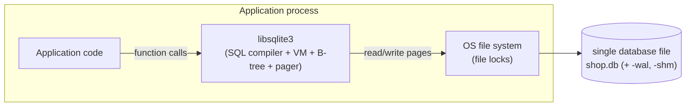
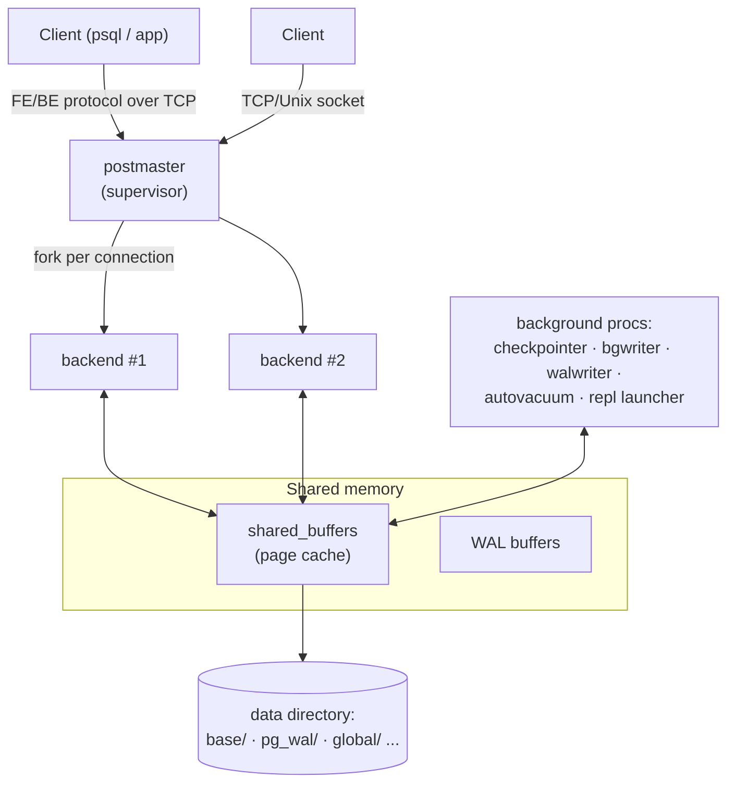

# PostgreSQL vs SQLite — An Architectural Comparison

> Advanced DBMS · System Design Discussion · **Saswata Das (24BCS10248)**

Two SQL databases that sit at opposite ends of the design spectrum. SQLite is an
_embedded, in-process library_; PostgreSQL is a _client–server data platform_.
Almost every difference between them — concurrency, storage, durability,
scalability — follows from that one decision about **where the database engine
runs and who is allowed to talk to it**. This document traces those consequences
with diagrams, reasoning, and live experiments run against PostgreSQL 17.10 (in
Docker) and SQLite 3.44.

---

## 1. Problem Background

|                | SQLite                                                                       | PostgreSQL                                                  |
| -------------- | ---------------------------------------------------------------------------- | ----------------------------------------------------------- |
| Origin         | D. Richard Hipp, 2000                                                        | POSTGRES, UC Berkeley (Stonebraker), 1986 → PostgreSQL 1996 |
| Designed to be | A replacement for `fopen()` — structured local storage for _one_ application | A multi-user, concurrent, extensible RDBMS for shared data  |
| Deployment     | A library linked into the application                                        | A server process that many clients connect to               |
| Licensing      | Public domain                                                                | PostgreSQL License (BSD-style)                              |

**SQLite** was built for the situation where an application needs the
convenience of SQL but does _not_ want a database server: a phone app, a
browser, an embedded device, a desktop file format. The whole engine is a C
library you link in; there is no daemon, no configuration, no network port. The
design goal is "_the database is a file_."

**PostgreSQL** descends from the academic POSTGRES project and targets the
opposite world: many users and applications concurrently reading and writing a
_shared_, long-lived, mission-critical dataset, with strong correctness,
security, and extensibility guarantees. The design goal is "_the database is a
service_."

Neither is "better" — they solve different problems. The rest of this document
shows how that single split propagates through every layer.

---

## 2. Architecture Overview

### SQLite — embedded, in-process



There is **no separate process**. The application calls SQLite functions
directly; SQLite reads and writes pages of a single file through the OS. There is
no IPC, no socket, no authentication — access control _is_ file-system
permission. Concurrency between processes is coordinated purely by **OS file
locks**.

### PostgreSQL — client–server, multi-process



A supervisor (`postmaster`) **forks a dedicated backend process per
connection**. All backends share a region of shared memory containing the page
cache (`shared_buffers`) and WAL buffers. A set of background processes handle
checkpointing, dirty-page flushing, WAL writing, and vacuuming. This is exactly
what the running server reports:

```text
$ ps -eo pid,ppid,cmd   (inside the PostgreSQL 17.10 container)
    1     0 postgres                                  <- postmaster
   62     1 postgres: checkpointer
   63     1 postgres: background writer
   65     1 postgres: walwriter
   66     1 postgres: autovacuum launcher
   67     1 postgres: logical replication launcher

$ SELECT pid, backend_type FROM pg_stat_activity;
 pid |         backend_type
-----+------------------------------
  62 | checkpointer
  63 | background writer
  65 | walwriter
  66 | autovacuum launcher
  67 | logical replication launcher
 139 | client backend             <- one backend per connected client
```

> **Architectural consequence already visible:** SQLite's "process model" is
> _the application's own process_. PostgreSQL maintains a small operating-system
> of cooperating processes around shared memory. That machinery is pure overhead
> for a single-user phone app, and pure necessity for a 500-connection server.

---

## 3. Internal Design

### 3.1 Database file organization

**SQLite — one file is the whole database.** Tables, indexes, and the schema
catalog (`sqlite_master`) all live in a single file, divided into fixed-size
pages (default **4096 bytes**, confirmed below). The entire experiment database —
two tables, an index, rows — is one 20 KB file:

```text
$ sqlite3 shop.db 'PRAGMA page_size;'   -> 4096
$ ls -la
-rw-r--r-- 1 user 20480 shop.db        # everything: tables + index + catalog
```

**PostgreSQL — a directory tree of many files.** Each _database_ is a directory
under `base/`; each _relation_ (table or index) is stored as one or more 1 GB
segment files named by numeric OID, accompanied by a **free space map** (`_fsm`)
and **visibility map** (`_vm`) "fork":

```text
$ ls data/                 base/  global/  pg_wal/  pg_xact/  pg_multixact/ ...
$ ls data/base/16384/      112  113  1247  1247_fsm  1247_vm  1249  1249_fsm  1249_vm ...
                           └── per-relation heap files + FSM/VM forks
$ ls data/                 ... pg_wal/   <- the write-ahead log lives here
```

### 3.2 Page layout

Both store data in fixed-size pages, but lay them out differently:

```text
PostgreSQL 8 KB heap page              SQLite 4 KB B-tree page
+---------------------------+          +---------------------------+
| PageHeaderData (24 B)     |          | page header (8/12 B)      |
+---------------------------+          +---------------------------+
| ItemId array (line ptrs)  | --+      | cell-pointer array        | --+
|  ...grows downward...     |   |      |  ...grows downward...     |   |
+---------------------------+   |      +---------------------------+   |
|        free space         |   |      |        free space         |   |
+---------------------------+   |      +---------------------------+   |
|  ...tuples grow upward... | <-+      |  ...cells grow upward...  | <-+
| tuple | tuple | tuple     |          | cell  | cell  | cell      |
+---------------------------+          +---------------------------+
| special space (idx only)  |          | (overflow ptr if large)   |
+---------------------------+          +---------------------------+
```

Both use the "slotted page" idea — an indirection array at the top, variable
length records filling from the bottom — so records can move within a page
without invalidating external references.

### 3.3 Table storage & index organization — the deepest structural difference

- **SQLite: the table _is_ a B-tree, clustered by `rowid`.** Rows are stored in
  a B-tree keyed by the 64-bit `rowid` (or the column if you declare `INTEGER
PRIMARY KEY`). Lookups by rowid are therefore index lookups into the table
  itself. Secondary indexes are separate B-trees whose leaves store the indexed
  columns plus the rowid.
- **PostgreSQL: the table is an _unordered heap_; _all_ indexes are secondary.**
  Rows live wherever there is free space; an index entry points to a physical
  tuple location `(block, offset)` = `ctid`. PostgreSQL has **no clustered
  index** — even the primary key is just another B-tree that points into the
  heap.

This shows up directly in the query plans (§5): SQLite reaches `orders` _through_
its index B-tree; PostgreSQL sequentially scans the heap and joins with a hash
table.

### 3.4 Transaction management, concurrency & durability

| Aspect             | SQLite                                                                                     | PostgreSQL                                               |
| ------------------ | ------------------------------------------------------------------------------------------ | -------------------------------------------------------- |
| Concurrency unit   | Whole-database (rollback journal) / single-writer (WAL)                                    | Row-level MVCC                                           |
| Writers            | **One at a time** for the entire DB                                                        | **Many concurrent** writers                              |
| Readers vs writers | Block each other in rollback-journal mode; coexist in WAL mode (readers see last snapshot) | Never block each other (MVCC)                            |
| Isolation          | Serializable (by virtue of single writer)                                                  | MVCC snapshot isolation; up to Serializable (SSI)        |
| Durability log     | Rollback journal _or_ WAL sidecar file, `fsync` at commit                                  | Write-Ahead Log in `pg_wal/`, checkpointer, crash replay |

**SQLite concurrency** is coordinated by file locks. In the default
rollback-journal mode a writer takes an EXCLUSIVE lock on the file — so writes
are serialized for the _entire database_. Switching to **WAL mode** lets readers
proceed against the last committed snapshot while a single writer appends to the
`-wal` file (with a `-shm` shared-memory index):

```text
$ sqlite3 shop.db 'PRAGMA journal_mode;'            -> delete   (rollback journal)
$ sqlite3 shop.db 'PRAGMA journal_mode=WAL; ...';   -> wal      (now uses shop.db-wal/-shm)
```

**PostgreSQL concurrency** is Multi-Version Concurrency Control: an `UPDATE`
writes a _new_ row version rather than overwriting, and each transaction sees a
consistent snapshot. Two transactions can write different rows of the same table
simultaneously; readers never wait for writers. (The internals of `xmin/xmax`,
visibility, and `VACUUM` are explored in the _PostgreSQL Internals_ topic.)

---

## 4. Design Trade-Offs

| Dimension        | SQLite                                            | PostgreSQL                                               |
| ---------------- | ------------------------------------------------- | -------------------------------------------------------- |
| Setup / ops      | Zero config, no server, no DBA                    | Server, config, roles, maintenance                       |
| Footprint        | ~1 MB library, no processes                       | Multiple processes + shared memory                       |
| Concurrency      | Single writer; great for read-mostly single-user  | Many concurrent readers _and_ writers                    |
| Scalability      | One machine, one process, limited by file locks   | Hundreds of connections, large datasets, replication     |
| Access           | In-process function calls only (no network)       | Network clients, auth, TLS, roles                        |
| Latency          | No IPC — fastest possible local access            | Connection + protocol + IPC overhead                     |
| Query planner    | Lightweight, nested-loop joins only               | Cost-based optimizer, multiple join algorithms           |
| Types / features | Dynamic typing, core SQL                          | Rich types, extensions, stored procs, FDWs, partitioning |
| Best when        | Embedded, edge, on-device, app file format, tests | Shared, multi-user, large, mission-critical systems      |

**Why SQLite works well for mobile applications.** A phone app is a _single user
on a single device_ with read-dominated access to local data. SQLite needs no
background service draining the battery, no configuration, no network surface;
the database is one file that is trivial to back up, copy, or ship inside the
app. Access is in-process function calls — no IPC, no connection pool — which is
the lowest-latency option. The single-writer limitation rarely matters because
there is effectively one writer (the app).

**Why PostgreSQL is preferred for large multi-user systems.** Such systems have
_many concurrent writers_ to _shared_ data, accessed _over a network_, with
requirements for security, durability, and analytics. PostgreSQL's per-connection
backends, MVCC (concurrent writers without blocking readers), cost-based planner,
WAL-based recovery, replication, and extensibility are exactly what those
workloads need — and exactly the machinery a single-user app would never want to
pay for.

**The architectural root cause.** Embedding the engine in the application forces
SQLite toward file locks (no shared memory to coordinate processes) and a small
planner (latency matters more than squeezing big joins). Running as a server lets
PostgreSQL keep shared buffers, run background workers, and invest in MVCC and a
cost-based optimizer — because the cost is amortized across many users.

---

## 5. Experiments / Observations

All outputs below are **real**, captured from PostgreSQL 17.10 (Docker) and
SQLite 3.44 on the same join query. Dataset: 5 000 customers, 50 000 orders,
200 000 order items.

### 5.1 Page size & storage footprint

```text
SQLite:      PRAGMA page_size  -> 4096   ; whole DB = one file (shop.db)
PostgreSQL:  SHOW block_size   -> 8192   ; one directory of OID-named files + _fsm/_vm forks
```

### 5.2 Same query, two planners

Query: `SELECT c.name, count(*) FROM customers c JOIN orders o ON o.cust_id=c.id WHERE c.city='Pune' GROUP BY c.name;`

**PostgreSQL** — cost-based optimizer chooses a **Hash Join** and **HashAggregate**, with explicit cost and row estimates:

```text
 HashAggregate  (cost=1074.99..1087.49 rows=1250 width=16)
   Group Key: c.name
   ->  Hash Join  (cost=110.12..1012.49 rows=12500 width=8)
         Hash Cond: (o.cust_id = c.id)
         ->  Seq Scan on orders o      (cost=0.00..771.00 rows=50000 width=4)
         ->  Hash  (cost=94.50..94.50 rows=1250 width=12)
               ->  Seq Scan on customers c  (cost=0.00..94.50 rows=1250 width=12)
                     Filter: (city = 'Pune'::text)
```

**SQLite** — a **nested-loop** join driving through the index, with a temporary B-tree for grouping:

```text
QUERY PLAN
|--SCAN c
|--SEARCH o USING COVERING INDEX idx_orders_cust (cust_id=?)
`--USE TEMP B-TREE FOR GROUP BY
```

**Observation / analysis.** The two engines pick _structurally different_
strategies. PostgreSQL estimates that hashing the small filtered `customers` set
and streaming `orders` through it is cheapest, and it can quantify that with a
cost model fed by table statistics. SQLite's planner only does nested-loop joins,
so it drives the outer table and probes the inner via its index — simpler, lower
setup cost, and excellent for the small/local datasets SQLite targets, but it
cannot consider hash or merge joins for large inputs. This is the planner
sophistication trade-off from §4, made concrete.

### 5.3 Process & concurrency model (observed)

`pg_stat_activity` and `ps` (§2) show PostgreSQL's supervisor + background
workers + one backend _per client_. SQLite shows none of this — it has no
processes of its own. The `journal_mode` PRAGMA confirms SQLite's writer model:
`delete` (whole-DB rollback journal) by default, switchable to `wal`
(single-writer + concurrent readers).

---

## 6. Key Learnings

1. **One decision cascades through everything.** "Library vs server" is not a
   packaging detail — it _determines_ the concurrency model (file locks vs MVCC),
   the storage layout (one file vs a managed directory), the durability machinery
   (journal/WAL sidecar vs `pg_wal/` + checkpointer), and even how clever the
   planner can afford to be.
2. **Concurrency is the sharpest divide.** SQLite serializes writers for the
   whole database; PostgreSQL lets many writers proceed via row-versioning. This
   single fact explains "SQLite for one user, PostgreSQL for many."
3. **Clustered-by-rowid vs unordered-heap** is a quiet but deep difference:
   SQLite's table _is_ a B-tree; PostgreSQL's table is a heap with only secondary
   indexes — which is why their plans for the same join differ.
4. **Cost-based vs rule-of-thumb planning** is visible in one `EXPLAIN`: hash
   join with numeric cost estimates vs a nested-loop index probe.
5. **Surprising takeaway.** SQLite is reportedly the most widely deployed
   database in the world precisely _because_ it gave up being a server — the
   constraints that make it "limited" (single file, single writer, no network)
   are the same ones that make it perfect for billions of phones and apps.
6. **They are complements, not competitors.** Edge/device/test → SQLite; shared
   multi-user backend → PostgreSQL. Many systems use both.

---

### References (all consulted and credited)

- SQLite documentation: _Architecture of SQLite_, _Database File Format_,
  _Write-Ahead Logging_, _File Locking And Concurrency_ — sqlite.org/docs.
- PostgreSQL 17 documentation: _Database Page Layout_, _Storage File Layout_,
  _Concurrency Control / MVCC_, _Write-Ahead Logging_, _The Statistics Used by
  the Planner_ — postgresql.org/docs/17.
- M. Stonebraker & L. Rowe, _The Design of POSTGRES_, 1986 (historical context).

_Experiments performed locally: PostgreSQL 17.10 in Docker (port 5440) and
SQLite 3.44; all plan/PRAGMA/`ps` outputs are verbatim._
