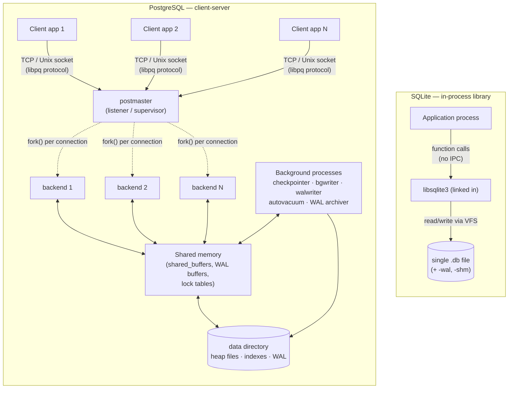
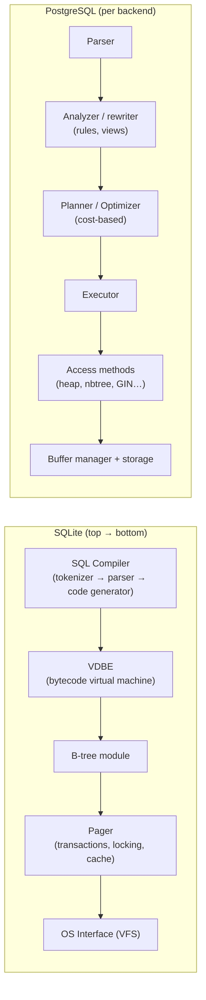

# PostgreSQL vs SQLite — An Architecture Comparison

> Advanced DBMS · System Design Discussion · Topic 1
>
> Two relational databases, two opposite philosophies. SQLite is a *library you link into your program*; PostgreSQL is a *server your programs talk to*. Almost every other difference between them — locking granularity, concurrency model, durability mechanism, type system — falls out of that single architectural decision. This document traces that thread, and backs every claim with output captured from a live PostgreSQL 16 server and SQLite 3.51 on the same machine.

## Table of Contents

1. [Problem Background](#1-problem-background)
2. [Architecture Overview](#2-architecture-overview)
3. [Internal Design](#3-internal-design)
4. [Design Trade-Offs](#4-design-trade-offs)
5. [Experiments & Observations](#5-experiments--observations)
6. [Key Learnings](#6-key-learnings)
7. [References](#7-references)

---

## 1. Problem Background

### SQLite — replacing `fopen()`, not Oracle

SQLite was written by D. Richard Hipp in 2000. The origin story matters: he was building software for a guided-missile destroyer program and needed a database that would keep working even when no database server was running and no administrator was present. The system had to survive on its own. So the design goal was never "compete with client-server databases" — it was **"replace `fopen()`"**: give an application a structured, transactional, SQL-queryable *file format* that it embeds directly, with zero configuration and zero external processes.

This reframing explains everything that follows. SQLite is not a competitor to PostgreSQL any more than a `.zip` library is a competitor to a file server. It solves the problem of *"my single application needs to store structured data reliably on local disk."* It is the most widely deployed database engine in the world precisely because it ships inside every Android and iOS device, every major browser, countless desktop apps, and aircraft and IoT firmware — billions of copies, none of them administered.

### PostgreSQL — a shared, extensible data server

PostgreSQL descends from the **POSTGRES** project led by Michael Stonebraker at UC Berkeley in 1986, itself a successor to Ingres. The motivating problem was the opposite of SQLite's: *many users and applications need concurrent, consistent, durable access to a shared body of data, with rich data types and complex queries.* POSTGRES pioneered the object-relational model, user-defined types, and a no-overwrite (multi-version) storage manager — ideas that directly became today's extensions and MVCC. SQL support arrived in 1994 ("Postgres95"), and the system became PostgreSQL in 1996.

PostgreSQL therefore exists to be the **system of record** for multi-user systems: a daemon that mediates concurrent access, enforces durability and isolation across many simultaneous transactions, and scales with rich features (custom types, advanced indexing, replication, a sophisticated cost-based planner).

| | **SQLite** | **PostgreSQL** |
|---|---|---|
| **Problem solved** | Local structured storage for one application | Shared data for many concurrent clients |
| **Born** | 2000, embedded shipboard software | 1986 (POSTGRES), Berkeley research |
| **Deployment unit** | A `.c`/`.h` file linked into your binary | A server process you connect to |
| **Mental model** | "A better file format" | "A system of record" |
| **License** | Public domain | PostgreSQL License (permissive BSD-style) |

The rest of this comparison is best read as: *given these two problems, what architecture does each one force?*

---

## 2. Architecture Overview

### The defining split: embedded library vs. client-server



**SQLite** runs entirely inside the application's address space. A query is an ordinary function call; there is no network, no socket, no separate process, no context switch. The "database" is one file on disk (plus two transient sidecar files in WAL mode). When the application exits, nothing is left running.

**PostgreSQL** is a constellation of cooperating OS processes sharing one region of memory:

- The **postmaster** listens on a socket and, for each incoming connection, `fork()`s a dedicated **backend process** that runs that session's queries. PostgreSQL is deliberately **multi-process, not multi-threaded** — historically for isolation and portability (a crashing backend can be cleaned up without corrupting shared state).
- A set of **background processes** do system-wide work: the *checkpointer* and *background writer* flush dirty pages, the *WAL writer* flushes the log, *autovacuum* workers reclaim dead tuples, and the *archiver* / *logical replication launcher* handle replication.
- All of these coordinate through **shared memory** — most importantly `shared_buffers` (the page cache), WAL buffers, and the lock tables.

I confirmed this process model on the running server:

```text
$ ps -eo args | grep postgres
postgres: checkpointer
postgres: background writer
postgres: walwriter
postgres: autovacuum launcher
postgres: logical replication launcher
```

### Internal component stack



The pipelines rhyme — both parse SQL, plan, and execute against a B-tree-based access layer — but the scale differs. SQLite compiles SQL into bytecode for a compact register virtual machine (the **VDBE**); its optimizer is intentionally modest. PostgreSQL runs a full **cost-based optimizer** that considers join orders, multiple join algorithms (nested loop / hash / merge), and parallel plans, using collected statistics. We see that contrast directly in [§5](#5-experiments--observations).

### Data flow of a write

- **SQLite (WAL mode):** `INSERT` → VDBE opcodes → B-tree modifies pages in the page cache → the changed pages are appended to the `-wal` file → on `COMMIT`, the WAL is `fsync`'d. A periodic *checkpoint* copies WAL pages back into the main `.db` file.
- **PostgreSQL:** `INSERT` → executor calls the heap access method → a new tuple is placed in a shared buffer page (marked dirty) → a **WAL record** is written to the WAL buffer → on `COMMIT`, WAL up to that point is `fsync`'d to disk. The dirty data page itself is flushed later by the background writer/checkpointer. Recovery replays WAL after a crash.

Both are **write-ahead logged**, and that is not a coincidence — it is the only way to get durability without `fsync`-ing every data page on every commit.

---

## 3. Internal Design

### 3.1 Storage structures & disk layout

**SQLite — one file, many B-trees.** The entire database (every table, every index, the schema catalog `sqlite_master`, and the freelist of recycled pages) lives in a **single file**, divided into fixed-size **pages** (default 4096 bytes, confirmed below). Each table and each index is its own **B-tree** rooted at a page recorded in `sqlite_master`.

A crucial detail: a normal SQLite table is a B-tree keyed by an integer **`rowid`**, and the *table's row data lives in the leaves of that B-tree*. In other words, **SQLite tables are clustered (index-organized) by default** — the table *is* a B+-tree. If you declare `INTEGER PRIMARY KEY`, that column becomes the rowid alias, so primary-key lookups are direct B-tree descents with no separate index. Secondary indexes are separate B-trees storing the indexed columns plus the rowid to find the row.

```
SQLite database file
┌───────────────────────────────────────────────┐
│ page 1: file header (100B) + sqlite_master root │
│ page 2: customers table B-tree root             │
│ page 3: orders table B-tree (interior)          │
│ page 4: orders B-tree leaf  ← actual row data   │
│ page 5: idx_orders_customer B-tree              │
│ ...                                             │
│ page k: (free page — on the freelist)           │
└───────────────────────────────────────────────┘
            one file = the whole database
```

**PostgreSQL — file-per-relation heaps + separate indexes.** Each table is a **heap** — an *unordered* collection of 8 KB pages. Rows are not stored in key order; PostgreSQL has no clustered index (the one-shot `CLUSTER` command only reorders once and is not maintained). Every relation is stored as its own file, split into 1 GB segments, with extra **forks**:

- the **main fork** (the data),
- the **`_fsm`** (Free Space Map — which pages have room for new tuples),
- the **`_vm`** (Visibility Map — which pages contain only all-visible tuples, enabling index-only scans and cheaper vacuums).

Verified on disk for the `orders` table:

```text
$ psql -c "SELECT pg_relation_filepath('orders');"  ->  base/16423/16434
base/16423/16434        26091520   ← main fork (heap data)
base/16423/16434_fsm       24576   ← free space map
base/16423/16434_vm         8192   ← visibility map
```

This file-per-relation design contrasts sharply with SQLite's everything-in-one-file approach, and it is a direct consequence of the server model: a server can afford many file descriptors and a directory full of segments; an embedded "file format" wants exactly one file you can copy, email, or `scp`.

**Page layout (PostgreSQL 8 KB page):**

```
┌──────────────┬──────────────────────────────┬───────────────┐
│ PageHeader   │ ItemId array (line pointers)→ │   ← tuples    │
│ (24 bytes)   │ ████ ███ ██ ...               │ ...████ █████ │
└──────────────┴──────────────────────────────┴───────────────┘
                line pointers grow downward,  tuples grow upward;
                they meet in the middle = free space.
```

Line pointers (the `ItemId` array) are an indirection layer: an index points at a *line pointer*, not directly at a tuple offset. This lets PostgreSQL move or reclaim a tuple within a page (and do **HOT** updates) without touching every index that references it. Large field values are pushed out-of-line into **TOAST** tables and optionally compressed, so a wide column never blows past the 8 KB page limit.

### 3.2 Memory management

| | SQLite | PostgreSQL |
|---|---|---|
| Cache | Private **page cache** per connection (`PRAGMA cache_size`) | **`shared_buffers`** — one shared pool across all backends |
| Sharing | Each connection caches independently | All backends hit the same cached page |
| Replacement | LRU-ish in the pager | Clock-sweep (a NUMA-friendly approximate-LRU) over buffer headers |
| Scope | Bounded by the app's own memory | A dedicated, configurable fraction of server RAM |

PostgreSQL's shared buffer pool is essential to its concurrency model: when 50 backends read the same hot page, they share **one** cached copy and coordinate with lightweight locks (LWLocks/pins). SQLite, having no shared server, gives each connection its own cache; cross-process coherence is handled at the file level by the OS page cache and the WAL's shared-memory index (`-shm`).

### 3.3 Index organization

- **SQLite:** B-tree only (table B-trees keyed by rowid; index B-trees keyed by indexed columns + rowid). `WITHOUT ROWID` tables let you make the primary key itself the clustering key. Simple, predictable, small.
- **PostgreSQL:** B-tree (`nbtree`) is the default, but the access-method layer is pluggable: **Hash, GiST, SP-GiST, GIN** (inverted, for full-text/JSONB/arrays), and **BRIN** (block-range, tiny indexes for naturally-ordered huge tables). An index entry stores the key plus a **TID** (`ctid` = page number, line pointer) that locates the heap tuple. Because the heap is separate, an index lookup is "find TID in index → fetch tuple from heap," unless an **index-only scan** can answer entirely from the index (checked against the visibility map).

### 3.4 Transaction processing, concurrency & isolation — the heart of the difference

This is where the embedded-vs-server split has the deepest consequences.

**SQLite — file-level locking, one writer at a time.**
SQLite's concurrency unit is essentially *the whole database file*.

- In the classic **rollback-journal** mode, a writer escalates locks `SHARED → RESERVED → PENDING → EXCLUSIVE`; while it commits, readers are locked out. Atomicity comes from first copying the original pages into a `-journal` file, then writing in place; a crash rolls back by restoring those pages.
- In **WAL mode** (default in many modern embeddings), new pages are *appended* to a `-wal` file and a shared-memory index (`-shm`) tells readers where to find the latest version of each page. This is a big improvement: **readers no longer block the writer and the writer doesn't block readers.** But there is still **exactly one writer at a time** for the whole database. A second concurrent writer gets `SQLITE_BUSY` ("database is locked").

SQLite is effectively **serializable** by default — trivially, because writes are serialized. Its concurrency story is "fast and correct for one writer; not built for many."

**PostgreSQL — MVCC with row-level versioning.**
PostgreSQL implements **Multi-Version Concurrency Control**: an `UPDATE` does **not** overwrite a row in place. It writes a **new version** of the tuple and marks the old one as expired. Every heap tuple carries two hidden system columns:

- **`xmin`** — the transaction ID that *created* this version,
- **`xmax`** — the transaction ID that *deleted/superseded* this version (0 if still live).

A transaction takes a **snapshot** (the set of transactions that had committed at a point in time) and a tuple is visible to it iff `xmin` is committed-and-visible and `xmax` is not. The consequence is the property SQLite cannot offer: **readers never block writers and writers never block readers.** Only two transactions trying to write the *same row* conflict (row-level lock). This is what lets a PostgreSQL server keep hundreds of transactions making progress at once.

Isolation levels build on snapshots:

- **Read Committed** (default): a fresh snapshot per statement.
- **Repeatable Read**: one snapshot for the whole transaction (snapshot isolation).
- **Serializable**: snapshot isolation **plus** Serializable Snapshot Isolation (SSI), which tracks read/write dependencies and aborts transactions that would form a non-serializable cycle.

> **The trade-off MVCC forces — and why VACUUM exists.** Because old versions are left behind, every `UPDATE`/`DELETE` produces **dead tuples**. They stay until **VACUUM** reclaims them; otherwise the heap bloats. VACUUM also performs **freezing** to prevent **transaction-ID wraparound** (xids are 32-bit and must be periodically "frozen" to a special always-visible value). So PostgreSQL trades "no in-place overwrite, great concurrency" for "must continuously garbage-collect." See the live demonstration in [§5.3](#53-mvcc-postgresql-does-not-update-in-place).

### 3.5 Durability & recovery

| | SQLite | PostgreSQL |
|---|---|---|
| WAL | Optional (`PRAGMA journal_mode=WAL`) or rollback journal | Always; the system of record for durability |
| Commit cost | `fsync` the journal/WAL (`PRAGMA synchronous`) | `fsync` the WAL up to the commit record |
| Data page flush | Checkpoint copies WAL → main file | Checkpointer/bgwriter flush dirty buffers asynchronously |
| Crash recovery | Replay/rollback the journal or WAL | Redo WAL from the last checkpoint |
| Torn-page protection | Page-sized atomic writes / journal | `full_page_writes` (first change to a page after a checkpoint logs the whole page) |

Both rely on the same core insight (write-ahead logging: log the *intent* durably before mutating data pages, so you can always replay), but PostgreSQL's WAL does double duty as the basis for **streaming replication and point-in-time recovery**, while SQLite's WAL is purely a local crash-safety/concurrency mechanism.

---

## 4. Design Trade-Offs

### Why SQLite is *embedded* (and why that's the right call for its problem)

| Advantage | Why it follows from "embedded library" |
|---|---|
| **Zero configuration / no server** | Nothing to install, start, secure, or administer — ideal where no DBA exists (phones, browsers, appliances). |
| **Single-file database** | Backup = copy the file; ship a dataset = email the file; atomic and portable. |
| **Tiny footprint & no IPC** | ~1 MB library; a query is a function call, so there's no socket/serialization/context-switch overhead — extremely fast for local single-user access. |
| **Reliability** | One of the most thoroughly tested code bases in existence (100% branch coverage via TH3, aggressive fuzzing). |

| Limitation | Why it follows |
|---|---|
| **One writer at a time** | File-level write serialization caps write concurrency — fine for one app, wrong for a busy multi-writer service. |
| **No network access by design** | Accessing a SQLite file over a network share is explicitly discouraged (locking semantics break). It is local-only. |
| **Coarse locking / limited per-row concurrency** | The price of simplicity. |
| **Manifest (dynamic) typing** | Flexible but surprising — a `TEXT` value can land in an `INTEGER` column ([§5.5](#55-sqlite-dynamic-typing--type-affinity)). |
| **Fewer enterprise features** | No roles/users, limited `ALTER TABLE`, no stored procedures, no built-in replication. |

### Why PostgreSQL is *client-server*

| Advantage | Why it follows from "shared server" |
|---|---|
| **High concurrency** | MVCC + row-level locks + shared buffer pool let many clients read and write simultaneously. |
| **Rich features** | Extensible types, advanced index types, a real planner with parallel query, replication, fine-grained security/roles. |
| **Scales with the workload** | Tunable shared memory, parallel workers, partitioning, replicas. |
| **Strong, replicable durability** | WAL underpins crash recovery *and* streaming replication/PITR. |

| Limitation | Why it follows |
|---|---|
| **Operational overhead** | A server to install, configure, secure, monitor, back up. |
| **Connection cost** | Process-per-connection means each connection has real memory/fork cost; thousands of connections need a pooler (PgBouncer). |
| **MVCC bloat → VACUUM** | Old tuple versions must be garbage-collected; misconfigured autovacuum causes bloat and wraparound risk. |
| **Overkill for embedded/single-user** | All that machinery is pure cost if you just need a local file. |

### The recurring theme

Almost every difference reduces to one decision and its second-order effects:

```
            "library you link in"            "server you connect to"
                    │                                   │
        ┌───────────┴───────────┐           ┌───────────┴───────────┐
   file-level locking      single file   row-level MVCC      file-per-relation
        │                       │              │                     │
   1 writer max          copy = backup    many writers          needs VACUUM
        │                       │              │                     │
   great for 1 app       great for ship   great for N clients   needs a DBA
```

**Answering the suggested questions directly:**

- **Why does SQLite work well for mobile apps?** A phone app is a single process that owns its own data, has no DBA, runs on limited RAM, and must survive abrupt power loss. SQLite's in-process model (no server to manage), single-file storage, tiny footprint, and atomic-commit durability fit that exactly — and the "one writer" limit rarely bites a single app.
- **Why is PostgreSQL preferred for large multi-user systems?** Such systems have many clients hitting shared data concurrently over a network and need real isolation, security, and durability. MVCC delivers high read/write concurrency, the client-server model mediates many connections safely, and WAL-based replication gives high availability.
- **What architectural decisions create these differences?** The embedded-library vs. client-server choice cascades into locking granularity (file vs. row), concurrency model (single-writer vs. MVCC), storage layout (one file vs. file-per-relation), and durability scope (local crash safety vs. replication-grade WAL).

---

## 5. Experiments & Observations

All output below was captured on **PostgreSQL 16** (running locally) and **SQLite 3.51.0**, using an identical logical schema: `customers (50,000 rows)` and `orders (500,000 rows)` with an index on `orders.customer_id`.

### 5.1 The optimizer gap: parallel hash join vs. nested loop

The same aggregating join, run on each engine. **PostgreSQL** (`EXPLAIN (ANALYZE, BUFFERS)`):

```text
Sort  (actual time=71.7..72.8 rows=5)
 -> Finalize GroupAggregate
   -> Gather Merge  (Workers Planned: 2, Launched: 2)        ← parallel execution
     -> Partial HashAggregate
       -> Hash Join  (rows=166667 loops=3)                   ← hash join chosen
         Hash Cond: (o.customer_id = c.id)
         -> Parallel Seq Scan on orders o  (rows=166667 loops=3)
         -> Hash  (Buckets: 65536  Memory: 2466kB)
           -> Seq Scan on customers c  (rows=50000)
 Planning Time: 1.921 ms
 Execution Time: 72.935 ms
```

The cost-based planner decided the *whole* join is best served by building a hash table on `customers` and streaming `orders` through it, **split across 2 parallel workers** and finished with a parallel-aware aggregate. `BUFFERS` confirms it ran entirely from `shared_buffers` (`shared hit=4186`, no `read`).

**SQLite** (`EXPLAIN QUERY PLAN`) for the same query:

```text
|--SCAN c
|--SEARCH o USING INDEX idx_orders_customer (customer_id=?)
`--USE TEMP B-TREE FOR GROUP BY
```

SQLite does a **nested-loop join** (scan `customers`, probe the index on `orders` for each) and a temp B-tree for grouping — **single-threaded, no hash join, no parallel workers**. This is exactly the optimizer-sophistication trade-off from [§2](#2-architecture-overview): PostgreSQL's planner pays ~2 ms of planning to pick among algorithms and parallelize; SQLite keeps it simple and lean.

### 5.2 Selectivity drives plan choice (and `pg_statistic`)

When the query is *selective* (one customer), PostgreSQL switches strategy entirely:

```text
Nested Loop  (actual rows=8)
 -> Index Scan using customers_pkey on customers c   (Index Cond: id = 12345, rows=1)
 -> Bitmap Heap Scan on orders o                     (Recheck Cond: customer_id = 12345)
      Heap Blocks: exact=8
   -> Bitmap Index Scan on idx_orders_customer        (rows=8)
Execution Time: 0.064 ms
```

Same two tables, **opposite plan** — index/bitmap access instead of a full hash join — because the planner *estimated* only ~11 matching rows and chose the cheaper path. Those estimates come from statistics in `pg_statistic` (exposed via `pg_stats`), refreshed by `ANALYZE`:

```text
 attname     | n_distinct | correlation
-------------+------------+-------------
 id          |         -1 |   1.000     ← unique, perfectly ordered (it's the serial PK)
 customer_id |      46368 |  -0.004     ← ~46k distinct values, no physical ordering
 created_at  |        366 |   0.001
 amount      |  -0.171178 |  -0.004
```

`n_distinct` for `customer_id` (~46k distinct over 500k rows) is what lets the planner compute "≈11 rows per customer" and prefer an index scan. `correlation ≈ 0` tells it the heap is *not* physically ordered by `customer_id`, so a bitmap scan (which sorts page accesses) beats a plain index scan. **This is the EXPLAIN-ANALYZE → planner-estimate → `pg_statistic` chain the assignment asks about, observed end-to-end.**

### 5.3 MVCC: PostgreSQL does *not* update in place

This is the single most illuminating experiment. I read a row's hidden system columns, updated it, and read them again:

```text
-- before
  ctid   | xmin | xmax | amount
---------+------+------+--------
 (0,100) |  797 |    0 |  81.96      ← version lives at page 0, line pointer 100

-- after  UPDATE orders SET amount = amount + 1 WHERE id = 100;
   ctid     | xmin | xmax | amount
------------+------+------+--------
 (3184,113) |  842 |    0 |  82.96      ← BRAND NEW location and a new xmin
```

The row physically **moved** from `ctid (0,100)` to `(3184,113)`, and `xmin` jumped from `797` to `842`. PostgreSQL did not overwrite the original — it wrote a *new tuple version* elsewhere and marked the old one expired. Proof of the resulting garbage:

```text
 n_live_tup | n_dead_tup
------------+------------
     500000 |          1      ← one dead tuple left behind by a single UPDATE
```

One `UPDATE` → one dead tuple. Multiply by a write-heavy workload and you have bloat — **which is precisely why VACUUM is necessary.** No amount of reading the docs makes this as concrete as watching the `ctid` change.

### 5.4 SQLite is genuinely *one* file — and WAL adds two sidecars

The entire 50k+500k-row database is a single file:

```text
-rw-r--r--  23179264  demo.db          ← the whole database, one file (~23 MB)
```

`PRAGMA page_size` returned **4096**. After `PRAGMA journal_mode=WAL` and one write, two transient companions appear:

```text
-rw-r--r--  23179264  demo.db          ← main database
-rw-r--r--     32768  demo.db-shm      ← shared-memory index for the WAL
-rw-r--r--         0  demo.db-wal      ← write-ahead log (checkpointed back into .db)
```

Compare with PostgreSQL's `base/16423/16434` + `_fsm` + `_vm` *per relation* from [§3.1](#31-storage-structures--disk-layout). One file you can copy vs. a managed directory tree — the embedded-vs-server contrast made physical.

### 5.5 The single-writer rule, demonstrated

Two connections to the same SQLite file in WAL mode, `busy_timeout=0`:

```text
A: holds write lock, inserted a row (uncommitted)
B: concurrent READ succeeds while A writes  -> count=500001    ← WAL: readers don't block
B: second writer REJECTED -> OperationalError: database is locked
A: committed; the single-writer lock is now released
```

WAL mode delivers exactly what it promises — a reader runs happily *while* a writer holds the lock — but a **second writer is refused immediately** (`SQLITE_BUSY` / "database is locked"). In PostgreSQL, those two writers would proceed concurrently as long as they touched different rows (MVCC). This one experiment is the concurrency difference in a nutshell.

### 5.6 SQLite dynamic typing / type affinity

```text
CREATE TABLE affinity_demo(a INTEGER, b TEXT, c BLOB);
INSERT INTO affinity_demo VALUES('123', 456, 'hello'), ('not_a_number', 7.5, 99);

   a       | typeof(a) |  b  | typeof(b) |  c    | typeof(c)
-----------+-----------+-----+-----------+-------+-----------
 123       | integer   | 456 | text      | hello | text
 not_a_number | text   | 7.5 | text      | 99    | integer
```

`'123'` (a string) was *converted* to an integer to fit the `INTEGER`-affinity column, but `'not_a_number'` stayed text in that **same column** — SQLite stores the type per *value*, not per *column*. PostgreSQL would have rejected `'not_a_number'` against an `integer` column outright. Flexible vs. strict — another consequence of "lightweight embedded engine" vs. "rigorous system of record."

### Summary of observations

| Observation | SQLite | PostgreSQL |
|---|---|---|
| Join algorithm chosen | Nested loop + index | Hash join, parallelized |
| Parallel query | No | Yes (2 workers) |
| Plan adapts to selectivity | Limited | Yes — index/bitmap vs. hash (§5.2) |
| Update behavior | In-place (single writer) | New version + dead tuple (§5.3) |
| On-disk footprint | One file (+2 WAL sidecars) | File-per-relation + forks + WAL |
| Write concurrency | One writer total | Many writers (row-level MVCC) |
| Typing | Per-value (dynamic) | Per-column (static, enforced) |

---

## 6. Key Learnings

1. **One decision explains the whole system.** "Embedded library" vs. "client-server daemon" is not one difference among many — it is *the* difference, and locking granularity, concurrency, storage layout, and durability scope are all downstream of it. When comparing databases, find the root architectural premise first; the feature list is mostly consequences.

2. **Neither is "better" — they solve different problems.** SQLite winning on phones and PostgreSQL winning in data centers isn't one beating the other; they were designed for opposite constraints (no-admin single-process local storage vs. many-client shared system of record). The most-deployed database on Earth (SQLite) and the most capable open-source RDBMS (PostgreSQL) coexist precisely because their problems don't overlap.

3. **MVCC is a bargain with a bill attached.** Watching a row's `ctid` change on `UPDATE` (§5.3) made it click: PostgreSQL buys lock-free read/write concurrency by *never overwriting*, and pays for it with dead tuples and a permanent obligation to VACUUM. SQLite buys simplicity by serializing writers and pays with limited write concurrency. There is no free concurrency.

4. **The optimizer is where server-class databases earn their cost.** The same join produced a parallel hash join in PostgreSQL and a single-threaded nested loop in SQLite (§5.1), and PostgreSQL even flipped to a bitmap index scan when the query got selective (§5.2). That intelligence is fed by `pg_statistic` — statistics are not bookkeeping, they actively choose the plan.

5. **Write-ahead logging is a near-universal answer to durability.** Both engines, despite everything else differing, independently arrive at WAL: log the intent durably, mutate data pages lazily, replay on crash. When two systems built for opposite goals converge on the same mechanism, that mechanism is fundamental.

6. **Surprising observation:** SQLite's *table is the primary-key B-tree* (clustered by rowid), whereas PostgreSQL's heap is unordered with all indexes separate. The "embedded, simple" engine is actually *more* index-organized by default than the "advanced" one — a reminder that simpler architecture doesn't mean less clever, just differently optimized (here, for compact single-file storage and fast PK lookups).

---

## 7. References

- SQLite documentation — *Architecture of SQLite*, *Database File Format*, *Write-Ahead Logging*, *Datatypes / Type Affinity*, *Appropriate Uses For SQLite* — https://www.sqlite.org/docs.html
- D. R. Hipp et al., *SQLite* history and design notes — https://www.sqlite.org/whentouse.html
- PostgreSQL 16 documentation — *Internals: Overview*, *Storage (Database Physical Storage)*, *MVCC*, *WAL*, *Routine Vacuuming*, *Using EXPLAIN*, *Planner Statistics* — https://www.postgresql.org/docs/16/
- M. Stonebraker & L. Rowe, *The Design of POSTGRES*, SIGMOD 1986.
- H. Suzuki, *The Internals of PostgreSQL* — https://www.interdb.jp/pg/
- All experiment outputs in §5 were generated locally on PostgreSQL 16 and SQLite 3.51.0 for this submission.

---

*Submitted for the Advanced DBMS System Design Discussion. All prose, diagrams, and experiments are original work; sources consulted are credited above.*
