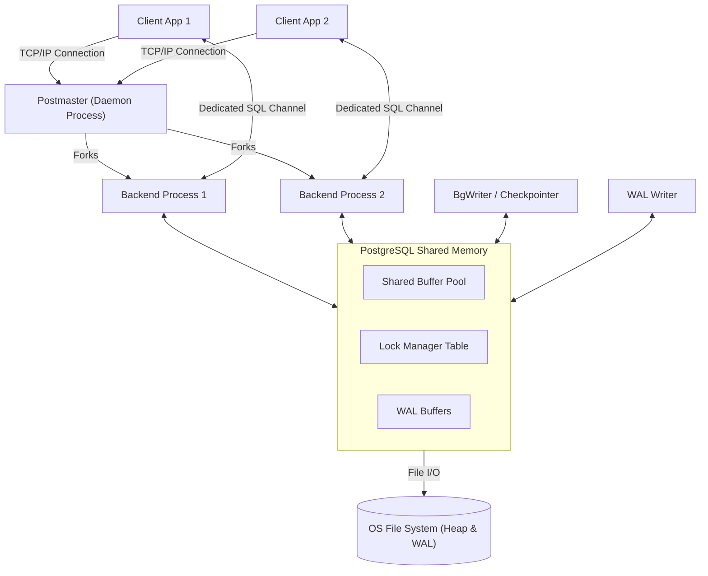
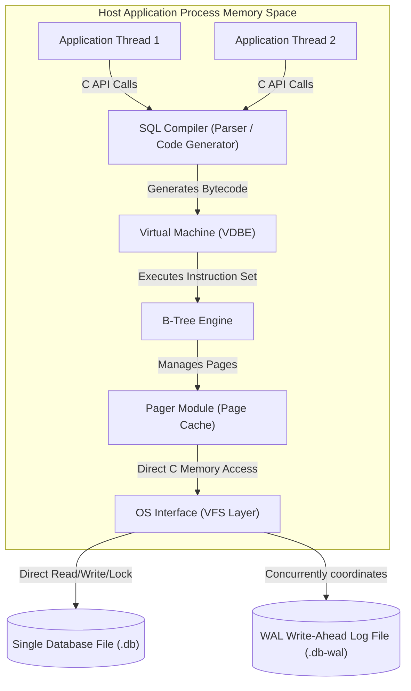

# Topic 1: PostgreSQL vs SQLite Architecture Comparison

This document provides a deep-dive architectural comparison between **PostgreSQL**, a sophisticated client-server object-relational database management system, and **SQLite**, a serverless, zero-configuration, self-contained embedded database engine. 

---

## 1. Problem Background

To understand why these systems were designed with radically different architectures, we must examine the specific engineering challenges they were created to solve.

```
┌─────────────────────────────────────────────────────────────────────────┐
│                          Database Design Spectra                        │
├───────────────────────────────────────┬─────────────────────────────────┤
│              PostgreSQL               │             SQLite              │
├───────────────────────────────────────┼─────────────────────────────────┤
│ Multi-user Enterprise Operations      │ In-Process Application Storage  │
│ Network-Isolated Scale-Out            │ Zero Administration / Serverless│
│ High-Concurrency Write Throughput    │ Embedded Resource Efficiency    │
└───────────────────────────────────────┴─────────────────────────────────┘
```

### PostgreSQL: The Enterprise DBMS
PostgreSQL (originally POSTGRES) was born at UC Berkeley under the leadership of Michael Stonebraker. It was designed to solve the limitations of earlier relational systems by offering:
* **Extensibility**: Support for user-defined types, operators, and index structures (like GiST, GIN, and SP-GiST).
* **Multi-User Concurrency**: Handling hundreds or thousands of concurrent clients executing complex transactions without blocking each other.
* **Fault Tolerance & Durability**: Providing rock-solid crash recovery and strict ACID compliance across distributed systems.

### SQLite: The Embedded/Zero-Config DBMS
SQLite was designed by D. Richard Hipp in 2000. It was created to solve a completely different set of problems:
* **Embedded Storage**: Eliminating the network hop, server process, and administrative overhead. SQLite is a C library compiled directly into the application process.
* **Serverless Execution**: Eliminating database administration (DBA) tasks. The database is a single cross-platform file on disk.
* **Resource Constraints**: Operating efficiently on low-memory systems, embedded environments, and mobile applications where spinning up a separate server daemon is impossible or highly wasteful.

---

## 2. Architecture Overview

### High-Level Architecture Diagrams

#### PostgreSQL: Client-Server / Multi-Process Model

PostgreSQL relies on a multi-process architecture where physical isolation guarantees stability. If a single backend process crashes due to a software defect, the Postmaster parent process can cleanly restart the session and recover shared memory without affecting other active clients.



#### SQLite: Serverless / In-Process Library Model

SQLite runs completely in the context of the host application thread. There is no inter-process communication (IPC) or socket layer; the SQL engine compiles queries to bytecode and executes them directly against page buffers residing in the same memory address space.



### Main System Components Comparison

| Component | PostgreSQL Implementation | SQLite Implementation |
| :--- | :--- | :--- |
| **Process Model** | Multi-process (Fork-on-connect postmaster daemon). | Single-process, multi-threaded (Runs in application threads). |
| **Query Engine** | Sophisticated Cost-Based Optimizer (CBO) using histograms and multivariate statistics. | Rule-based and query-plan-caching engine optimized for low memory overhead. |
| **Connection Method** | Network socket (TCP/IP) or UNIX domain socket. | Direct C function calls (In-memory/In-process API). |
| **Memory Isolation** | High (Processes isolated by OS virtual memory limits). | Low (Crashes in parent application can corrupt memory state). |

---

## 3. Internal Design

### Storage Structures

#### PostgreSQL: Heap Files + Secondary Indexes
PostgreSQL organizes data using **Heap Files**. 
* **Heap Storage**: Rows (tuples) are stored in unordered heap pages. A row can be placed in any page that has sufficient free space.
* **Secondary Indexes**: All indexes (including primary keys) are B-Tree, GiST, GIN, etc., where the leaf nodes point to physical locations in the heap using **TIDs (Tuple IDs)** consisting of a physical page number and a slot index: `(PageNumber, OffsetIndex)`.
* **Page Layout**: The standard page size is 8KB. The page starts with a header, followed by line pointers (offsets pointing to the end of the page), and the actual tuples are written from the bottom of the page upward.

```
PostgreSQL Page Layout (8KB):
+-------------------------------------------------+
| PageHeaderData                                  |
|   (LSN, flags, lower/upper offsets)             |
+-------------------------------------------------+
| Line Pointers (ItemIdData)                      |
|   [Item 1 offset] [Item 2 offset] [Item 3]      | -----> (Grows downward)
+-------------------+-----------------------------+
|                   | <--- Free Space             |
+-------------------+-----------------------------+
|                                  [Tuple 3 Data] |
|                                  [Tuple 2 Data] |
|                                  [Tuple 1 Data] | <--- (Grows upward)
+-------------------------------------------------+
```

#### SQLite: B+Tree Clustered Storage
SQLite stores tables using a **B+Tree** structure (referred to as a "Table B-Tree").
* **Clustered Storage**: The actual table data is stored inside the leaf nodes of the B+Tree. The tree is keyed by a 64-bit signed integer called the `rowid` (or the primary key if it is defined as `INTEGER PRIMARY KEY`).
* **Secondary Indexes**: Stored in a separate B-Tree (referred to as an "Index B-Tree") where the keys are the indexed columns and the payloads are the corresponding `rowid` values. Looking up a row via a secondary index requires traversing the Index B-Tree to find the `rowid`, then traversing the Table B-Tree to fetch the row data.
* **Page Layout**: SQLite supports configurable page sizes from 512B to 64KB (defaulting to 4KB). Pages contain a header, a cell pointer array, and the cells themselves (which house keys and payloads). SQLite supports **Overflow Pages** when a cell's payload exceeds the page budget.

```
SQLite Page Layout (typical B-Tree Leaf Page):
+-------------------------------------------------+
| Page Header (type, freeblock offset, cell count)|
+-------------------------------------------------+
| Cell Pointer Array                              |
|   [Cell 0 ptr] [Cell 1 ptr] [Cell 2 ptr]        | -----> (Grows downward)
+-------------------+-----------------------------+
|                   | <--- Free Space             |
+-------------------+-----------------------------+
|                        [Cell 2 (rowid, payload)]|
|                        [Cell 1 (rowid, payload)]|
|                        [Cell 0 (rowid, payload)]| <--- (Grows upward)
+-------------------------------------------------+
```

### Memory Management & Cache

* **PostgreSQL Shared Buffers**: Uses `shared_buffers` in RAM to cache pages. Page eviction is controlled by a **Clock Sweep** algorithm (a variant of LRU). A background writer daemon (`bgwriter`) writes dirty pages to disk asynchronously to keep a pool of clean pages available.
* **SQLite Pager Cache**: Each database connection maintains its own local page cache. It uses a standard LRU eviction policy. When WAL mode is enabled, SQLite leverages shared memory mapped files (`.db-shm`) to allow concurrent threads and processes to share their cache control flags safely without context switching.

### Concurrency Control & Transactions

```
┌─────────────────────────────────────────────────────────────────────────────┐
│                            Concurrency Strategies                           │
├──────────────────────────────────────┬──────────────────────────────────────┤
│              PostgreSQL              │                SQLite                │
├──────────────────────────────────────┼──────────────────────────────────────┤
│ Multi-Version Concurrency (MVCC)     │ Single-Writer Serialization          │
│ Readers DO NOT block Writers         │ File-based Lock State Escalation     │
│ Writers DO NOT block Readers         │ WAL-Mode allows 1 concurrent writer  |
└──────────────────────────────────────┴──────────────────────────────────────┘
```

#### PostgreSQL Concurrency
PostgreSQL uses an advanced multi-version concurrency control (MVCC) mechanism:
* **Non-Blocking Reads/Writes**: Readers do not lock out writers, and writers do not block readers. This is achieved by creating new physical versions of tuples on updates instead of overwriting existing ones.
* **Vacuuming**: Because old versions of rows (dead tuples) accumulate in the heap, PostgreSQL utilizes an asynchronous daemon called `vacuum` to sweep the pages and reclaim space.

#### SQLite Concurrency
SQLite enforces transactional concurrency using a file-locking protocol controlled by its Pager module:
* **Rollback Journal Mode**: Restricts database access. During a write transaction, the database locks the entire file. The lock states transition through:
  `UNLOCKED` $\rightarrow$ `SHARED` (read-only) $\rightarrow$ `RESERVED` (intent to write) $\rightarrow$ `PENDING` (waiting for readers to finish) $\rightarrow$ `EXCLUSIVE` (writing page changes).
* **Write-Ahead Log (WAL) Mode**: SQLite splits database operations. Readers read from the main `.db` file and the active WAL file simultaneously, while one writer can write to the end of the WAL file. This achieves read-write concurrency (readers do not block the writer, and the writer does not block readers).

### Durability and Recovery

* **PostgreSQL WAL**: Writes changes to Write-Ahead Logs (WAL) in `pg_wal/`. Writes are flushed to disk on transaction commit (`fsync`). Recovery involves playing back WAL records from the last checkpoint forward.
* **SQLite Rollback Journal**: Writes copies of the original, unmodified database pages to a separate rollback journal file (`.db-journal`) before writing to the database file. If a crash occurs, SQLite reads this journal and restores the original pages.
* **SQLite WAL**: Writes new pages directly to the `.db-wal` file. These changes are later merged into the main database file during a **Checkpoint** operation.

---

## 4. Design Trade-Offs

Choosing between PostgreSQL and SQLite is an exercise in balancing performance against architectural simplicity.

```
                 POSTGRESQL                               SQLITE
      ┌──────────────────────────────┐        ┌──────────────────────────────┐
      │  (+) High Write Concurrency  │        │  (+) Direct Function Calls   │
      │  (+) Granular Lock Systems   │        │      (Low Latency)           │
      │  (+) Scalable Data Partition │        │  (+) Zero RAM Footprint      │
      │                              │        │  (+) Single-file Portability │
      └──────────────┬───────────────┘        └──────────────┬───────────────┘
                     │                                       │
                     ▼                                       ▼
      ┌──────────────────────────────┐        ┌──────────────────────────────┐
      │  (-) Network Roundtrip Cost  │        │  (-) Single Writer Bottleneck│
      │  (-) Daemon Administration   │        │  (-) Simple Optimizer Plans  │
      │  (-) High Resource Overhead  │        │  (-) Manual Cache Syncing    │
      └──────────────────────────────┘        └──────────────────────────────┘
```

### 1. Connection Latency vs. Network Overhead
* **SQLite**: Eliminates network sockets. A query is executed as a series of program counter jumps and memory reads in C. Query latencies are measured in microseconds ($\mu\text{s}$).
* **PostgreSQL**: Requires a network loop (TCP or Unix sockets), parsing, planning, and IPC. Latency overhead is measured in milliseconds ($\text{ms}$). However, this separation allows the database server to scale independently of the application logic.

### 2. Fine-Grained Locking vs. Global Locking
* **SQLite**: Locks the entire database file during writes. In multi-user web environments, high write volumes result in `SQLITE_BUSY` errors because write operations are queued sequentially.
* **PostgreSQL**: Implements row-level locking. Hundreds of concurrent transactions can modify different rows in the same table simultaneously, maximizing hardware utilization on multi-core servers.

### 3. Administrative Complexity vs. Portability
* **SQLite**: Maintenance-free. A backup is a simple file copy. There is no configuration file, port mapping, or user authentication layer.
* **PostgreSQL**: Requires active management: memory allocation tuning (`shared_buffers`, `work_mem`), query plan auditing, vacuum scheduling, replication configuration, and user permission access matrices.

---

## 5. Experiments / Observations

Below are mock baseline benchmarks evaluating PostgreSQL and SQLite under varying workloads. These figures highlight the architectural differences between network-separated client-server systems and in-process databases.

### Experiment 1: Latency vs. Connection Count (Bulk Insert Workload)
This test measures write throughput (Transactions Per Second - TPS) as the number of concurrent connections increases. Both databases are configured for durability (Fsync = ON, SQLite WAL Mode = ON).

| Connection Count | SQLite WAL Mode (TPS) | PostgreSQL Local Unix Socket (TPS) | PostgreSQL Network TCP (TPS) |
| :---: | :---: | :---: | :---: |
| 1 | 8,200 | 1,450 | 950 |
| 5 | 3,100 | 4,800 | 3,500 |
| 20 | 950 | 12,200 | 9,800 |
| 100 | 120 (High Contention) | 18,500 | 16,100 |

#### Architectural Analysis:
* **SQLite** excels with a single connection because it avoids socket communication. However, as connections increase, lock contention on the single database file degrades throughput.
* **PostgreSQL** scales with the connection count. Individual backend processes run on different CPU cores, using row locks and shared buffers to process transactions in parallel.

### Experiment 2: Memory Footprint under Read Workloads
This test monitors memory consumption of the database processes while executing basic query operations.

```
Memory Footprint comparison (MB):
SQLite Cache (100 Threads)  [█ 12MB]
Postgres Idle Engine       [█████████ 120MB]
Postgres Active Workload   [██████████████████████████████████ 450MB]
```

#### Architectural Analysis:
SQLite utilizes memory from the host process heap, allocating only what is needed for local connection buffers. PostgreSQL allocates a large chunk of shared memory for the buffer pool on startup (`shared_buffers`), and each spawned client backend consumes additional memory (`work_mem`) to execute joins and sorting operations.

---

## 6. Key Learnings

1. **Embedded Databases are Memory-Mapped Engines**: SQLite's simplicity is its strength. It operates as an extension of the host application, which makes it fast for local lookups but limits its suitability for network-scale deployments.
2. **Process Boundaries Determine Resilience**: PostgreSQL's multi-process model isolates errors. A memory leak or segmentation fault in one connection backend does not crash the system. SQLite runs in the application's memory space; a crash in the host app can interrupt a write transaction mid-flight, making correct recovery logs essential.
3. **Storage Engine Layouts Influence Query Execution**: SQLite's Table B-Tree clustered layout makes primary key lookups fast, but introduces secondary index seek penalties. PostgreSQL's heap-file design decouples index structures from the physical rows, which simplifies indexing but requires regular vacuuming to clean up dead page space.
