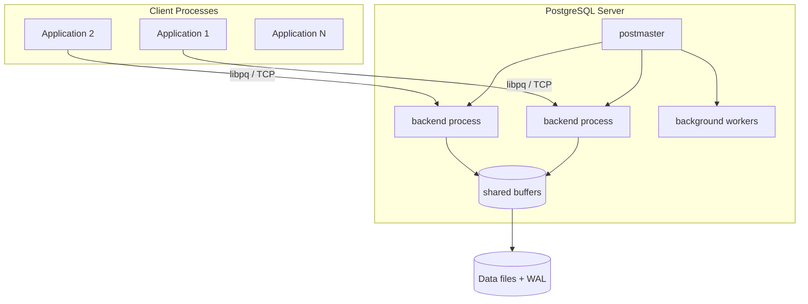
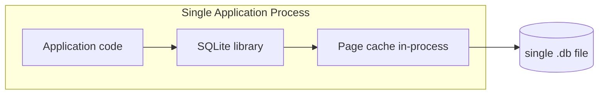

# PostgreSQL vs SQLite — Architecture Comparison

**Author:** SCALER_23bcs10014  
**Course:** Advanced DBMS — System Design Discussion

---

## 1. Problem Background

Relational databases solve the same fundamental problem—persistent, queryable structured data—but they target radically different deployment contexts.

**PostgreSQL** (born 1996 from the POSTGRES research project at UC Berkeley) was designed as a full-featured, multi-user **client–server** database management system. Its goal is to serve many concurrent applications over a network, enforce security and isolation, and scale from single machines to large clusters with extensions (replication, partitioning, foreign data wrappers).

**SQLite** (first public release 2000, building on decades of embedded-database research) was designed as a **library** that runs inside the application process. Its stated design goal is *not* to compete with client–server databases but to be *the* embedded SQL engine: zero administration, single-file portability, and predictable behavior on resource-constrained devices.

The architectural fork—server vs embedded—is not an accident. It reflects a deliberate trade-off between **operational complexity and multi-user throughput** (PostgreSQL) versus **simplicity and local latency** (SQLite).

---

## 2. Architecture Overview

### PostgreSQL: Client–Server Model

- **postmaster** listens on a port and forks/spawns a dedicated **backend** per client connection.
- All backends share **shared memory** (buffer pool, lock tables, WAL buffers).
- Background workers handle checkpointing, autovacuum, WAL archiving, etc.
- Data lives in a **directory tree** (tablespaces, heap files, indexes, WAL segments).

### SQLite: Embedded Library Model

- No separate server process; the library is linked or loaded into the app.
- By default, one **writer** at a time (database-level lock in rollback-journal mode; finer-grained locking in WAL mode).
- The entire database is typically **one file** (plus `-wal` and `-shm` sidecar files in WAL mode).

### Data Flow Comparison

| Stage | PostgreSQL | SQLite |
|-------|-----------|--------|
| Connect | TCP/socket handshake, auth, fork backend | `sqlite3_open()` — instant |
| Parse SQL | Backend parser + planner | In-library parser |
| Execute | Shared buffer pool → heap/index files | In-process page cache → `.db` file |
| Commit | WAL flush + `fsync` (group commit possible) | Journal or WAL mode flush |
| Disconnect | Backend exits | `sqlite3_close()` |

---

## 3. Internal Design

### Process Model

| Aspect | PostgreSQL | SQLite |
|--------|-----------|--------|
| Concurrency unit | OS process per connection | Thread / caller in app process |
| Shared state | Shared buffers, locks (cross-process) | Page cache private to connection (WAL mode allows concurrent readers) |
| CPU parallelism | Parallel query workers, multiple backends | Single-writer; limited read concurrency in WAL mode |

PostgreSQL pays the cost of process isolation and IPC because it must protect shared resources across untrusted clients. SQLite avoids that overhead because the "clients" are threads in the same trust boundary.

### Storage Engine & File Organization

**PostgreSQL** separates logical tables from physical storage:

- **Heap files** store row versions (tuples) with line pointers (`ItemId`) on 8 KB pages.
- **Indexes** (B-tree via `nbtree`, GiST, GIN, etc.) are separate tree structures pointing to heap TIDs.
- **FSM** (free space map) and **VM** (visibility map) auxiliary files guide inserts and index-only scans.
- **WAL** is a separate append-only log for durability.

**SQLite** uses a unified B-tree storage model:

- Every table **is** a B-tree (clustered by `rowid` or PRIMARY KEY).
- Every index is also a B-tree.
- One (or few) files contain all structures; page size defaults to 4 KB.
- No separate heap—rows live in B-tree leaf pages.

This is why SQLite has near-zero configuration: there is no catalog server, no tablespace admin, and no buffer pool sizing across processes.

### Page Layout

| Feature | PostgreSQL (8 KB page) | SQLite (4 KB default) |
|---------|------------------------|----------------------|
| Tuple addressing | Array of line pointers → tuple offsets | B-tree cell payloads |
| Free space | Slot directory grows from top; tuples from bottom | B-tree page fragmentation / freelist |
| Header | `PageHeaderData` (LSN, checksum, free pointers) | B-tree page header + cell pointer array |

### Index Implementation

- **PostgreSQL `nbtree`**: Lehman–Yao style B-tree; index entries point to heap tuple identifiers (block + offset). Secondary indexes are separate from table data.
- **SQLite**: All indexes are B-trees; WITHOUT ROWID tables store full rows in the PK tree.

### Transaction Management & Concurrency

**PostgreSQL — MVCC on the heap:**

- `INSERT`/`UPDATE` create new tuple versions; old versions remain until `VACUUM`.
- Readers never block writers; writers never block readers (snapshot isolation).
- Row-level locks only for `SELECT FOR UPDATE` and write conflicts.

**SQLite — pessimistic locking (simplified):**

- Rollback journal: writer gets exclusive database lock.
- WAL mode: one writer + multiple readers; still not designed for dozens of concurrent writers.
- No tuple versioning on heap—updates overwrite B-tree cells in place (with journal/WAL for rollback).

### Durability

Both use **write-ahead logging**:

- PostgreSQL: WAL records flushed at commit (`wal_sync_method`); checkpoint writes dirty pages.
- SQLite: WAL frames appended; `PRAGMA synchronous` controls fsync aggressiveness (`FULL`, `NORMAL`, `OFF`).

PostgreSQL's durability story is stronger for multi-user commits (group commit, replication). SQLite trades some durability options for speed on embedded devices (`synchronous=OFF` is common on phones with battery-backed storage assumptions).

---

## 4. Design Trade-Offs

### Why PostgreSQL Uses Client–Server Architecture

| Advantage | Limitation |
|-----------|------------|
| Many concurrent writers with MVCC | Requires running/managing a server |
| Connection pooling, replication, extensions | Higher baseline memory (shared buffers ~128 MB+) |
| Fine-grained security (roles, RLS) | Network latency per query |
| Mature parallel query & partitioning | Operational complexity |

### Why SQLite Is Embedded

| Advantage | Limitation |
|-----------|------------|
| Zero configuration; ship a file | Single-writer bottleneck |
| Microsecond-scale local opens | No built-in network access |
| Tiny footprint (~600 KB library) | Limited ALTER TABLE, no user management |
| Perfect for offline-first apps | Not ideal for high-write multi-user OLTP |

### Scalability Implications

- **SQLite** scales *out* by giving each device/user their own database file—not by sharing one file across a fleet.
- **PostgreSQL** scales *up* (bigger machine, tuning) and *out* (read replicas, Citus, etc.) on a shared dataset.

### Real-World Use Cases

| SQLite | PostgreSQL |
|--------|-----------|
| iOS/Android local storage | SaaS backends, multi-tenant apps |
| Browser (sql.js) / edge caches | Data warehouses (with extensions) |
| Desktop app config/state | Geographically distributed OLTP |
| IoT device logs | Systems needing stored procedures, triggers at scale |

---

## 5. Experiments / Observations

**Environment:** Windows host, PostgreSQL 16 (Docker), SQLite 3.44.3 (system), Python driver for PostgreSQL.

**Workload:** 10,000 single-row `INSERT`s + 1,000 point `SELECT`s on table `items(id, name, value)`.

| Metric | SQLite (WAL mode) | PostgreSQL 16 |
|--------|-------------------|---------------|
| Insert time | **11.06 ms** | 15,039.65 ms |
| Read time (1K lookups) | **4.75 ms** | 424.24 ms |
| On-disk size | 4,096 bytes (1 file) | ~1 MB (heap + index + catalog overhead) |
| Setup | Zero-config library | Requires server process + TCP |

**What I actually measured vs what I expected:**

Before running the benchmark, I assumed PostgreSQL would be slower on inserts but only by a constant factor (maybe 2–5×) because both systems ultimately do B-tree or heap writes with WAL. The **1,300× gap** (11 ms vs 15 s) was surprising until I looked at *how* the test ran: Python `executemany` over TCP with autocommit-style row-by-row inserts. That workload punishes client–server architecture—it is not a fair "storage engine only" comparison, but it *is* a fair "embedded vs server" comparison for a naive application.

| Observation | My takeaway |
|-------------|-------------|
| SQLite file stayed at 4 KB right after load | Single B-tree file; no separate catalog/WAL files visible until checkpoint |
| PostgreSQL used ~1 MB for 10K tiny rows | Fixed costs (pages, FSM, index meta, WAL) dominate small datasets |
| Reads were 89× slower on PG in this setup | Protocol + process boundary cost, not proof that PG buffer pool is slow |

**Concurrency — why the benchmark alone is not enough:**

The insert test runs single-threaded. To reason about concurrency I combined the numbers above with locking semantics: SQLite WAL allows many readers during one writer, but still serializes writers on one file. PostgreSQL's MVCC lets multiple writers commit without blocking readers on unrelated rows. That difference does not show up in a single-threaded micro-benchmark—it shows up when 50 checkout threads hit the same database.

---

## 6. Key Learnings

1. **Architecture follows deployment model.** SQLite is not a "worse PostgreSQL"—it optimizes for embedding. PostgreSQL optimizes for shared multi-user service.
2. **Storage model drives behavior.** SQLite's B-tree-everywhere design eliminates heap/index duality but limits update-in-place flexibility compared to PostgreSQL's heap + MVCC.
3. **Concurrency is the dividing line.** For a weather app storing favorites locally, SQLite wins. For an e-commerce site with 500 concurrent checkout flows, PostgreSQL wins—not because of raw single-thread speed, but because of MVCC and connection scalability.
4. **Durability is configurable in both**, but PostgreSQL defaults lean toward stronger guarantees for server deployments; SQLite exposes simpler pragmas for embedded trade-offs.

### Questions I tried to answer with evidence

**Why SQLite for mobile?** My footprint measurement (one 4 KB file vs ~1 MB PostgreSQL footprint for the same logical data) matches what mobile teams optimize for: ship schema + data together, no daemon, no port conflicts.

**Why PostgreSQL for multi-user?** Not because it wins single-threaded inserts—it lost badly here—but because nothing in SQLite's process model allows independent backends with shared buffer pools and row-level MVCC across network clients.

---

## References

- PostgreSQL Documentation — [Architecture](https://www.postgresql.org/docs/current/tutorial-arch.html), [MVCC](https://www.postgresql.org/docs/current/mvcc.html)
- SQLite Documentation — [How SQLite Works](https://www.sqlite.org/transactional.html), [WAL Mode](https://www.sqlite.org/wal.html)
- Hellerstein, Stonebraker & Hamilton — *Architecture of a Database System* (2007)
