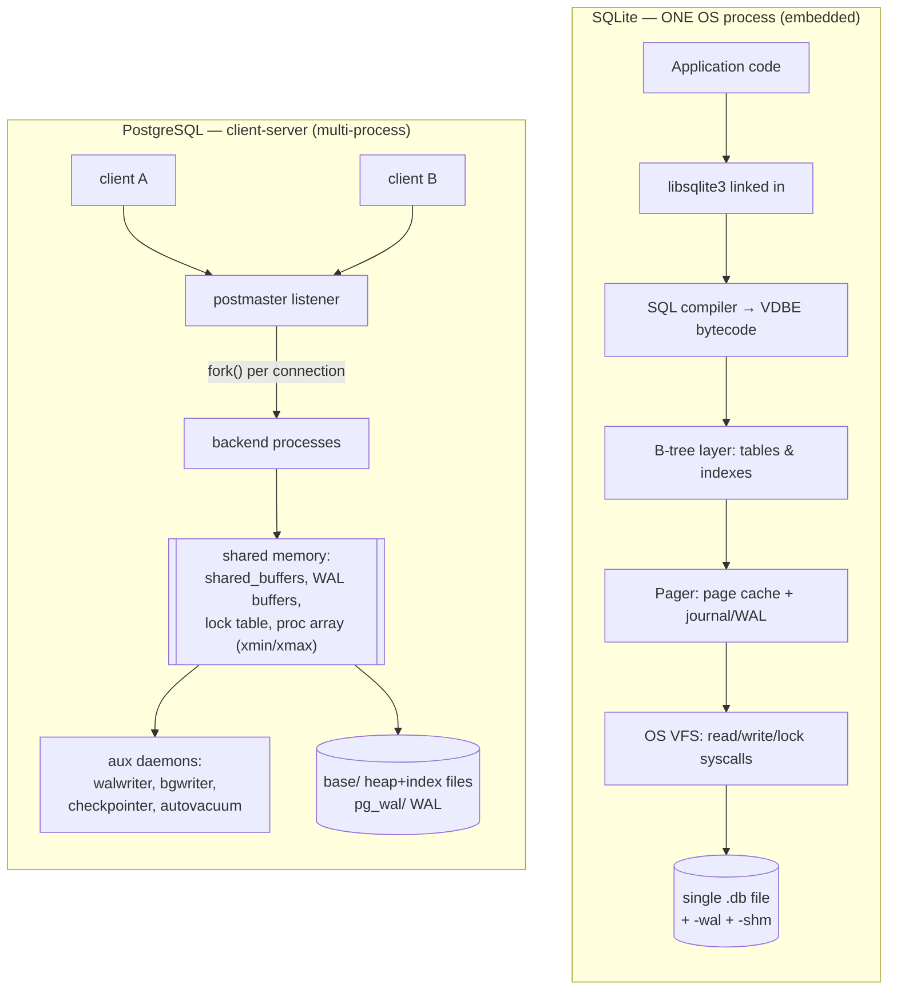

# PostgreSQL vs SQLite — Architecture Comparison

A database-internals comparison of two systems that solve the *same logical
problem* (durable, transactional, SQL-queryable relational storage) with
**opposite architectural philosophies**: SQLite is an embedded, in-process,
single-file library; PostgreSQL is a multi-process client-server engine built
around MVCC and a shared buffer cache. Almost every difference downstream —
concurrency model, durability mechanism, query planner sophistication — is a
*consequence* of that one initial choice. This document traces those
consequences from first principles and backs each claim with captured output
from `sqlite3 3.51.0` and `PostgreSQL 17.10`.

---

## 1. Problem Background

Every relational database must answer four questions:

1. **Where do bytes live?** (file/page/disk layout)
2. **Who is allowed to touch them, and when?** (concurrency control)
3. **How do reads find rows fast?** (indexing + query planning)
4. **What survives a crash?** (durability / recovery)

SQLite and PostgreSQL answer all four differently because they optimize for
different *deployment contexts*, not because one is "better":

- **SQLite** optimizes for the case where the database lives *inside* one
  application process — a phone app, a browser, an embedded device, a desktop
  tool, a unit-test fixture. The dominant cost it tries to eliminate is
  **operational and IPC overhead**: no server to install, no port, no
  authentication handshake, no network/socket round-trip per query. The whole
  database is one ordinary file you can `cp`.

- **PostgreSQL** optimizes for the case where *many* independent clients hammer
  *one* shared dataset concurrently — an OLTP backend, an analytics warehouse,
  a multi-tenant SaaS. The dominant cost it tries to eliminate is **writer
  contention and coordination**: it must let many sessions read and write at
  once without corrupting each other or blocking on a single lock.

The thesis of this document: **"embedded library + single file" forces a
single-writer concurrency model; "multi-process server + shared memory" enables
MVCC multi-writer concurrency.** Hold that contrast in mind through every
section below.

---

## 2. Architecture Overview

The two engines sit at opposite ends of the "where does the database run?"
spectrum. SQLite *is* a function call inside your process; PostgreSQL is a
server you connect to. The diagram below contrasts the two stacks; the
subsections then walk each in detail.



### 2.1 SQLite — embedded, in-process, serverless

There is no SQLite *server*. SQLite is a C library you link into your program.
A `sqlite3_step()` call is an ordinary function call on your thread's stack;
"talking to the database" never leaves your process. The database is a single
file on disk, and concurrency between *processes* is mediated by the operating
system's file-locking primitives (`fcntl`/`flock` ranges) plus, in WAL mode, a
shared-memory index file.

```text
            ONE OS PROCESS (your application)
   +-------------------------------------------------+
   |  application code                               |
   |        |  sqlite3_prepare/step/finalize (calls) |
   |        v                                        |
   |  +-------------------------------------------+  |
   |  |  libsqlite3 (linked in)                   |  |
   |  |   SQL compiler  -> VDBE bytecode          |  |
   |  |   VDBE register virtual machine           |  |
   |  |   B-tree layer (tables & indexes)         |  |
   |  |   pager  (page cache + journal/WAL logic) |  |
   |  |   OS VFS  (read/write/lock syscalls)      |  |
   |  +---------------------|---------------------+  |
   +----------------------- | ------------------------+
                            v   (file I/O + advisory locks)
            +--------------------------------+
            |  sqlite_demo.db   (one file)   |
            |  sqlite_demo.db-wal  (writes)  |
            |  sqlite_demo.db-shm  (shm idx) |
            +--------------------------------+
```

Key consequence: SQLite has **no background processes, no shared server memory,
no connection pool**. The page cache lives in *each* connection's heap
(`PRAGMA cache_size=2000` pages in our run). Coordination between two processes
opening the same file is done entirely through file locks and the `-shm` file.

### 2.2 PostgreSQL — client-server, process-per-connection

PostgreSQL runs a long-lived supervisor, the **postmaster**. Each new client
connection causes the postmaster to `fork()` a dedicated **backend process**
that runs all of that session's queries. All backends attach to one region of
**shared memory** that holds the shared buffer cache, lock tables, WAL buffers,
and the list of in-progress transactions. A set of **auxiliary processes**
(WAL writer, background writer, checkpointer, autovacuum launcher/workers) run
alongside. (Cumulative statistics moved into shared memory in PostgreSQL 15, so
on 17.10 there is no longer a separate "stats collector" process.)

```text
   client A      client B      client C        (TCP / unix socket)
      |             |             |
      v             v             v
  +---------------------------------------------------------------+
  |  postmaster (listener)  --fork()-->  backend per connection   |
  |                                                               |
  |   backendA   backendB   backendC      (separate OS processes) |
  |      \           |           /                                |
  |       \          |          /   attach                        |
  |        v         v         v                                  |
  |   +-------------------------------------------------------+   |
  |   |        SHARED MEMORY                                  |   |
  |   |  shared_buffers (page cache)  | WAL buffers           |   |
  |   |  lock table | proc array (xmin/xmax of live txns)     |   |
  |   +-------------------------------------------------------+   |
  |        ^         ^          ^                                 |
  |   walwriter  bgwriter  checkpointer  autovacuum               |
  +---------------------------------------------------------------+
                          |  buffered + fsync'd I/O
                          v
        base/ (heap + index files, 1GB segments) | pg_wal/ (WAL)
```

Key consequence: because state is shared across processes, PostgreSQL can let
*many backends write concurrently* and use MVCC to keep their views isolated.
The price is a real server: a process per connection (memory + fork cost), a
shared-memory segment, and background maintenance daemons.

### 2.3 The one-line summary

| Dimension | SQLite | PostgreSQL |
|---|---|---|
| Deployment | In-process library, linked into app | Standalone client-server daemon |
| Process model | Caller's thread; **no** server processes | postmaster + process-per-connection + aux daemons |
| Where data lives | One file (`+ -wal`, `+ -shm`) | Cluster dir: `base/`, `pg_wal/`, `global/` |
| Cache | Per-connection private heap cache | Shared `shared_buffers` in shared memory |
| Concurrency | **1 writer + N readers** (WAL) | **N writers + N readers** via MVCC |
| Isolation mechanism | File locks + WAL frames | MVCC tuple versions (xmin/xmax) |
| Durability | Rollback journal **or** WAL | WAL (always) + checkpoints |
| Planner | Cost-based, `sqlite_stat1` stats | Cost-based, `pg_statistic` (histograms, n_distinct, correlation) |
| Config | Zero | `postgresql.conf`, roles, `pg_hba.conf` |
| Sweet spot | Mobile / embedded / edge / single-app | Multi-user OLTP / OLAP servers |

---

## 3. Internal Design

### 3.1 On-disk organization

**SQLite: everything is one file made of fixed-size pages.** Our database uses
`page_size = 4096` bytes, `page_count = 45`, `freelist_count = 0`. The file
*is* the database — header in page 1, then a sequence of B-tree pages. Crucially,
**every B-tree — table or index — is rooted at exactly one page**, and that
root page number is recorded in the schema:

```text
table|authors|authors|2            <- authors table B+-tree root = page 2
table|books|books|3                <- books   table B+-tree root = page 3
index|idx_books_author|books|4     <- index   B-tree    root = page 4
table|sqlite_stat1|sqlite_stat1|45 <- stats   table      root = page 45
```

There are two B-tree flavors:

- **Table B-trees** are *clustered* by `rowid`: a 64-bit integer key with the
  full row payload in the leaf. When you declare `INTEGER PRIMARY KEY`, that
  column becomes an **alias for `rowid`** — so the table itself *is* the primary
  index; there is no separate PK structure. (This is why a PK lookup in §5 reads
  the table B-tree directly, not a secondary index.)
- **Index B-trees** store the indexed key plus the `rowid` it points back to,
  so an index probe yields a `rowid` that is then used to seek into the table
  B-tree.

(Two caveats to "the table is the PK index": this holds for the common
`INTEGER PRIMARY KEY` alias. A *non-integer* primary key is implemented as a
regular unique **index** over a hidden rowid table, so it costs the extra index
hop; and a `WITHOUT ROWID` table flips the model entirely — the table becomes a
clustered B-tree keyed by the *declared* primary key, much closer to InnoDB's
clustered index than to PostgreSQL's heap.)

```text
SQLite "books" table = ONE clustered B+-tree, keyed by rowid (=INTEGER PK)

                       [ interior page: rowid separators ]
                      /             |              \
            [ leaf: rowid -> full row ] ...  [ leaf: rowid -> full row ]
            | 4240: (id,author,title,year) |
            | 4241: (...)                  |
            | 4242: (...)  <-- SeekRowid    |
            +------------------------------+
```

**PostgreSQL: a cluster directory of many files.** Each table ("relation") and
each index is its own file (segmented at 1 GB) under `base/<dboid>/`, plus the
write-ahead log in `pg_wal/`. The table file is a **heap**, *not* a clustered
B-tree: rows ("tuples") are placed in 8 KB heap pages in roughly insertion
order, and *all* indexes — including the primary key — are **secondary** indexes
pointing at heap tuples by physical address (`ctid` = block number + line
pointer). This is the single biggest storage difference: SQLite's table is its
PK index; PostgreSQL's table is an unordered heap with separate index files.

Page layout of a PostgreSQL heap page (source: `src/backend/storage/page/`,
`src/include/storage/bufpage.h`):

```text
PostgreSQL 8 KB heap page
+------------------------------------------------------------+
| PageHeader (24B): LSN, checksum, free-space pointers       |
+------------------------------------------------------------+
| ItemId array (line pointers): lp1, lp2, lp3 ...  --->      |  grows down
|     lp -> (offset, length, flags)                          |
+------------------------------------------------------------+
|                  free space                                |
+------------------------------------------------------------+
|  <--- tuples packed from the end                           |  grows up
|   tuple3 | tuple2 | tuple1                                 |
|   each tuple: HeapTupleHeader{ xmin, xmax, t_ctid, ... }   |
+------------------------------------------------------------+
| special space (used by index AMs; empty for heap)          |
+------------------------------------------------------------+
```

The indirection through the **line-pointer (ItemId) array** is what makes MVCC
cheap: PostgreSQL can keep multiple tuple versions on a page and add/redirect
line pointers without rewriting index entries for every move (HOT updates).

### 3.2 Index implementation

Both engines default to B-trees, but the semantics differ:

- **SQLite** (`src/btree.c`): one unified B-tree module serves both tables
  (clustered, payload in leaf) and indexes (key + rowid). Lookups always end in
  a `rowid`, then a seek into the table B-tree — except `INTEGER PRIMARY KEY`
  lookups, which seek the table directly.
- **PostgreSQL** (`src/backend/access/nbtree/`): the nbtree access method is a
  Lehman-Yao high-concurrency B-tree (right-links + a "high key" so a reader
  descending while a page splits can still find the moved key without holding
  locks up the tree). Index tuples store the indexed key + a `ctid` heap
  pointer. Whether an index scan causes *random* heap I/O depends on
  **correlation** — how well the index's key order matches the heap's physical
  order. When correlation is near zero, the index hands back ctids scattered
  across the heap, so PostgreSQL uses a **Bitmap Index Scan** (collect all
  matching ctids, sort by page, then do *sequential* heap reads), seen in §5.
  When correlation is ~1 (the heap is already physically ordered by that key),
  it uses a plain **Index Scan** with no bitmap step (Experiment 8 on `id`).

`pageinspect` on `idx_books_author` (Experiment 5) confirms a real nbtree:

```text
 magic  | version | root | level | fastroot | fastlevel | allequalimage
 340322 |    4     |  3   |   1   |    3     |    1      |      t
```

`magic 340322` and `version 4` are the nbtree on-disk metapage signature;
`level 1` means root + leaf (a shallow tree over our 200k rows). The same
metapage reports `allequalimage=t`, which enables nbtree **posting-list
deduplication**. A leaf page report shows `type=l, live_items=10,
avg_item_size=729, free_size=812` out of `page_size=8192`. Only **10** live
items per leaf is *not* many distinct entries — it is the deduplication at work:
`author_id` has just ≈50 distinct values across 200k rows (there are 50 authors),
so each leaf item is a single key plus a large **posting list** of heap TIDs
(hence the abnormally large `avg_item_size ≈ 729` bytes for an index on a 4-byte
integer). The page is full
*by bytes* — ~7.4 KB of posting lists, only 812 bytes free — not because it holds
many keys.

### 3.3 Concurrency control — the central divergence

**SQLite: one writer at a time.** SQLite serializes writes with a coarse lock
on the database file. In the legacy rollback-journal mode, a writer takes an
EXCLUSIVE lock and blocks all readers. In **WAL mode** (`PRAGMA
journal_mode=WAL`, which our run switches to), the rule relaxes to the famous
**one writer + many readers simultaneously**:

- Writers append new page images to `sqlite_demo.db-wal` instead of overwriting
  the main file.
- Readers read a consistent snapshot: the main file up to a point, plus WAL
  frames up to their snapshot's "mark", located via the shared-memory index
  `sqlite_demo.db-shm`.
- Only one writer may append to the WAL at a time, but it no longer blocks
  readers, and readers don't block the writer.

This is genuine snapshot isolation, but the **writer is still a global
singleton**. Two threads cannot commit concurrently to the same SQLite
database; the second blocks (or gets `SQLITE_BUSY`). That is acceptable —
*desirable*, even — for an embedded single-app workload, and it keeps the
implementation tiny.

**PostgreSQL: many writers via MVCC.** PostgreSQL never overwrites a row in
place for an `UPDATE`. It writes a *new tuple version* and marks the old one as
expired. Each tuple header carries `xmin` (the transaction id that created it)
and `xmax` (the txn that deleted/superseded it). A transaction sees a tuple iff
`xmin` is committed-and-visible and `xmax` is not — so each transaction reads a
consistent snapshot *without locking rows for read*. Writers only conflict if
they touch the *same row*. This is what lets dozens of backends commit at once.

The cost: **bloat**. Old versions ("dead tuples") accumulate and must be
reclaimed by **VACUUM** (and transaction ids must be "frozen" to avoid 32-bit
XID wraparound). SQLite has no such background garbage because it overwrites in
place — another simplicity dividend of the single-writer model. We watch a
single `UPDATE` create a dead tuple in §5, and then watch VACUUM *decline to
reclaim it* (Experiments 3-4): with only one dead item, VACUUM takes its
"index scan bypassed" fast path and leaves the dead line pointer behind, so
the maintenance cost lingers until a larger future VACUUM. The MVCC machinery
lives in `src/backend/access/heap/`
(`heapam.c`) and `src/backend/access/transam/`.

### 3.4 Durability

- **SQLite WAL** (`src/wal.c`): commit = WAL frames flushed (`fsync`) with a
  commit marker. Periodically a **checkpoint** copies WAL frames back into the
  main file (`wal_autocheckpoint=1000` pages in our run). Crash recovery replays
  committed WAL frames. In rollback-journal mode the dual exists: before
  modifying a page, the *original* is copied to a journal so an interrupted txn
  can be rolled back.
- **PostgreSQL WAL** (`src/backend/access/transam/xlog.c`): every change is
  described by a WAL record written to `pg_wal/` *before* the dirty data page is
  allowed to reach disk (write-ahead logging / the "WAL rule"). Commit = the
  WAL up to the commit record is `fsync`'d. The monotonic **LSN** (log sequence
  number) orders all changes; a **checkpoint** flushes dirty shared buffers and
  records a safe restart point. Recovery replays WAL from the last checkpoint.

Same idea (log the intent before the data), but PostgreSQL's WAL is also the
backbone of **replication** (stream WAL to standbys) and point-in-time
recovery — features that only make sense for a server. SQLite's WAL is purely a
local crash/concurrency mechanism.

---

## 4. Design Trade-Offs

### 4.1 Why SQLite wins for mobile / embedded

- **Zero configuration / serverless.** No daemon to launch, no port, no auth,
  no `postgresql.conf`. The app opens a file. On a phone or IoT device there is
  no ops team — this is decisive.
- **Single file.** Backup = copy the file. Ship a prebuilt DB as an app asset.
  Atomic-ish deploy. The `.dbinfo` output (`number of tables: 3`, schema and
  data all in `sqlite_demo.db`) shows the entire database is self-describing
  inside one file.
- **In-process = no IPC.** A query is a function call, not a socket round-trip.
  For an app issuing thousands of tiny queries, eliminating per-query
  serialization + context switches dominates.
- **Tiny footprint.** The whole engine is a few hundred KB of C with no
  external dependencies — it fits where a server never could.
- **Accepted trade-off:** one writer at a time, no network access, no
  per-user roles, a simpler planner. For a single application owning its own
  data, none of these matter.

### 4.2 Why PostgreSQL wins for large multi-user systems

- **Concurrent writers (MVCC).** Many backends commit at once with snapshot
  isolation; readers never block writers. This is *the* requirement for a busy
  OLTP backend and is structurally impossible in SQLite's single-writer model.
- **Shared buffer cache.** All backends share one hot page cache in shared
  memory, so a page read by one session benefits all. Experiment 6 shows the
  cache being actively managed (`books` pinning 1377 buffers; a clock/usage-count
  eviction policy with most buffers at `usagecount=3`). SQLite's per-connection
  caches can't share like this.
- **Sophisticated cost-based planner.** Rich `pg_statistic` (n_distinct,
  null_frac, histograms, physical **correlation**) lets the planner choose
  among seq scan, index scan, bitmap scan, hash/merge/nested-loop joins, and
  **parallel** plans. Experiment 8 shows the plan *flipping* from index scan to
  parallel seq scan as selectivity changes.
- **Operational maturity for servers:** roles/permissions, WAL-based streaming
  replication and PITR, extensions, partitioning, parallel query.
- **Accepted trade-off:** you must run and tune a server; a process per
  connection costs memory and fork time (hence connection poolers); MVCC
  produces dead tuples that VACUUM must reclaim and XIDs that must be frozen.

### 4.3 The trade-off in one sentence

SQLite traded away multi-writer concurrency and server features to gain
**radical simplicity and zero operational cost**; PostgreSQL accepted
**operational complexity and MVCC garbage** to gain **concurrent multi-user
scalability**. Each is optimal *for its context* and a poor fit for the other's.

### 4.4 Scalability implications

- SQLite scales **down** beautifully (one binary, one file, runs on a watch) and
  scales reads horizontally per process, but write throughput is capped by the
  single-writer serialization and it does not scale across machines.
- PostgreSQL scales **up and out** (more cores → more concurrent backends and
  parallel workers; read replicas via WAL streaming) at the cost of a heavier
  baseline and the need to manage connection counts, vacuum, and checkpoints.

---

## 5. Experiments / Observations

All output below was **captured on this machine** (not copied from
documentation) by the self-contained harnesses in `../_experiments/`:
`run_sqlite.sh` → `../_experiments/sqlite_experiments.txt` (`sqlite3 3.51.0`)
and `run_postgres.sh` → `../_experiments/postgres_experiments.txt`
(`PostgreSQL 17.10`). The live two-session concurrency demo in §5.8 comes from
`../_experiments/postgres_concurrency_demo.{sql,txt}` and
`../_experiments/sqlite_concurrency_demo.{sql,txt}`.

### 5.1 SQLite — the file is one bag of pages

```text
$ sqlite3 sqlite_demo.db 'PRAGMA page_size; PRAGMA page_count;
                          PRAGMA freelist_count; PRAGMA cache_size;'
4096        # page_size
45          # page_count
0           # freelist_count
2000        # cache_size (pages, per-connection)
```

`.dbinfo` confirms it is self-contained: `database page size: 4096`,
`text encoding: 1 (utf8)`, `number of tables: 3`, `number of indexes: 1`,
`freelist page count: 0`. **Interpretation:** the entire schema and all data of
3 tables + 1 index occupy 45 × 4 KB pages in *one* file with a per-connection
2000-page cache — there is no server and no shared memory in sight.

### 5.2 SQLite — every B-tree is one root page; the table is the PK

```text
table|authors|authors|2
table|books|books|3
index|idx_books_author|books|4
table|sqlite_stat1|sqlite_stat1|45
```

**Interpretation:** each object names exactly one root page. This is direct
evidence that a SQLite table and a SQLite index are *the same kind of object*
(a B-tree) — the only difference is what the leaves carry. Because `books` uses
`INTEGER PRIMARY KEY`, page 3 is simultaneously the table heap *and* the primary
index, clustered by rowid.

### 5.3 SQLite — the planner and the VDBE virtual machine

```text
-- join authors x books on indexed FK
QUERY PLAN
|--SCAN a
|--SEARCH b USING INDEX idx_books_author (author_id=?)
`--USE TEMP B-TREE FOR GROUP BY

-- lookup by PRIMARY KEY (rowid)
QUERY PLAN
`--SEARCH books USING INTEGER PRIMARY KEY (rowid=?)

-- year=1999 has no useful index
QUERY PLAN
`--SCAN books
```

The PK lookup compiles to **VDBE bytecode** — SQLite is a register virtual
machine, not a tree-walker:

```text
addr  opcode       p1   p2   p3   p4   comment
1     OpenRead     0    3    0    4         root=3 iDb=0; books
2     Integer      4242 1    0              r[1]=4242
3     SeekRowid    0    9    1              intkey=r[1]
4     Rowid        0    2    0              r[2]=books.rowid
8     ResultRow    2    4    0              output=r[2..5]
9     Halt
```

**Interpretation:** the optimizer picked three different strategies for three
predicates (index search, direct rowid seek, full scan), proving SQLite *does*
have a real cost-based planner — just a lighter one. The bytecode shows
`OpenRead ... root=3` opening the **table B-tree directly** and `SeekRowid 4242`
jumping straight to the row: concrete proof that the `INTEGER PRIMARY KEY` is
the clustered table, with no secondary index hop.

### 5.4 SQLite — WAL mode materializes the sidecar files

```text
$ ... PRAGMA journal_mode=WAL; PRAGMA wal_autocheckpoint;
wal
1000

$ ls -l           # after a WAL write
184k  sqlite_demo.db
 33k  sqlite_demo.db-shm   <- shared-memory index for readers
   0  sqlite_demo.db-wal   <- appended write frames
```

`ANALYZE` populates `sqlite_stat1`, which the planner reads:

```text
books|idx_books_author|5000 1250
authors||4
```

**Interpretation:** switching to WAL is what unlocks "1 writer + N readers."
The `-shm` file is the shared-memory index that lets concurrent readers locate
the right WAL frames for their snapshot; the `-wal` file is the append log that
commits grow with new page frames between checkpoints. It reads `0` bytes here
only because it was just checkpointed/truncated back into the main `.db`
(consistent with `wal_autocheckpoint=1000`) — the point being demonstrated is the
*presence* of `-wal` and `-shm` in WAL mode, not their current size. The
`5000 1250` stat means "≈5000 rows, ≈1250 rows per distinct `author_id`" — the
selectivity hint that drove the `SEARCH ... USING INDEX` choice above. Note this
is far simpler than PostgreSQL's per-column histograms.

### 5.5 PostgreSQL — a rich plan over shared buffers

```text
EXPLAIN (ANALYZE, BUFFERS): authors JOIN books, group/sort/limit
 Hash Join (cost=409.42..2334.93 rows=36000) (actual rows=36000)
   Hash Cond: (b.author_id = a.id)
   ->  Bitmap Heap Scan on books b   (actual rows=36000)
         Recheck Cond: (b.year > 2010)   Heap Blocks: exact=1373
         ->  Bitmap Index Scan on idx_books_year  (actual rows=36000)
   ->  Hash -> Seq Scan on authors a   (rows=50)
 Buffers: shared hit=1377 read=33 written=33
 Planning Time: 0.444 ms   Execution Time: 7.631 ms
```

**Interpretation:** the planner's row estimate (`rows=36000`) exactly matched
reality (`actual rows=36000`) — that accuracy comes from full lab-table statistics in `pg_statistic`. It chose
a **Bitmap Index Scan + Bitmap Heap Scan** precisely because `year` has near-zero
physical **correlation** (Experiment 2: `correlation ≈ 0.020`): the index's key
order does not match the heap's physical order, so following the index directly
for 36000 rows would scatter random reads across the heap. Instead it gathers all
matching `ctid`s, sorts them by page, then reads the 1373 heap blocks in
*physical* order to avoid that random I/O. (Contrast with `id`, whose
`correlation = 1` means the heap *is* physically ordered by `id`; for the
`id = 4242` lookup in Experiment 8 the planner uses a plain **Index Scan** with no
bitmap step.) SQLite doesn't face this choice because its table is itself
clustered by rowid. `Buffers: shared hit=1377 read=33`
exposes the **shared buffer cache**: 1377 pages served from shared memory, only
33 read from disk. This is the cross-session cache SQLite structurally lacks.

### 5.6 PostgreSQL — MVCC made visible (xmin / xmax / ctid)

```text
-- before:
  ctid   | xmin | xmax | id  | title
 (0,123) | 744  |  0   | 123 | Title 123

-- after one UPDATE — SAME logical row, NEW physical version:
   ctid    | xmin | xmax | id  | title
 (1372,34) | 788  |  0   | 123 | Title 123 (rev2)

-- dead vs live tuples:
 n_live_tup | n_dead_tup | n_tup_upd
   200000   |     1      |     1
```

**Interpretation:** the `UPDATE` did **not** overwrite in place — it wrote a new
tuple at a new physical address (`ctid (0,123) -> (1372,34)`) with a new
`xmin=788`, leaving the old version as a **dead tuple** (`n_dead_tup=1`). Note
the new version landed on a *different* heap page (block 0 → block 1372), so this
was specifically **not** a HOT update: HOT requires the new version to fit on the
same page and avoid a new index entry, but here page 0 had no room, forcing a new
heap tuple *and* a new index entry. (The cheap line-pointer redirection described
in §3.1 applies only when HOT *can* keep the version on the same page.) This is
the literal mechanism that lets concurrent transactions each see a consistent
snapshot without read locks. The flip side is the maintenance cost SQLite avoids
by overwriting in place under its single writer — and Experiment 4 shows that
cost is real *and sticky*. The VACUUM scanned all 1373 pages
(`pages: ... 1373 scanned (100.00% of total)`) but reported `tuples: 0 removed,
200000 remain` and `index scan bypassed: 1 pages ... have 1 dead item
identifiers`: because only a single dead item existed, VACUUM took its fast path,
skipped index cleanup, and left a **dead line pointer** in place. The post-VACUUM
stats are unchanged (`n_live_tup=200000`, `n_dead_tup=1`). In other words, a lone
dead tuple sits below VACUUM's index-cleanup threshold, so its line pointer
lingers until a later, larger VACUUM consolidates it — concrete evidence that
MVCC's garbage isn't reclaimed for free or immediately.

### 5.7 PostgreSQL — WAL LSN advances; the planner flips with selectivity

```text
-- WAL: monotonic LSN advances on write
 lsn_before        lsn_after  | wal_segment
 0/38E3728   -->   0/393CD28  | 000000010000000000000003

-- selective predicate (id = 4242): INDEX SCAN
 Index Scan using books_pkey on books (cost=0.42..8.44 rows=1)
   Execution Time: 0.031 ms

-- wide predicate (year > 1975): PARALLEL SEQ SCAN
 Gather (Workers Planned: 1)
   ->  Parallel Seq Scan on books (rows=104119)  Rows Removed by Filter: 12000
   Execution Time: 9.464 ms
```

**Interpretation:** two things server-scale databases need, demonstrated.
(1) The WAL **LSN** advanced (`0/38E3728 -> 0/393CD28`) on a 1000-row update —
this is the write-ahead-log position that orders all changes and feeds crash
recovery and replication. (2) The planner *flipped strategy based on
selectivity*: for one matching row it used a precise **Index Scan** (cost
0.42..8.44, 0.031 ms); for a predicate matching ~88% of the table it (correctly)
abandoned the index and ran a **Parallel Seq Scan** with a worker, because
random index lookups for most of the table would be slower than a sequential
parallel sweep. This cost-based, parallel-aware decision-making is the planner
sophistication that justifies PostgreSQL for large datasets.

### 5.8 Live two-session write conflict — single-writer vs MVCC

The experiments above *infer* the concurrency models from internal state. This
one **demonstrates them directly**: two concurrent sessions race on the same
row (`accounts`, a simple transfer), with a bounded wait so the block is
observable. Same scenario, both engines:

```text
PostgreSQL (lock_timeout = 2s)            SQLite (busy_timeout = 1500 ms)
-----------------------------------       -----------------------------------
S1: BEGIN; UPDATE id=1 ...  (open)        S1: BEGIN IMMEDIATE; UPDATE id=1 (open)
S2: SELECT id=1  -> 1000 (no block)       S2: SELECT id=1  -> 1000 (no block)
    pg_locks: 9295 RowExclusiveLock t          (WAL lets the reader proceed)
S2: UPDATE id=1 (conflicts):              S2: UPDATE id=1 (conflicts):
    waits ~2.05s, then                        waits ~1.54s, then
    ERROR: canceling statement due to         Error: database is locked (5)
    lock timeout (tuple (0,1))                exit_code = 5
S1: COMMIT;                               S1: COMMIT;
S2: retry UPDATE -> succeeds              S2: retry UPDATE -> succeeds
```

**Interpretation.** Both engines let the **reader** proceed during an open write
(PostgreSQL via MVCC snapshot visibility, SQLite via WAL), so neither blocks a
`SELECT`. The divergence is the **conflicting writer**: PostgreSQL blocks it on a
*row-level* `RowExclusiveLock` — so writers touching *different* rows never
contend, which is what enables many concurrent writers — whereas SQLite's writer
blocks at the granularity of the *whole database file* and ultimately returns
`SQLITE_BUSY (5)`. This is the single-writer-vs-MVCC thesis of §1 and §3.3, shown
live rather than inferred: the same conflict that PostgreSQL resolves with a
per-row queue, SQLite resolves by serializing the entire database.

### 5.9 What the experiments prove, side by side

| Observation | SQLite evidence | PostgreSQL evidence |
|---|---|---|
| Storage unit | 45 × 4096B pages in one file | 8192B pages; `books` = 1373 heap blocks |
| Table = index? | Yes — `INTEGER PK` is the clustered B-tree (root=3) | No — heap + separate `books_pkey`/`idx_*` files |
| Execution engine | VDBE bytecode (`OpenRead/SeekRowid`) | Plan tree of nodes (Hash Join, Bitmap, Gather) |
| Cache | per-connection `cache_size=2000` | shared `Buffers: shared hit=1377` |
| Concurrency | WAL: 1 writer + N readers (`-wal`,`-shm`) | MVCC: UPDATE makes new ctid; `n_dead_tup=1` |
| Durability log | WAL frames, `wal_autocheckpoint=1000` | WAL LSN `0/38E3728 -> 0/393CD28` |
| Planner stats | `sqlite_stat1`: `5000 1250` | `pg_statistic`: n_distinct/correlation, est≈actual |

---

## 6. Key Learnings

1. **One architectural choice cascades into everything.** "Embedded library +
   single file" *necessitates* coarse file-lock concurrency (one writer);
   "multi-process server + shared memory" *enables* MVCC (many writers). Almost
   every other difference (cache scope, VACUUM, replication, planner depth) falls
   out of this root decision.

2. **SQLite's table *is* its primary index.** With `INTEGER PRIMARY KEY`, the
   table is a clustered B+-tree keyed by rowid (root page 3), so a PK lookup is a
   single `SeekRowid` with no index hop. PostgreSQL's table is an *unordered
   heap*; even the PK is a secondary index pointing at `ctid`s — which is exactly
   why it needs bitmap scans to turn random heap access into sequential I/O.

3. **MVCC is a trade, not free lunch.** Non-blocking concurrent writers cost
   you dead-tuple bloat and VACUUM/freezing (we watched one `UPDATE` create one
   dead tuple). SQLite's overwrite-in-place model has no garbage *because* it
   only ever has one writer. Simplicity and concurrency are in tension; each
   engine picked the right side for its workload.

4. **Both are cost-based, but at different weights.** SQLite reads `sqlite_stat1`
   ("5000 1250") and picks among scan/seek/index. PostgreSQL reads per-column
   histograms + correlation, estimated `rows=36000` vs actual `36000`, and even
   chooses *parallel* plans. The heavier planner pays off only when datasets and
   query variety are large — i.e. on a server.

5. **"Better" is context-dependent.** SQLite is the correct database for a phone
   app, an embedded device, a CLI tool, or a test fixture: zero config, one file,
   in-process, no server. PostgreSQL is the correct database for a multi-user
   backend: concurrent writers, shared cache, replication, a planner that scales.
   Choosing between them is choosing a *deployment model*, not ranking quality.

---

## References

- [SQLite — Architecture of SQLite](https://www.sqlite.org/arch.html)
- [SQLite — Database File Format](https://www.sqlite.org/fileformat2.html)
- [SQLite — Write-Ahead Logging (WAL)](https://www.sqlite.org/wal.html)
- [SQLite — The Virtual Database Engine (VDBE) / bytecode](https://www.sqlite.org/opcode.html)
- [SQLite — EXPLAIN QUERY PLAN](https://www.sqlite.org/eqp.html)
- [SQLite — Isolation and file locking](https://www.sqlite.org/lockingv3.html)
- [PostgreSQL Docs — Internals: Database Physical Storage](https://www.postgresql.org/docs/current/storage.html)
- [PostgreSQL Docs — Concurrency Control (MVCC)](https://www.postgresql.org/docs/current/mvcc.html)
- [PostgreSQL Docs — Write-Ahead Logging (WAL)](https://www.postgresql.org/docs/current/wal-intro.html)
- [PostgreSQL Docs — Routine Vacuuming](https://www.postgresql.org/docs/current/routine-vacuuming.html)
- [PostgreSQL Docs — How the Planner Uses Statistics](https://www.postgresql.org/docs/current/planner-stats.html)
- [PostgreSQL source — heap access method](https://github.com/postgres/postgres/tree/master/src/backend/access/heap) (`heapam.c`)
- [PostgreSQL source — nbtree B-tree access method](https://github.com/postgres/postgres/tree/master/src/backend/access/nbtree)
- [PostgreSQL source — buffer manager](https://github.com/postgres/postgres/tree/master/src/backend/storage/buffer)
- [PostgreSQL source — WAL / xlog](https://github.com/postgres/postgres/tree/master/src/backend/access/transam) (`xlog.c`)
- P. L. Lehman and S. B. Yao, *Efficient Locking for Concurrent Operations on B-Trees*, ACM TODS, 1981 (the high-concurrency B-tree behind nbtree).
