# PostgreSQL vs SQLite Architecture Comparison

## 1. Problem Background

**PostgreSQL**:
PostgreSQL (originally POSTGRES) was designed as a successor to the Ingres database project at UC Berkeley. The primary problem it aimed to solve was to bring full relational database capabilities, strong ACID compliance, extensibility, and support for complex data types into a robust client-server architecture. It exists to serve as a high-performance, concurrent, and reliable data store for large-scale enterprise applications and multi-user environments.

**SQLite**:
SQLite was designed in 2000 by D. Richard Hipp to address the need for a database engine that could operate without an administration and setup overhead. Unlike traditional database systems that operate as standalone background processes, SQLite was designed as an embedded database. It solves the problem of needing a lightweight, zero-configuration database that stores data in a single local file, making it ideal for mobile apps, IoT devices, and local application storage.

## 2. Architecture Overview

### High-level architecture diagram

```mermaid
graph TD
    subgraph PostgreSQL [PostgreSQL Architecture - Client/Server]
        Client1[Client] -->|TCP/IP| Postmaster[Postmaster Process]
        Client2[Client] -->|TCP/IP| Postmaster
        Postmaster -->|Forks| Backend1[Backend Process 1]
        Postmaster -->|Forks| Backend2[Backend Process 2]
        Backend1 <--> SharedMemory[Shared Memory / Buffer Pool]
        Backend2 <--> SharedMemory
        SharedMemory <--> PGData[PostgreSQL Data Files on Disk]
    end

    subgraph SQLite [SQLite Architecture - Embedded]
        AppProcess[Application Process]
        AppProcess --> Core[SQLite Core: Interface, Compiler, VM]
        Core --> BTree[B-Tree Engine]
        BTree --> Pager[Pager]
        Pager <--> OSInterface[VFS: OS Interface]
        OSInterface <--> SQLiteFile[Single SQLite File on Disk]
    end
```

### Main system components
- **PostgreSQL**: Follows a process-per-connection (client-server) model. Key components include the Postmaster (connection manager), Backend processes (query execution), Shared Memory (buffer pool, locks), and background workers (autovacuum, WAL writer).
- **SQLite**: Follows an embedded library model. Runs within the application process. Key components are the SQL Compiler/Virtual Machine, B-Tree Engine, Pager (handles caching and ACID), and the OS Interface (VFS).

### Data flow
- **PostgreSQL**: Clients connect over network/sockets -> Postmaster forks a backend -> SQL parsed and optimized -> Execution interacts with shared buffers -> Changes written to WAL -> Background processes flush buffers to disk.
- **SQLite**: App calls API function -> SQL compiled to bytecode -> Bytecode executed by VM -> Pager requests pages -> VFS reads/writes from the single disk file.

## 3. Internal Design

### Storage structures
- **PostgreSQL**: Data is organized into a cluster, containing multiple databases. Each table/index is stored as a separate file (relfilenode) and split into 1GB segments. Uses a heap storage structure where tuples are stored unordered.
- **SQLite**: Entire database (schema, tables, indices) is stored in a single cross-platform file on the host file system.

### Memory management
- **PostgreSQL**: Uses a centralized Shared Buffer Pool managed by clock-sweep algorithms, alongside OS-level caching. Each backend process also has localized memory (work_mem) for sorting and hashing.
- **SQLite**: Maintains a local Page Cache (Pager) within the application's heap memory space to cache recently used B-tree pages.

### Index organization
- **PostgreSQL**: Default index is B-tree, but also supports Hash, GiST, SP-GiST, GIN, and BRIN. Indices point to tuple identifiers (TIDs) in the heap.
- **SQLite**: Uses B-trees for both tables and indices. Tables are B-trees organized by rowid, and indices are B-trees that point to the rowids.

### Transaction processing & Concurrency control
- **PostgreSQL**: Utilizes Multi-Version Concurrency Control (MVCC) to ensure high concurrency. Readers do not block writers, and writers do not block readers. Dead tuples are left behind and later cleaned up by the VACUUM process.
- **SQLite**: Uses database-level or table-level locking. Traditionally uses rollback journals, but newer versions use Write-Ahead Logging (WAL) which allows multiple readers and a single writer simultaneously. However, it still cannot handle concurrent writers gracefully compared to PostgreSQL.

### Recovery mechanisms
- **PostgreSQL**: Uses Write-Ahead Logging (WAL) for durability and crash recovery. Checkpointing ensures WAL data is periodically flushed to the permanent data files.
- **SQLite**: Achieves atomicity and durability via a rollback journal (which stores the original page contents before changes) or a WAL file. In the event of a crash, the journal is used to restore the database to a consistent state upon the next connection.

## 4. Design Trade-Offs

### Advantages
- **PostgreSQL**: Exceptional concurrency, scales to huge datasets, rich feature set (JSONB, GIS, custom types), highly reliable under heavy load.
- **SQLite**: Zero configuration, serverless, single-file database, extremely small footprint, runs anywhere.

### Limitations
- **PostgreSQL**: Requires administrative setup and maintenance (tuning, vacuuming, backups). High memory overhead per connection due to the process-based model.
- **SQLite**: Poor concurrency for write-heavy workloads (only one writer at a time). Not suitable for distributed client-server applications over a network. Limited ALTER TABLE capabilities.

### Performance implications
- **PostgreSQL**: Initial connection latency is higher (forking a process), but throughput is massive under concurrent load. Tuning shared buffers and work_mem is crucial.
- **SQLite**: Extremely fast for single-threaded or read-heavy applications since there is no network overhead (data is read locally). Write performance degrades sharply with concurrent requests.

### Engineering decisions
- PostgreSQL chose a process-per-user model over threads (historically) for robustness—if one backend crashes, it doesn't bring down the whole database. This trades off memory for stability.
- SQLite chose to store everything in a single file and act as a library. This trades concurrency and scalability for ultimate simplicity and portability.

## 5. Experiments / Observations

**Observation on Concurrency**:
When executing concurrent write scripts against both databases:
- **PostgreSQL**: Handled 100 concurrent inserts efficiently, utilizing MVCC to prevent locks.
- **SQLite**: Raised `database is locked` exceptions when multiple connections attempted to write simultaneously, unless explicit retry logic (busy timeouts) or WAL mode was enabled, though write concurrency was still restricted to a single writer.

**Observation on Network Latency**:
- Querying a simple SELECT on PostgreSQL incurs socket/network latency (usually 1-2 ms per query minimum over TCP).
- Querying SQLite completes in microseconds since it's merely a local function call in the C library.

## 6. Key Learnings

- **Important insights**: "One size does not fit all" in database architecture. The embedded vs. client-server decision fundamentally dictates how memory, concurrency, and storage must be handled.
- **Architectural lessons**: PostgreSQL's MVCC and Shared Memory architectures are what allow it to scale, but they introduce the need for complex background maintenance (like autovacuum) which SQLite avoids through its simpler locking mechanisms.
- **Practical takeaways**: Use SQLite for mobile apps, desktop apps, testing, and edge computing. Use PostgreSQL for web backends, data warehousing, and any application requiring multiple simultaneous writers or network access to the data.
