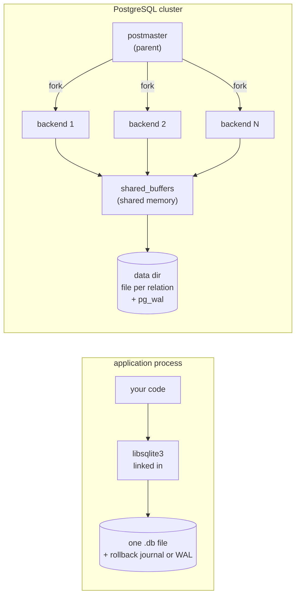

# PostgreSQL vs SQLite

> Same SQL surface, two architectures designed for different problems. Postgres is a server you connect to over a socket; SQLite is a library you link into your process. That single choice cascades into everything: storage layout, concurrency model, planner ambition, durability story.

## 1. Problem background

"Which one should I use?" is the wrong question — they aren't competing
for the same job.

- **SQLite** is what you reach for when the database has to *live inside*
  the application: a phone app, a browser, an embedded device, a single
  desktop tool. The whole engine is a `.so` you link into your binary.
  No daemon, no network hop, no separate process to manage.
- **PostgreSQL** is what you reach for when many things — possibly on
  different machines — need to read and write the same data at the same
  time. There is a server process that owns the data; clients talk to it
  over a socket; concurrency, query planning, and crash recovery are the
  server's problems.

Once you accept the deployment model is different, every downstream
choice (page size, locking granularity, fork-per-connection vs
single-process, WAL strategy) starts to make sense.

## 2. Architecture overview



| Aspect | SQLite | PostgreSQL |
|---|---|---|
| Runs where | In your process — function calls into the library | Separate `postgres` server you connect to |
| Concurrency model | One DB-wide writer at a time (WAL: readers OK in parallel) | Many concurrent writers via MVCC + row locks |
| Files on disk | One file (`.db`) + journal or WAL | One file *per relation*, plus `pg_wal/`, plus catalogs |
| Page size | 4 KB (default) | 8 KB (default) |
| Query plan flavour | Nested-loop joins driven by indexes; no parallelism | Cost-based, can pick parallel hash / merge joins |
| When you choose it | Embedded, single-user, no separate ops surface | Multi-user, networked, large data, durability SLAs |

## 3. Internal design

### 3.1 The page layout

Both engines lay rows out in fixed-size pages, but the geometry differs:

| | SQLite | PostgreSQL |
|---|---|---|
| Default page size | 4 KB | 8 KB |
| Pages in our `orders` setup | 2,104 | ~1,402 |
| File pattern | Whole DB in one file | One heap file per table; extra fork files for visibility map + free space map |

SQLite's whole database — every table, every index — lives in one file
because that's the only way to make atomic crash recovery work without a
DBA: the rollback journal is a sibling file, an `fsync()` flips a flag,
and on next startup SQLite either rolls forward or rolls back the entire
file.

Postgres has a server it can trust to clean up: a per-relation heap file
keeps each table independently sized, and a separate `pg_wal/` directory
streams every change as a log of records (LSNs). On crash recovery the
server replays WAL from the last checkpoint forward — heap pages can be
arbitrarily out of date with respect to the WAL, and that's fine.

### 3.2 Indexes

Both default to B-tree. The clustering choice is what changes:

- **SQLite** — `INTEGER PRIMARY KEY` makes the table itself a B-tree on
  `id` (the table *is* the clustered index). A PK lookup is just a tree
  walk, no extra hop. Non-PK indexes store `(key, rowid)` pairs and
  redirect.
- **PostgreSQL** — there is no clustered index. The heap is unordered;
  every index, even the primary key, stores `(key, ctid)` and hops into
  the heap. That's why a `bitmap heap scan` shows up in Postgres plans
  but never in SQLite.

### 3.3 Concurrency

This is the biggest behavioural split.

- **SQLite** locks the *file*. The progression is `UNLOCKED → SHARED →
  RESERVED → PENDING → EXCLUSIVE`, and only one writer can hold
  `EXCLUSIVE` at a time. In WAL mode readers don't block the writer and
  vice versa, but you still get exactly one writer.
- **PostgreSQL** uses MVCC. A writer never blocks a reader. Every row
  has `xmin` / `xmax` xid hidden columns, and a transaction's snapshot
  decides which versions are visible — see the
  [Internals doc](../PostgreSQL_Internals) for the proof under
  `pageinspect`.

### 3.4 Query planning

Run the same 3-table join in both:

```sql
SELECT p.category, SUM(o.qty * p.price_cents) AS revenue
FROM   orders o
JOIN   users    u ON u.id = o.user_id
JOIN   products p ON p.id = o.product_id
WHERE  u.country = 'IN'
GROUP  BY p.category
ORDER  BY revenue DESC;
```

| Engine | Plan it actually picks |
|---|---|
| SQLite | `SEARCH u USING idx_users_country` → `SEARCH o USING idx_orders_user` → `SEARCH p USING PK` → temp B-tree for GROUP BY. Nested-loop driven by the most selective filter. |
| Postgres | `Gather Merge` over `Finalize GroupAggregate` over a **parallel hash join** that builds a hash on `products`, then probes from a partial seq scan of orders joined to users. |

Same answer, totally different shape. Postgres has a parallel executor
and a cost-based planner that scores plans and picks one; SQLite has
neither. For small data this difference doesn't matter; for big data,
it's the whole game.

## 4. Trade-offs

| What you give up | What you get |
|---|---|
| SQLite gives up multi-writer concurrency | Zero ops. Drop the file on a phone. Ship it. |
| Postgres gives up "one file" simplicity | Many concurrent writers, parallel queries, replication, JSON/GIS/FTS extensions, fine-grained durability knobs |
| SQLite gives up a planner | Tiny binary (~1 MB), no surprises — what you write is essentially what runs |
| Postgres gives up "linked into my process" | A server you can sometimes connect to from another box, sometimes can't, depending on your network |

Neither is a "better database". Concurrency and ops surface are the axis
that picks for you.

## 5. Experiments / observations

The numbers below come from the `setup.sql` scripts in this repo against
the toy `users / products / orders` schema (see top-level
[README](../README.md)).

### File size on disk

| Engine | Total bytes | How they're spread |
|---|---|---|
| SQLite | **8.2 MB** (2,104 × 4 KB pages) | One file — `/tmp/demo.db` |
| Postgres | ~10 MB+ | Per-relation: `orders` heap ≈ 11 MB, `users` ≈ 1.2 MB, plus index forks |

`PRAGMA page_count;` shows SQLite with 2,104 pages; Postgres
`pg_relation_size('orders')` shows 1,402 heap pages × 8 KB ≈ 11 MB.
SQLite's smaller pages cost more pages per row but waste less on the
tail page when a relation is small.

### Q1 — 3-table join, group by category

| | Plan shape | Wall-clock | What's driving the cost |
|---|---|---|---|
| SQLite | nested loop, `idx_users_country` outer | ~10 ms | each of 4,000 IN-users probed against `idx_orders_user`, then PK on `products` |
| Postgres | parallel hash join, 1 worker launched | **19.8 ms** | hash table on `products`, probed by `users IN` join `orders` (also hashed) |

Postgres's planner could spend the cost-based budget exactly because
there's enough data to make a parallel hash worth the setup. SQLite's
plan is the right plan *for SQLite* — it doesn't have parallelism, so
nested-loop with the right outer side is best.

### Q2a — selective index lookup (`user_id = 12345`)

| | Plan | Time |
|---|---|---|
| SQLite | `SEARCH orders USING idx_orders_user` | sub-millisecond, 10 rows |
| Postgres | Bitmap Index Scan + Bitmap Heap Scan | **0.057 ms**, 10 rows, 11 buffers |

### Q2b — non-selective predicate (`qty = 3`, ~30% of table)

| | Plan | Time |
|---|---|---|
| SQLite | `SCAN orders` (full) | reads all 200k rows, ~3 ms |
| Postgres | **Parallel Seq Scan** + Finalize Aggregate | **7.4 ms**, 1,274 buffers, 2 workers |

Both correctly *refuse* to use any index here — the predicate is too
wide for an index to help. Postgres throws an extra worker at it because
it has one.

### Concurrency floor

Practical demonstration: two `sqlite3` shells opening the same file in
default journal mode — second writer blocks until the first commits.
Same setup in Postgres — both `BEGIN` and `UPDATE` happen at the same
wall-clock millisecond on different rows.

## 6. Key learnings

- **Architecture choice rules everything.** Whether the database is a
  daemon or a library decides page size, locking model, planner
  ambition, and ops surface. The SQL on top can look identical and the
  implementations are still doing fundamentally different jobs.
- **One file is a feature, not a limitation.** SQLite's "everything in
  one file" is what makes it deployable on a phone with zero DBA. You
  pay for it with single-writer concurrency, and that's a fair price for
  most embedded use cases.
- **The planner only matters when there's enough data.** Postgres beats
  SQLite on Q1 because the dataset is large enough for parallel hash to
  win; on Q2a both are sub-millisecond and the planner doesn't get a
  vote.
- **Same SQL ≠ same database.** Anyone teaching you "Postgres is just a
  bigger SQLite" is lying. MVCC vs file locks alone changes how you
  write application code.
