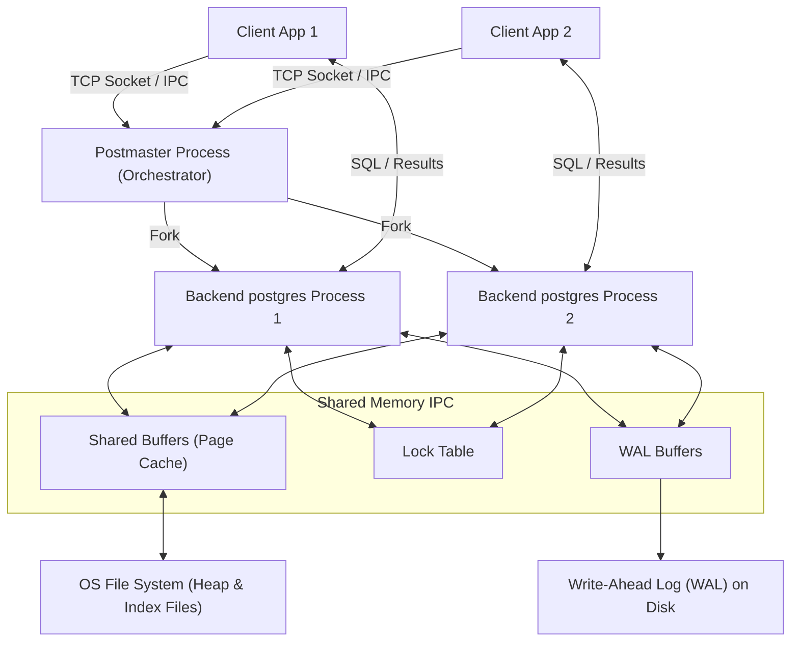
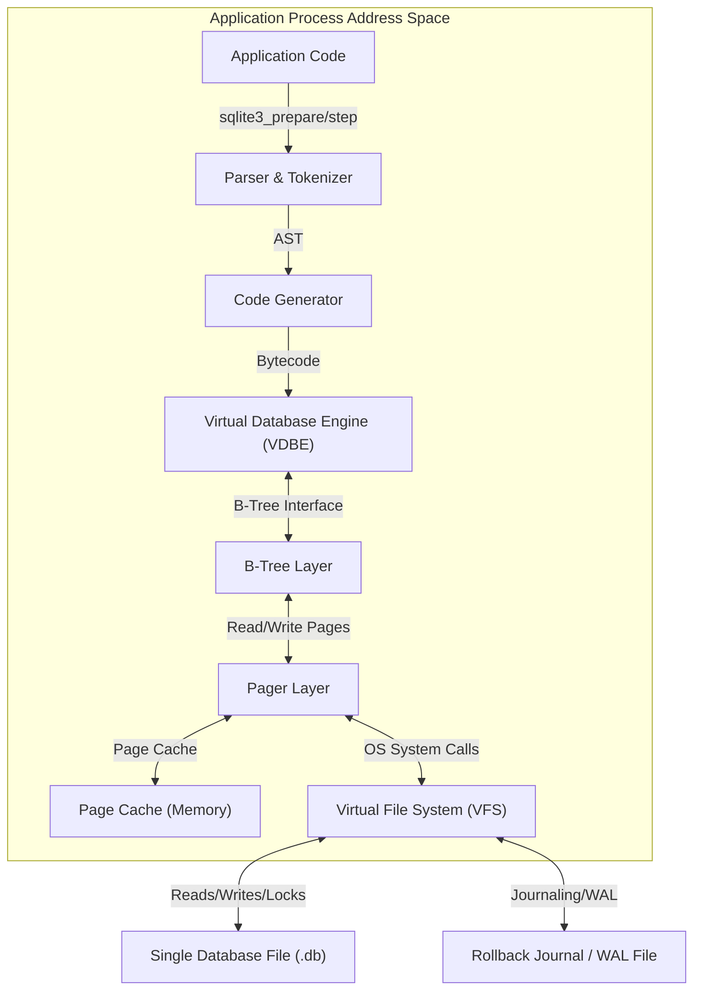

# System Design Discussion: PostgreSQL vs. SQLite Architecture Comparison

This document presents a comprehensive system design analysis comparing **PostgreSQL** and **SQLite**, analyzing their high-level architectures, internal layouts, concurrency models, transactional mechanisms, and design trade-offs.

---

## 1. Problem Background

### Why the Database Systems Exist
- **PostgreSQL**: PostgreSQL was designed to be a highly extensible, standards-compliant, and enterprise-grade object-relational database management system (ORDBMS). Originating from the POSTGRES project at UC Berkeley (led by Michael Stonebraker in 1986), it sought to address the limitations of existing relational database systems (like INGRES). Its primary goal was to provide complete support for object-relational features, extensible types, complex queries, and high concurrency in enterprise environments. It uses a client-server architecture where multiple clients connect to a server that manages the database files and transactions, making it ideal for multi-user, distributed, and large-scale applications.
- **SQLite**: SQLite was created by D. Richard Hipp in 2000 with the goal of developing an administrative-free, "zero-configuration" database engine that could run directly inside an application process. It was designed to replace custom file-based data structures or complex client-server engines in resource-constrained or embedded environments, delivering maximum reliability, portability, and simplicity.

### Historical Context & Target Workloads
- **PostgreSQL** emerged during the rise of client-server computing and enterprise web applications. It targets high-concurrency, multi-user, write-heavy, and distributed transactional workloads (OLTP) where data integrity, scalability, and advanced analytical capabilities are critical.
- **SQLite** emerged with the explosion of consumer software, mobile applications, and embedded devices. It targets single-user desktop applications, mobile apps (iOS/Android), IoT devices, test suites, and local file storage where minimal footprint and zero operational overhead are required.

---

## 2. Architecture Overview

### High-Level Architecture Diagrams

#### PostgreSQL Client-Server Architecture (Process-per-Connection)


#### SQLite Embedded Architecture (In-Process Library)


### Main System Components

#### PostgreSQL Components
- **Postmaster (Server Process)**: The master daemon process that initializes the server, allocates shared memory, listens for incoming connections, and forks a backend `postgres` process for each client connection.
- **Backend Processes (Postgres Workers)**: Independent processes that execute SQL commands, parse, optimize, compile, and execute plans for their respective client connection.
- **Shared Memory**: A region of memory accessible by all backend processes. It holds the **Shared Buffers** (page cache), **Lock Table** (locks for concurrency control), and **WAL Buffers** (staging area for log records).
- **Background Writers & Checkpointer**: Helper processes that asynchronously flush dirty pages to disk, prune WAL logs, and run vacuum operations.

#### SQLite Components
- **SQL Compiler**: Contains the Tokenizer, Parser (Lemon-parser generated), and Code Generator. It compiles SQL queries into VM bytecode.
- **Virtual Database Engine (VDBE)**: A register-based virtual machine that executes the generated bytecode. It is the component that interacts with the B-Tree layer to perform data manipulation.
- **B-Tree Layer**: Organizes database tables and indexes into B-Tree structures. SQLite uses **B+Trees** for tables (where key is a 64-bit integer rowid and values are stored in leaves) and standard **B-Trees** for indexes.
- **Pager**: Coordinates cache access, locking, transactions, and crash recovery. It manages the in-memory page cache and writes to disk via the VFS.
- **Virtual File System (VFS)**: An abstraction layer providing OS-independent interfaces for disk reads/writes, file locking, and system clock operations.

---

## 3. Internal Design

### Storage Structures

| Characteristic | PostgreSQL | SQLite |
| :--- | :--- | :--- |
| **Physical Organization** | Directory containing multiple files; each table and index has its own file(s), split into 1GB segments. | A single file containing the database schema, tables, and indexes. |
| **Large Attribute Storage** | **TOAST (The Oversized-Attribute Storage Technique)**: Compresses and splits large columns (e.g., text, bytea) into out-of-line storage in auxiliary tables. | **Overflow Pages**: Cells exceeding a specific payload threshold link to a chain of overflow pages. |
| **Row Storage Format** | **Heap Storage**: Unordered collection of pages containing tuple versions. | **B+Tree Storage**: Leaf nodes of the table B+Tree store actual data records sorted by rowid. |

### Memory Management

#### PostgreSQL
- Uses a centralized **Shared Buffer Pool** (default is usually 25% of system RAM) shared among all worker processes.
- Employs a clock-sweep replacement algorithm (a variant of Second Chance / LRU) to keep hot pages in memory.
- Backends also allocate private memory (`work_mem`) for sorting and hashing operations.

#### SQLite
- Uses an **in-process page cache** allocated within the application's heap space.
- Supports page cache configurations per database connection.
- Employs an LRU cache replacement algorithm. Since it executes in-process, it relies heavily on the operating system’s filesystem cache to optimize read operations across multiple application instances.

### Index Organization

#### PostgreSQL
- Supports a wide variety of index types including **B-Tree** (default), **Hash**, **GiST**, **GIN**, **SP-GiST**, and **BRIN**.
- The B-Tree implementation is based on the Lehman & Yao algorithm, allowing concurrent reads and writes with high performance by using "right-links" to handle page splits without locking parent nodes.

#### SQLite
- Supports **B-Tree** indexes only.
- Indexes are stored as B-Trees where the key is the user-defined index columns appended with the 64-bit integer `rowid`.
- Has no native support for advanced indexing models like GIN (for full-text search, though it has FTS extensions) or GiST (for spatial data, though it has R-Tree extensions).

### Transaction Processing & Concurrency Control

#### PostgreSQL (MVCC)
- Employs **Multi-Version Concurrency Control (MVCC)**.
- Every row header contains transactional metadata:
  - `xmin`: The transaction ID of the inserting transaction.
  - `xmax`: The transaction ID of the deleting/updating transaction.
- When an update occurs, the old tuple version remains in the heap (with its `xmax` set to the updating transaction ID) and a new tuple version is appended (with `xmin` set to the updating transaction ID).
- Transactions determine tuple visibility based on a comparison of their snapshot (list of active transactions at snapshot creation) with the tuple's `xmin` and `xmax`.
- Readers do not block writers, and writers do not block readers. Dead tuples are periodically cleaned up using the **VACUUM** engine.

#### SQLite (Lock-Based vs. WAL)
- **Rollback Journal Mode**:
  - Employs coarse-grained locking on the database file.
  - Lock states: `UNLOCKED` $\rightarrow$ `SHARED` $\rightarrow$ `RESERVED` $\rightarrow$ `PENDING` $\rightarrow$ `EXCLUSIVE`.
  - Multiple readers can hold `SHARED` locks. A writer acquires a `RESERVED` lock (allowing readers to continue but preventing other writers). To commit, the writer upgrades to `PENDING` (blocks new readers) and then `EXCLUSIVE` (blocks all readers) to write changes.
  - Readers block writers, and writers block readers.
- **WAL Mode**:
  - Implements Write-Ahead Logging.
  - Readers read snapshot pages from the main database file or the WAL file.
  - A single writer can append new pages directly to the end of the WAL file concurrently with multiple active readers.
  - Readers do not block writers, and writers do not block readers. However, write concurrency is still limited to a single connection at any given time.

### Durability Mechanisms

#### PostgreSQL
- Uses a **Write-Ahead Log (WAL)**. Every data modification is written to WAL buffers and flushed to disk (`fsync`) before the corresponding page in the shared buffer is modified on disk (Write-Ahead Logging protocol).
- Checkpoints periodically flush dirty pages to disk, minimizing recovery time.
- Crash recovery replays WAL records from the last checkpoint to reconstruct database state.

#### SQLite
- **Rollback Journal Mode**:
  - Before writing a modified page to the database file, the original page content is copied to a rollback journal file (`.db-journal`) and flushed to disk.
  - The modified pages are then written to the database file.
  - On commit, the rollback journal is deleted or truncated. If a crash occurs, the journal file remains, and the next connection replays it to restore the original pages.
- **WAL Mode**:
  - Changes are written directly to the WAL file (`.db-wal`).
  - Periodic checkpoints copy the pages from the WAL file back into the main database file.
  - An index file (`.db-shm`) is used in shared memory to allow readers to quickly search for pages in the WAL file.

---

## 4. Design Trade-Offs

### Advantages & Limitations

```
                      ┌─────────────────────────────────────────┐
                      │          POSTGRESQL (Server)            │
                      ├─────────────────────────────────────────┤
                      │ [+] Scalable to thousands of clients    │
                      │ [+] High-concurrency MVCC model         │
                      │ [+] Extensible (Types, GIN/GiST indexes)│
                      │ [─] High memory and connection overhead │
                      │ [─] Complex setup and administration    │
                      └─────────────────────────────────────────┘
                                           ▲
                                           │  (Architectural Split)
                                           ▼
                      ┌─────────────────────────────────────────┐
                      │           SQLITE (Embedded)             │
                      ├─────────────────────────────────────────┤
                      │ [+] Zero-configuration, single file     │
                      │ [+] Low memory / high local speed       │
                      │ [+] Direct VFS / low latency access     │
                      │ [─] Restricted concurrent writes        │
                      │ [─] Lacks advanced SQL / server roles   │
                      └─────────────────────────────────────────┘
```

### Key Trade-Off Matrix

| Dimension | PostgreSQL | SQLite |
| :--- | :--- | :--- |
| **Deployment Model** | Client-Server | Embedded (In-Process Library) |
| **Write Concurrency** | High (Row-level lock, multiple concurrent writes via MVCC) | Low (Single writer per database file) |
| **Connection Cost** | High (Process allocation or connection pooling required) | Virtually Zero (Function call invocation) |
| **Network Overhead** | Present (TCP socket / packet serialization latency) | Zero (In-process memory read/write) |
| **Extensibility** | High (Plugins, custom data types, procedurals) | Low (Requires C extensions or compile-time flags) |
| **Operational Overhead**| High (Requires installation, tuning, vacuuming, backups) | Zero (Zero-administration, single-file copies) |

---

## 5. Experiments / Observations

To empirically demonstrate the impact of these architectural decisions on SQLite performance, we executed a benchmark comparing SQLite in **Rollback Journal (DELETE)** mode vs. **Write-Ahead Log (WAL)** mode under both single-transaction (Single Insert) and batch-transaction (Bulk Insert) conditions, as well as a concurrent multi-threaded read/write test.

### Experimental Setup
- **Environment**: Python 3.11.15, SQLite 3.42.0
- **Storage Medium**: Local SSD
- **Tests**:
  1. **Single Insert Mode**: 500 individual insertions, each committed as a separate transaction.
  2. **Bulk Insert Mode**: 10,000 insertions committed within a single database transaction block.
  3. **Concurrency Test**: 1 writer thread and 3 concurrent reader threads executing query loops for 3 seconds.

### Benchmark Results

#### 1. Single Insert Mode (Individual Transactions - 500 records)
*Highlights the I/O disk sync overhead for transactional commits.*

| Journal Mode | Synchronous Mode | Total Duration (s) | Transactions Per Second (TPS) | Performance Speedup |
| :--- | :--- | :--- | :--- | :--- |
| **DELETE** | `FULL` | 1.1812 | 423.29 | Baseline |
| **DELETE** | `NORMAL` | 1.1051 | 452.44 | 1.07x |
| **WAL** | `FULL` | 0.1100 | 4,545.60 | **10.74x** |
| **WAL** | `NORMAL` | 0.0140 | **35,717.48** | **84.38x** |

#### 2. Bulk Insert Mode (Single Transaction - 10,000 records)
*Demonstrates performance when physical disk sync is amortized across thousands of writes.*

| Journal Mode | Synchronous Mode | Total Duration (s) | Transactions Per Second (TPS) |
| :--- | :--- | :--- | :--- |
| **DELETE** | `FULL` | 0.0305 | 328,264.72 |
| **DELETE** | `NORMAL` | 0.0172 | 581,976.41 |
| **WAL** | `FULL` | 0.0150 | 666,778.58 |
| **WAL** | `NORMAL` | 0.0130 | **769,371.19** |

#### 3. Concurrency Test (1 Writer, 3 Readers for 3 Seconds)
*Illustrates the block-level locking limitations vs. WAL concurrent snapshot execution.*

| Journal Mode | Total Reads | Total Writes | Read / Write Ratio | Lock Contention / Errors |
| :--- | :--- | :--- | :--- | :--- |
| **DELETE** (Rollback) | 892 | 1,134 | 0.79 | High (Locks serialized read/write loops) |
| **WAL** | **108,854** | **7,838** | **13.89** | **Zero** (Readers & writers run concurrently) |

### Analysis of Observations

1. **WAL Write Throughput**: 
   In Single Insert Mode, WAL mode with `synchronous=NORMAL` achieves **35,717.48 TPS**, an **84x increase** over DELETE mode with `synchronous=FULL`. This occurs because WAL mode writes transactions sequentially to the WAL log file and avoids rewriting the database B-Tree pages directly on every single commit. With `synchronous=NORMAL`, SQLite does not perform a physical write-sync (`fsync`) on the WAL file at every commit, relying instead on checkpoints to flush pages to the database file, which significantly accelerates execution while maintaining database consistency in the event of application crashes.
2. **Transaction Amortization**:
   In Bulk Insert Mode, when wrapping 10,000 writes inside a single transaction (`BEGIN TRANSACTION ... COMMIT`), the TPS metrics for all modes skyrocket into the hundreds of thousands. This emphasizes that disk synchronization overhead is the ultimate bottleneck for ACID compliance. By committing in a batch, only one disk sync call is executed at the end, eliminating the physical I/O bottleneck.
3. **Concurrency and Locking**:
   In DELETE mode, the total read operations are limited to **892** because write transactions hold exclusive locks that block readers, and read transactions block the writer. This forces both threads to wait on file locks. In WAL mode, the reader-writer blocking behavior is completely eliminated. Readers access a historical snapshot of the database file and WAL log, while the writer concurrently appends writes to the end of the WAL file. This results in **108,854 reads** and **7,838 writes** completed in the identical time frame (a **122x increase in read performance** and a **6.9x increase in write performance**).

---

## 6. Key Learnings

1. **Embedded vs. Server Architectural Split**: 
   SQLite is optimized to minimize latency inside a single process, making network round-trips non-existent. PostgreSQL, on the other hand, accepts network and process communication overheads to enable robust client isolation, enterprise scalability, and server-side compute resources.
2. **The Impact of Logging Protocols**: 
   The transition from Rollback Journals to WAL represents a fundamental trade-off: WAL increases write speed by substituting random-access page writes with sequential appends, but it introduces minor read complexity as readers must search the WAL file alongside the main database file to locate the newest page versions.
3. **ACID Durability Bottlenecks**: 
   ACID compliance is bounded by disk write latency. Batching writes into single transactions or tuning `fsync` barriers (using `synchronous=NORMAL`) yields order-of-magnitude performance gains, but developers must balance these settings against the risk of losing the most recent transactions in a power loss scenario.
4. **Concurrency Trade-Offs**: 
   For systems demanding high write concurrency across multiple clients, PostgreSQL's MVCC row-level locking engine is indispensable. For embedded systems with read-heavy workloads or low-frequency writes, SQLite's WAL mode delivers extreme throughput with zero administrative overhead.
