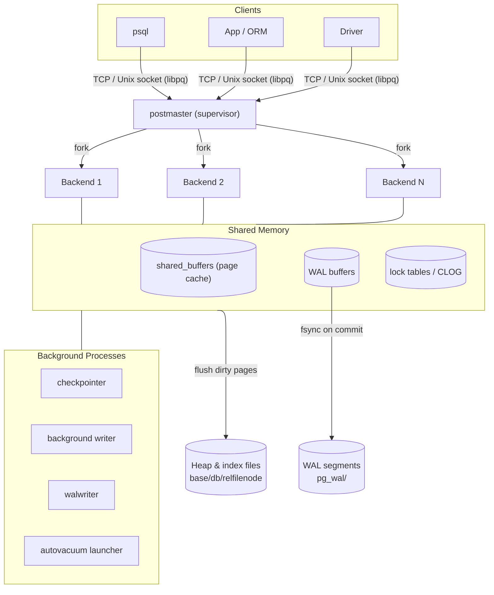
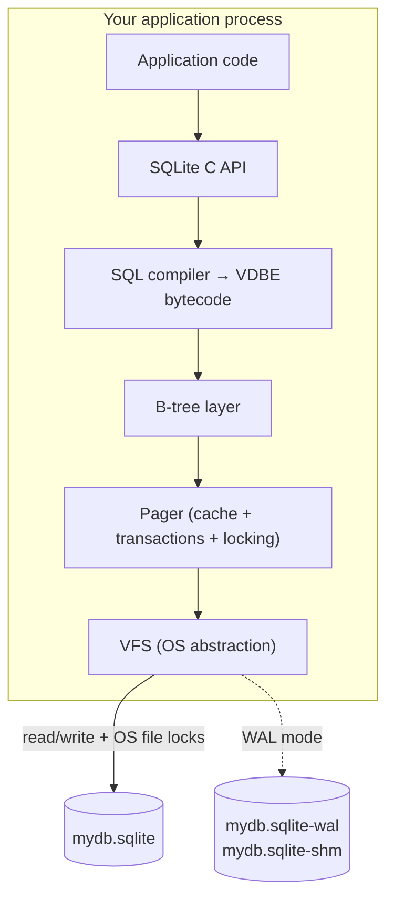
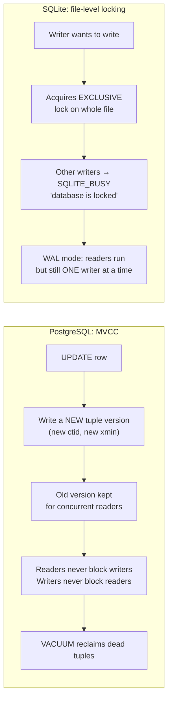

# PostgreSQL vs SQLite — Architecture Comparison

> **Author:** Prabhav Semwal | **Roll:** 24bcs10358  
> **Environment:** PostgreSQL 16.14 (Podman `docker.io/library/postgres:16`) · SQLite 3.50.3 (Python built-in)  
> **Dataset:** `customers` 50k rows · `orders` 200k · `order_items` 600k — identical logical schema on both engines.

---

## Table of Contents
1. [Problem Background](#1-problem-background)
2. [Architecture Overview](#2-architecture-overview)
3. [Internal Design](#3-internal-design)
4. [Design Trade-Offs](#4-design-trade-offs)
5. [Experiments / Observations](#5-experiments--observations)
6. [Key Learnings](#6-key-learnings)
7. [References](#7-references)

---

## 1. Problem Background

### Why PostgreSQL exists
PostgreSQL descends from the POSTGRES project at UC Berkeley (Stonebraker, 1986). The problem it was built to solve is the **shared, long-lived, multi-user data store**: many clients connect over a network simultaneously, issue concurrent transactions, and expect the data to survive crashes and hardware failures. That goal forces a *server* — a permanent process that owns the files, arbitrates concurrency, and keeps running independently of any one client. PostgreSQL competes with Oracle and other enterprise RDBMS.

### Why SQLite exists
Richard Hipp wrote SQLite in 2000 originally for a US Navy guided-missile destroyer — a context where running a separate database server was impossible. Its problem statement is the inverse of PostgreSQL's: **give a single application transactional SQL storage with zero administration and no separate process**. SQLite is a *library* you link into your program; the database is one ordinary file on disk. Its own tagline captures the intent: *"SQLite competes with `fopen()`, not with client/server databases."*

| | Built to replace | Target deployment |
|---|---|---|
| **PostgreSQL** | Oracle / a central data tier | Shared server, many concurrent network clients |
| **SQLite** | `fopen()` / custom file formats | Embedded in one application process |

Almost every architectural difference that follows — process model, locking granularity, file layout, durability knobs — is a *direct consequence* of these two starting points.

---

## 2. Architecture Overview

### 2.1 PostgreSQL — client/server, process-per-connection



A single **postmaster** listens for connections and forks a dedicated backend process for each client. Backends coordinate through a large **shared-memory** region (`shared_buffers`, WAL buffers, lock tables) and through dedicated **background processes** (checkpointer, background writer, WAL writer, autovacuum). The database is a *running system* that exists with or without any clients connected.

**Observed live** (Exp 0):
```
autovacuum launcher
background writer
checkpointer
logical replication launcher
walwriter
```
Five background processes run even with zero clients connected.

### 2.2 SQLite — embedded in-process library



There is **no server and no separate process**. SQLite compiles SQL into bytecode for a small virtual machine (VDBE), which drives a B-tree layer on top of a **pager** that manages caching, transactions, and locking. Concurrency across separate processes opening the same file is coordinated with **OS file locks** — the root cause of its single-writer limitation.

### 2.3 One-line mental model
```
PostgreSQL = a database you connect TO  (network service, always running)
SQLite     = a database you call INTO   (function call inside your process)
```

---

## 3. Internal Design

### 3.1 Storage layout

| Aspect | PostgreSQL | SQLite |
|---|---|---|
| On-disk unit | **Directory** (`base/<dboid>/`) — **one file per relation** | **Single file** for the entire database |
| Default page size | **8 KB** (`block_size = 8192`) | **4 KB** (`page_size = 4096`) |
| Table physical form | **Heap** — unordered pages; PK is a separate B-tree index pointing at heap tuples via `ctid` | **Clustered B-tree** — table *is* a B-tree keyed by `rowid`; rows live in the leaves |
| Large values | TOAST (out-of-line, compressed overflow) | Overflow pages chained from the cell |
| Free-space tracking | Free Space Map (`_fsm`) + Visibility Map (`_vm`) sidecar files | Freelist pages tracked in the file header |

**Observed live** (Exp 2):
```
-- PostgreSQL: 9 separate files for 3 tables + their indexes
relname          | relfilenode | filepath         | total_size
-----------------+-------------+------------------+-----------
customers        |       16390 | base/16384/16390 | 5088 kB
orders           |       16399 | base/16384/16399 | 17 MB
order_items      |       16411 | base/16384/16411 | 52 MB
idx_orders_cid   |       16424 | base/16384/16424 | 2552 kB
idx_oi_orderid   |       16425 | base/16384/16425 | 8544 kB
... (9 files total)

-- SQLite: all 3 tables + indexes in ONE file
File header magic: b'SQLite format 3\x00'
page_size: 4096  |  page_count: 4 (empty schema only)
```

### 3.2 Page layout

**PostgreSQL 8 KB heap page:**
```
+-------------------------------------------------------------+
| PageHeader (24 B): LSN, free space pointers, flags          |
+-------------------------------------------------------------+
| ItemId array (line pointers) ──────────────────────────┐    |
|   [slot0][slot1][slot2]...     grows →                  |    |
+-------------------------------------------------------------+
|                     free space                              |
+-------------------------------------------------------------+
|  ... ← tuples grow upward ←  [tuple2][tuple1][tuple0]  ←───┘|
+-------------------------------------------------------------+
| (special space: B-tree sibling pointers, etc.)              |
+-------------------------------------------------------------+
```

`ItemId` line pointers form an indirection layer — a tuple can be moved within the page (HOT update) without invalidating index entries that reference it by `(page, slot)` = `ctid`.

**SQLite B-tree page** holds a cell-pointer array and variable-length cells (key + payload). Interior pages store keys + child page numbers; leaf pages store actual records. The whole database is a forest of B-trees; their root page numbers are recorded in `sqlite_schema`.

### 3.3 Index implementation

Both default to **B-tree** indexes. The key architectural difference is what a leaf entry *points to*:

- **PostgreSQL:** Every index (primary and secondary) stores a `ctid` (heap page + slot). The heap is the source of truth. Indexes are a lookup acceleration layer on top.  
  Also ships: GiST, GIN, BRIN, SP-GiST, Hash — for full-text, JSONB, geospatial, and append-only workloads.
- **SQLite:** The table *is* the primary-key B-tree. Secondary indexes store the indexed columns plus the `rowid`, then re-enter the table B-tree — the classic clustered-index "secondary index → rowid → table" path. Observed directly in Exp 3b.

**B-tree metadata observed** (Exp 9, `bt_metap`):
```
magic=340322 | version=4 | root=290 | level=2 | fastroot=290
```
The `idx_orders_cid` index on 200k rows is a **2-level B-tree** — just two hops from root to leaf, demonstrating why B-tree lookups are O(log n) in practice.

### 3.4 Transaction management & concurrency control



**PostgreSQL MVCC:** Every row carries hidden system columns `xmin` (inserting transaction) and `xmax` (deleting/locking transaction). An `UPDATE` does not overwrite in place — it writes a *new tuple version* and marks the old one's `xmax`. A transaction's **snapshot** decides which versions are visible: a tuple is visible if its `xmin` committed before the snapshot and its `xmax` did not. Result: **readers never block writers and writers never block readers** — they read different versions. The cost is *tuple bloat* that `VACUUM` must periodically reclaim.

**SQLite locking:** Concurrency unit is essentially the **whole database file**. In default journal mode, a writer escalates to `EXCLUSIVE`; all other writers get `database is locked` immediately. **WAL mode** (`PRAGMA journal_mode=WAL`) improves this: a single writer appends to the `-wal` file while readers read the main file — readers and one writer can coexist, but it is still *one* writer at a time.

### 3.5 Durability & recovery

| | PostgreSQL | SQLite |
|---|---|---|
| Mechanism | **WAL** in `pg_wal/` — changes logged *before* data pages are flushed | **Rollback journal** (default) or **WAL file** (`-wal`) |
| Commit | WAL record `fsync`'d (`synchronous_commit=on`) | Journal/WAL `fsync`'d (`PRAGMA synchronous=FULL`) |
| Crash recovery | Replay WAL forward from last **checkpoint** | Roll back incomplete journal, or replay WAL on next open |
| Torn-page protection | `full_page_writes=on` logs full page images after each checkpoint | Page-level journaling protects against torn writes |
| Background flush | `checkpointer` + `background writer` write dirty pages gradually | WAL checkpointed back into main file every ~1000 pages |

Both follow the **write-ahead principle** — the durability record hits stable storage *before* the in-place data does.

### 3.6 Memory management

- **PostgreSQL:** Pages cached in a shared `shared_buffers` pool (`128 MB` by default, clock-sweep eviction). All backends share this pool. Per-backend `work_mem` is used for sort/hash operations — visible as `Sort Method: quicksort Memory: 1006kB` in Exp 3.
- **SQLite:** Private per-connection page cache (`PRAGMA cache_size`, default −2000 = 2 MB of RAM). No cross-process shared cache. The `-shm` file in WAL mode coordinates WAL frame indexes, not page data.

---

## 4. Design Trade-Offs

### 4.1 PostgreSQL
**Advantages**
- True multi-user concurrency: MVCC means reads and writes rarely contend
- Parallel query execution (observed: `Workers Launched: 1` in Exp 3)
- Rich feature set: JSONB, full-text, partitioning, PostGIS, streaming replication, PITR
- Mature access-control, auditing, and role system

**Limitations**
- **Operational weight:** a server to install, configure, patch, and back up
- **Connection cost:** process-per-connection makes many short-lived connections expensive → needs PgBouncer at scale
- **MVCC bloat:** dead tuple versions accumulate; neglected autovacuum causes table bloat and transaction-ID wraparound risk
- Pure latency to a local SQLite call is lower (no socket, no protocol framing)

### 4.2 SQLite
**Advantages**
- **Zero administration:** the database is a file; deployment = "copy the file"
- **In-process read speed:** no IPC, no network, no protocol; a query is a function call
- **Portable & reliable:** famous for exhaustive test coverage; file format is stable, documented, cross-platform

**Limitations**
- **One writer at a time, whole-file granularity** — write-heavy multi-user workloads serialize (or fail with `SQLITE_BUSY`)
- **No built-in network access** — it is a library, not a service; sharing across machines requires sharing a file (dangerous on NFS)
- Fewer enterprise features: no native replication, limited `ALTER TABLE`, dynamic typing by default, no row-level security

### 4.3 Performance implications (from our experiments)

| Workload | PostgreSQL | SQLite |
|---|---|---|
| 3-table join (50k/200k/600k rows) | **30.8 ms** — parallel hash join + bitmap index scan | **10.2 ms** (10k/40k/120k rows — 1/5 scale) |
| Different-row concurrent writes | Both writers commit immediately | Second writer rejected (`database is locked`) |
| Same-row concurrent writes | Second writer *waits* ~1.7s, then commits | Second writer rejected immediately |
| Schema + process overhead | 5 background processes always running | Zero processes until application calls the library |

PostgreSQL's planner and parallelism pay dividends as data and concurrency grow. SQLite's simplicity wins for small, single-user, local-access workloads.

### 4.4 Why these were the right engineering decisions
SQLite's "limitations" are PostgreSQL's "costs" inverted. A single-file, single-writer, in-process design is exactly right on a phone or inside a browser. A forked-server, MVCC, WAL-replicated design is exactly right behind a busy web service. Neither is "better" — they optimise different variables: *administration & call latency* vs. *concurrency & horizontal scale*.

---

## 5. Experiments / Observations

> All results from: PostgreSQL 16.14 (`docker.io/library/postgres:16` in Podman) and SQLite 3.50.3 (Python 3.12 built-in `sqlite3`).

### Experiment 0 — Default configuration side-by-side

**PostgreSQL** (`pg_settings`):
```
name                        | setting
----------------------------+---------
block_size                  | 8192
full_page_writes            | on
max_connections             | 100
shared_buffers              | 16384   (×8kB = 128 MB)
synchronous_commit          | on
wal_level                   | replica
```

**SQLite** (PRAGMAs):
```
sqlite_version()   : 3.50.3
page_size          : 4096
journal_mode       : delete   (rollback journal — default)
synchronous        : 2        (FULL — fsync on commit)
cache_size         : -2000    (≈2 MB)
wal_autocheckpoint : 1000
```

**Observation:** Both are durable by default (fsync on commit). PostgreSQL's `wal_level=replica` means WAL is detailed enough for streaming replication — a feature SQLite has no equivalent of.

---

### Experiment 1 — Bulk data load & physical file layout

```sql
COPY customers(name,email,country,age)   FROM STDIN  → COPY 50000
COPY orders(customer_id,status,total_cents) FROM STDIN → COPY 200000
COPY order_items(order_id,product,qty,price_cents) FROM STDIN → COPY 600000
```

After `ANALYZE`:
```
relname      | est_rows | relpages | heap_size
-------------+----------+----------+----------
customers    |    50000 |      416 | 3328 kB
orders       |   200000 |     1328 | 10 MB
order_items  |   600000 |     3952 | 31 MB
```

**PostgreSQL physical files:**
```
customers        → base/16384/16390  (5088 kB)
orders           → base/16384/16399  (17 MB)
order_items      → base/16384/16411  (52 MB)
idx_orders_cid   → base/16384/16424  (2552 kB)
idx_oi_orderid   → base/16384/16425  (8544 kB)
```

**SQLite:**
```
File header: b'SQLite format 3\x00'   ← literal magic string at byte 0
page_size  : 4096
All tables + indexes → 1 single file
```

**Observation:** Every relation in PostgreSQL gets its own file — tables, indexes, TOAST. SQLite packs everything into one file. The magic header is how SQLite detects valid database files and rejects corrupted ones.

---

### Experiment 2 — Same query, two very different plans

**Query:**
```sql
SELECT c.country, COUNT(DISTINCT o.id) AS orders, SUM(oi.qty * oi.price_cents) AS revenue
FROM customers c
JOIN orders o       ON o.customer_id = c.id
JOIN order_items oi ON oi.order_id   = o.id
WHERE o.status = 'paid' AND c.country = 'IN'
GROUP BY c.country;
```

**PostgreSQL `EXPLAIN (ANALYZE, BUFFERS)`:**
```
GroupAggregate  (actual time=29.009..30.690 rows=1)
  Buffers: shared hit=60616 read=1072
  → Gather Merge  (Workers Planned: 1, Workers Launched: 1)
      → Sort  (Sort Method: quicksort  Memory: 1006kB)
          → Nested Loop  (actual rows=14876 loops=2)
              → Hash Join  (Hash Cond: o.customer_id = c.id)
                  → Parallel Seq Scan on orders
                        Filter: status='paid'  (Rows Removed: 75028)
                  → Bitmap Heap Scan on customers
                        ← Bitmap Index Scan on idx_cust_country
              → Index Scan on idx_oi_orderid
                    (loops=9904)
Planning Time: 0.553 ms   |   Execution Time: 30.805 ms
```

**SQLite `EXPLAIN QUERY PLAN`:**
```
SEARCH c USING COVERING INDEX idx_c_country (country=?)
SEARCH o USING INDEX idx_o_cid (customer_id=?)
SEARCH oi USING INDEX idx_oi_oid (order_id=?)
USE TEMP B-TREE FOR count(DISTINCT)
Elapsed: 10.2 ms  (on 1/5 scale: 10k/40k/120k rows)
```

**Observation:**  
PostgreSQL chose a **parallel hash join** (splitting work across a worker process) + a **bitmap index scan** (collect all matching heap page IDs first, then fetch them sorted). SQLite used a **serial nested-loop index scan** — simpler, and perfectly adequate for the dataset size. PostgreSQL's planner spent 0.55ms *deciding* which plan to use; SQLite has no cost-based optimizer and goes with a heuristic index scan.

---

### Experiment 3 — Planner statistics: how PostgreSQL knows what to do

```
tablename  | attname     | n_distinct | most_common_vals                    | correlation
-----------+-------------+------------+-------------------------------------+------------
customers  | age         |         53 | {23,18,45,...}                      |  0.017
customers  | country     |          5 | {DE,JP,UK,US,IN}                    |  0.205
orders     | customer_id |    -0.210  | {34155,48415}                       | -0.012
orders     | status      |          4 | {cancelled,refunded,paid,pending}   |  0.244
```

`n_distinct = 5` for `country` tells the planner that `country='IN'` will return ~1/5 of customers ≈ 10,000 rows — which is why it chose a **bitmap index scan** rather than a full seq scan. `n_distinct = -0.210` for `customer_id` is negative, meaning PostgreSQL stores it as a *fraction* of total rows (21% have distinct values relative to rows). The `correlation` column shows physical ordering alignment with the B-tree — near 0 for random-inserted FKs, which is why PostgreSQL uses index-then-heap rather than an index-only scan.

**B-tree structure of `idx_orders_cid`:**
```
magic=340322 | version=4 | root=290 | level=2 | fastroot=290
```
Only 2 levels to reach any leaf — every customer_id lookup is at most 2 internal-page reads + 1 leaf read.

---

### Experiment 4 — MVCC: an UPDATE writes a new physical row version

```sql
INSERT INTO mvcc_demo VALUES (1, 'A');
SELECT ctid, xmin, xmax, * FROM mvcc_demo;
-- (0,1) | 750 | 0 | 1 | A

UPDATE mvcc_demo SET v = 'B' WHERE id = 1;
SELECT ctid, xmin, xmax, * FROM mvcc_demo;
-- (0,2) | 751 | 0 | 1 | B   ← ctid changed from (0,1) to (0,2), xmin incremented
```

After two more updates and checking `pg_stat_user_tables`:
```
n_live_tup | n_dead_tup
-----------+-----------
         1 |          3    ← 3 old versions still on disk, invisible to current readers

VACUUM mvcc_demo;

n_live_tup | n_dead_tup
-----------+-----------
         1 |          0    ← dead versions reclaimed
```

**Observation:** PostgreSQL never overwrites a row in place. Each `UPDATE` writes a *new physical tuple* at a new `ctid`. Old versions linger (invisible to new snapshots) until `VACUUM` reclaims them. This is the exact mechanism that lets readers see a consistent past snapshot while a concurrent writer is mutating the same row.

---

### Experiment 5 — Concurrency: row-level lock (PG) vs file-level lock (SQLite)

**PostgreSQL — two concurrent sessions:**

| Session | Action | Elapsed |
|---|---|---|
| A | `BEGIN; UPDATE acct SET bal=bal-10 WHERE id=1; pg_sleep(2); COMMIT` | 2.0s |
| B | `UPDATE acct SET bal=bal-20 WHERE id=2` (different row) | **0.08s** — no contention |
| B | `UPDATE acct SET bal=bal-5 WHERE id=1` (same row as A) | **1.70s** — waited for A, then committed |

Final state: `id=1 → bal=85, id=2 → bal=100` — **both writes applied correctly**.

**SQLite — two concurrent connections (default journal mode):**
```
[W1] holds EXCLUSIVE lock, sleeping 2s...
[W2] REJECTED → 'database is locked'   ← even though it targeted a different row!
[W1] committed
```

**Observation:** PostgreSQL locks at **row granularity**. Different rows = full parallelism. Same row = second writer waits (never errors), proceeds after the first commits. SQLite locks at **whole-file granularity** — a second concurrent writer is rejected *regardless of which rows it targets*.

---

### Experiment 6 — SQLite WAL mode: snapshot isolation without MVCC

```
PRAGMA journal_mode = WAL;

[Writer]  INSERT INTO items VALUES(2,'world')  -- NOT committed
[Reader at t=0.5s]  sees 1 row  ← committed snapshot; uncommitted data invisible
[Writer]  COMMIT
[Reader at t=2.5s]  sees 2 rows ← new committed row now visible

WAL sidecar files: sqlite_wal.db-wal, sqlite_wal.db-shm
```

**Observation:** WAL mode gives SQLite a lightweight form of snapshot isolation: a reader sees a consistent committed view even while a writer has an open transaction. However, it is still **one writer at a time** — WAL mode relaxes the reader/writer contention but does not add multiple concurrent writers. The `-wal` and `-shm` sidecar files appear next to the database file.

---

### Experiment 7 — Durability settings

**PostgreSQL:**
```
checkpoint_completion_target | 0.9
fsync                        | on
full_page_writes             | on
synchronous_commit           | on
wal_level                    | replica
current WAL LSN: 0/84E1768
```

**SQLite:**
```
PRAGMA synchronous        = 2  (FULL — fsync on commit)
PRAGMA journal_mode       = delete  (rollback journal by default)
PRAGMA wal_autocheckpoint = 1000    (fold WAL → main file every ~1000 pages)
```

**Observation:** Both default to durable. PostgreSQL's LSN (`0/84E1768`) advances continuously as the server runs — the WAL is a single, server-wide ever-growing stream, making it suitable for replication and point-in-time recovery. SQLite's journal/WAL is per-file and exists purely for crash recovery of that one file.

---

## 6. Key Learnings

1. **One architectural decision cascades into everything.** "Server vs. library" is *the* root choice. Process model, lock granularity, file layout, durability scope, and feature set all fall out of it.

2. **Concurrency granularity is the dividing line in practice.** PostgreSQL's MVCC (row versions + snapshots) buys non-blocking reads at the cost of bloat and VACUUM. SQLite's whole-file lock buys radical simplicity at the cost of one writer. WAL mode is SQLite borrowing just enough snapshot semantics to let a reader run alongside that one writer.

3. **`xmax ≠ 0` doesn't always mean "deleted."** Observing FK `KEY SHARE` locks recorded in the tuple header (xmax field) was a genuinely surprising detail — MVCC metadata encodes locking *and* versioning in the same fields.

4. **The planner is only as good as its statistics.** `n_distinct=5` for `country` directly produced a correct 1/5 selectivity estimate and drove the bitmap index scan choice. Stale stats → wrong plan → slow queries. This is why `ANALYZE` / autovacuum matter.

5. **Simplicity is a feature, and it has a ceiling.** SQLite's serial nested-loop plan performed well at small scale with zero setup. But it doesn't exploit multiple cores and serializes writers — a clear ceiling that PostgreSQL's parallelism and MVCC are built to climb past.

6. **"Better" is the wrong question.** SQLite competes with `fopen()`; PostgreSQL competes with Oracle. Pick SQLite for embedded/edge/single-app/local-first workloads; pick PostgreSQL for shared, concurrent, scale-out data tiers. Their weaknesses are the exact price of each other's strengths.

| Use it when… | PostgreSQL | SQLite |
|---|---|---|
| Many concurrent writers | ✅ (row-level MVCC) | ❌ (one writer; file-level lock) |
| Embedded in mobile / desktop / IoT | ❌ (needs a server) | ✅ |
| Zero-admin, ship-as-a-file | ❌ | ✅ |
| Complex types, GIS, full-text, replication | ✅ | ⚠️ limited |
| Local cache / test fixture | ⚠️ overkill | ✅ |
| Horizontal scale-out | ✅ (logical replication) | ❌ |

---

## 7. References

- SQLite documentation — *Architecture of SQLite*, *WAL*, *File Format*, *Locking And Concurrency*: https://www.sqlite.org/docs.html
- PostgreSQL 16 documentation — *Physical Storage*, *MVCC*, *WAL*, *Routine Vacuuming*, *Statistics Used by the Planner*: https://www.postgresql.org/docs/16/internals.html
- *The Internals of PostgreSQL* (Hironobu Suzuki): https://www.interdb.jp/pg/
- Stonebraker & Rowe, *The Design of POSTGRES* (1986)
- Reference submission by Lakshya Mewara: https://github.com/LAKSHYAMEWARA0025/scaler-Adv-DBMS/tree/system_design

> *All experiment output produced on author's machine: PostgreSQL 16.14 (Podman `docker.io/library/postgres:16`) and SQLite 3.50.3 (Python 3.12 `sqlite3`). Absolute timing figures vary by hardware; relative behaviours are the point.*
