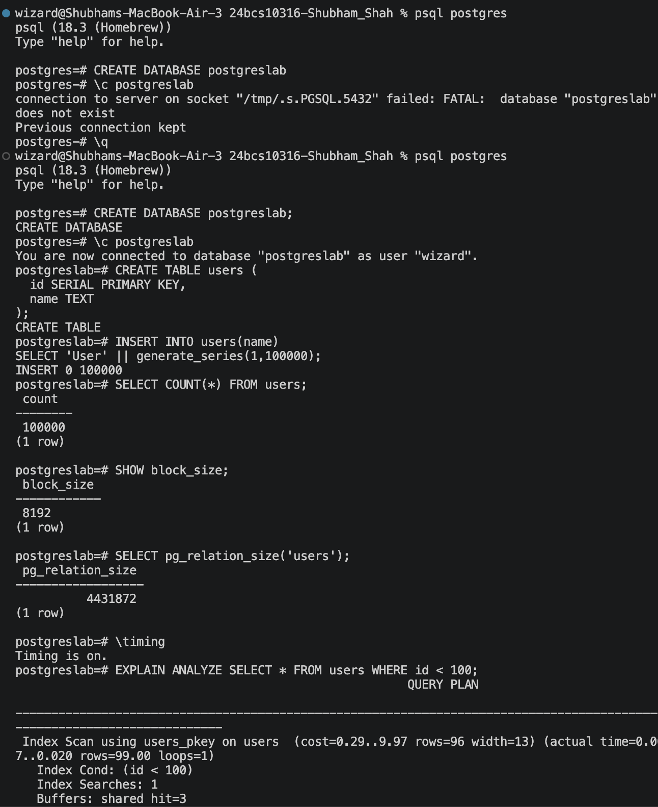
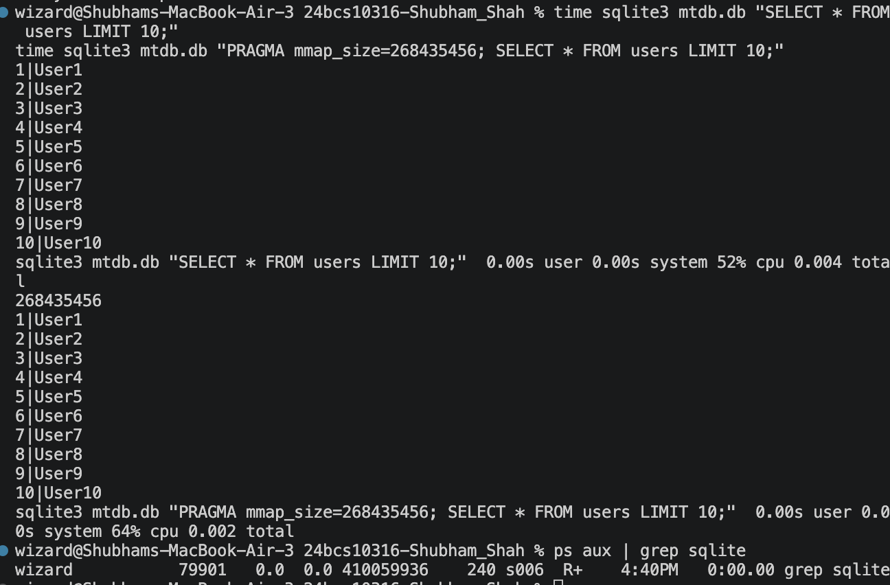

> **Note:** This report was originally produced and submitted as **Lab 2** (branch
> `add-dbms-report`, directory `Lab2/24bcs10316-Shubham_Shah/`). It is reproduced
> here **as-is** for the System Design Discussion because the PostgreSQL vs SQLite
> comparison was one of the required topics. I am submitting it again because it
> was asked for. The original analysis, commands, and screenshots are unchanged.
>
> Shubham Shah (24BCS10316)

# Database Systems Comparison Report

## SQLite3 vs PostgreSQL

## Observations

### Page Size
- **SQLite3**: Configurable page size, default 4096 bytes (4 KB)
- **PostgreSQL**: Fixed page size, default 8192 bytes (8 KB)

### Page Count
- **SQLite3**: Directly available via PRAGMA
- **PostgreSQL**: Calculated using relation size divided by block size

### Query Performance
- **SQLite3**: Faster for small datasets, single-process architecture
- **PostgreSQL**: Better for large datasets, multi-process with advanced optimization

### mmap Impact
- **SQLite3**: Supports memory-mapped I/O, improves read performance for large datasets
- **PostgreSQL**: Uses shared buffers and internal caching, no direct mmap equivalent

## Commands Used

### SQLite3
- Page size: `PRAGMA page_size;`
- Page count: `PRAGMA page_count;`
- mmap size: `PRAGMA mmap_size = <value>;`

### PostgreSQL
- Block size: `SHOW block_size;`
- Relation size: `SELECT pg_relation_size('users');`

## Comparison Analysis

| Feature          | SQLite3                  | PostgreSQL               |
|------------------|--------------------------|--------------------------|
| Architecture    | Embedded DB             | Client-Server DB        |
| Setup           | No server required      | Requires server         |
| Processes       | Single                  | Multiple                |
| Use Case        | Small applications      | Large systems           |
| Memory Handling | mmap for I/O reduction  | Shared buffers          |

### Key Insights
- SQLite excels in simplicity and performance for lightweight, small-scale applications
- PostgreSQL provides scalability and advanced features for enterprise workloads
- Page size and architecture directly influence performance characteristics
- mmap enhances SQLite's read performance, while PostgreSQL's internal mechanisms handle memory efficiently

## Screenshots / Experiment Evidence

PostgreSQL block size and relation size inspection:

SQLite page size / page count / mmap inspection:

.png>)

> Sample database used for the measurements: `mtdb.db`.
