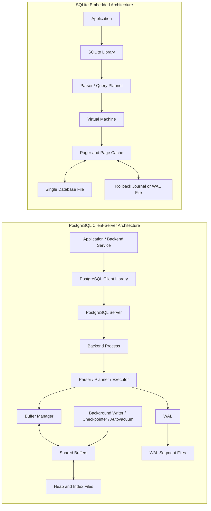
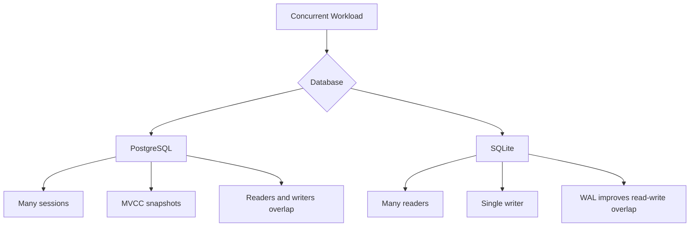

# PostgreSQL vs SQLite Architecture Comparison

**Name:** Aparna Singha  
**Roll Number:** 24BCS10353  

---

## 1. Problem Background

PostgreSQL and SQLite are both relational database systems, but they are designed with very different system goals.

PostgreSQL is a full client-server relational database management system. It is built for production applications where many users, services, or backend processes connect to the same database concurrently. Its design focuses on correctness, strong SQL support, concurrency, durability, scalability, extensibility, and centralized database administration.

SQLite is an embedded relational database engine. It does not run as a separate database server. Instead, the SQLite engine is linked directly into the application, and the application reads and writes a local database file. SQLite is designed for simplicity, portability, low configuration, and reliable local storage.

The architectural difference comes from the target environment:

- PostgreSQL assumes the database is a shared service.
- SQLite assumes the database belongs directly to one application.
- PostgreSQL optimizes for concurrent multi-user access.
- SQLite optimizes for local, lightweight, serverless usage.

This comparison is important because both systems use SQL, tables, indexes, pages, and transactions, but their internal architecture leads to very different trade-offs.

---

## 2. Architecture Overview

PostgreSQL uses a **client-server architecture**, while SQLite uses an **embedded/serverless architecture**.

In PostgreSQL, the application sends SQL queries to a PostgreSQL server. The server is responsible for parsing, planning, execution, memory management, transaction control, locking, WAL, background processes, and storage.

In SQLite, the application directly calls the SQLite library. SQLite executes SQL inside the application process and reads/writes the database file through its pager and file system layer.



### Query Flow Comparison

| Stage | PostgreSQL | SQLite |
|---|---|---|
| Query entry | Sent through client connection | Function call into SQLite library |
| Process boundary | Separate server process | Same process as application |
| Parsing | Server backend parses SQL | SQLite library parses SQL |
| Planning | Cost-based planner uses table statistics | Lightweight planner selects access path |
| Execution | Executor reads heap/index pages through buffer manager | SQLite virtual machine executes bytecode |
| Caching | Shared buffers managed by PostgreSQL | Page cache inside SQLite |
| Durability | WAL segment files | Rollback journal or WAL file |
| Deployment | Needs database server | Single database file and library |

---

## 3. Internal Design

## 3.1 Process Model

PostgreSQL has a server process model. The server accepts client connections and uses backend processes to handle sessions. Background processes handle maintenance tasks like checkpointing, WAL writing, background writing, and autovacuum.

SQLite has no server process. The database engine runs inside the application process. This removes network and server management overhead but also limits how much concurrency SQLite can support compared to PostgreSQL.

| Aspect | PostgreSQL | SQLite |
|---|---|---|
| Server process | Yes | No |
| Application access | Through client connection | Through library calls |
| Background workers | Yes | No separate DB workers |
| Network access | Built-in | Not directly; application must provide it |
| Operational model | Managed database service | Local file-based database |

### Design Impact

PostgreSQL's process model is more complex, but it allows many clients to share one database safely. SQLite's model is simpler and faster to embed, but it is not intended to act as a central database server for many applications.

---

## 3.2 Storage Engine and File Organization

PostgreSQL stores data inside a database cluster directory. Tables, indexes, WAL files, transaction status files, and metadata are stored across different files and directories.

SQLite usually stores the entire database in a single `.db` file. Extra temporary files may exist depending on journaling mode, such as rollback journal files or WAL files.

| Storage Area | PostgreSQL | SQLite |
|---|---|---|
| Main table data | Heap relation files | B-tree pages inside one database file |
| Index data | Separate index relation files | Index B-trees inside same database file |
| Transaction log | WAL segment files | Rollback journal or WAL file |
| Metadata | System catalogs | SQLite schema tables |
| Portability | Requires cluster directory | Single database file is easy to copy |

PostgreSQL is better for managed server environments. SQLite is better when the database should be portable as a file.

---

## 3.3 Table Storage and Page Layout

PostgreSQL stores table rows in heap pages. A heap page contains a page header, item identifiers, free space, and tuple data. Each tuple includes MVCC metadata such as transaction IDs.

SQLite stores data in pages inside the database file. Tables and indexes are represented using B-trees. SQLite rowid tables are stored as table B-trees where the key is usually the rowid.

| Feature | PostgreSQL | SQLite |
|---|---|---|
| Common page size | 8 KB by default | Configurable page size stored in DB header |
| Table organization | Heap storage | B-tree based table storage |
| Row version metadata | Stored in tuple header | Managed through pager/journal and row structure |
| Index relation | Separate from heap | Stored as B-tree inside same DB file |

---

## 3.4 Index Implementation

Both databases commonly use B-tree indexes, but the relationship between table data and index data differs.

In PostgreSQL, a B-tree index stores keys and tuple identifiers pointing to heap tuples. The table data remains in heap storage. This means an index scan often requires an extra heap access, unless an index-only scan is possible.

In SQLite, tables and indexes are B-tree based inside the same database file. A secondary index stores indexed values and references to rowids or primary keys. Covering indexes can satisfy queries without accessing the table B-tree.

### Index Trade-off

PostgreSQL's separate heap and index design gives flexibility and supports MVCC tuple versioning cleanly. SQLite's file-based B-tree design keeps the database compact and simple for embedded usage.

---

## 3.5 Transaction Management

PostgreSQL supports ACID transactions using MVCC and WAL. Updates create new tuple versions. Old versions remain until they are no longer needed and are later cleaned by VACUUM.

SQLite also supports ACID transactions. It uses rollback journal mode or WAL mode to maintain atomicity and durability. Its transaction system is reliable, but it has a simpler concurrency model.

| Transaction Feature | PostgreSQL | SQLite |
|---|---|---|
| ACID transactions | Yes | Yes |
| Multi-version reads | MVCC | Snapshot behavior with journaling/WAL |
| Write concurrency | Stronger | Limited single-writer model |
| Crash recovery | WAL replay | Rollback journal or WAL recovery |
| Cleanup requirement | VACUUM for dead tuples | Checkpointing/journal cleanup |

---

## 3.6 Concurrency Control

PostgreSQL is designed for high concurrency. MVCC allows readers and writers to avoid blocking each other in many cases. Each transaction sees a consistent snapshot based on transaction visibility rules.

SQLite supports many readers but only one writer at a time. WAL mode improves concurrency because readers can continue while a writer appends to the WAL, but only one writer can write at a time.



### Main Concurrency Trade-off

PostgreSQL accepts more internal complexity to support many concurrent sessions. SQLite keeps concurrency simple because it is mainly designed for local application storage.

---

## 3.7 Durability and Recovery

PostgreSQL uses Write-Ahead Logging. Before a changed data page is relied upon, the WAL record describing that change is written. If a crash happens, PostgreSQL replays WAL to restore committed changes.

SQLite uses rollback journaling or WAL mode. In rollback journal mode, old page content is saved so changes can be undone if a transaction fails. In WAL mode, changes are appended to a WAL file and later checkpointed back into the main database file.

| Durability Mechanism | PostgreSQL | SQLite |
|---|---|---|
| Main method | WAL | Rollback journal or WAL |
| Crash recovery | WAL replay | Journal rollback or WAL replay |
| Commit behavior | WAL flush based on settings | Journal/WAL sync based on settings |
| Recovery scope | Server database cluster | Local database file |

---

## 4. Design Trade-Offs

| Aspect | PostgreSQL | SQLite | Trade-off |
|---|---|---|---|
| Architecture | Client-server | Embedded library | PostgreSQL supports shared services; SQLite is simpler |
| Deployment | Requires server setup | No server required | SQLite is easier to start |
| Storage | Multi-file database cluster | Mostly single DB file | SQLite is more portable |
| Concurrency | MVCC, many sessions | Many readers, one writer | PostgreSQL handles concurrent writes better |
| Query planning | Advanced cost-based planner | Lightweight planner | PostgreSQL better for complex workloads |
| Administration | Roles, configs, monitoring | Minimal admin | PostgreSQL is powerful but operationally heavier |
| Durability | WAL and crash recovery | Journal/WAL based recovery | Both durable, PostgreSQL richer for server recovery |
| Scaling | Better for web/backend systems | Better for local apps | Different target environments |
| Best use case | Multi-user production DB | Embedded/local DB | Use case decides choice |

### PostgreSQL is Better When

- Many clients access the database.
- Complex queries and joins are common.
- Strong concurrency is needed.
- Centralized administration is required.
- Database size and workload may grow.
- Replication, backups, and monitoring are important.

### SQLite is Better When

- The database is local to one application.
- Setup should be zero or minimal.
- Data should be stored in a portable file.
- The workload is mostly local reads and light writes.
- The application is mobile, desktop, embedded, or test-oriented.

---

## 5. Experiments / Observations

These examples are written as observations that can be performed. No fake benchmark result is assumed.

### 5.1 PostgreSQL Query Planning

```sql
EXPLAIN ANALYZE
SELECT *
FROM users
WHERE email = 'test@example.com';
```

Expected observation:

PostgreSQL shows the selected query plan, estimated cost, actual timing, and whether it used an index scan or sequential scan. This demonstrates that PostgreSQL has a cost-based optimizer.

### 5.2 SQLite Query Planning

```sql
EXPLAIN QUERY PLAN
SELECT *
FROM users
WHERE email = 'test@example.com';
```

Expected observation:

SQLite shows whether it will scan the table or use an index. This demonstrates that SQLite also performs query planning, but in a lighter embedded engine.

### 5.3 SQLite Single File Behavior

```bash
sqlite3 app.db
.tables
ls -lh app.db
```

Expected observation:

The database exists as a local `.db` file. This shows why SQLite is easy to move, copy, backup, and embed.

### 5.4 PostgreSQL Multi-Session Behavior

Open two PostgreSQL sessions.

Session 1:

```sql
BEGIN;
UPDATE users SET name = 'Aparna' WHERE id = 1;
```

Session 2:

```sql
SELECT * FROM users WHERE id = 1;
```

Expected observation:

Depending on isolation and commit state, the second session sees a consistent committed version. This demonstrates MVCC behavior.

### 5.5 SQLite Write Limitation Observation

Open two SQLite sessions and attempt concurrent writes.

Expected observation:

SQLite allows many readers but has limited concurrent writer behavior. This demonstrates the simplicity and limitation of SQLite's concurrency model.

---

## 6. Key Learnings

PostgreSQL and SQLite show how database architecture is shaped by system requirements.

PostgreSQL is not just a SQL parser and storage file. It is a complete database server with process management, shared buffers, WAL, MVCC, background workers, permissions, and query optimization. This makes it suitable for large multi-user systems.

SQLite is not a weaker PostgreSQL. It is a different design optimized for embedded storage. Its single-file architecture, low setup cost, and in-process execution make it excellent for local applications.

The main learning is that every database system optimizes for a context. PostgreSQL chooses scalability and concurrency at the cost of operational complexity. SQLite chooses simplicity and portability at the cost of server-level concurrency.

---

## 7. References

1. PostgreSQL Documentation: https://www.postgresql.org/docs/
2. PostgreSQL MVCC: https://www.postgresql.org/docs/current/mvcc.html
3. PostgreSQL WAL: https://www.postgresql.org/docs/current/wal.html
4. PostgreSQL Indexes: https://www.postgresql.org/docs/current/indexes.html
5. SQLite Documentation: https://www.sqlite.org/docs.html
6. SQLite File Format: https://www.sqlite.org/fileformat2.html
7. SQLite WAL: https://www.sqlite.org/wal.html
8. SQLite Appropriate Uses: https://www.sqlite.org/whentouse.html