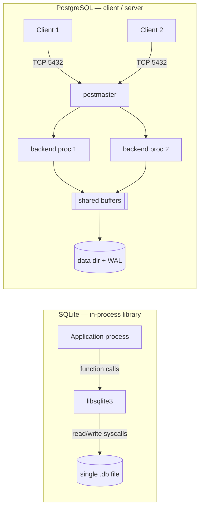

# PostgreSQL vs SQLite — Architecture Comparison

> System Design Discussion · Advanced DBMS · roll `24BCS10130`
> Measured on PostgreSQL 17.9 and SQLite 3.51. Commands and raw output: [`../experiments`](../experiments).

## 1. Problem Background

Both PostgreSQL and SQLite are mature, ACID-compliant relational databases that
speak SQL — yet they are built for almost opposite situations. The reason is a
single early architectural decision: **who owns the data file and how many
processes touch it at once.**

- **SQLite** (2000) was written so that an application could embed a SQL engine
  with *zero* operational footprint — no server to install, configure, or keep
  running. It targets the device the app runs on.
- **PostgreSQL** (descended from POSTGRES, 1986) was built as a multi-user
  database server: many clients connect over the network and read and write
  concurrently, with the server arbitrating access.

Comparing them is the cleanest way to see how one decision — *embedded library*
vs *client–server* — propagates into storage, concurrency, and durability.

## 2. Architecture Overview



| | SQLite | PostgreSQL |
|---|---|---|
| Process model | Library linked into the app | Separate server (`postmaster` + one backend process per connection) |
| Communication | Direct C function calls | TCP / Unix socket, wire protocol |
| Storage | One `.db` file | A *data directory*: one file per table/index + WAL + catalogs |
| Memory | Per-connection page cache; OS page cache | Shared buffer pool (`shared_buffers`) across all backends |
| Concurrency | One writer at a time (DB- or WAL-level) | MVCC: many readers + writers truly concurrent |
| Auth | OS file permissions | Roles, passwords, SSL, `pg_hba.conf` |

**Data flow (a `SELECT`):** In SQLite the call stays inside the process — the
library translates SQL to bytecode (the VDBE), reads pages from the `.db` file
(or the OS page cache), and returns rows by function return. In PostgreSQL the
query crosses a process boundary: the client sends SQL over the socket, a
dedicated backend parses → plans → executes it against shared buffers (faulting
pages in from disk on a miss), and streams rows back over the protocol.

## 3. Internal Design

### Storage layout
Both store data as fixed-size **pages**, but with different defaults (both
measured): SQLite `page_size = 4096`, PostgreSQL `block_size = 8192`. The deeper
difference is file organisation:
- SQLite packs *everything* — every table and index — into **one file**, as a set
  of 4 KB B-tree pages addressed by page number. A table is a B-tree keyed by
  `rowid`.
- PostgreSQL uses a **heap**: rows are placed in any free slot of any 8 KB page,
  and indexes are separate files pointing back to heap tuples by physical address
  (`ctid`). Tables are *not* clustered.

### Indexing
- SQLite: a normal table is a B-tree on `rowid`; `INTEGER PRIMARY KEY` *is* the
  rowid, so such tables are **clustered**. Secondary indexes are separate B-trees
  mapping the key → rowid. `WITHOUT ROWID` tables cluster on the declared PK.
- PostgreSQL: all indexes (default B-tree) are **secondary** — they store
  key → `ctid`. There is no clustered storage; even the primary key is just a
  unique B-tree index over the heap.

### Concurrency control
This is the deepest divergence.
- SQLite serialises writers. In rollback-journal mode a writer takes an exclusive
  lock on the whole database; in **WAL mode** readers and one writer can proceed
  together, but still only **one writer at a time**.
- PostgreSQL uses **MVCC**: each write creates a new row *version*, so readers
  never block writers and writers never block readers. Many writers run
  concurrently as long as they touch different rows.

### Durability / recovery
- SQLite: default **rollback journal** (copy old pages aside, then overwrite;
  on crash, restore them) or **WAL** (append changes to a `-wal` file,
  periodically *checkpoint* back into the main file).
- PostgreSQL: **Write-Ahead Log** — every change is logged to WAL and fsynced
  *before* the data page is written. Crash recovery replays WAL from the last
  checkpoint. (Explored in depth in the PostgreSQL Internals write-up.)

## 4. Design Trade-Offs

**SQLite wins on**: zero setup, single-file portability (copy the file = copy the
DB), no IPC overhead (function calls, not sockets), tiny footprint. The cost:
one writer at a time, no network access, no roles/SSL, weaker typing.

**PostgreSQL wins on**: true concurrent multi-user writes (MVCC), rich types and
extensions, a sophisticated cost-based planner, fine-grained security. The cost:
a server to run and tune, per-connection process overhead, and network latency
on every query.

The trade-off is essentially **simplicity & portability vs concurrency &
scalability**. Neither is "better" — they optimise for a different number of
concurrent writers.

## 5. Experiments / Observations

**(a) No server vs a running server.** SQLite has no daemon; the same machine
ran 8 `postgres`/`mysqld` processes. SQLite work happens entirely inside the
calling process ([`sqlite.txt`](../experiments/output/sqlite.txt)):
```
(no sqlite daemon — it's an in-process library)
postgres/mysqld processes running: 8
```

**(b) Same page size, different file organisation.** SQLite reports `page_size =
4096`, `page_count = 1781`, and the whole 200k-row DB is a single **7.3 MB file**.
PostgreSQL spreads the same data across heap + index files: `orders` heap = 12 MB,
indexes = 7.9 MB ([`pg_internals.txt`](../experiments/output/pg_internals.txt)).

**(c) Clustered vs secondary primary key.** SQLite's PK lookup uses the rowid
B-tree directly — the table *is* the index:
```
EXPLAIN QUERY PLAN SELECT * FROM orders WHERE id = 12345;
`--SEARCH orders USING INTEGER PRIMARY KEY (rowid=?)
```
PostgreSQL's identical query does an **Index Scan on `orders_pkey`** then fetches
the heap tuple — index and table are separate
([`pg_plans.txt`](../experiments/output/pg_plans.txt)):
```
Index Scan using orders_pkey on orders  (cost=0.42..8.44 rows=1) (actual ... rows=1)
```

**(d) Both are cost/rule-based about index use.** For a non-indexed predicate
(`status='paid'`, ~25% of rows) both fall back to scanning rather than chasing an
index per row — SQLite `SCAN orders`, PostgreSQL an index-only/aggregate scan
over ~50k rows.

**(e) WAL mode exists in both, for the same reason.** Switching SQLite to WAL
(`PRAGMA journal_mode=WAL`) returned `wal` and a checkpoint folded it back. This
is SQLite borrowing PostgreSQL's append-then-checkpoint idea to improve
read/write concurrency.

## 6. Key Learnings

- A database's *process model* is its most defining choice — embedded vs
  client–server explains nearly every downstream difference.
- "Clustered" isn't universal: SQLite clusters tables on `rowid`; PostgreSQL
  never clusters and always indirects through `ctid`. This single fact changes
  what a primary-key lookup costs.
- Concurrency is where they truly part ways: SQLite *serialises* writers for
  simplicity; PostgreSQL spends MVCC complexity to let writers run in parallel.
- Good engineering is fit-for-purpose. SQLite is the right answer for an app's
  local store; PostgreSQL is the right answer for a shared multi-user backend.
  The "right" architecture is defined by the workload, not by feature count.
