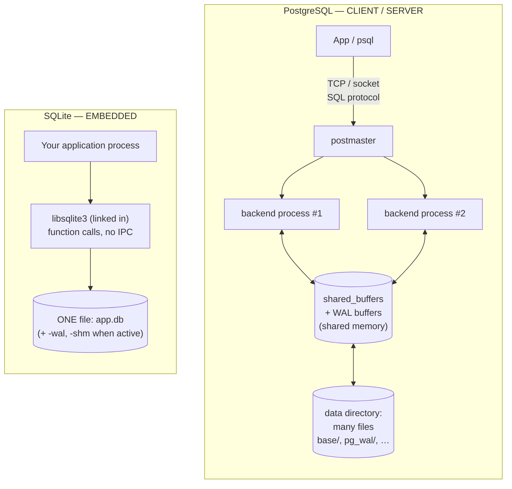

# PostgreSQL vs SQLite — A Tale of Two Architectures

> **Topic 1 — Advanced DBMS System Design Discussion**
> Author: Rudhar Bajaj · Roll No: 24BCS10143
>
> Both databases were run **for real** on Windows 11: SQLite 3.53 (CLI + Python
> `sqlite3`) and a locally-initialised **PostgreSQL 16.4** server (portable binaries,
> port 54399). Every figure and query plan in §5 is captured verbatim from those runs.

---

## 1. Problem Background

PostgreSQL and SQLite are both relational, SQL, ACID databases — and almost nothing else
about them is the same. They sit at **opposite ends of the design spectrum** because they
were built to solve opposite problems.

| | **PostgreSQL** (1986→, UC Berkeley) | **SQLite** (2000, D. R. Hipp) |
|---|---|---|
| Designed to be | A powerful **multi-user database server** | A **zero-configuration embedded** library |
| Deployment | A server process you connect to over a socket | A `.c` file you compile *into* your app |
| Concurrency target | Hundreds of concurrent clients | One application, mostly one writer |
| Canonical use | Backends, analytics, multi-tenant SaaS | Phones, browsers, IoT, app file formats |

SQLite is, by deployment count, the **most widely used database engine on Earth** (every
Android/iOS device, every major browser, countless desktop apps). PostgreSQL is the
reference-grade **open-source RDBMS** for server workloads. The interesting question is
*why the same requirements (store relations, run SQL, be ACID) produced two such different
machines* — and almost every difference traces back to **one decision: server process vs
embedded library.**

---

## 2. Architecture Overview



- **PostgreSQL** = a fleet of **OS processes** sharing memory, mediating access to a
  **directory of files**. A client never touches the files; it sends SQL to a backend.
- **SQLite** = a **library**. `SELECT` is a *function call* in your process; the "database"
  is **one ordinary file** the library reads and writes directly. No server, no sockets,
  no background processes, no configuration.

This is visible immediately on disk. A PostgreSQL database is a directory tree; a SQLite
database is a single file:

```
PostgreSQL cluster dir:                 SQLite database:
  PG_VERSION  base/  global/              company.db        ← that's the entire DB
  pg_wal/  pg_xact/  postgresql.conf      (company.db-wal, company.db-shm appear
  …(20+ entries)…                          only while a WAL-mode connection is open)
```

---

## 3. Internal Design

### 3.1 Process model

| | PostgreSQL | SQLite |
|---|---|---|
| Processes | `postmaster` + **one backend process per connection** + checkpointer, walwriter, bgwriter, autovacuum | **None** — runs inside the host app's thread |
| Concurrency unit | OS process + shared memory | Mutexes inside the linked library |
| Crash isolation | A crashed backend can't corrupt others | A crash in the app *is* a crash in the DB |

Measured — PostgreSQL's six cooperating processes are real (`pg_stat_activity`):

```
 checkpointer | background writer | walwriter | autovacuum launcher
 logical replication launcher | client backend (your session)
```

SQLite has **zero** processes of its own. That single fact is *why* it needs no
installation, no port, no daemon, no DBA — the entire engine is `libsqlite3` in your
address space.

### 3.2 Storage engine & file organisation

**SQLite — "the whole database is one file of 4 KB pages, and everything in it is a
B-tree."** Tables, indexes and the schema all live as B-trees inside that one file. The
first page holds a 100-byte header. Measured with `.dbinfo`:

```
database page size:  4096        number of tables:   2
database page count: 113         number of indexes:  0
text encoding:       1 (utf8)    freelist page count:0
```

A **table is itself a B-tree keyed by `rowid`** — i.e. SQLite tables are *clustered* by
rowid, with the full row stored in the leaf (similar in spirit to InnoDB's clustered
index, and unlike PostgreSQL's heap). Page-level breakdown via the `dbstat` virtual table
(20,000-row `employees` table):

```
 name            | bytes  | pages | layout
-----------------+--------+-------+----------------------------------
 employees       | 454656 |  111  | 1 interior page (109 child ptrs) + 110 leaf pages
 idx_emp_salary  | 225280 |   55  |
 idx_emp_dept    | 180224 |   44  |
```

So the table B-tree is **2 levels deep** (one interior root → 110 leaves), each leaf
holding ~180 rows.

**PostgreSQL — "a directory of files; tables are *heaps*, indexes are separate."** Each
table/index is one or more files of **8 KB pages**, named by `relfilenode`:

```
employees relfilenode = 16396
heap file path        = base/16388/16396     (16388 = database OID)
```

A PostgreSQL table is an **unordered heap**; rows are placed wherever there's free space,
and *every* index (including the primary key) is a **separate** B-tree pointing back into
the heap by TID `(block, offset)`. This is a direct consequence of MVCC (§3.4): updates
create new tuple versions in the heap, so the storage cannot be permanently clustered the
way SQLite's rowid table is.

**Page size:** SQLite 4 KB (mobile-friendly, configurable), PostgreSQL 8 KB (server
default). Both are slotted pages with a header, an array of cell/item pointers, and rows
filled from the page's end.

### 3.3 Index implementation

Both use **B-trees**, but organised differently:

- **SQLite:** the table *is* a rowid B-tree (clustered). A `PRIMARY KEY INTEGER` is just
  the rowid — no extra index. Secondary indexes are separate B-trees whose leaves store
  the indexed columns + the rowid.
- **PostgreSQL:** the heap is unordered; the PK is a separate B-tree. Measured: the 110K-row
  PK index is a **3-level** tree (root→internal→leaf), point lookup in 0.072 ms (§5.3).

Measured query plans show each engine choosing its access path (`EXPLAIN QUERY PLAN`,
SQLite):

```
-- before indexing:                      -- after CREATE INDEX on salary:
SCAN e                                    SEARCH e USING INDEX idx_emp_salary (salary>?)
SEARCH d USING INTEGER PRIMARY KEY        SEARCH d USING INTEGER PRIMARY KEY (rowid=?)
USE TEMP B-TREE FOR GROUP BY              USE TEMP B-TREE FOR GROUP BY
```

`SEARCH … USING INTEGER PRIMARY KEY (rowid=?)` is the clustered-table lookup; after adding
an index the full-table `SCAN` becomes an index `SEARCH`.

### 3.4 Concurrency control — the central difference

This is where the two architectures diverge most sharply.

**PostgreSQL: MVCC with row-level locking.** Many writers proceed in parallel as long as
they touch different rows; readers see a consistent snapshot and never block. (Full
internals in the *PostgreSQL Internals* topic.)

**SQLite: one writer for the entire database file.** Locking is at the granularity of the
*whole file*, escalating `SHARED → RESERVED → EXCLUSIVE`. In the default **rollback-journal**
mode, a writer eventually blocks all other access; in **WAL** mode, readers and one writer
can coexist — but there is still **at most one writer at a time**.

This is not a limitation to apologise for — it is the *correct* choice for an embedded,
single-application database, and it is what makes SQLite's implementation so small. §5.1
measures the contrast directly.

### 3.5 Durability

Both use write-ahead logging, but very differently:

| | PostgreSQL | SQLite |
|---|---|---|
| Default mechanism | **WAL** (16 MB segment files in `pg_wal/`) | **Rollback journal** (`-journal` file); optional **WAL** mode (`-wal` + `-shm`) |
| Commit cost | one sequential WAL `fsync` | `fsync` of journal/WAL + DB file |
| Crash recovery | replay WAL forward from last checkpoint | roll back incomplete txn from journal, or replay `-wal` |

SQLite's **rollback journal** is the inverse of PostgreSQL's redo log: it saves the
*original* pages before modifying them, so a crash *undoes* the partial transaction. WAL
mode flips this to a redo-style append log — measured in §5.2.

---

## 4. Design Trade-Offs

**Why SQLite works beautifully for mobile / embedded:**
- **Zero configuration & zero processes** — nothing to install, start or administer; the engine is a library in the app.
- **One file** — the entire database is a single file that is trivial to copy, ship, back up, or use as an application file format.
- **Tiny footprint & fast local reads** — no IPC, no network round-trip; a query is a function call. Ideal when there is *one* app and effectively one writer.
- **The single-writer model is a feature here:** a phone app has no need for 500 concurrent writers, so paying nothing for that capability is exactly right.

**Why PostgreSQL is preferred for large multi-user systems:**
- **True multi-writer concurrency (MVCC)** — measured below: concurrent writers on different rows don't block; readers never block writers.
- **Scales with connections & cores** via its process model and shared buffer pool.
- **Server-grade features** SQLite intentionally omits: roles/permissions, replication, rich types, parallel query, sophisticated cost-based planning, extensions.
- **Crash isolation & central administration** — the DB is a managed server, not part of each client.

**The trade-off in one line:** SQLite optimises for **simplicity, portability and a single
application**; PostgreSQL optimises for **concurrency, scale and many clients** — and each
*pays* for what the other gets for free (SQLite gives up multi-writer concurrency;
PostgreSQL gives up zero-config embedding and carries VACUUM/process overhead).

---

## 5. Experiments / Observations

### 5.1 The decisive contrast — concurrent writers

**SQLite (default rollback-journal mode):** one connection opens a write transaction; a
second connection tries to write:

```
journal_mode (default): delete
Writer2 BLOCKED -> 'database is locked'           ← SQLITE_BUSY: whole-file write lock
Reader during write tx -> rows: 1                 ← reader still sees last committed state
```

**PostgreSQL (MVCC):** the *same* scenario, two transactions:

```
[A] updated row 1 (uncommitted) -> holds a ROW lock on id=1 only
[B] updated DIFFERENT row 2 and committed in 1.0 ms  -> NO BLOCK
[R] reads row 1 during A's uncommitted write -> bal=100 (committed snapshot, did NOT wait)
[B2] tries SAME row 1 -> waits on A's ROW lock, times out after 809 ms (per-row, not whole-DB)
```

**Observation — this one experiment captures the whole architectural difference.** In
SQLite, *any* second writer to the database is refused (`database is locked`), because the
lock covers the entire file. In PostgreSQL, two writers on **different rows** both succeed
concurrently (1.0 ms, no blocking); only contention on the **same row** serialises, and even
then it's a *row* lock, not a database lock. SQLite trades concurrency for a 600 KB,
zero-admin engine; PostgreSQL spends a multi-process MVCC machine to buy that concurrency.

### 5.2 SQLite WAL mode — readers and a writer coexist; side files appear

```
journal_mode: wal
Reader during active write tx (WAL) -> rows: 1   (committed snapshot, did NOT block)
Writer2 BLOCKED (WAL still single-writer) -> 'database is locked'
After commit, reader sees rows: 2

Files while a WAL connection is OPEN:        After checkpoint(TRUNCATE) / close:
  walfiles.db       536576 bytes               walfiles.db    565248 bytes
  walfiles.db-shm    32768 bytes               (-wal and -shm merged away)
  walfiles.db-wal  4120032 bytes
```

**Observation.** WAL mode lets readers proceed against the last committed snapshot while a
writer is active (a lightweight MVCC), and it materialises two extra files — the `-wal`
write-ahead log and the `-shm` shared-memory index. A **checkpoint** merges the 4.1 MB WAL
back into the main file and truncates it. But note: **a second writer is still blocked** —
WAL relaxes reader/writer contention, not the one-writer rule.

### 5.3 Storage & access-path observations

- **File layout:** SQLite = one 462 KB file (`company.db`); PostgreSQL = a directory where
  `employees` is the file `base/16388/16396`.
- **Clustered vs heap:** SQLite's table is a rowid B-tree (row lives in the leaf);
  PostgreSQL's table is a heap with separate index B-trees.
- **Plans:** SQLite point lookup → `SEARCH employees USING INTEGER PRIMARY KEY (rowid=?)`;
  PostgreSQL point lookup → `Index Scan using employees_pkey … 0.072 ms`. Both logarithmic,
  different organisation.

---

## 6. Key Learnings

1. **One decision cascades into everything.** "Server process" vs "linked library" is the
   root from which the process model, concurrency, file layout, durability and use-cases
   all grow. Understanding that single fork explains every downstream difference.

2. **The single-writer lock is not SQLite being primitive — it is SQLite being right.** For
   one application on one file, whole-file locking is simpler, smaller and fast. The 809 ms
   row-lock-wait vs `database is locked` experiment (§5.1) shows two *correct* answers to
   two *different* problems.

3. **Storage organisation follows the concurrency model.** PostgreSQL *must* use an
   unordered heap + separate indexes because MVCC creates new tuple versions on update;
   SQLite *can* cluster the table by rowid because it overwrites in place under a single
   writer. The data layout is downstream of the concurrency choice.

4. **"Embedded" and "client-server" are not quality tiers — they are different niches.**
   SQLite is the most-deployed database precisely because billions of devices need a
   zero-config local store, not a concurrent server. PostgreSQL dominates server backends
   for the mirror-image reason.

5. **Both are ACID and both use write-ahead logging, yet implement durability inversely**
   — PostgreSQL's redo-style WAL vs SQLite's undo-style rollback journal — a reminder that
   the same guarantee admits very different mechanisms.

---

### References & tooling
- *SQLite Documentation* — "Database File Format", "Write-Ahead Logging", "File Locking And Concurrency".
- *PostgreSQL 16 Documentation* — "Internals", MVCC, WAL.
- Live runs: SQLite 3.53 (`.dbinfo`, `dbstat`, `EXPLAIN QUERY PLAN`, Python `sqlite3`) and PostgreSQL 16.4 (`psql`, `pg_stat_activity`, `psycopg2` concurrency demo) on Windows 11. Outputs shown are captured verbatim.
