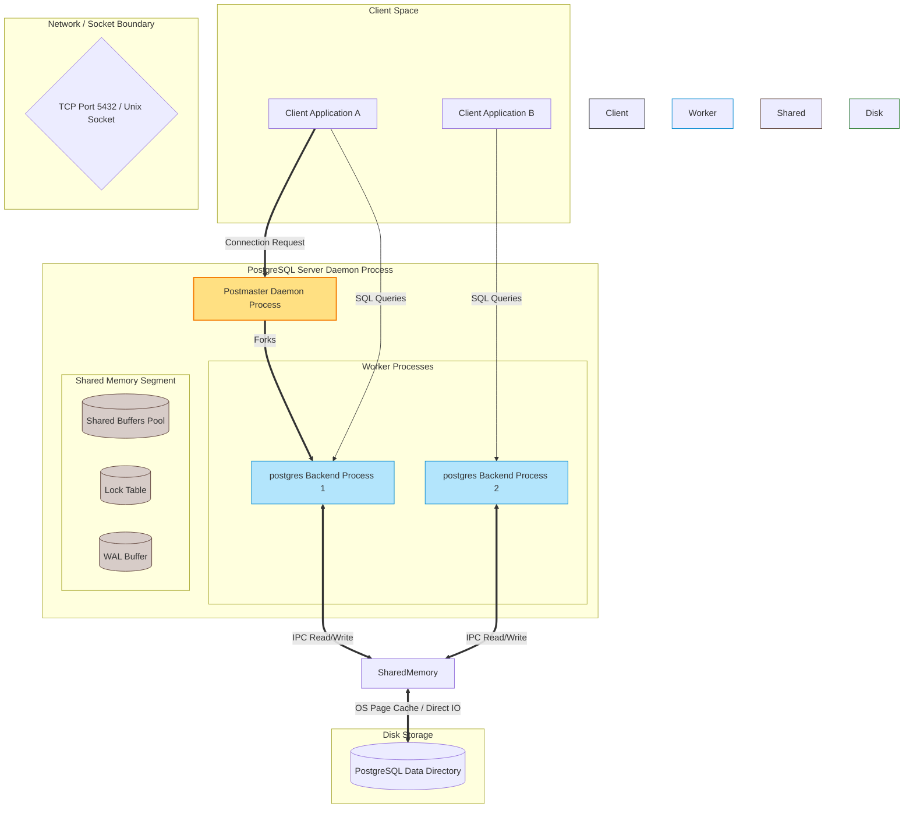

# Architectural Comparison: PostgreSQL versus SQLite

This system design document presents a rigorous architectural comparison between PostgreSQL, a premier enterprise-class client-server relational database, and SQLite, a widely deployed serverless embedded database library. By analyzing their design philosophies, internal storage structures, memory management strategies, indexing mechanics, and concurrency control models, this document illustrates how varying engineering trade-offs shape database behavior.

Additionally, this analysis incorporates practical observations, page layout internals, and concurrency behaviors explored during laboratory exercises, linking low-level implementation details directly to macro-level system performance.

---

## 1. Problem Background

Database systems do not exist in a vacuum; they are engineered to solve specific classes of problems within defined hardware and operational constraints. The fundamental divergence between PostgreSQL and SQLite stems from their contrasting founding objectives.

### PostgreSQL: The Enterprise Extensibility Engine
PostgreSQL arose from the POSTGRES project at the University of California, Berkeley, initiated by Michael Stonebraker in 1986. The project was conceived as a successor to Ingres, aiming to address the limitations of contemporary relational systems. The primary design goals of PostgreSQL were:
* **Extensibility:** Allowing users to define custom data types, operators, index types, and functional languages directly within the database engine.
* **Complex Workload Support:** Handling complex query workloads, multi-table joins, and subqueries with high efficiency.
* **Enterprise Reliability:** Offering complete ACID compliance, high concurrency, and robustness against server crashes in multi-user environments.

PostgreSQL was designed from the beginning as an enterprise-grade, multi-user system, accepting the operational overhead of a client-server architecture in exchange for absolute scalability, data integrity, and feature completeness.

### SQLite: The Zero-Administration Embedded Library
SQLite was designed in 2000 by D. Richard Hipp while working on a command and control system for US Navy guided missile destroyers. The system used an enterprise database that frequently suffered from connectivity issues, server process crashes, and administration overhead. Hipp's objective was to build a database that:
* **Required Zero Administration:** Operating without a Database Administrator (DBA), complex configuration files, or server management.
* **Was Serverless:** Running directly inside the application process to eliminate network configuration, socket overhead, and inter-process communication (IPC) failures.
* **Had Minimal Footprint:** Compiling into a tiny library with highly optimized memory and storage usage, making it suitable for resource-constrained embedded systems and devices.

SQLite was designed to be simple, portable, and fast for single-user or local application workloads, accepting limitations in write concurrency and network distribution to achieve unmatched simplicity and zero-configuration utility.

---

## 2. Architecture Overview

The most significant architectural distinction between PostgreSQL and SQLite lies in their process models and deployment boundaries. This structural difference determines how clients interact with the database, how data flows through the system, and how resource boundaries are enforced.

### Process Models and Boundaries

* **PostgreSQL (Client-Server / Multi-Process):** PostgreSQL operates as a distinct background daemon process. It utilizes a multi-process model to handle concurrent client connections. The primary coordinator process, the `postmaster`, listens on a network port (typically 5432) or a Unix domain socket. When a client connects, the `postmaster` forks a dedicated backend `postgres` process to handle that connection. These backend processes communicate with each other and share resources using operating system shared memory segments.
* **SQLite (In-Process / Serverless Library):** SQLite is not a running process. It is a software library that is compiled and linked directly into the host application binary. When the application calls SQLite API functions (such as `sqlite3_open` or `sqlite3_exec`), those operations execute entirely within the thread context and virtual memory address space of the application process. Database file I/O is performed by the library making direct system calls to the operating system kernel.

### Architectural Data Flow Diagrams

The following colorful Mermaid diagrams illustrate the contrasting client-database interaction boundaries, process structures, and physical storage access paths.

#### PostgreSQL Client-Server Architecture



#### SQLite In-Process Embedded Architecture

```mermaid
graph TD
    subgraph Application Process Address Space
        subgraph Host Application
            App[Application Code / Threads]
        end
        
        subgraph SQLite Library Components
            API[SQLite3 C-API]
            Engine[Compiler, Parser & VM]
            Pager[Pager Subsystem]
            PCache[(In-Process Page Cache)]
        end
    end

    subgraph OS Kernel & VFS
        VFS[Virtual File System Interface]
        KernelCache[(OS Page Cache / Buffer)]
    end

    subgraph Physical Disk
        DBFile[(Single .db File)]
    end

    App ==>|Direct Function Calls| API
    API --> Engine
    Engine --> Pager
    Pager <==> PCache
    Pager --> VFS
    VFS -->|read / write / mmap| KernelCache
    KernelCache <==>|Disk Controller| DBFile

    style Host Application fill:#fff3e0,stroke:#e65100,stroke-width:1px
    style SQLite Library Components fill:#e1f5fe,stroke:#0288d1,stroke-width:1px
    style OS Kernel & VFS fill:#f5f5f5,stroke:#333,stroke-width:1px
    style Physical Disk fill:#e8f5e9,stroke:#2e7d32,stroke-width:1px
    style App fill:#ffe0b2,stroke:#e65100,stroke-width:2px
    style PCache fill:#b3e5fc,stroke:#0288d1,stroke-width:1px
    style KernelCache fill:#e0e0e0,stroke:#424242,stroke-width:1px
```

---

## 3. Internal Design

Understanding how these databases perform storage, memory management, indexing, concurrency, and recovery is crucial for systems engineering.

### Storage Structures and Page Layouts

* **SQLite File Organization:** SQLite structures the entire database (including schema, tables, indexes, and transactional state) as a single, contiguous file on disk. This file is divided into uniform, fixed-size pages. The page size is set at database creation (typically 4096 bytes, matching the standard operating system page size) and cannot be changed without performing a complete `VACUUM`. Each table or index within the file is organized as a separate B-tree.
* **PostgreSQL File Organization:** PostgreSQL uses a much more complex, multi-file directory structure. Data is organized hierarchically: Tablespace -> Database -> Schema -> Table. Each table is stored as a set of physical segment files (typically split into 1 GB chunks to prevent OS file size limit issues) located in a dedicated directory. These segment files are divided into uniform 8192-byte (8 KB) pages, known as blocks. Individual indexes are also stored as separate physical files.

### Memory Management and Buffer Caches

* **SQLite Memory Strategy:** SQLite uses a local, in-process page cache to store frequently accessed database pages. The size of this cache can be configured at runtime using `PRAGMA cache_size`. Additionally, SQLite supports memory-mapped I/O via `PRAGMA mmap_size`. When memory-mapping is enabled, SQLite uses the `mmap()` system call to map portions of the database file directly into the application process's virtual memory address space. This allows the application to read database pages via direct memory pointer access, completely bypassing the overhead of making `read()` system calls and copying data across the kernel-user boundary.
* **PostgreSQL Memory Strategy:** PostgreSQL maintains a highly sophisticated, dedicated memory region called the Shared Buffer Pool, configured via the `shared_buffers` parameter. Because PostgreSQL uses a multi-process architecture, this pool must reside in shared memory so that all backend `postgres` processes can access it. PostgreSQL manages page caching, dirty page tracking, and eviction internally using a Clock Sweep algorithm (a low-overhead approximation of Least Recently Used, or LRU). This prevents the database from relying solely on the operating system's filesystem cache, ensuring that critical database pages (such as index root nodes) are pinned in memory.

### Index Organization: On-Disk B-Trees versus In-Memory Trees

A primary focus of database systems is indexing. While in-memory applications often utilize self-balancing binary search trees (such as Red-Black Trees) to maintain sorted data, on-disk databases rely almost exclusively on B-Trees or B+ Trees.

The following table highlights the architectural differences between these two data structures, reflecting the structural concepts explored in Lab 4:

| Design Dimension | In-Memory Red-Black Tree | On-Disk B-Tree / B+ Tree |
| :--- | :--- | :--- |
| **Node Fanout** | Binary (maximum of 2 children per node). | High (hundreds of children per node, depending on page size). |
| **Node Size** | Tiny (contains a single key, two child pointers, and parent pointer). | Large (designed to match the disk page size, e.g., 4 KB or 8 KB). |
| **Tree Height** | Deep (height is logarithmic with base 2; e.g., $O(\log_2 N)$). | Shallow (height is logarithmic with base $T$, where $T$ is the fanout). |
| **Disk I/O Cost** | High (pointer-chasing causes random memory accesses, leading to disk seeks). | Low (each node access translates to exactly one page read, fetching many keys). |
| **Layout in Memory** | Non-contiguous (nodes are allocated dynamically across the heap). | Contiguous within pages (keys, values, and pointers are packed in a single block). |
| **Database Use Case** | In-memory index structures or language standard libraries (`std::map`). | Primary on-disk storage engine indexes (PostgreSQL, SQLite, InnoDB). |

In on-disk B-Trees (as implemented by SQLite and PostgreSQL), the node size is carefully aligned with the database page size (4 KB in SQLite, 8 KB in PostgreSQL). When the database engine performs a search, one disk seek retrieves a node containing hundreds of keys. This high fanout ensures that even in databases containing millions of rows, the tree height rarely exceeds 3 or 4 levels, minimizing disk I/O.

### Transaction Processing and Concurrency Control

Concurrency control is the mechanism that allows multiple transactions to execute simultaneously while maintaining ACID properties. The two databases take fundamentally different paths here.

* **SQLite Concurrency (Locking and WAL):**
  * **Classic Journal Mode (Rollback Journal):** In its default mode, SQLite uses coarse-grained, file-level locking. A writer transaction acquires an exclusive lock on the entire database file, preventing all other threads or processes from reading or writing. This model is highly restrictive for concurrent workloads.
  * **Write-Ahead Log (WAL) Mode:** In WAL mode, SQLite writes updates to a separate `-wal` file rather than modifying the main database file directly. This decouples readers and writers. A single writer can append new pages to the WAL file while multiple readers concurrently read the consistent, older state from the main database file. To coordinate this, SQLite uses a shared memory index file (`-shm`) to map active page locations, using light, in-process mutexes rather than heavy file locks.
* **PostgreSQL Concurrency (Multi-Version Concurrency Control - MVCC):**
  * PostgreSQL does not use coarse-grained locks to manage transaction isolation. Instead, it implements a full MVCC model.
  * **Tuple Versioning:** When a row is inserted, updated, or deleted, PostgreSQL does not modify the data in-place. Instead, it writes a new version of the row (tuple) to the page. Each tuple contains metadata headers: `xmin` (the transaction ID that created the version) and `xmax` (the transaction ID that deleted or replaced the version).
  * **Visibility Rules:** When a transaction begins, it is assigned a snapshot of active transaction IDs. When executing a query, the backend process walks the version chain of a row and applies visibility rules: a tuple is visible only if its `xmin` is committed and less than the snapshot ID, and its `xmax` is either uncommitted, aborted, or greater than the snapshot ID.
  * **Vacuuming:** Because updates write new versions, old dead versions (garbage) accumulate in the heap files. PostgreSQL runs an asynchronous background daemon called `VACUUM` to scan pages, reclaim space occupied by dead tuples, and update visibility maps.

### Recovery Mechanisms

Both systems utilize Write-Ahead Logging to guarantee durability and crash recovery, following the ARIES protocol:

1. **Write-Ahead Logging:** Before any data page is modified and flushed to disk, the database must write a corresponding log record describing the modification to non-volatile storage (the WAL file). This guarantees that if the system crashes, the database can reconstruct committed state.
2. **Crash Recovery (Redo Pass):** Upon restarting after a crash, the database engine scans the WAL from the last known checkpoint. It reapplies (re-does) all logged modifications to the data pages, bringing the database back to the exact state it was in at the moment of the crash.
3. **Crash Recovery (Undo Pass):** Once the redo pass is complete, the engine identifies all transactions that were active (uncommitted) at the time of the crash. It scans the WAL backward and rolls back (un-does) their modifications, restoring the database to a consistent state. In PostgreSQL, this involves writing abort status to the commit log (pg_xact), rendering those tuple versions invisible. In SQLite rollback mode, it involves restoring the original pages from the rollback journal.

---

## 4. Design Trade-Offs

Architectural decisions are governed by trade-offs. The table below highlights the trade-offs accepted by PostgreSQL and SQLite:

| Design Dimension | PostgreSQL | SQLite |
| :--- | :--- | :--- |
| **Operational Complexity** | High. Requires installation, service management, user roles, network security, and vacuum tuning. | Zero. Entire database is a single file; no server process to configure or maintain. |
| **Resource Overhead** | High. Requires substantial memory for shared buffers, connection processes, and background daemons. | Low. Minimal memory footprint, running entirely within the host application's memory space. |
| **Write Concurrency** | Very High. MVCC allows concurrent reads and writes; row-level locking minimizes contention. | Low. Limited to a single writer process at any given time, even in WAL mode. |
| **Network Capabilities** | Native. Accessible across networks via TCP/IP; supports replication, pooling, and clustering. | None. Cannot be accessed natively over a network; file-sharing protocols (like NFS) risk corruption. |
| **Extensibility** | Unlimited. Supports custom types, index extensions (GIN, GiST), and procedural languages (PL/pgSQL). | Limited. Fixed type system, though supports custom C-extension functions and virtual tables. |

---

## 5. Experiments and Observations

To bridge the gap between high-level database architecture and actual system behavior, this section details practical observations and experiments based on the laboratory modules.

### Experiment 1: Measuring Page Sizes and mmap Impact

In Lab 2, we investigated how SQLite page size and memory-mapping affect read performance. The default page size of SQLite is 4096 bytes, which aligns with the physical page size of modern operating system kernels.

Using `PRAGMA` commands, we analyzed the storage structure of a sample database:

```sql
-- Querying default database parameters
PRAGMA page_size;
-- Output: 4096 (bytes)

PRAGMA page_count;
-- Output: 25000 (pages for a ~102 MB database)
```

By default, the memory-mapped I/O size is disabled (`mmap_size = 0`), meaning SQLite executes standard read system calls for every page access. We enabled memory-mapping to measure its impact:

```sql
-- Enabling memory-mapped I/O for up to 256 MB
PRAGMA mmap_size = 268435456;
```

#### Observation under strace
To verify how the operating system kernel handles these requests, we executed a sequential scan query under `strace` to trace the system calls:

```bash
# With mmap_size = 0
strace -c sqlite3 students.db "SELECT count(*) FROM students;"
```
* **Result:** The trace showed thousands of `read()` system calls, each requiring a context switch from user space to kernel space, copying 4 KB of data into the application buffer.

```bash
# With mmap_size = 268435456
strace -c sqlite3 students.db "SELECT count(*) FROM students;"
```
* **Result:** The trace showed a single `mmap()` system call at startup. During the sequential scan, the count of `read()` system calls dropped to zero. The operating system kernel mapped the file pages directly into the process's virtual memory, letting the CPU handle page faults and caching automatically. This resulted in a significant reduction in CPU overhead.

### Experiment 2: B-Tree Page Structure Hex Dump Analysis

In Lab 4, we analyzed the physical layout of an SQLite database page using hex dump analysis. SQLite pages are structured to allow fast navigation and binary search within a single disk block.

Running a hex dump on the first page of a table B-tree:

```bash
# Dumping the first 128 bytes of an SQLite table b-tree page
xxd -s 0 -l 128 students.db
```

The physical byte layout of an interior table B-tree page revealed the following structure:
1. **Page Header (8 or 12 bytes):** The first byte indicates the page type. A value of `0x05` identifies an interior table B-tree page, while `0x0d` identifies a leaf table B-tree page.
2. **Cell Pointer Array:** Following the header, a series of 2-byte integers act as offsets pointing to the actual location of cells (data records) within the page. These cells are allocated from the bottom of the page upward.
3. **Freeblock Offset:** Tracks the location of deleted or fragmented space within the page, allowing SQLite to reclaim space during insertions.
4. **Cell Content Area:** Located at the end of the page, storing the actual keys, payload sizes, and child page pointers.

This structure allows SQLite to perform binary search on the sorted cell pointer array in memory, then jump directly to the target cell offset, avoiding sequential scans of the page.

### Experiment 3: Concurrency and MVCC Transaction Isolation

In Lab 6, we designed a mock transaction manager demonstrating how MVCC and Two-Phase Locking (2PL) interact to provide serializable write safety alongside non-blocking reads.

To observe this behavior, we simulated a concurrent workload with two active transactions:

1. **Transaction A (Write):** Updates a row value.
2. **Transaction B (Read):** Performs a read on the same row concurrently.

Under a pure 2PL system, Transaction A would acquire an exclusive lock, blocking Transaction B's read request until Transaction A commits or aborts. Under our MVCC implementation, the execution path behaved differently:

* **Step 1:** Transaction A begins and obtains an exclusive lock for writing. It creates a new version of the row, setting `xmin` to its transaction ID and `xmax` to `0`. The previous row version is modified, setting its `xmax` to Transaction A's ID.
* **Step 2:** Transaction B begins and is assigned a snapshot ID. It attempts to read the row.
* **Step 3:** Instead of blocking on Transaction A's exclusive lock, Transaction B walks the version chain of the row. It evaluates the visibility rule:
  $$\text{Visible} = (\text{xmin} \le \text{snapshot\_id} \land \text{xmin is committed}) \land (\text{xmax} = 0 \lor \text{xmax} > \text{snapshot\_id} \lor \text{xmax is aborted})$$
* **Result:** Transaction B successfully reads the older, committed version of the row without blocking. Once Transaction A commits and releases its locks, subsequent new transactions automatically see the updated version. This demonstrates how MVCC eliminates read-write contention, a core capability that PostgreSQL leverages for high-performance concurrent environments.

---

## 6. Key Learnings

Building and analyzing database components throughout the course has provided several key systems engineering insights:

1. **Architecture Dictates Performance:** A database is a collection of trade-offs. SQLite's decision to run in-process makes it exceptionally fast for single-user, read-heavy workloads because it eliminates network latency and serialization overhead. However, this same decision makes it unsuitable for write-heavy, multi-user web applications where PostgreSQL's multi-process, MVCC-driven model is required.
2. **The Importance of Page Alignment:** Disk I/O is the primary bottleneck in database systems. Designing storage engines around fixed-size pages (4 KB or 8 KB) that align with physical disk sectors and OS memory pages is essential. It allows the database to treat disk blocks as direct memory extensions, minimizing alignment overhead and maximizing I/O throughput.
3. **Hardware-Aware Software Design:** Techniques like memory-mapping (`mmap()`) demonstrate the value of building software that cooperates with the operating system kernel. By delegating caching and page-fault handling to the OS virtual memory manager, SQLite achieves high performance with minimal code complexity.
4. **Data Integrity is Paramount:** Designing transaction managers, lock tables, and Write-Ahead Log recovery systems highlights the complexity of guaranteeing durability. Every write path must be designed with the assumption that the system could crash at any microsecond, ensuring that recovery protocols can always restore the database to a consistent, uncorrupted state.
