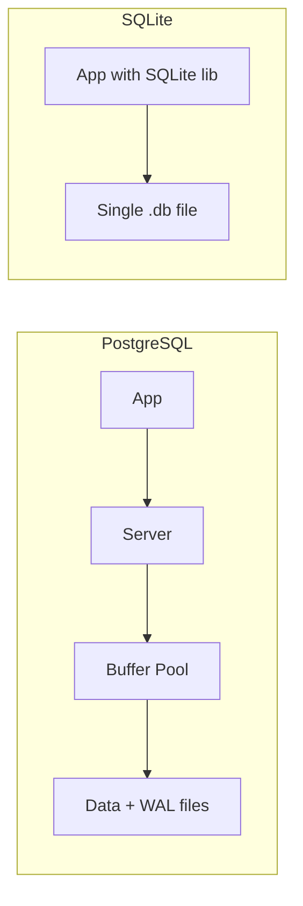

# PostgreSQL vs SQLite — Architecture Comparison

## 1. Problem Background

Apps need a place to store data. PostgreSQL and SQLite both use SQL, but they were built for different jobs.

**SQLite** was made to run inside an app. No server to install. The whole database can live in one file. Phones, laptops, and small tools use it a lot.

**PostgreSQL** was made to run as a server. Many apps connect at the same time. Websites, APIs, and systems with lots of users use it.

I picked this topic because the real difference is not SQL syntax. It is how the app talks to the database and how each system handles many users writing at once.

---

## 2. Architecture Overview

### PostgreSQL (client-server)

```
App  -->  socket (port 5432)  -->  postgres server  -->  buffer pool  -->  data files + WAL
```

- A `postgres` process runs on its own
- Clients connect over the network or a Unix socket
- The server owns memory (shared buffers) and disk files
- Many clients share one database

### SQLite (embedded)

```
App  -->  SQLite library (same process)  -->  one .db file
```

- No server process
- The app calls SQLite like any other library (`sqlite3_open`, `sqlite3_exec`)
- The app reads and writes the file directly
- Usually one app owns the file

### Why I think the designs differ

| Goal | SQLite | PostgreSQL |
|------|--------|------------|
| Easy to ship | Library inside the app | Needs a running server |
| Low setup | Copy one `.db` file | Install, configure, manage |
| Many writers at once | Not the main goal | Main goal (MVCC) |
| User login / security | File permissions only | Users, roles, SSL |



---

## 3. Internal Design

### Process model

**PostgreSQL**
- Server process handles queries
- Background workers run checkpoints, WAL flush, vacuum, and more
- Clients only send SQL and get rows back

**SQLite**
- Runs inside the app's memory space
- No TCP, no login handshake
- `ps aux | grep sqlite` shows nothing — only your app process exists

SQLite starts fast and needs no ops work. PostgreSQL pays that cost to serve many clients safely.

### Storage

**PostgreSQL**
- Data lives in a data directory with many files
- Default page size: 8 KB
- Table rows sit on heap pages; indexes are B-trees pointing to row locations
- WAL is written before data pages change (crash safety)

**SQLite**
- Entire database in one file
- Default page size: 4 KB (4096 bytes)
- Tables and indexes are B-trees inside that file
- Durability via rollback journal or WAL mode

File size in SQLite: `page_size × page_count`.

### Pages and indexes

Both split disk into fixed-size pages and use B-trees for indexes.

Main difference I see:
- PostgreSQL keeps heap (row data) separate from indexes
- SQLite packs everything into one file — easy to copy, backup, or move

### Concurrency

**PostgreSQL — MVCC**
- Updates create new row versions instead of overwriting old ones right away
- Readers use a snapshot and usually do not block writers
- Old dead rows need VACUUM to clean up
- Built for many users on one database

**SQLite — file locking**
- Locks at the database file level
- Traditionally one writer at a time
- WAL mode helps: readers can read while one writer works, but heavy write traffic still queues
- Fine when one app owns the DB; bad when many apps write together

### Transactions and recovery

Both are ACID.

- PostgreSQL: commit goes to WAL first; crash recovery replays WAL
- SQLite: journal or WAL records changes before applying them to pages

Same idea — log first, data second — different packaging.

### Memory caching

- **SQLite** can use `mmap()` to map the file into app memory (optional). Reads can skip many `read()` syscalls.
- **PostgreSQL** keeps a shared buffer pool in the server. All clients share the same cached pages.

Both avoid disk. They manage memory at different layers.

---

## 4. Design Trade-Offs

| Area | PostgreSQL | SQLite |
|------|------------|--------|
| Setup | Harder — install server | Easiest — just a file |
| Concurrent writes | Strong (MVCC) | Weak (file locks) |
| Memory | Server RAM (shared_buffers) | Small cache inside app |
| Multi-user apps | Built for this | Poor fit |
| Mobile / embedded | Overkill | Great fit |
| Backups | pg_dump, replication | Copy the `.db` file |
| Auth | Users, passwords, roles | Filesystem permissions only |

### Why PostgreSQL uses client-server

1. One place to control who can connect
2. One shared buffer pool for all clients
3. One engine to run MVCC for many transactions

**Trade-off:** you must run and watch a server. Uses more RAM. Slower to set up.

### Why SQLite is embedded

1. Phones cannot run a database server
2. Developers want clone → run, no Docker, no port 5432
3. One writer is enough for most local apps

**Trade-off:** not built for 100 users writing at the same time.

---

## 5. Experiments / Observations

I ran these on my machine.

### Experiment 1 — SQLite has no server process

```bash
ps aux | grep -i sqlite
```

**Output:** (empty — no sqlite process found)

**What I learned:** SQLite is not a background service. The library runs inside whatever app opened the database.

---

### Experiment 2 — SQLite storage is one file made of pages

Created a test DB with 2 rows, then ran PRAGMA checks (via Python `sqlite3`):

```
PRAGMA page_size;   → 4096
PRAGMA page_count;  → 2
PRAGMA journal_mode; → delete
File size:           → 8192 bytes (8 KB)
```

**What I learned:**
- Page size is 4096 bytes (matches typical OS page size)
- Only 2 pages for a tiny table — the whole DB fits in one small file
- `journal_mode = delete` — changes go through a journal before hitting pages
- One file = entire database. Easy to see and copy on disk.

---

### Experiment 3 — PostgreSQL server is a real process

```bash
ps aux | grep postgres
```

**Output (trimmed):**
```
postgres   ...  postgres
postgres   ...  postgres: checkpointer
postgres   ...  postgres: background writer
postgres   ...  postgres: walwriter
postgres   ...  postgres: autovacuum launcher
postgres   ...  postgres: logical replication launcher
```

**What I learned:** PostgreSQL always runs as its own process with helper workers. That is the client-server model in practice — not just a diagram.

---

### Real-world fit (my take)

| Use case | Better pick | Why |
|----------|-------------|-----|
| Android/iOS offline storage | SQLite | No server, one file, low RAM |
| Local dev / unit tests | SQLite | Fast, zero config |
| Web API with many concurrent users | PostgreSQL | MVCC handles parallel writes |
| E-commerce checkout | PostgreSQL | Many writes; file locks would queue too much |

---

## 6. Key Learnings

1. Architecture follows the user. SQLite fits one app on one device. PostgreSQL fits many apps and many users.
2. Embedded does not mean worse. SQLite is simpler by design.
3. Concurrency is the big split. PostgreSQL MVCC vs SQLite file locks matters most in production.
4. One file vs many files changes how you deploy, back up, and debug.
5. Both use pages and B-trees — internals are similar, packaging is not.
6. No single winner. Pick based on how many writers you have and how much server work you accept.

---

## References

- [SQLite Architecture](https://www.sqlite.org/arch.html)
- [SQLite File Format](https://www.sqlite.org/fileformat.html)
- [PostgreSQL Storage](https://www.postgresql.org/docs/current/storage.html)
- Course Lab 2: `lab_sessions/lab_2.txt` (PRAGMA, mmap, process model)
