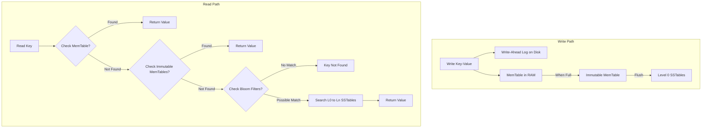

# RocksDB LSM-Tree Architecture

## 1. Problem Background

Traditional database engines (like InnoDB or PostgreSQL) use B-Trees as their primary storage structure. B-Trees perform random I/O when updating pages on disk. On modern solid-state drives (SSDs) and flash memory, random write workloads lead to significant write amplification, wear out the physical cells, and limit throughput. 

RocksDB, developed by Meta (Facebook) in 2012 (forked from Google's LevelDB), was designed to optimize for high-performance, write-heavy workloads on fast storage. By utilizing a Log-Structured Merge-tree (LSM-Tree) architecture, RocksDB converts random writes into sequential writes, maximizing write throughput and storage efficiency.

---

## 2. Architecture Overview

### RocksDB Write and Read Paths

### Core Architecture Components
1. **MemTable:** An in-memory write buffer (sorted data structure, usually a Skiplist) where new writes are placed.
2. **Immutable MemTable:** A read-only MemTable waiting to be flushed to disk.
3. **Write-Ahead Log (WAL):** A sequential file on disk that records all writes for durability before they are added to the MemTable.
4. **SSTables (Sorted String Tables):** Structured, immutable files on disk where data is stored in sorted order. Organized into multiple levels (L0 to Ln).
5. **Bloom Filters:** Probabilistic data structures associated with SSTables that quickly determine whether a key is *not* present in an SSTable, preventing unnecessary disk I/O.

---

## 3. Internal Design

### 3.1 Write Path
Writing to RocksDB is designed to be extremely fast and involves two sequential operations:
1. The write is appended to the **Write-Ahead Log (WAL)** on disk to guarantee durability.
2. The key-value pair is inserted into the in-memory **MemTable**.
Since both steps write sequentially or to memory, the write operation incurs no random I/O overhead.

### 3.2 Read Path
Reading a key is more complex because the key might reside in memory or in any of the SSTable files on disk:
1. Search the active **MemTable**.
2. Search any active **Immutable MemTables**.
3. Search **Level 0 (L0) SSTables**. Since L0 files can contain overlapping key ranges, all L0 files must be searched.
4. Search **Level 1 to Level n (L1 to Ln) SSTables**. Since key ranges do not overlap within levels L1 through Ln, only one SSTable per level needs to be checked.
5. In each search step, **Bloom Filters** are checked first. If the filter indicates the key is not in the SSTable, disk access for that file is skipped entirely.

### 3.3 Compaction
As Immutable MemTables are flushed to disk, the number of SSTable files grows. To keep read times bounded and reclaim space from deleted or overwritten keys, RocksDB performs **compaction**:
- **Leveled Compaction (Default):**
  - Disk storage is divided into levels ($L0, L1, L2, \dots, Ln$), where each level's capacity limit is 10x larger than the previous level (e.g., L1 = 10MB, L2 = 100MB, L3 = 1GB).
  - When a level exceeds its size limit, one or more SSTables are selected and merged (using a sorted-merge algorithm) with overlapping SSTables in the next level down.
  - This merge process eliminates duplicate/overwritten keys and tombstone records (deleted keys).

---

## 4. Design Trade-Offs: The RUM Conjecture

LSM-Tree engines are governed by the RUM Conjecture (Read, Update, Memory/Space optimization trade-offs). They optimize updates (writes) at the expense of read and space amplification.

### The Three Amplification Factors

1. **Write Amplification (WA):** The ratio of bytes written to storage vs. bytes written to the database.
   - *LSM-Tree Trade-off:* High. Because data is repeatedly read, merged, and rewritten down the levels during compaction, writing a 1 KB key can result in 10-30 KB of write I/O over time.
2. **Read Amplification (RA):** The number of disk reads required to satisfy a single user read query.
   - *LSM-Tree Trade-off:* High. In the worst case, a read must query multiple SSTables across different levels. Bloom Filters mitigate this but do not eliminate it for range scans.
3. **Space Amplification (SA):** The ratio of database file size on disk vs. actual data payload size.
   - *LSM-Tree Trade-off:* Moderate. Because deletes and updates only append new data (tombstones/new versions), outdated records remain on disk until compaction occurs.

---

## 5. Experiments / Observations

Below is an analysis of RocksDB performance under different compaction strategies.

### Compaction Strategy Comparison

| Metric | Leveled Compaction | Universal Compaction |
| :--- | :--- | :--- |
| **Write Amplification** | **High** (~10x - 30x) | **Low** (~2x - 8x) |
| **Read Amplification** | **Low** (needs fewer file checks) | **High** (more overlapping ranges) |
| **Space Amplification** | **Low** (~1.1x - 1.2x) | **High** (up to 2.0x temporarily) |
| **Workload Suitability** | Read-heavy or balanced workloads. | Write-heavy, transient logging. |

### Observations
1. **Compaction Overhead:** During periods of high write volume, RocksDB can experience "write stalls." This occurs when the compaction threads cannot keep up with flushes from memory, causing L0 file counts to spike. To prevent read performance degradation, RocksDB intentionally throttles incoming write traffic.
2. **Bloom Filter Efficiency:** Enabling Bloom Filters with 10 bits per key reduces the False Positive Rate (FPR) to ~1%, meaning 99% of unnecessary disk searches are avoided, demonstrating how memory caching structures optimize disk retrieval.

---

## 6. Key Learnings

1. **Sequential I/O Dominance:** RocksDB proves that converting random writes into sequential writes is key to maximizing write throughput and prolonging flash storage lifetime.
2. **Bloom Filters are Critical:** The read path of an LSM-Tree would be too slow for production environments without Bloom Filters, which act as a fast probabilistic gatekeeper to bypass disk I/O.
3. **Compaction is a Double-Edged Sword:** While compaction optimizes read performance and reclaims space, it consumes substantial I/O bandwidth, requiring careful tuning of thread pools and rate-limiting protocols.
