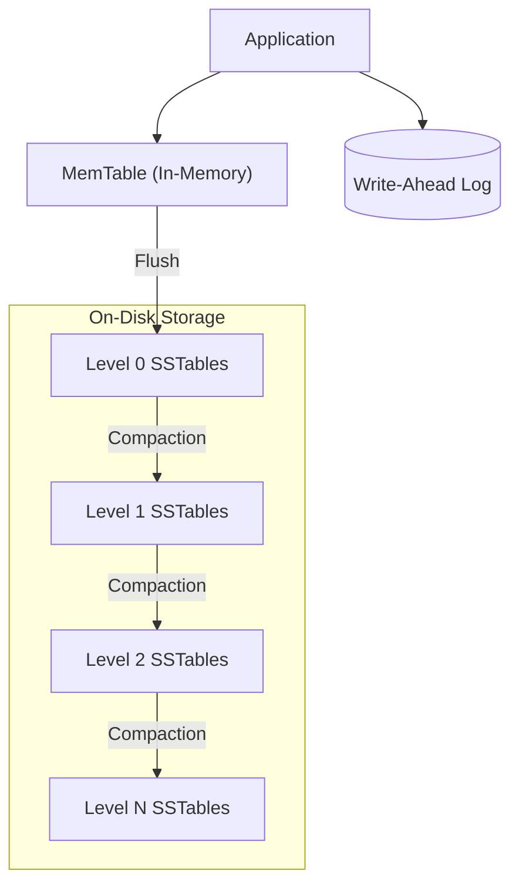

# RocksDB Storage Engine Architecture

## 1. Problem Background
RocksDB originated at Facebook as a fork of Google's LevelDB. The primary problem it aimed to solve was the underutilization of fast storage hardware (specifically Flash/SSDs) by traditional B-Tree based database engines. Server workloads often require handling massive volumes of random writes, which are bottlenecked by the random disk I/O of B-Trees. RocksDB was engineered to convert these random writes into sequential writes, maximizing the throughput of SSDs while providing flexible configuration for high-performance key-value storage.

## 2. Architecture Overview
Unlike traditional relational databases, RocksDB is an embeddable key-value store library (like SQLite, but strictly key-value). It relies on a **Log-Structured Merge-Tree (LSM-Tree)** architecture.

The three foundational constructs of RocksDB are the **memtable**, **logfile (WAL)**, and **sstfile**.

## 3. Internal Design

### Data Flow (Write Path)
When a `Put(key, val)` is executed:
1. **WAL:** The write is optionally (but usually) appended sequentially to the Write-Ahead Log on disk for durability.
2. **MemTable:** The key-value pair is inserted into the in-memory MemTable (a skiplist by default). Because the data is kept sorted in memory, writes are incredibly fast.
3. **Flush:** When the MemTable fills up, it becomes immutable, and a background thread flushes it to disk as an **SSTable** (Sorted String Table) at Level-0 (L0). The corresponding WAL is then safely deleted.

### Data Flow (Read Path)
When a `Get(key)` is executed, RocksDB searches in the following order:
1. The active MemTable.
2. Immutable MemTables pending flush.
3. SSTables on disk, starting from Level-0 down to Level-max.
Since searching multiple files on disk is expensive, RocksDB utilizes **Bloom Filters**. If a Bloom Filter indicates a key is *not* in an SSTable, RocksDB skips reading that file, drastically reducing disk I/O for read operations.

### Compaction
Since SSTables are immutable, updates and deletes do not modify existing files. Instead, they are appended as new records. Over time, this leads to redundant data. **Compaction** is the background process that reads SSTables, merges them, drops deleted/overwritten keys, and writes the consolidated data to the next level down (e.g., L1 to L2). 

RocksDB supports multiple compaction styles:
- **Level Style (Default):** Optimizes for disk space (low space amplification) but increases disk writes.
- **Universal Style:** Optimizes for lower write amplification by merging many files at once, at the cost of higher space and read amplification.
- **FIFO Style:** Deletes the oldest file when the max size is reached, ideal for cache-like workloads.

## 4. Design Trade-Offs

The architecture of an LSM-Tree is entirely built around managing three competing metrics:
1. **Write Amplification:** The ratio of bytes written to storage vs. bytes written by the application. (Compaction causes data to be rewritten multiple times).
2. **Read Amplification:** The number of disk reads required to satisfy a single logical read query. (Searching across multiple LSM levels increases this).
3. **Space Amplification:** The ratio of disk space used vs. the actual logical size of the database. (Storing multiple versions of updated keys increases this).

**Trade-offs vs B-Trees:**
- **Advantages:** Unmatched write throughput. By buffering writes in memory and writing to disk sequentially, RocksDB sidesteps the random I/O penalty that cripples B-Trees during heavy write workloads.
- **Limitations:** Compaction can become a severe bottleneck. If writes outpace the background compaction threads, the MemTables fill up, triggering write stalls. Additionally, point-lookups (reads) are generally slower than in a B-Tree because the system might have to check multiple SSTables (even with Bloom Filters).

## 5. Experiments / Observations

**Benchmarking with `db_bench`**
If we run RocksDB's native benchmarking tool (`db_bench`) under different compaction strategies for a write-heavy workload, we observe the following architectural trade-offs:
- **Using Level Compaction:** The benchmark shows excellent read performance and minimal space usage, but the disk I/O metrics reveal high Write Amplification (often 10x to 30x). Every byte written by the user results in 30 bytes written to the SSD over its lifetime due to continuous level-by-level merging.
- **Using Universal Compaction:** The write throughput dramatically increases, and Write Amplification drops significantly. However, because files overlap more, the space amplification spikes, and point-lookups (Get operations) take slightly longer because more files must be checked.

## 6. Key Learnings
- **Storage Media Dictates Architecture:** RocksDB proves that software must evolve with hardware. The LSM-tree was adopted specifically because Flash/SSDs excel at sequential writes but degrade under heavy random writes.
- **Pluggability:** RocksDB's architecture is highly modular. The MemTable can be swapped (from a skiplist to a vector or prefix-hash) depending on whether the workload requires range scans or just bulk loading.
- **The Immutable Reality:** By treating on-disk files as immutable (SSTables), RocksDB completely avoids the complex locking mechanisms required by systems that perform in-place updates. Concurrency is simplified because readers never block writers during disk operations.
