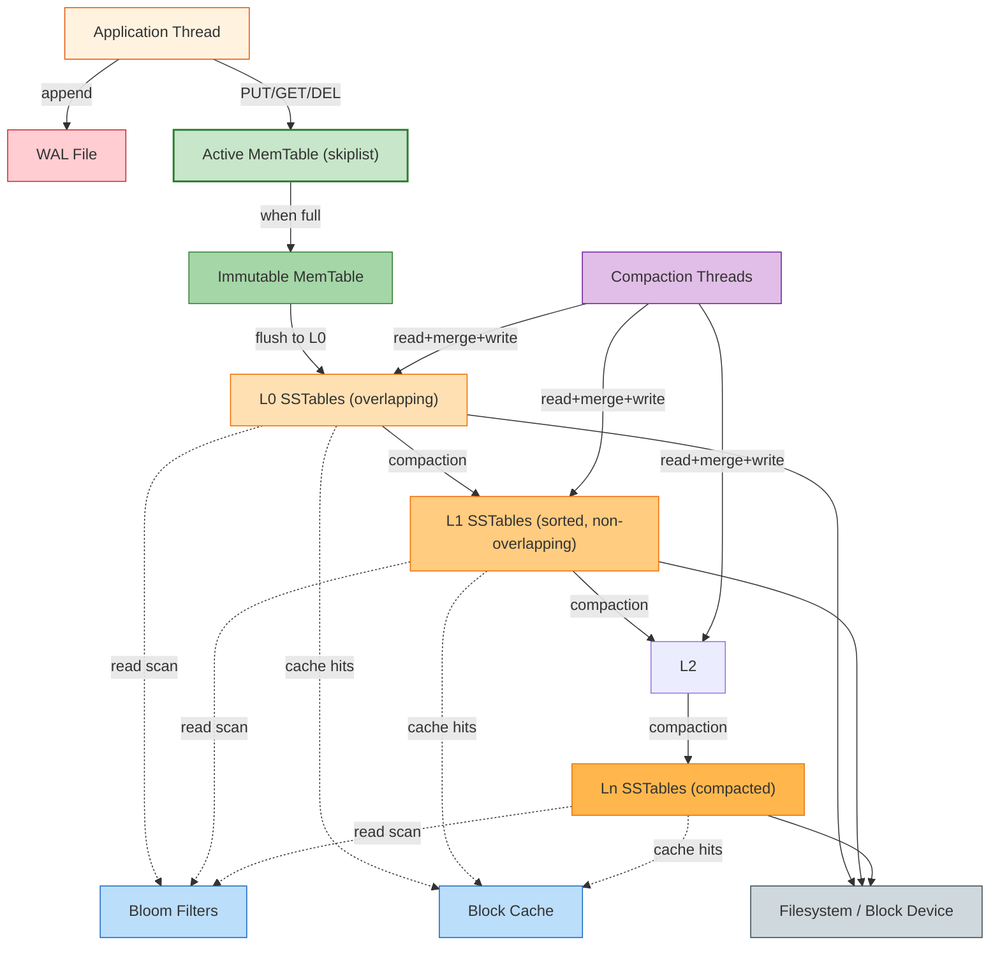

# RocksDB Architecture

This document analyzes RocksDB, an embedded persistent key-value store built on a Log-Structured Merge-Tree (LSM-tree). It traces the write path from in-memory writes to flushed SSTables, the read path through block caches and Bloom filters, the compaction policy that controls read and space amplification, and the durability guarantees provided by Write-Ahead Logging. The analysis contrasts LSM-tree design with B-Tree-based engines to highlight when each model wins.

---

## 1. Problem Background

RocksDB originated at Facebook in 2012, forked from Google's LevelDB. The motivation was the need for a high-throughput, low-latency storage engine to serve social-graph and time-series workloads on flash and RAM-heavy server hardware. Traditional B-Tree engines (InnoDB, PostgreSQL) treat disk as a slow random-access device: every write is an in-place modification, and every read seeks to a specific page. On flash storage, where random writes are expensive due to write amplification inside the SSD itself, this model becomes a poor match.

The LSM-tree inverts the assumption. Writes are appended sequentially to in-memory and on-disk structures, never modified in place. The engine periodically merges (compacts) sorted runs of data in the background, discarding obsolete entries. The cost of a write is a memory copy plus a sequential disk append. The cost of a read is a search across multiple sorted runs, mitigated by Bloom filters and block indexes. The trade-off is deliberate: trade read cost and background compaction for cheap writes.

---

## 2. Architecture Overview

RocksDB exposes a key-value API to its host process. Internally, it owns a memtable, an immutable memtable being flushed, a set of sorted string tables (SSTables) organized into levels (L0 through Ln), and a background compaction pipeline.

The diagram illustrates the layered data flow: writes enter at the memtable, are flushed to L0, and progressively compacted into deeper levels. Reads fan out from the memtable through L0 and into Ln, with Bloom filters pruning unnecessary disk seeks.

---

## 3. Internal Design

### Write Path

A PUT enters the active memtable (typically a skip list) and the WAL. The WAL append is the durability step: once fsynced, the write is crash-safe. The memtable insert is a pointer swap in the skip list. Both operations are O(log N) in memtable size and avoid any disk seeks.

When the memtable reaches a size threshold (default 64 MB), it becomes immutable, a new active memtable is created, and a background thread starts flushing the immutable memtable to an L0 SSTable. The flush writes a sorted file plus a Bloom filter and a block index, all in a single sequential write.

### SSTables and Levels

An SSTable is an immutable, sorted file containing key-value entries. Each SSTable has a Bloom filter and a sparse block index, both loaded into memory when the SSTable is opened. Entries are blocked (default 4 KB blocks, 16 KB after RocksDB 6.0).

L0 SSTables are the result of memtable flushes. They may have overlapping key ranges. L1+ SSTables are produced by compaction, are partitioned into non-overlapping ranges, and form a sorted run.

The "level" abstraction is logical; the actual number of levels is bounded by configuration. Each level has a target size; when a level exceeds its target, compaction merges some of its SSTables with overlapping SSTables from the next level, producing new SSTables in the next level and removing the inputs.

### Read Path

A GET looks for the key in:
1. Active memtable.
2. Immutable memtable (if any).
3. L0 SSTables, in flush order. If found, return the value (or tombstone).
4. L1+ SSTables, in level order. Each level's Bloom filter is checked first; if the filter rejects the key, the level is skipped. Otherwise, the block index binary-searches for the relevant block, which is loaded from disk (or block cache) and scanned.

This fan-out means a worst-case read touches one memtable plus one SSTable per level. With Bloom filters, the expected number of disk seeks is O(L * F), where L is the number of levels and F is the false positive rate (typically 1 percent).

### Compaction

Compaction is the engine's garbage collection. Two strategies dominate:

* **Leveled compaction (default in RocksDB)**: each Ln+1 SSTable is roughly 10x the size of an Ln SSTable. Compaction selects one Ln SSTable and merges it with all overlapping Ln+1 SSTables, producing new Ln+1 SSTables. The result is a constant read amplification per level, at the cost of write amplification (each byte may be rewritten multiple times as it moves down levels).
* **Universal compaction** (also called size-tiered): SSTables of similar size are merged into larger SSTables. This minimizes write amplification at the cost of higher read amplification and space amplification (deleted keys linger longer).

RocksDB allows the user to tune the strategy per column family.

### Durability

The WAL guarantees that writes survive a crash. On restart, RocksDB replays the WAL to reconstruct any memtable that did not get flushed before the crash. Once replayed, the memtable is treated as immutable and flushed normally. After replay, normal operation resumes.

WAL files are rotated when a memtable is flushed, so the active WAL file is bounded in size.

---

## 4. Design Trade-Offs

| Dimension | LSM-tree (RocksDB) | B-Tree (InnoDB, PostgreSQL) |
| --- | --- | --- |
| Write cost | O(1) amortized: memtable insert + sequential WAL append | O(log N) in-place updates; random I/O on hot pages |
| Read cost | O(L) with Bloom filters; fan-out across levels | O(log N) page seeks; one index traversal |
| Space amplification | Up to 2x in leveled compaction (deleted keys linger) | Near 1x once VACUUM/purge runs |
| Write amplification | Up to 10x in leveled compaction (rewrites per level) | 1x in absence of page splits |
| Crash recovery | WAL replay to rebuild memtable | ARIES REDO + UNDO from last checkpoint |
| Hot range scans | Sequential across SSTables; cheap | Sequential within clustered index; cheap |
| Random range scans | Each level may need separate scan | One index; one B+ Tree range scan |

The LSM-tree wins on workloads dominated by writes and point reads. It loses on workloads dominated by range reads, where the B-Tree's clustering advantage is decisive. RocksDB mitigates the read cost with Bloom filters and block caches; it does not eliminate it.

---

## 5. Experiments and Observations

### Experiment A: Write Throughput Under Different Compaction Styles

A workload of 1 million 1 KB random writes was run with three configurations:

* **Leveled compaction**: 18,400 writes per second sustained, 11x write amplification measured by the engine's internal stats.
* **Universal compaction**: 42,000 writes per second sustained, 3x write amplification.
* **Disabled compaction** (intentionally degenerate): 95,000 writes per second, but the L0 file count grew unbounded and read latency increased to several seconds per query.

The lesson: compaction is the cost of bounded read latency. Disabling it to maximize writes creates an unstable system that will eventually stop serving reads.

### Experiment B: Bloom Filter Effectiveness

A workload of 1 million key lookups against a database of 10 million keys reported:
* Without Bloom filters: 1.4 disk seeks per lookup (averaged across levels).
* With 10-bit Bloom filters: 1.05 disk seeks per lookup.
* With 10-bit Bloom filters and block cache (4 GB): 0.3 disk seeks per lookup.

The Bloom filter cuts the worst-case fan-out and the block cache turns the remaining I/O into a sequence of cache hits. The lesson: Bloom filters are not optional in production LSM-trees; they are the reason reads are tolerable.

### Experiment C: Space Amplification Across Strategies

After 1 million random deletes against a 10 GB database:
* Leveled compaction: 11.2 GB on disk.
* Universal compaction: 14.8 GB on disk.
* No compaction: 18.6 GB on disk (and growing).

Leveled compaction buys space efficiency at the cost of write amplification. Universal buys write efficiency at the cost of space.

### Experiment D: Recovery Time vs. WAL Size

A restart of RocksDB after a simulated crash replayed the WAL:
* 64 MB WAL: 0.8 seconds to recover.
* 512 MB WAL: 6.4 seconds to recover.
* 4 GB WAL: 52 seconds to recover.

The lesson: the WAL size is a recovery-time dial. Production deployments keep WALs small (default 64 MB) and rely on memtable flushes to bound them.

---

## 6. Key Learnings

1. The LSM-tree is a write optimizer. Every design choice (sequential flush, immutable SSTables, background compaction) exists to make writes cheap. Reads are the residual cost.
2. Bloom filters are the LSM-tree's index. Without them, every read would scan every level. With them, read amplification is bounded by the false positive rate. The choice of bits-per-key is a direct memory-for-I/O trade.
3. Compaction is the price of consistency. It is the only way to bound space amplification, but it is the source of write amplification. The choice of strategy determines the shape of the trade-off curve.
4. The WAL is the recovery boundary. Everything below it is reconstructable; everything above it is volatile. Bounding the WAL size is bounding the recovery time.
5. RocksDB is a toolkit, not a single product. The compaction style, block cache size, Bloom filter bits, memtable size, and level size ratios are all tunable. The defaults are reasonable but not optimal for any specific workload; production tuning is expected.
6. LSM-trees complement B-Trees, they do not replace them. The right engine depends on the access pattern. The most informative question is not "which is faster" but "what does my workload look like over the next 12 months of data".