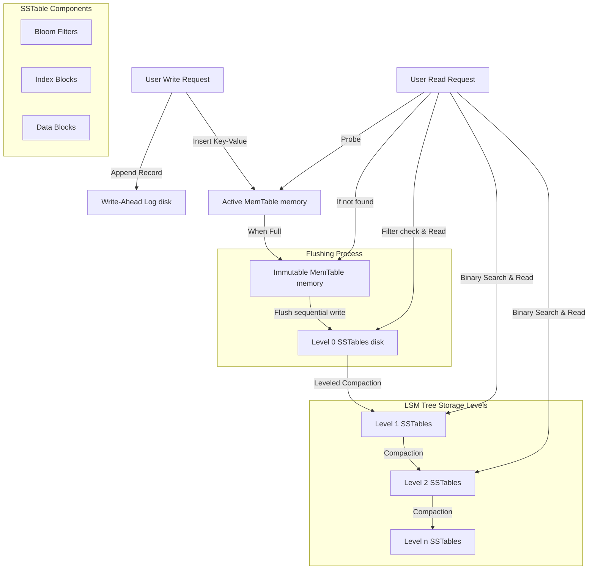

# Advanced DBMS System Design — RocksDB Storage Architecture

## 1. Problem Background

Traditional relational database systems use B-Trees as their primary storage structures. While B-Trees are highly optimized for read operations, they perform poorly under **high-throughput write workloads**. In B-Trees:
- Updates are written in-place, which requires random disk writes.
- On SSDs and HDDs, random write operations suffer from high latency due to page erase cycles and head repositioning.
- In-place writes cause fragmentation and require lock-heavy concurrency control.

To address these limitations, **Log-Structured Merge-Trees (LSM-Trees)** were designed. **RocksDB** (forked from Google's LevelDB by Facebook/Meta) is an embeddable, persistent key-value store optimized for fast storage media (SSDs and NVMs) and highly concurrent write-heavy workloads. It achieves this by converting random writes into high-speed sequential writes.

---

## 2. Architecture Overview

RocksDB operates as an embedded database engine within the application process, utilizing a **Log-Structured Merge-Tree** storage architecture.

### System Components & Data Flow Diagram

---

## 3. Internal Design

### 3.1 Data Flow Paths

#### The Write Path
RocksDB's write path is designed to be extremely fast by avoiding random disk writes:
1. **WAL Append**: When a write request arrives, the key-value pair is written sequentially to the Write-Ahead Log (WAL) on disk to guarantee durability.
2. **MemTable Insertion**: The write is inserted into the active in-memory buffer called the **MemTable** (typically implemented as a concurrent SkipList).
3. **Flushing**: Once the active MemTable reaches its size limit (e.g., 64 MB), it is marked as an **Immutable MemTable**, and a background thread flushes its sorted contents sequentially to disk as a **Level 0 (L0) Sorted String Table (SSTable)** file.

#### The Read Path
Because data is split across memory and disk levels, the read path must check multiple locations in order of database age:
1. **MemTable Check**: Search the active MemTable.
2. **Immutable MemTables**: Search any un-flushed, immutable MemTables.
3. **SSTable Scan**: Search SSTables starting from Level 0 down to Level $n$.
   - **Level 0 Search**: L0 SSTables can have overlapping key ranges, so *all* L0 SSTables must be searched.
   - **Levels 1 to $n$ Search**: For levels $\ge 1$, key ranges do not overlap. The database performs binary search on the level's index to locate the single SSTable containing the key range.

### 3.2 SSTable Structure & Bloom Filters
A **Sorted String Table (SSTable)** file is a partitioned, append-only, sorted binary file.
- **Data Block**: Contains sorted key-value pairs.
- **Index Block**: Maps the boundary keys of data blocks to their physical offsets in the file, enabling fast binary search.
- **Bloom Filters**: To prevent expensive disk reads for keys that do not exist, RocksDB stores a Bloom Filter block inside each SSTable. A Bloom Filter is a space-efficient probabilistic data structure that can determine if a key is *definitely not* in the SSTable, or if it *might be* in the SSTable. This eliminates $> 90\%$ of unnecessary disk probes.

### 3.3 Compaction
Since updates and deletes are appends (deletions are written as "tombstones"), duplicate versions of keys build up across different levels. To reclaim space and maintain read performance, RocksDB uses background threads to perform **Compaction**.
- **Leveled Compaction (Default)**:
  - Each level (L1, L2, etc.) has a maximum size limit (e.g., L1 = 10 MB, L2 = 100 MB, L3 = 1 GB), increasing exponentially by a factor of 10.
  - When Level $i$ exceeds its size limit, RocksDB selects one or more SSTables from Level $i$ and merges them with overlapping SSTables in Level $i+1$, discarding old versions and tombstones.
  - Compaction merges sorted files using a high-speed merge-sort stream, producing new sorted SSTables for Level $i+1$.

---

## 4. Design Trade-Offs (The RUM Conjecture)

Storage engines are bound by the **RUM Conjecture** (Read, Update, and Memory/Space amplification trade-offs):

### 4.1 Write Amplification (WA)
- **Definition**: The ratio of bytes written to physical storage compared to bytes written by the application.
- **LSM-Tree Behavior**: In RocksDB, WA is high (typically 10x to 30x) because data is read, merged, and rewritten repeatedly during background compactions as it moves down through the levels.
- **Impact**: Heavy write amplification can cause SSD write endurance issues over time.

### 4.2 Read Amplification (RA)
- **Definition**: The number of disk reads required to satisfy a single application read query.
- **LSM-Tree Behavior**: Read amplification is high for point-miss queries because the database must check multiple SSTables across levels if the key is missing (partially mitigated by Bloom Filters). For range queries, RA is higher because the engine must run a merge-iterator over multiple SSTables simultaneously.

### 4.3 Space Amplification (SA)
- **Definition**: The ratio of physical disk space occupied by the database to the actual size of the data.
- **LSM-Tree Behavior**: In RocksDB, Space Amplification is low to moderate. Because data is compressed and old versions/deletes are merged during compaction, space utilization is highly efficient compared to B-Trees, which suffer from page fragmentation and internal page free-space overhead.

---

## 5. Architectural Q&A

### Q1: Why are LSM trees preferred in write-heavy workloads?
LSM-Trees eliminate the need for random writes. Every update, insert, and delete is written sequentially to the WAL and cached in memory. Flushing to disk is also a bulk sequential operation. On modern flash memory, sequential writes are significantly faster than random writes, enabling write throughputs that are orders of magnitude higher than B-Trees.

### Q2: Why can compaction become expensive?
Compaction requires reading entire SSTables from disk, merge-sorting them in memory, and writing them back to disk. This consumes massive amounts of disk I/O bandwidth and CPU cycles. Under heavy write spikes, compaction threads may lag behind, leading to a build-up of L0 files. To prevent this, RocksDB will actively throttle incoming user writes (called **write stall**) to allow compaction to catch up, causing latency spikes.

### Q3: How do Bloom Filters improve read performance?
Without Bloom Filters, looking up a key that doesn't exist (a point-miss) would require reading the index blocks and data blocks of multiple SSTables at every level, causing many random disk reads. A Bloom Filter fits in memory. By checking the filter first, RocksDB can instantly skip SSTables that do not contain the key, resolving point-misses at $O(1)$ memory cost and avoiding disk I/O entirely.

---

## 6. Key Learnings

1. **Sequential writes are the key to high write scaling**: By trading random write latency for background merge sorting (compaction), RocksDB achieves write performance that B-Trees cannot match on SSDs.
2. **Read efficiency is bought with memory structures**: High read performance in LSM-Trees is highly dependent on Bloom Filters and Block Cache. Without sufficient RAM to store these filters, read performance degrades rapidly.
3. **There is no free lunch in storage design**: LSM-Trees optimize for writes and space efficiency at the cost of high write amplification and periodic CPU/IO spikes during compaction, highlighting the engineering trade-offs inherent in DBMS design.