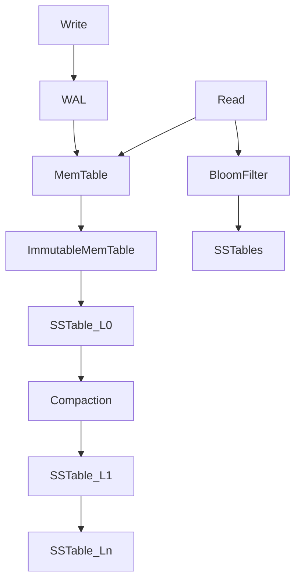

# RocksDB Architecture — LSM-Tree Storage

## 1. Problem Background

Many apps write data constantly — logs, metrics, messaging, metadata. Traditional B-tree databases often do **random disk writes** on updates. That gets slow at high write rates.

**RocksDB** is an embedded key-value store (a fork of LevelDB) built on an **LSM-tree** (Log Structured Merge Tree). It batches writes in memory, flushes them sequentially to disk, and merges files in the background.

I picked this topic because it shows a different trade-off than PostgreSQL/InnoDB: **optimize writes first**, accept more work on reads and compaction later.

---

## 2. Architecture Overview

```
Write  -->  WAL  -->  MemTable  -->  Immutable MemTable  -->  SST files (L0..Ln)
Read   -->  MemTable  +  Bloom filters  -->  SST files (newest to oldest)
Background  -->  Compaction (merge and drop old versions)
```



### Main parts

| Part | Job |
|------|-----|
| WAL | Durability before MemTable flush |
| MemTable | In-memory sorted buffer for new writes |
| Immutable MemTable | Frozen MemTable being flushed |
| SSTable | Sorted string table on disk (read-only file) |
| Levels L0–Ln | Tiered files; L0 overlaps, deeper levels are larger and cleaner |
| Bloom filter | Skip SST files that cannot contain a key |
| Compaction | Merge files, remove duplicates and tombstones |

---

## 3. Internal Design

### Write path

1. Append write to **WAL** (crash safety)
2. Insert into active **MemTable** (in-memory skip list / sorted structure)
3. When MemTable is full → mark **immutable** → new MemTable for writes
4. Flush immutable MemTable to a new **SST file** (often level L0)

Writes are mostly **sequential** — that is why LSM-trees handle write-heavy loads well.

### Read path

1. Check active MemTable and immutable MemTables
2. Check SST files from L0 down to Ln
3. **Bloom filters** skip files that definitely do not have the key
4. Return the newest version of the key found

Reads can touch **many files** — especially before compaction catches up. That is the main read cost.

### Levels (L0 to Ln)

- **L0:** files can overlap key ranges; reads may check several files
- **L1+:** non-overlapping ranges within a level; compaction pushes data deeper
- Deeper levels hold more data per file — fewer files to search if compaction keeps up

### Compaction

Over time, updates and deletes leave old entries in older SST files. **Compaction** merges files into new ones and drops stale keys.

**Why it is required:** without compaction, reads get slower and disk usage grows (space amplification).

**Trade-off:** compaction uses CPU and disk I/O — can cause latency spikes.

### Amplification (what benchmarks measure)

- **Write amplification** — bytes written to disk per byte of user data
- **Read amplification** — disk reads per logical read
- **Space amplification** — disk used vs live data size

LSM-trees accept higher write amplification early to avoid random writes.

---

## 4. Design Trade-Offs

| Choice | Pros | Cons |
|--------|------|------|
| LSM vs B-tree | Fast sequential writes | Reads may scan many files |
| MemTable | Absorb write bursts | RAM limit; flush pauses |
| Compaction | Cleans old data | Background I/O spikes |
| Bloom filters | Faster reads | Extra memory per file |
| Embedded library | No server to run | App manages tuning |

### Why LSM for write-heavy workloads

Appends to WAL + MemTable avoid random disk seeks. Flushes and compaction are sequential. Good for time-series, queues, and KV caches.

### Why compaction can hurt

If writes outpace compaction, L0 file count grows → every read checks more files. Tuning compaction threads and level sizes matters.

### Bloom filters

Each SST file can store a Bloom filter per key range. On read, if the filter says “key not here,” RocksDB skips opening that file. Big win when many SST files exist.

---

## 5. Experiments / Observations

I built RocksDB from source and ran a small C++ program using `librocksdb.so`.

### Experiment 1 — Write and read speed

Program: 100,000 puts (100-byte values), flush, then 10,000 gets.

**Output:**
```
WRITES: 100000 keys in 441 ms
READS: 10000 lookups, 10000 hits in 40 ms
DB path: /tmp/rocksdb_demo_db
```

**What I learned:**
- Writes batch in memory first — 100k inserts in under half a second
- After flush, reads still fast because keys are in MemTable and on disk
- Sequential write pattern fits LSM design

---

### Experiment 2 — Files on disk after flush

```bash
ls /tmp/rocksdb_demo_db/
```

**Output:**
```
000008.log      (WAL)
000009.sst      (SSTable — flushed sorted data)
MANIFEST-000005 (metadata: which files are live)
LOG             (RocksDB log)
CURRENT, IDENTITY, LOCK, OPTIONS-000007
```

**What I learned:**
- WAL exists before data is in SST form
- One `.sst` file appeared after flush — sorted on-disk store
- Manifest tracks the set of active files (LSM metadata)

---

### Experiment 3 — SST file count

```bash
find /tmp/rocksdb_demo_db -name "*.sst" | wc -l
```

**Output:** `1`

**What I learned:**
- After one MemTable flush, one SST file holds the data
- More writes without compaction would add more L0 files
- That is when read amplification and compaction pressure rise — matches the theory

---

## 6. Key Learnings

1. LSM-trees trade random writes for sequential writes + later merging.
2. MemTable absorbs bursts; SST files are the durable sorted storage.
3. WAL protects data before flush — same log-first idea as PostgreSQL WAL / InnoDB redo.
4. Compaction is not optional — it keeps reads and disk usage under control.
5. Bloom filters are a practical fix for “too many SST files to check.”
6. RocksDB fits embedded write-heavy KV workloads; PostgreSQL fits rich SQL and multi-user OLTP.
7. Pick storage design based on read/write shape, not buzzwords.

---

## References

- [RocksDB Wiki](https://github.com/facebook/rocksdb/wiki)
- [RocksDB Write Path](https://github.com/facebook/rocksdb/wiki/Write-Ahead-Log)
- [Leveled Compaction](https://github.com/facebook/rocksdb/wiki/Leveled-Compaction)
- [Bloom Filter](https://github.com/facebook/rocksdb/wiki/RocksDB-Bloom-Filter)
