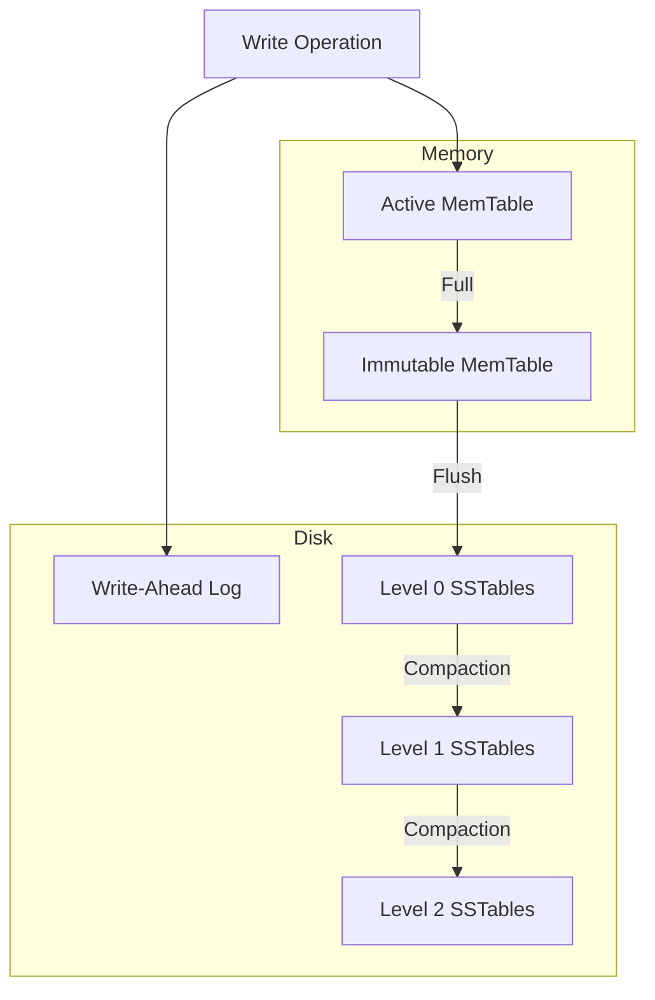

# RocksDB Architecture

## 1. Problem Background
Traditional database engines like InnoDB and PostgreSQL rely heavily on B-Tree variants for storage. While B-Trees offer excellent read performance, they suffer from high "Write Amplification" during heavy random write workloads, as updating a single row can force the rewriting of entire 16KB/8KB disk pages.
RocksDB was built by Facebook as a high-performance embedded database for key-value data, optimized for fast storage (SSDs) and write-heavy workloads. It achieves this by using a Log-Structured Merge-Tree (LSM-Tree) architecture.

## 2. Architecture Overview
Data in RocksDB flows from memory to disk in a tiered manner.

## 3. Internal Design

### Write Path (MemTable and WAL)
When a write comes in, it is appended to a Write-Ahead Log (WAL) for durability and then inserted into an in-memory data structure called the `MemTable` (usually a SkipList). Because these are both sequential appends, writes are incredibly fast.

### Immutable MemTable and SSTables
When the `MemTable` fills up, it becomes immutable and a new one is created. A background thread flushes the immutable MemTable to disk as an SSTable (Sorted String Table) at Level 0.

### Read Path and Bloom Filters
To read a key, RocksDB checks the Active MemTable -> Immutable MemTable -> Level 0 SSTables -> Level 1 SSTables, etc.
Because searching multiple SSTables on disk is slow, RocksDB relies heavily on **Bloom Filters** attached to the SSTables. The Bloom Filter can instantly tell if a key is *definitely not* in an SSTable, saving an expensive disk read.

### Compaction
Over time, SSTables accumulate. A background process called "Compaction" merges SSTables from lower levels into higher levels, throwing away deleted keys (tombstones) and older versions of updated keys.

## 4. Design Trade-Offs
*   **Write Amplification vs Space/Read Amplification:** LSM-Trees are optimized for writes. B-Trees rewrite pages in place, but LSM-Trees constantly merge and rewrite data in the background (Compaction).
*   RocksDB trades some read latency (reads might have to check multiple levels) and CPU utilization (compaction is CPU intensive) in exchange for massive write throughput and efficient use of SSD lifespans by converting random writes into sequential writes.

## 5. Experiments / Observations
Running the `db_bench` tool provided by RocksDB allows testing different compaction strategies.
*   **Leveled Compaction (Default):** Minimizes space amplification but increases write amplification.
*   **Universal Compaction:** Can lower write amplification but temporarily requires more disk space (Space Amplification).
Observation: Under heavy random write loads, RocksDB vastly outperforms B-Tree engines, but read latency can have higher tail percentiles if a read misses the block cache and has to inspect multiple SSTables.

## 6. Key Learnings
*   LSM-Trees are the standard for write-heavy data systems today (Cassandra, LevelDB, RocksDB).
*   Compaction is the necessary tax paid to maintain read performance and reclaim disk space in an append-only architecture.
*   Bloom Filters are critical in LSM-Trees; without them, read performance would be completely unacceptable due to checking multiple files.
