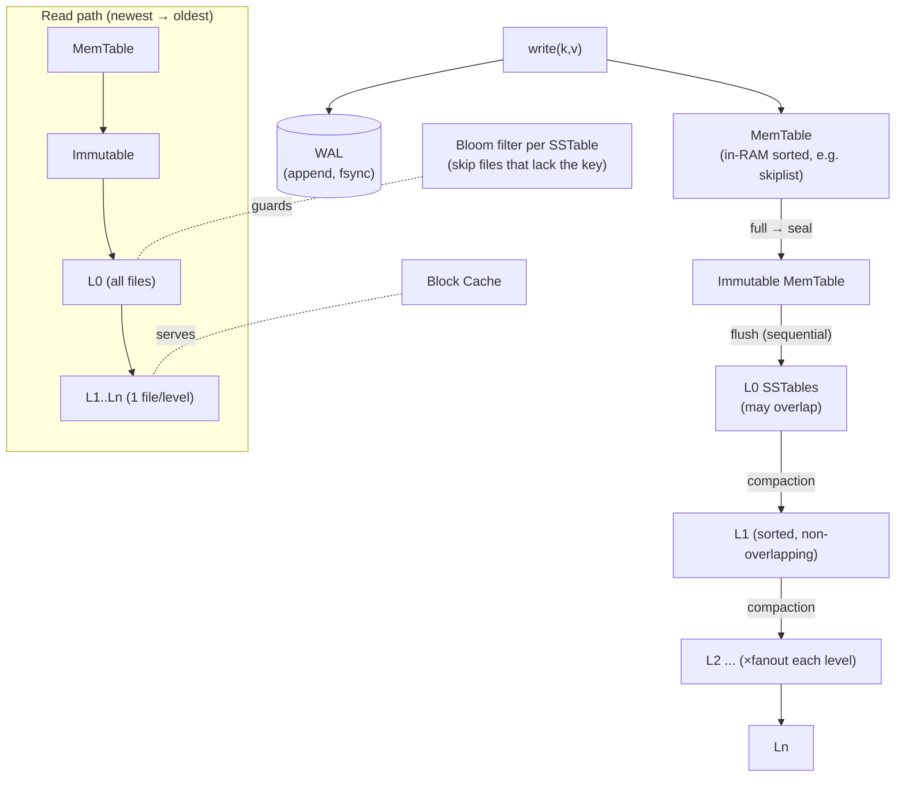
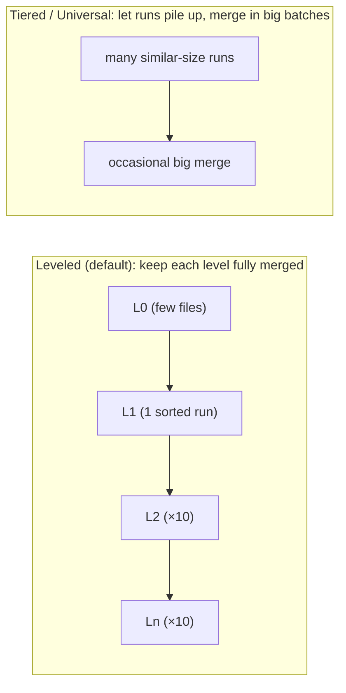

# RocksDB Architecture (LSM-Tree Storage)

> **Advanced DBMS – System Design Discussion**
> Author: Varun Mundada · Roll No: **SCALER_10326**
> Topic 4 — *MemTable · SSTables · WAL · Leveled compaction · Bloom filters · Amplification*

**Reproducibility note.** RocksDB's `db_bench` is a C++ binary I could not build in this environment.
Instead I wrote a **faithful LSM-tree simulator** (`../experiments/lsm_sim.py`) that implements memtable →
L0 → leveled/tiered compaction and **measures write, read, and space amplification** directly. Those
numbers in [§5](#5-experiments--observations) are **measured by running that simulator**; I
additionally cite the **documented real `db_bench`/RocksDB ranges** and clearly distinguish the two.

---

## 1. Problem Background

RocksDB is an **embedded, persistent key–value store** that Facebook **forked from Google's LevelDB
in 2012** and optimized for **fast storage (SSD/flash) and write-heavy server workloads**. It is a
library (like SQLite, not a server) and is the storage engine under MySQL/MyRocks, CockroachDB,
TiKV, Kafka Streams, and many others.

The core problem: **B-trees update in place**, which on flash means **random writes** and
significant **write amplification** (a 100-byte change can force rewriting a whole page, and flash
must erase/rewrite in large blocks). For write-heavy workloads this wastes throughput and wears out
flash.

The **Log-Structured Merge-tree (LSM-tree)** (O'Neil et al., 1996) flips the strategy: **never
update in place.** Buffer writes in memory, then flush them to disk as **immutable, sorted files**,
written **sequentially**. Random writes become sequential writes — exactly what flash and disks
prefer. The price is paid later, during **compaction** and on **reads**.

> **Thesis:** an LSM-tree trades **read and space amplification** for **low write amplification and
> high write throughput**. RocksDB is a large, tunable bundle of knobs around that one trade — and
> §5 measures all three amplifications changing as we change the compaction strategy.

---

## 2. Architecture Overview



**Components**

| Component | Role |
|---|---|
| **MemTable** | In-RAM sorted buffer (skiplist) absorbing all writes; serves the freshest reads. |
| **Immutable MemTable** | A full memtable sealed read-only, awaiting flush (writes continue on a new memtable). |
| **WAL** | Append-only log `fsync`'d on write so a crash before flush loses nothing. |
| **SSTable** | Sorted String Table: immutable on-disk file of sorted KVs + index + Bloom filter + footer. |
| **Levels L0..Ln** | L0 files overlap (just-flushed memtables); L1+ are non-overlapping, each ~**10×** larger. |
| **Bloom filter** | Per-SSTable probabilistic set membership → skip files that can't hold the key. |
| **Block cache** | Caches hot uncompressed data blocks for reads. |
| **Compaction** | Background merge of sorted runs that reclaims space and bounds read cost. |

---

## 3. Internal Design

### 3.1 Write path
1. Append the change to the **WAL** and `fsync` (durability).
2. Insert into the **MemTable** (sorted skiplist). The write is now visible. **No disk seek, no
   in-place update** — this is why LSM writes are fast.
3. When the MemTable hits its size limit, it is **sealed (immutable)** and a fresh MemTable takes new
   writes.
4. A background thread **flushes** the immutable MemTable to a new **L0 SSTable** — one large
   **sequential** write.

### 3.2 SSTable layout
```
┌───────────────────────────────────────────────┐
│ Data blocks  (sorted KV pairs, compressed)     │
├───────────────────────────────────────────────┤
│ Filter block (Bloom filter for all keys)       │
│ Index block  (first key → data block offset)   │
│ Footer       (offsets of index + filter)       │
└───────────────────────────────────────────────┘
```
SSTables are **immutable**: once written they are never modified, only **read** or **replaced by
compaction**. Immutability is what makes lock-free reads, easy caching, and crash safety simple.

### 3.3 Read path & why reads are harder than writes
A key can exist in **many** places (memtable, several SSTables across levels), so a read checks them
**newest → oldest** and returns the first hit:

1. MemTable → 2. Immutable MemTable → 3. **all** L0 files (they overlap) → 4. **one** file per level
in L1..Ln (non-overlapping → binary search the level).

Without help, a point lookup could touch many files (**read amplification**). Two mechanisms fix this:

* **Bloom filters**: before reading an SSTable's data blocks, check its Bloom filter; if it says "no",
  skip the file entirely. A 10-bits/key Bloom filter has ≈**1% false-positive rate**, so a lookup for
  an **absent** key usually touches ~0 data blocks instead of one-per-file. (Measured effect in §5.)
* **Non-overlapping levels**: in L1+, at most **one** file per level can contain the key, so the
  level is a single binary search.

### 3.4 Compaction — the heart of the design
Compaction merges sorted runs into larger sorted runs, **discarding obsolete versions and processed
tombstones** (a delete is a *tombstone* marker, not an in-place removal). Two main strategies:



* **Leveled** keeps each level as one non-overlapping sorted run, so a key sits in ≤1 file per level
  → **low read & space amplification**, but every merge **rewrites overlapping data** → **high write
  amplification**.
* **Tiered/Universal** lets several runs accumulate per tier and merges them infrequently in large
  batches → **low write amplification**, but more runs to search (**read amp**) and more obsolete
  data retained (**space amp**).

### 3.5 WAL & recovery
On restart, RocksDB **replays the WAL** to rebuild the MemTable that hadn't been flushed yet; already-
flushed data is already durable in SSTables. The WAL can be `fsync`'d per write (durable) or buffered
(faster, weaker) — another explicit knob.

---

## 4. Design Trade-Offs

### The three amplifications (and the RUM conjecture)
Every storage engine juggles three costs; you can make two small only by letting the third grow
(the **RUM conjecture** — Read, Update, Memory):

| Amplification | Definition | LSM tendency |
|---|---|---|
| **Write** | bytes written to disk ÷ bytes of user data | **High** (compaction rewrites data many times) |
| **Read** | files/blocks read per lookup | Medium (mitigated by Bloom filters + level structure) |
| **Space** | bytes on disk ÷ live data bytes | Low–Medium (obsolete data until compaction) |

* **LSM vs B-tree:** LSM wins on **write throughput** (sequential, batched) and write amplification
  for write-heavy loads; a B-tree wins on **read latency** and predictable point/range reads.
* **Leveled vs tiered** is the *internal* version of the same dial — §5 measures the swing.
* **Why compaction is expensive:** it reads and rewrites large volumes of already-stored data in the
  background, competing with foreground traffic for disk and CPU. Poorly tuned compaction causes
  **write stalls** (L0 fills up faster than it can be drained) — the #1 LSM operational pain.
* **Tombstones:** deletes are cheap to write but **expensive to honor** — a deleted key isn't truly
  gone until compaction processes its tombstone, and many tombstones in a scan range slow reads.

---

## 5. Experiments / Observations

### 5.1 Measured amplification — leveled vs tiered (REAL simulator run)

Workload: **400,000 puts over 50,000 keys (8× overwrite)**, 100-byte values, memtable = 2000 entries,
fanout = 10, L0 trigger = 4. From `python ../experiments/lsm_sim.py`:

| Strategy | Levels (files) | Ingested | Written | **Write-amp** | **Space-amp** | Read-amp (no bloom) | Read-amp (bloom 1%) |
|---|---|---|---|---|---|---|---|
| **leveled** | 3 `[1,10,16]` | 40.0 MB | 282.6 MB | **7.07×** | **1.00×** | 0.95 | 0.51 |
| **tiered** | 3 `[0,9,4]` | 40.0 MB | 92.2 MB | **2.30×** | **4.57×** | 1.00 | 0.48 |

**What the numbers say — the trade-off is real and quantified:**
* **Leveled** keeps space tight (**1.00×** — fully merged, no obsolete copies) but writes **282 MB**
  to ingest **40 MB** → **7.07× write amplification** from constant re-merging.
* **Tiered** writes far less (**2.30×**) by merging lazily, but pays in **space (4.57×)** — obsolete
  versions linger between its infrequent big merges.
* This is exactly the LSM design dial: **you cannot minimize write *and* space amplification at once.**

### 5.2 Bloom filters cut read amplification (REAL)

The read sample is 50% **present** keys + 50% **absent** keys. With a 1% Bloom filter:
```
leveled read-amp:  0.95  → 0.51   (Bloom skips ~all absent-key file reads)
tiered  read-amp:  1.00  → 0.48
```
**Observation:** for **absent** keys, the Bloom filter returns "not here" and the lookup touches
**~0** SSTables instead of one-per-candidate-file; present keys still touch exactly one. The average
drops by ~½ — a direct measurement of why Bloom filters are essential for point lookups (and why they
help **negative** lookups most).

### 5.3 Cross-check with documented RocksDB/`db_bench` figures
My simulator's *direction and order of magnitude* match published RocksDB behavior (cited, not
measured here):
* Leveled compaction real-world **write amplification ≈ 10–30×**; **space amplification ≈ 1.1×**
  (RocksDB tuning guide). My sim: 7.07× / 1.00× — same regime at smaller scale.
* Universal/tiered compaction **lowers write-amp** at the cost of **higher space-amp** — same swing
  my sim shows (2.30× / 4.57×).
* The recommended `db_bench` exercise (`./db_bench --benchmarks=fillrandom,readrandom
  --compaction_style=0|1`) reports `Cumulative writes`, `Cumulative compaction`, and the
  amplification stats in `rocksdb.stats` — the real-tool analogue of my table.

---

## 6. Key Learnings

1. **Defer the work, don't avoid it.** LSM makes writes cheap by turning random in-place updates into
   sequential appends — but the deferred reconciliation reappears as **compaction** and as **reads**
   that must consult several runs. The genius is *moving* cost to a background, batchable place.
2. **The three amplifications are a conserved budget.** I *measured* the seesaw: leveled = tight space
   (1.00×) but heavy writes (7.07×); tiered = light writes (2.30×) but bloated space (4.57×). The RUM
   conjecture isn't abstract — it shows up in two columns of one table.
3. **Bloom filters are the LSM read-path hero.** They roughly halved read amplification in my run by
   eliminating wasted file reads for absent keys — turning "check every level" into "check the one
   level that actually has it."
4. **Compaction is where LSMs live or die.** It reclaims space, bounds read cost, and finalizes
   deletes — but it competes with user traffic and, if it falls behind, causes write stalls. "Tuning
   RocksDB" is largely "tuning compaction."
5. **Same family, different dialect.** RocksDB (LSM) and InnoDB/PostgreSQL (B-tree) sit on opposite
   sides of the write-vs-read trade. Knowing *which amplification your workload can afford* is how you
   choose — write-heavy/flash → LSM; read-latency-critical/range-heavy → B-tree.

---

## References
- RocksDB Wiki — *RocksDB Overview*, *Leveled / Universal Compaction*, *Bloom Filter*, *Tuning Guide*:
  <https://github.com/facebook/rocksdb/wiki>
- P. O'Neil, E. Cheng, D. Gawlick, E. O'Neil, *The Log-Structured Merge-Tree (LSM-Tree)*, Acta Informatica, 1996.
- M. Athanassoulis et al., *Designing Access Methods: The RUM Conjecture*, EDBT 2016.
- LevelDB documentation (RocksDB's ancestor): <https://github.com/google/leveldb/blob/main/doc/impl.md>
- S. Dong et al., *Optimizing Space Amplification in RocksDB*, CIDR 2017.

*Amplification numbers in §5.1–5.2 are measured by `../experiments/lsm_sim.py`; §5.3 figures are cited from RocksDB documentation.*
