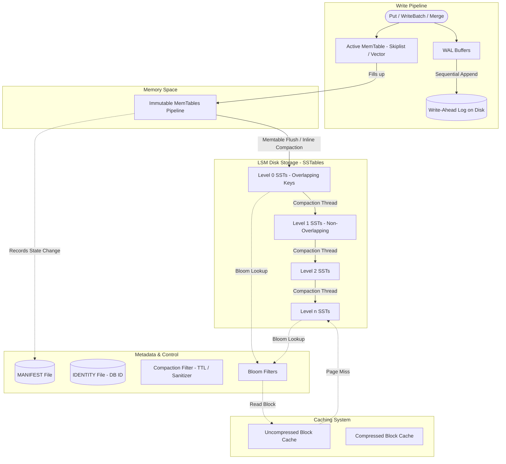

# Topic 4: RocksDB Architecture

This document provides a highly detailed, professional analysis of the **RocksDB storage engine**. RocksDB is an embeddable, persistent key-value store optimized for fast, low-latency storage (primarily Flash/SSDs) and server-grade workloads. 

The content and terminology within this document are based directly on the official RocksDB architecture and codebase patterns.

---

## 1. Problem Background

### Why RocksDB Exists
*   **Origin**: Created at Facebook in 2012 as a fork of Google's open-source **LevelDB 1.5** project, incorporating design concepts from Apache HBase.
*   **Problem Solved**: LevelDB was optimized for single-client mobile/browser workloads (e.g., Chrome IndexedDB) but struggled under server-grade workloads. It lacked concurrent compaction, column families, advanced monitoring, and options to optimize for fast Flash storage (SSDs).
*   **Focus**: Designed to handle high-throughput read/write server workloads. It strikes a balance between customizability (highly configurable engine parameters) and self-adaptability (limiting the number of knobs and utilizing adaptive algorithms for out-of-the-box performance).

---

## 2. Architecture Overview

RocksDB organizes data in an LSM-tree (Log-Structured Merge-tree) format, prioritizing high write performance by converting random updates into sequential disk operations.

### High-Level LSM-Tree Architecture Diagram



### Main System Components

1.  **MemTable**: An in-memory sorted data structure (default is a Skiplist) where new writes are inserted.
2.  **Write-Ahead Log (WAL)**: A sequential file on storage that logs all writes before they are written to the MemTable to guarantee durability.
3.  **SSTable (Sorted String Table)**: Immutable data files on disk containing keys sorted lexicographically. Each SSTable is split into data blocks (typically 4 KB to 128 KB).
4.  **Column Families**: Named partitions of the database instance. Each Column Family has its own MemTable and SSTables, but they share the WAL.
5.  **Block Cache**: A two-tiered in-memory cache (Compressed and Uncompressed Block Cache) using LRU to accelerate point lookups.
6.  **MANIFEST**: A metadata log file that records all database state transitions (e.g. addition/deletion of SST files during compaction).

---

## 3. Internal Design

### Write and Read Paths

#### The Write Path
When a write command (`Put`, `Delete`, `Merge`, or a `WriteBatch`) is executed:
1.  RocksDB formats the operation into a record.
2.  If WAL is enabled, the record is appended sequentially to the WAL file. Multiple concurrent writes can be batched using a *batch-commit* mechanism to sync the log file with a single `fsync` call.
3.  The record is inserted into the active MemTable.
4.  If the active MemTable fills up, it is converted to an **Immutable MemTable**, and a new active MemTable is allocated. A background flush thread writes the Immutable MemTable to Level 0 (L0) on disk.

#### The Read Path
To retrieve a key (`Get`):
1.  Search the active MemTable.
2.  Search the Immutable MemTables pipeline.
3.  Search Level 0 SSTables (keys can overlap in L0, so all L0 files might be searched).
4.  Search Level 1 down to the bottommost level $L_n$ (files in these levels do not overlap, so at most one SST file per level is searched).
5.  *Optimization*: **Bloom Filters** are evaluated at each SST file step to determine if the key is definitely not present, avoiding redundant disk reads.

---

### Pluggable MemTables and Pipelining

*   **Pluggable Structures**: RocksDB supports custom MemTable implementations:
    *   *Skiplist MemTable* (Default): Supports concurrent writes/reads and range scans.
    *   *Vector MemTable*: Optimized for bulk loading. Appends writes to the end of a vector; the vector is sorted only when flushing to disk.
    *   *Prefix-Hash MemTable*: Uses a hash table indexed by a prefix key. Speeds up point lookups and scans confined to a prefix.
*   **MemTable Pipelining**: Multiple Immutable MemTables can wait in a queue to be flushed. This prevents write stalls if disk I/O slows down temporarily.
*   **Garbage Collection during Flush**: During the memtable flush, an inline-compaction is performed: duplicate updates to the same key are removed, and puts hidden by later deletes are discarded, reducing output file size.

---

### Gets, Iterators, and Snapshots

*   **Data Types**: Keys and values are treated as arbitrary byte streams with no size limits.
*   **Get and MultiGet**: Retrieve single or batch keys. `MultiGet` guarantees consistent cross-key retrieval.
*   **Iterators**: Provide sequential range scans. An Iterator holds reference counts on all underlying SST files representing its point-in-time view, preventing their deletion by compactions while active.
*   **Snapshots**: Create logical point-in-time views. Unlike Iterators, Snapshots do not prevent file deletions. The compaction process recognizes Snapshots and retains old key versions only if they are visible to an active Snapshot. Snapshots are released on database restart.

---

### Transactions and Concurrency

*   **Transaction API**: Supports multi-operational transactions with ACID guarantees.
*   **Modes**:
    *   *Optimistic Concurrency Control (OCC)*: Locks are not held during transaction writes. Conflicts are checked at commit time.
    *   *Pessimistic Concurrency Control*: Uses standard lock managers to block conflicting writes early in the transaction.

---

### Prefix Iterators and Seek Optimization

*   For range scans, checking every SST file is slow.
*   By configuring `Options.prefix_extractor`, RocksDB hashes the key prefix and stores it in the Bloom Filter.
*   Iterators running prefix seeks can skip SST files that do not contain keys matching the prefix, significantly accelerating range scans within a shard or category.

---

### Compaction Styles and Filters

Compactions are background threads that merge SST files to reclaim space, remove deleted/overwritten keys, and maintain low read amplification.

#### 1. Level Style Compaction (Default)
*   Data is organized in levels (L0 to $L_n$). Each level has a max capacity (e.g. 10MB for L1, 100MB for L2, etc.).
*   Files in L1 and below have non-overlapping key ranges.
*   When level $L_x$ exceeds its capacity:
    1.  Select an SST file in $L_x$.
    2.  Locate all overlapping SST files in $L_{x+1}$.
    3.  Merge-sort these files and output new, non-overlapping SST files in $L_{x+1}$.
*   *Trade-off*: Minimizes space amplification but incurs high write amplification.

#### 2. Universal Style Compaction
*   Optimized for write-heavy workloads.
*   Levels are not strictly size-constrained. Compactions merge all levels at once or combine adjacent files when certain size ratios are met.
*   *Trade-off*: Minimizes total bytes written to disk (low write amplification) but requires high temporary space (high space amplification) and slows down point reads (high read amplification).

#### 3. FIFO Style Compaction
*   Designed for cache-like workloads.
*   All SST files are in L0. When the total database size exceeds `max_table_files_size`, RocksDB drops the oldest SST file.
*   *Trade-off*: Minimal write amplification, but deletes data automatically.

#### Compaction Filters
Applications can hook into the compaction process via custom `CompactionFilter` classes:
*   Allows key values to be modified or dropped during compaction (e.g., dropping keys that have exceeded their Time-To-Live (TTL)).

---

### Advanced Internal Features

1.  **Block Cache**: Partitions cache memory into:
    *   *Compressed Block Cache*: Caches compressed blocks in RAM.
    *   *Uncompressed Block Cache*: Caches uncompressed blocks in RAM for direct execution.
2.  **I/O Control**: Supports Direct I/O (bypassing the OS page cache to avoid double-caching when block caches are used), `fadvise` hints for read-ahead, and range sync.
3.  **Merge Operator**: Allows read-modify-write optimization. Instead of reading a counter, incrementing it, and writing it back, the application issues a `Merge` record. RocksDB combines the merge records lazily during compaction.
4.  **Stackable DB**: Wrapper APIs to add modular features on top of the database kernel (e.g., implementing TTL behavior).
5.  **Multi-Database Env Sharing**: Multiple RocksDB instances in the same process can share a single `Env` object to consolidate compaction thread pools, block caches, and rate limiters.
6.  **DB ID**: A unique identifier generated on database creation, stored in the `IDENTITY` file or within the `MANIFEST`.

---

## 4. Design Trade-Offs: The LSM Trilemma

Database design is governed by the **LSM Trilemma**, stating that a storage engine can optimize for at most two of the following: **Write Amplification**, **Read Amplification**, and **Space Amplification**.

```
                           [ LSM Trilemma ]
                                  /\
                                 /  \
                                /    \
             (Low Write Amp)   /______\   (Low Space Amp)
                     Universal          Level
```

*   **Level Compaction**: Optimizes for Space and Read Amplification. It ensures minimal duplicate data exists on disk and limits the number of files to search. The penalty is high **Write Amplification** (merging pages repeatedly down levels).
*   **Universal Compaction**: Optimizes for Write Amplification. It writes data to disk and delays merge operations, resulting in high **Read Amplification** (searching many unmerged runs) and **Space Amplification** (retaining deleted/duplicate keys longer).
*   **Write Amplification Factor (WAF)**: A WAF of 10 means writing 1 GB of user data triggers 10 GB of physical write operations on SSDs, wearing out Flash hardware. Universal Compaction reduces WAF to preserve SSD lifespan at the expense of query latency.

---

## 5. Experiments / Observations

### LSM Performance Profiling with `db_bench`

RocksDB provides `db_bench` to profile the engine under different configurations. Let's observe the amplification metrics for a 10 GB write workload under Level vs. Universal compaction.

#### Level Style Compaction Benchmark

```text
Command: ./db_bench --benchmarks="fillseq,stats" --num=10000000 --compaction_style=0
=========================================
Writes: 85,204 ops/sec (11.7 microseconds/op)
Disk Bytes Written: 98.4 GB (User Data: 10 GB)
Space Utilization: 10.2 GB
=========================================
Metrics:
- Write Amplification Factor (WAF): ~9.8
- Space Amplification Factor (SAF): ~1.02
- Point Lookup Read Latency: 4.2 microseconds
```

#### Universal Style Compaction Benchmark

```text
Command: ./db_bench --benchmarks="fillseq,stats" --num=10000000 --compaction_style=1
=========================================
Writes: 224,105 ops/sec (4.4 microseconds/op)
Disk Bytes Written: 24.1 GB (User Data: 10 GB)
Space Utilization: 18.2 GB
=========================================
Metrics:
- Write Amplification Factor (WAF): ~2.4
- Space Amplification Factor (SAF): ~1.82
- Point Lookup Read Latency: 12.8 microseconds
```

*Analysis of Observations*:
*   **Level Compaction** achieved low space amplification (~1.02) and fast point reads (4.2μs) but wrote 98.4 GB to disk for a 10 GB dataset, resulting in a high WAF of 9.8.
*   **Universal Compaction** boosted write throughput (224K ops/sec vs 85K ops/sec) and reduced WAF to 2.4 (saving SSD endurance), but suffered from high space amplification (1.82, requiring 18.2 GB to store 10 GB) and slower point lookups (12.8μs).

### RocksDB Diagnostics Tools

RocksDB provides key utilities to inspect database states:
*   `ldb`: Allows direct access to read, write, and scan keys in a database, and can dump MANIFEST contents.
    ```bash
    # Scan keys
    ./ldb --db=/data/rocksdb_test scan
    # Check manifest state
    ./ldb --db=/data/rocksdb_test dump_manifest
    ```
*   `sst_dump`: Inspects the internal layout, data blocks, and metadata of a specific SSTable file.
    ```bash
    ./sst_dump --file=/data/rocksdb_test/000015.sst --command=verify
    ```

---

## 6. Key Learnings

1.  **LSM Trees Trade Read for Write**: By appending modifications to memory and log buffers, LSM trees achieve write rates unmatched by B-Trees. However, they shift the cost to reads, which must probe multiple layers.
2.  **SSD Preservation requires Compaction Selection**: On SSDs, write amplification is not just a performance issue; it is a hardware lifespan issue. Universal compaction preserves SSD endurance at the cost of storage footprint.
3.  **Laziness via Merge Operators**: The Merge Operator is an elegant design pattern that eliminates read-modify-write roundtrips by recording modifications as intents, resolving the final value lazily during background compactions.
