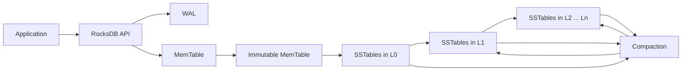
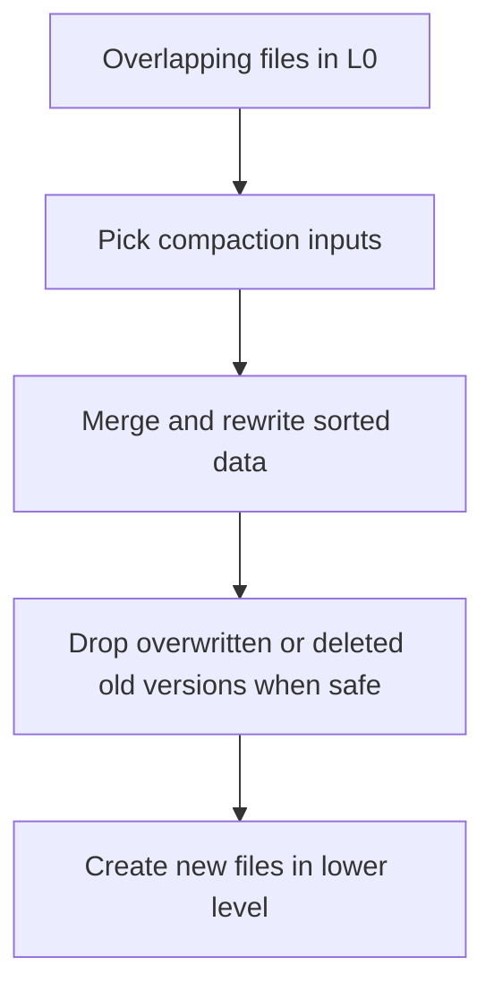

# RocksDB

**Name:** Lekhana Dinesh  
**Roll Number:** 24BCS10108

In this README, I study RocksDB as a storage-engine architecture rather than as a relational DBMS. RocksDB is very different from MySQL, PostgreSQL, and SQLite because it is an embeddable persistent key-value engine, not a server that speaks SQL. Its design choices revolve around the needs of write-heavy, flash-friendly, highly tunable storage systems. The central idea is the LSM-tree, and almost every important RocksDB behavior follows from that one design decision.

## Problem Background

RocksDB is built for applications that need a fast persistent key-value store inside their own process. Instead of asking the database to parse SQL, manage schemas, and expose a network protocol, the application calls an API such as `Put`, `Get`, `Delete`, `Write`, or `NewIterator`.

This is already a major difference from relational systems. In a relational DBMS, the engine must understand tables, joins, constraints, query plans, and many clients. In RocksDB, the engine focuses on ordered key-value storage, durability, snapshots, iterators, caching, and compaction. Higher-level structure is usually handled by the application or by another layer built on top of RocksDB.

RocksDB uses an LSM-tree architecture because it is especially good for write-heavy workloads on modern storage such as SSDs. A B+ tree engine often updates pages in place, which can lead to many random writes. An LSM-tree instead turns many small writes into sequential log appends and later merges them in the background. That improves write throughput, but it creates new trade-offs in read amplification, write amplification, and space amplification.

## Architecture Overview

At a high level, RocksDB writes into memory and a WAL first, then flushes sorted files to disk, and later compacts those files across levels.



This picture shows the write path clearly: incoming writes go into memory first, are protected by WAL, then are flushed to sorted string table files (SSTables), and later reorganized by compaction.

The read path also reflects the same layered design.


Reads are more complicated than writes because data may exist in memory, in recent files, or in deeper levels. Bloom filters and block cache exist mainly to keep this complexity from becoming too expensive.

## Internal Design

### 1. RocksDB as an embeddable persistent key-value engine

RocksDB is a storage engine library. The application links against it and uses its API directly. There is no separate server process by default, no SQL parser, and no relational optimizer.

This has two immediate consequences:

- integration overhead is low because the engine is embedded
- the application is responsible for much more of the data model

RocksDB is therefore often used as a storage layer inside a larger system rather than as the complete system by itself.

### 2. Why RocksDB uses an LSM-tree

The LSM-tree idea is to absorb writes in memory, append them safely to a log, and write them to disk later in large sorted batches. This is attractive for write-heavy systems because many small random updates are converted into more sequential work.

But the write is not "done forever" after one flush. The data may later be merged again during compaction. So an LSM-tree improves one part of the system by moving work into the background and spreading it over time.

This explains why RocksDB is usually chosen for write-heavy or update-heavy workloads, especially on fast flash storage.

### 3. Write path

The common write path is:

1. application issues `Put` or `Write`
2. RocksDB appends the change to the WAL for durability
3. RocksDB inserts the new key-value into the MemTable
4. when the MemTable fills, it becomes immutable
5. the immutable MemTable is flushed to an SSTable on disk
6. background compaction later merges SSTables across levels

This path is efficient because the first durable write is a sequential log append, not a random in-place page update.

### 4. MemTable and immutable MemTable

The MemTable is the active in-memory write buffer. New writes arrive here first. RocksDB's default MemTable implementation is skiplist-based, which gives good general performance for reads, writes, and scans.

When the MemTable reaches its configured limit, it becomes an immutable MemTable. That means it no longer accepts new writes, but it still exists until it is flushed to an SSTable.

This two-stage design is important because it allows writes to keep moving into a fresh active MemTable while the older one is flushed in the background.

The main trade-off is memory. Larger write buffers can improve write behavior, but they also delay flushes and can increase recovery and compaction pressure.

### 5. WAL

The WAL protects writes before they reach SSTables. If the process crashes after a write reaches the WAL and MemTable but before flush completes, RocksDB can recover by replaying WAL records.

RocksDB's WAL is also tied to flush behavior. WAL files can only be fully discarded after all relevant column families have flushed beyond the data contained in that WAL. This is one reason WAL lifecycle and flush lifecycle are connected.

In simple words: the WAL is the short-term durable history, and SSTables are the long-term durable organization.

### 6. SSTables

An SSTable is an immutable sorted file on disk. Because it is sorted, point lookups and range scans become practical even though the file is not updated in place.

Immutability is a big design win:

- readers can use SSTables safely without worrying about in-place modification
- files can be merged in the background
- crash recovery becomes easier than if many random in-place updates were happening everywhere

But immutability also creates duplication over time because newer versions of keys can coexist with older versions in different files until compaction resolves them.

### 7. Levels L0 to Ln

RocksDB organizes SSTables into levels. L0 usually contains the newest flushed files. Deeper levels contain older and larger data.

L0 is special because files there can overlap in key ranges. In deeper leveled organization, overlap is controlled much more tightly. This helps reads, but it requires compaction work.

Conceptually:

- L0: newest files, may overlap
- L1 and below: more organized structure
- deepest levels: older, larger, more stable data

This level structure is one of the main ways RocksDB manages the balance between write speed and read efficiency.

### 8. Read path

Reads in RocksDB are more complex than writes because data can be in many places:

- current MemTable
- immutable MemTables waiting to flush
- recent SSTables in L0
- deeper SSTables in lower levels

So a point lookup does not just "go to one page." RocksDB checks structures in order and stops as soon as it can confirm the newest visible value.

This is why read amplification is an important concept in LSM engines. A single logical read may involve multiple data structures unless the engine uses filters and caching effectively.

### 9. Bloom filters

Bloom filters reduce unnecessary SSTable reads during negative lookups. If the filter says a key definitely is not in an SSTable, RocksDB can skip opening the data block for that file.

This is especially useful when many files exist and the workload includes many lookups for missing keys or keys that are only in a small subset of files.

Bloom filters are not free:

- they consume memory
- they can return false positives
- they do not help if the data block must be read anyway

Still, for many workloads they are one of the most valuable read-optimization features in RocksDB.

### 10. Block cache

Block cache stores frequently read blocks in memory. Since SSTables are immutable, block caching works naturally on top of them.

The block cache is important because even with Bloom filters, positive lookups still need real data blocks. If those blocks are already cached, read latency improves significantly.

This is one reason RocksDB performance tuning is often really memory-budget tuning: write buffers, block cache, filters, and OS cache all compete for space.

### 11. MANIFEST and metadata

RocksDB needs a durable record of database state beyond just user data. It must know which SSTables exist, which levels they belong to, what sequence numbers are current, and what the latest consistent state is after restart.

That is the role of MANIFEST. It records version edits and metadata changes so RocksDB can reconstruct a consistent view of the database after restart.

This is easy to miss if we look only at key-value reads and writes, but metadata durability is just as important as user-data durability. Without it, RocksDB would not know which files belong to the latest consistent state.

### 12. Compaction

Compaction is the background process that merges SSTables, discards obsolete versions, resolves deletes, and reorganizes data across levels.

The following diagram shows the idea:



Compaction is central to RocksDB design. It is also where many trade-offs become visible.

Leveled compaction tends to reduce space amplification, but it can increase read and write amplification. Tiered or universal styles reduce some rewrite cost, but they may increase space and read cost. RocksDB supports different compaction styles because no single setting is best for every workload.

### 13. Snapshots

A snapshot captures a point-in-time view of the database. It is associated with an internal sequence number. Reads can use a snapshot to avoid seeing writes that happened later.

This is useful when the application wants consistent reads without blocking all writers. Snapshots do not persist across restarts, so they are runtime consistency tools, not long-term version history.

### 14. Iterators

Iterators allow ordered scans because RocksDB keeps keys in sorted order. An iterator can seek to a key and continue forward or backward.

This is one of the most useful reminders that RocksDB is not just a hash table on disk. Because it preserves key order, it can support range scans and ordered traversal. That makes it suitable for many storage-system use cases where sorted key space is important.

### 15. Column families

Column families let one RocksDB instance hold multiple logical key spaces with separate options and flush behavior while still sharing the same general engine.

This is powerful because different data classes may want different compaction behavior, cache priorities, or write-buffer sizes. But it also makes WAL, flush, and recovery behavior more complex because state must remain consistent across multiple families.

### 16. Read, write, and space amplification

These three forms of amplification are the heart of LSM trade-offs.

- **Read amplification:** one logical read may check multiple places
- **Write amplification:** one logical write may be rewritten many times by compaction
- **Space amplification:** multiple versions and pending compaction data can consume extra disk space

RocksDB tuning is often about deciding which amplification is most acceptable for the workload.

### 17. Comparison with B+ tree engines like InnoDB or PostgreSQL

B+ tree engines usually update storage pages in place and use WAL to protect those page updates. RocksDB instead logs writes, buffers them in memory, writes immutable sorted files, and compacts later.

That leads to a practical contrast:

- B+ tree engines often give simpler point-read paths but more random write pressure
- LSM engines often give faster sustained write behavior but more complex reads and background compaction

This is why RocksDB is often attractive for storage engines and write-heavy services, while B+ tree engines remain attractive for general-purpose relational systems with stable point reads, SQL planning, and rich transactions.

### 18. Where RocksDB is suitable

RocksDB is usually suitable for:

- write-heavy key-value workloads
- persistent storage inside larger systems
- metadata stores
- state stores in streaming or embedded systems
- systems that need ordered keys and range scans without a full SQL layer

It is less suitable when the main requirement is rich relational querying, joins, and centralized SQL service behavior out of the box.

## Design Trade-Offs

RocksDB is a storage engine built around explicit trade-offs. The engine is strong because it exposes those trade-offs clearly instead of hiding them.

| Design choice | Benefit | Cost / Limitation | Practical impact |
| --- | --- | --- | --- |
| LSM-tree architecture | High write throughput and flash-friendly behavior | Read and compaction complexity increase | Excellent for write-heavy systems |
| WAL + MemTable write path | Fast durable inserts without random in-place updates | Recovery and flush lifecycle must be managed carefully | Efficient first-stage write handling |
| Immutable SSTables | Safe concurrent reads and simple file-level merges | Old versions remain until compaction | Great for background organization, but not free |
| Leveled compaction | Lower space amplification and structured levels | More rewrite work can increase write amplification | Good when read efficiency matters |
| Tiered / universal style | Lower rewrite pressure in some workloads | Higher read or space amplification | Useful when write cost dominates |
| Bloom filters | Fewer unnecessary disk reads for misses | Extra memory and false positives | Important for negative-lookups and many-file workloads |
| Block cache | Faster repeated reads | Competes with write buffers for memory | Major read-performance tuning tool |
| Snapshots | Consistent point-in-time reads | Old versions may need to be kept longer | Helpful for background scans and consistency |
| Column families | Separate tuning within one DB instance | More complex flush and recovery interactions | Useful when one workload shape does not fit all keys |
| Embedded library model | Low deployment overhead and direct control | No built-in SQL server semantics | Best when the application wants engine-level control |

The main lesson is that RocksDB is not trying to be simple in every dimension. It is trying to be tunable and efficient for a particular class of workloads.

## Experiments / Observations

These experiments are written as runnable examples for a local RocksDB build. I have marked this output as sample/expected because I did not run this experiment locally.

### Experiment 1: `db_bench fillrandom`

**Purpose.**  
To observe the basic write path and the effect of buffered writes.

**Command.**

```bash
./db_bench --benchmarks=fillrandom --db=/path/to/rocksdb-fillrandom
```

**Expected observation.**  
The benchmark should spend most of its time appending to WAL, inserting into MemTables, flushing filled MemTables to SSTables, and triggering background compactions as the database grows. If the write workload is large enough, compaction activity should become increasingly visible in logs or statistics.

**What it proves.**  
It shows that RocksDB turns small logical writes into a staged pipeline rather than into repeated in-place page updates.

### Experiment 2: `db_bench readrandom`

**Purpose.**  
To observe point-lookups after the database has been populated.

**Command.**

```bash
./db_bench --benchmarks=readrandom --db=/path/to/rocksdb-fillrandom
```

**Expected observation.**  
If the workload has a warm block cache, repeated reads should get faster and rely more on cached blocks. If Bloom filters are enabled, missing-key lookups should avoid some unnecessary SSTable reads. If there are many L0 files or compaction is behind, read cost should feel heavier because more structures must be checked.

**What it proves.**  
It shows why RocksDB read performance depends not only on raw storage speed but also on compaction health, filters, and cache.

### Experiment 3: `db_bench overwrite`

**Purpose.**  
To observe what happens when existing keys are updated repeatedly.

**Command.**

```bash
./db_bench --benchmarks=overwrite --db=/path/to/rocksdb-fillrandom
```

**Expected observation.**  
New versions of existing keys should keep entering the write path quickly, but the engine must eventually clean up older versions during compaction. The foreground write path may still look smooth, while background compaction becomes more important over time.

**What it proves.**  
It shows that RocksDB handles updates by creating newer versions and resolving them later, not by editing one final location in place.

### Experiment 4: Manual compaction observation

**Purpose.**  
To observe how explicit compaction changes file organization and read/write trade-offs.

**Command.**

```bash
./ldb compact --db=/path/to/rocksdb-fillrandom
```

If compaction is triggered from application code, the equivalent idea is calling `CompactRange`.

**Expected observation.**  
After manual compaction, the number of overlapping files should usually reduce and key ranges should become better organized in deeper levels. Reads may become more predictable afterward, but the compaction itself can consume significant CPU, I/O, and temporary disk space.

**What it proves.**  
It proves that RocksDB performance is not only about writing data once. Long-term behavior depends on how well the LSM tree is maintained.

## Key Learnings

Learning RocksDB changed the way I think about storage engines.

- RocksDB is not a relational DBMS; it is a building block.
- The LSM-tree is the reason writes can be very fast, but it also creates the need for compaction.
- MemTable, WAL, SSTables, filters, and cache are one connected design, not separate optimizations.
- Compaction is not background decoration; it is central to correctness, space management, and read behavior.
- Read, write, and space amplification are the right lens for understanding RocksDB trade-offs.
- RocksDB is powerful because it exposes many tuning choices, but that also means users need to understand the workload.

My biggest takeaway is that RocksDB is really a system for shaping storage behavior over time. It accepts complexity in background maintenance so that the foreground write path can stay fast and scalable.

## References

1. [RocksDB Overview](https://github.com/facebook/rocksdb/wiki/RocksDB-Overview)
2. [MemTable](https://github.com/facebook/rocksdb/wiki/Memtable)
3. [Write Ahead Log (WAL)](https://github.com/facebook/rocksdb/wiki/Write-Ahead-Log-%28WAL%29)
4. [Compaction](https://github.com/facebook/rocksdb/wiki/Compaction)
5. [RocksDB Bloom Filter](https://github.com/facebook/rocksdb/wiki/RocksDB-Bloom-Filter)
6. [Block Cache](https://github.com/facebook/rocksdb/wiki/Block-Cache)
7. [Snapshot](https://github.com/facebook/rocksdb/wiki/Snapshot)
8. [Iterator](https://github.com/facebook/rocksdb/wiki/Iterator)
9. [MANIFEST](https://github.com/facebook/rocksdb/wiki/MANIFEST)
