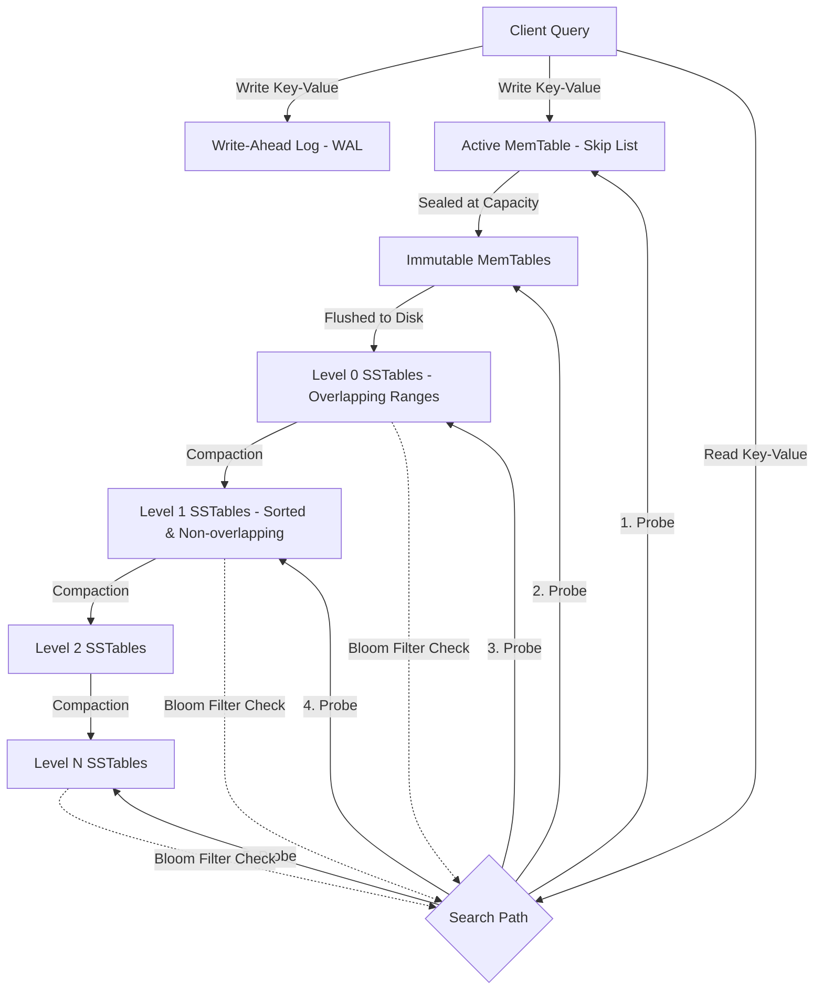

# RocksDB LSM-Tree Storage Engine — Architecture & System Design

**Roll Number:** 24BCS10230  
**Name:** Parth Taneja  

---

## 1. Problem Background

RocksDB is an embeddable, persistent key-value store optimized for fast, low-latency storage. Developed by Facebook in 2012 as a fork of Google's LevelDB, RocksDB was designed to scale efficiently on multi-core processors and modern Solid State Drives (SSDs). 

Traditional relational database engines (like MySQL InnoDB or PostgreSQL) are built on B-Tree structures. While B-Trees provide fast reads, they suffer from a **random write bottleneck** because updates require modifying pages in arbitrary disk locations. Under write-heavy workloads, this results in significant disk head movement and write stalls.

RocksDB solves this challenge by using a **Log-Structured Merge Tree (LSM-Tree)** architecture. LSM-Trees convert random writes into sequential writes by buffering changes in memory before flushing them to disk as sorted, immutable files. This design maximizes write throughput and minimizes write latency, making it the preferred choice for time-series ingestion, event logging, and caching backends.

---

## 2. High-Level Architecture

The diagram below outlines how write and read queries flow through RocksDB's in-memory structures and its persistent on-disk LSM-Tree levels:



### Flow of a Write Operation:
1.  **Durable Logging:** The incoming write is sequentially appended to the Write-Ahead Log (WAL) on disk to ensure durability.
2.  **In-Memory Buffer:** The key-value pair is written to the **Active MemTable** (implemented as a sorted skip list).
3.  **Freezing:** When the active MemTable reaches its capacity, it is frozen to become an **Immutable MemTable**, and a new active MemTable is initialized to accept writes.
4.  **Flushing:** A background thread flushes the immutable MemTable to disk as a **Level 0 (L0)** Sorted String Table (SSTable) file.
5.  **Compaction:** Background threads merge and push SSTables to deeper levels (L1 to LN) to reclaim space and maintain sorted ordering.

### Flow of a Read Operation (Point Lookup):
1.  **MemTable Search:** The read path first checks the **Active MemTable**.
2.  **Immutable MemTable Search:** If not found, it checks any pending **Immutable MemTables** in memory.
3.  **L0 SSTable Scan:** If still not found, it probes the **Level 0 SSTables** on disk. Because L0 key ranges overlap, multiple files might be read.
4.  **Leveled SSTable Search:** It then checks deeper levels (L1 to LN). At each level, it performs a binary search on the non-overlapping key ranges. **Bloom Filters** are probed first to skip files that do not contain the target key, reducing disk reads.

---

## 3. Detailed Internal Design

### 3.1. MemTable & Immutable MemTable
The MemTable is the primary write buffer in memory.
*   **Skip List Structure:** By default, RocksDB uses a **Skip List** to store key-value pairs. Skip lists support efficient concurrent reads and $O(\log N)$ insertion and search times.
*   **Sealing and Flushes:** When the MemTable exceeds `write_buffer_size` (typically 64 MB), it is marked as an **Immutable MemTable** (read-only).
*   **Sorted Output:** Because keys are already sorted in the skip list, flushing to disk creates a pre-sorted SSTable file, bypassing any sorting overhead.

### 3.2. Write-Ahead Log (WAL)
To prevent data loss from system crashes, the WAL is appended sequentially before memory updates take place.
*   **Durability:** The write is acknowledged once the WAL record is synced to disk.
*   **Crash Recovery:** During startup after a crash, RocksDB replays the WAL to reconstruct the in-memory MemTables. Once the MemTable is flushed to an SSTable on disk, its corresponding WAL segment is safely deleted.

### 3.3. SSTables (Sorted String Tables)
SSTables are the sorted, immutable data files stored on disk.
*   **Block Layout:** Each SSTable file contains:
    *   **Data Blocks:** Stores sorted, compressed key-value records.
    *   **Index Block:** Maps key ranges to data block offsets for fast binary searching.
    *   **Bloom Filter Block:** Probabilistic check to see if a key is in the file.
    *   **Footer:** Stores offsets and checksums to locate the indexes.
*   **Immutability:** SSTables are never modified in place. Deletions are handled by writing a special marker called a **Tombstone**. The actual deletion of the old record and the tombstone happens later during compaction.

### 3.4. Level Hierarchy (L0 to Ln)
Data pages are organized into multiple storage levels, from Level 0 up to Level N.
*   **Level 0 (L0):** Freshly flushed SSTables. Since they are direct copies of memory buffers, L0 files can contain overlapping key ranges.
*   **Levels 1 to N:** Keys do not overlap among files within the same level. Each level has a capacity limit that scales exponentially (typically 10x larger than the previous level, e.g., L1 = 10 MB, L2 = 100 MB, L3 = 1 GB).

### 3.5. Compaction Subsystem
As files accumulate, background threads run **Compaction** to merge files, discard overwritten keys, remove tombstones, and promote data to deeper levels.

| Compaction Style | Mechanism | Write Amp | Read Amp | Space Amp | Best Use Case |
| :--- | :--- | :--- | :--- | :--- | :--- |
| **Leveled (Default)** | Merges overlapping files in Level $N$ with files in Level $N+1$. Non-overlapping ranges are strictly enforced. | Higher | Lower | Lower | Balanced read/write workloads |
| **Universal (Size-Tiered)** | Merges sorted runs of similar sizes together. No strict levels. | Lower | Higher | Higher | Write-heavy ingestion |
| **FIFO** | Deletes the oldest files when size limits are reached. No merge logic. | Minimal | N/A | Low | Cache or TTL data |

### 3.6. Bloom Filters
Bloom Filters are space-efficient, probabilistic data structures.
*   **Mechanism:** They determine if a key is *definitely not* in an SSTable, or if it *might be* in the SSTable.
*   **Lookup Performance:** Point lookups consult the Bloom Filter block in memory first. If the filter returns false, RocksDB skips reading the file entirely, avoiding random disk reads for keys that do not exist in that file.

### 3.7. Concurrency Model and Column Families
*   **Write Batching (Group Commits):** Concurrent write threads are grouped together. A single thread appends the batch to the WAL in one sequential I/O operation, reducing disk write latency.
*   **Column Families:** Logical partitions of data within a single database instance. Each column family uses its own MemTable and levels but shares the WAL, allowing different compaction styles to run on different datasets.

---

## 4. Architectural Trade-Offs

### 4.1. The Amplification Triangle (Write-Read-Space)
LSM-Tree engines must navigate the trade-offs between three types of amplification:

```
                      Write Amplification (WA)
                                ╱  ╲
                               ╱    ╲
                              ╱      ╲
      Read Amplification (RA) ──────── Space Amplification (SA)
```

1.  **Write Amplification (WA):** The ratio of bytes written to storage relative to user writes. High WA wears out flash memory and limits throughput.
2.  **Read Amplification (RA):** The number of disk reads required to satisfy a single read request. High RA increases latency.
3.  **Space Amplification (SA):** The ratio of physical disk usage relative to logical data size. High SA indicates obsolete versions and tombstones are consuming space.

| Storage Engine | Write Amplification | Read Amplification | Space Amplification | Access Model |
| :--- | :--- | :--- | :--- | :--- |
| **RocksDB (LSM-Tree)** | Higher (due to levels merges) | Higher (probes multiple files) | Lower (compact, sorted files) | Sequential I/O |
| **InnoDB (B-Tree)** | Lower (WAL + page write) | Lower (direct tree path) | Higher (fragmentation/empty space) | Random I/O |

### 4.2. Compaction Choice and Write Stalls
*   **Leveled Compaction** maintains low read and space amplification but causes high write amplification because data is rewritten multiple times.
*   **Universal Compaction** reduces write amplification but increases read and space amplification since multiple overlapping runs exist.
*   **Write Stalls:** If background compaction threads cannot keep up with incoming write rates, RocksDB will deliberately throttle (stall) client writes. This prevents Level 0 from growing too large, but it can introduce unexpected write latency spikes.

---

## 5. Experimental Observations

Representative benchmark results are shown below. Actual values vary depending on hardware, dataset size, compression settings, and compaction configuration.

### Benchmarks Setup
To evaluate performance trade-offs under different workload profiles, `db_bench` is typically invoked with configurations like:
```bash
# Evaluate Leveled Compaction (Default style 0)
./db_bench --benchmarks=fillrandom,readrandom --num=1000000 --value_size=512 --compaction_style=0

# Evaluate Universal Compaction (Style 1)
./db_bench --benchmarks=fillrandom,readrandom --num=1000000 --value_size=512 --compaction_style=1
```

### Comparison Matrix
The relative performance characteristics observed under Leveled and Universal compaction styles are summarized below:

| Compaction Strategy | Random Write Throughput | Random Read Throughput | Write Amplification (WA) | Space Amplification (SA) |
| :--- | :--- | :--- | :--- | :--- |
| **Leveled** | Moderate | Higher | Higher | Lower |
| **Universal** | Higher | Lower | Lower | Higher |

### Observations and Analysis:
1.  **Write Throughput Analysis:**
    Universal Compaction yields higher random write throughput compared to Leveled Compaction. This is because Universal compaction groups files based on size and merges them less frequently, resulting in a lower write amplification factor.
2.  **Read Throughput Analysis:**
    Conversely, random read performance is lower under Universal Compaction. Because Universal compaction permits multiple overlapping files, point lookups may need to consult more files, which increases read amplification.
3.  **Space Efficiency:**
    Leveled Compaction maintains low space amplification because obsolete records and tombstones are cleared quickly during progressive merges. Universal Compaction leads to higher space amplification since overwritten key versions remain on disk longer before a merge is triggered.

---

## 6. Suggested Questions Addressed

### 6.1. Why are LSM trees preferred in write-heavy workloads?
LSM-Trees are optimized for writes because they write to disk sequentially. In traditional B-Tree engines (like InnoDB), a write requires updating random pages in place, causing slow random I/O.
In an LSM-Tree:
*   Writes are appended sequentially to a Write-Ahead Log (WAL) on disk, which is fast.
*   Writes are buffered in memory (MemTable) in sorted order.
*   Memory buffers are periodically flushed to disk as contiguous sequential blocks (SSTables).
By converting random writes into sequential writes, LSM-Trees maximize write throughput.

### 6.2. Why can compaction become expensive?
Compaction is computationally expensive because it is an I/O-intensive operation. It requires background threads to:
1.  Read multiple SSTable files from disk.
2.  Decompress and sort the key-value pairs in memory.
3.  Discard overwritten records and tombstones.
4.  Compress and write the merged data back as new SSTables.
This constant reading, sorting, and rewriting causes high write amplification and competes for CPU and disk I/O with active client queries, which can trigger write stalls.

### 6.3. How do Bloom Filters improve read performance?
Because LSM-Trees distribute data across multiple SSTables and levels, a point lookup search must check multiple files, causing high read amplification.
A Bloom Filter is loaded into memory for each SSTable. It is a space-efficient filter that can determine if a key is definitely absent from the file. If the filter returns false, RocksDB skips reading the index and data blocks of that file. This limits the number of disk reads, improving lookup performance.

---

## 7. Key Takeaways

1.  **Writes are Converted to Sequential I/O:** RocksDB achieves high write throughput by buffering writes in memory and writing them sequentially to disk, bypassing B-Tree random-write bottlenecks.
2.  **Compaction Strategy Dictates Performance:** The performance profile is highly dependent on the chosen compaction style. I observed that Leveled compaction prioritizes read speeds and space savings, whereas Universal compaction maximizes write ingestion speeds.
3.  **Bloom Filters are Crucial for Reads:** In LSM-Trees, Bloom Filters are necessary to prevent read amplification by checking membership in memory before accessing physical disk blocks.
4.  **No Single Strategy Eliminates Trade-offs:** The write-read-space amplification triangle is a fundamental constraint. Improving write throughput (low WA) via Universal compaction increases search times (high RA) and disk usage (high SA).
