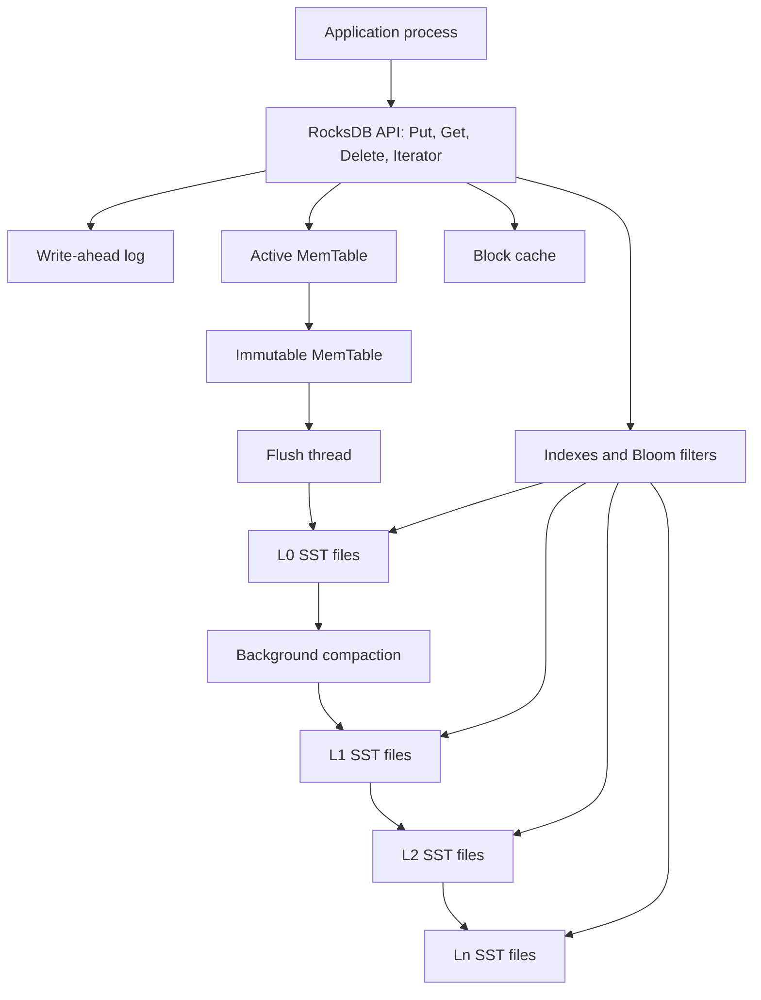
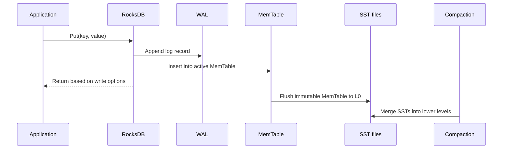
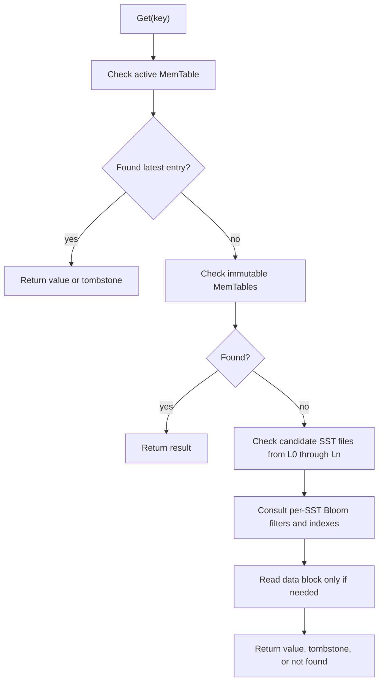

# RocksDB Architecture

## 1. Problem Background

RocksDB is an embeddable persistent key-value store based on a Log-Structured Merge tree. It is not a SQL server. Applications link RocksDB as a storage engine and store key-value data in a local directory.

The design problem is: how can a local storage engine absorb many writes while keeping durable state, point lookups, ordered iteration, snapshots, and bounded space usage?

RocksDB optimizes the foreground write path by writing to memory and usually to a WAL first. It then flushes immutable memory tables into sorted string table files and uses background compaction to reorganize those files across levels. This shifts cost from random in-place updates into compaction and read amplification management.

## 2. Architecture Overview



The three core physical structures are the MemTable, the WAL, and SST files. The MemTable absorbs writes in memory. The WAL makes those writes recoverable before flush. SST files persist sorted data on disk.

## 3. Internal Design

### MemTable and Immutable MemTable

New writes go into the active MemTable. When it reaches a configured size, RocksDB makes it immutable and creates a new active MemTable so foreground writes can continue. A flush thread writes immutable MemTables into SST files.

The trade-off is memory versus flush frequency. Larger MemTables can reduce flush pressure and produce larger sorted runs, but they consume more memory and can lengthen recovery if many WAL records must be replayed.

### SSTables

An SST file is an immutable sorted file. RocksDB's block-based table format stores sorted key-value entries in blocks plus metadata such as indexes and optional filters. Since SSTs are immutable, updates and deletes do not modify old files immediately; newer entries or tombstones supersede older entries until compaction removes obsolete data.

### WAL

The WAL records writes before they are safely represented in flushed SST files. On restart, RocksDB can replay the WAL to rebuild MemTables. Write options can trade durability latency against throughput, for example by controlling sync behavior.

### Transaction Processing and Concurrency Control

RocksDB's basic write API is key-value oriented, not SQL transactional processing. A single `Put` or `Delete` is atomic for that key, and `WriteBatch` can apply multiple updates atomically and in order. This matters when an application maintains related keys, such as a primary record plus a secondary lookup key.

Durability is controlled by write options. A synchronous write waits until the WAL reaches persistent storage. A non-sync write can be much faster, but a machine crash can lose recent updates that reached the operating system buffer but not storage. Disabling WAL goes further and accepts process-crash data loss for that write.

Concurrency is also an embedded-engine decision. RocksDB opens a database directory with a process-level lock, so the normal model is one process owning a DB instance. Inside that process, the same `DB` object can be shared by multiple threads; RocksDB performs the needed internal synchronization. Objects such as iterators and write batches are not generally safe to share without external locking. Snapshots provide consistent read-only views, and the separate transaction APIs (`TransactionDB` and `OptimisticTransactionDB`) add conflict detection when an application needs multi-key transactional semantics.

### L0 to Ln Levels

Flushes create L0 files. L0 files may overlap in key range. In leveled compaction, files in lower levels are organized so nonzero levels have less overlap. Compaction picks files, merges key ranges, discards overwritten or deleted entries when safe, and writes new SST files to lower levels.


### Bloom Filters

When configured, RocksDB stores Bloom filters for SST files. A Bloom filter can say a key is definitely absent or may be present. That is useful for point lookups because it can avoid reading data blocks from SST files that cannot contain the key. More bits per key reduce false positives but consume memory and storage.

### Compaction

Compaction is the core background cost of LSM design. It reduces read amplification by limiting how many files must be checked, reduces space amplification by dropping stale versions and tombstones, and can increase write amplification because the same logical data may be rewritten multiple times as it moves through levels.



### Read Path



The read path is more complex than the write path because the newest version of a key may be in memory, L0, or a deeper SST file. Bloom filters, indexes, and block cache are therefore important for point lookup performance.

## 4. Design Trade-Offs

| Design choice | Benefit | Cost |
| --- | --- | --- |
| LSM write buffering | Fast sequential-friendly ingestion | Compaction debt later |
| WAL | Recovery before flush | Extra write I/O unless disabled |
| Immutable SST files | Simple crash-safe file lifecycle | Updates leave stale versions until compaction |
| Bloom filters | Fewer unnecessary SST reads | Extra memory and space |
| Leveled compaction | Controls read and space amplification | Higher write amplification |
| Universal compaction | Can reduce write amplification for some workloads | Can increase read and space amplification |

RocksDB tuning is usually discussed in terms of three amplification metrics:

- Write amplification: storage bytes written divided by logical bytes written.
- Read amplification: storage or block reads needed to answer a lookup.
- Space amplification: on-disk database size divided by logical live data size.

No compaction strategy wins all three at once. A write-heavy workload may accept more read amplification. A read-heavy workload may pay more compaction cost to keep lower read latency.

## 5. Experiments / Observations

I ran these observations in a temporary Debian container using the `rocksdb-tools` package, RocksDB 7.8.3, and `db_bench`. The CPU reported by `db_bench` was AMD Ryzen 5 7535HS. I kept the data directories under `/tmp` inside the container and removed them with the container.

Command shape:

```bash
db_bench \
  --db=/tmp/rocksdb-level \
  --benchmarks=fillrandom,compact,readrandom,stats \
  --num=80000 \
  --reads=80000 \
  --value_size=256 \
  --key_size=16 \
  --threads=1 \
  --compression_type=none \
  --compaction_style=0 \
  --bloom_bits=10 \
  --statistics=1 \
  --write_buffer_size=1048576 \
  --target_file_size_base=1048576
```

I repeated the same run with `--compaction_style=1` for universal compaction. A fresh check on the same command shape produced the following metrics. I treated the ratios below as proxies, not device-level storage traces:

- Logical write payload: `80,000 * (16 byte key + 256 byte value) = 21,760,000 bytes`.
- Estimated live payload: `readrandom found keys * 272 bytes`. `fillrandom` can overwrite random keys, so this is more realistic than assuming all 80,000 generated keys remained distinct.
- WAF proxy: rounded cumulative compaction bytes written divided by logical write payload.
- RAF proxy: block-cache bytes read divided by estimated live payload returned by found random reads.
- SAF proxy: final DB directory bytes divided by estimated live payload.

| Compaction style | `fillrandom` | `readrandom` | Compaction stats | Bloom useful | Approx WAF / RAF / SAF |
| --- | --- | --- | --- | --- | --- |
| Level | 91,785 ops/sec, 23.8 MB/s | 286,379 ops/sec, 46.8 MB/s, 50,422 found | 0.07 GB written, 0.06 GB read | 29,281 | WAF about 3.2x, RAF about 8.2x, SAF about 1.06x |
| Universal | 135,542 ops/sec, 35.2 MB/s | 241,510 ops/sec, 39.5 MB/s, 50,395 found | 0.07 GB written, 0.05 GB read | 29,269 | WAF about 3.2x, RAF about 8.1x, SAF about 1.06x |

The fresh run also reported final directory sizes of `14,470,502` bytes for level compaction and `14,545,520` bytes for universal compaction. I noticed that both runs had `rocksdb.bloom.filter.useful` around 29k, meaning Bloom filters avoided many unnecessary SST data-block probes for absent keys. The level run reported `rocksdb.block.cache.bytes.read = 112,394,000`; the universal run reported `111,600,432`.

Observed files included `.log`, `MANIFEST`, `OPTIONS`, and `.sst` files:

```text
000095.log
000102.sst ... 000115.sst
CURRENT
MANIFEST-000005
OPTIONS-000007
```

In this tiny run, both compaction styles had similar WAF and SAF proxies. I found the read result more interesting: universal compaction wrote slightly faster during `fillrandom`, while level compaction read faster during `readrandom`. The read amplification proxies were close because both runs had similar live data size and block-cache bytes read. This is not a general benchmark result, but it illustrates that compaction strategy changes where cost appears.

### Limitations

This was a small single-threaded local run with 80,000 keys, no compression, warm container state, and temporary storage. I used it to understand RocksDB mechanics, not to produce production tuning advice.

## 6. Key Learnings

1. I learned to view RocksDB as an embedded LSM-tree storage engine rather than a smaller version of a SQL server.
2. The foreground write path was simpler than I initially expected: WAL plus MemTable. Most of the complexity appears later.
3. It was interesting to see how much of the system is really about background work: flushes, SST levels, and compaction decide whether the simple write path remains sustainable.
4. Bloom filters made the read path feel more practical. They do not remove the need to search SST files, but they can avoid many unnecessary data-block reads.
5. Compaction is the main trade-off I would watch in RocksDB. It controls stale data and read cost, but it creates write amplification.
6. My final takeaway is that RocksDB performance claims need workload context: device, cache state, key distribution, value size, compression, and compaction settings all matter.

## References

Accessed on 2026-06-23.

- RocksDB Repository: [facebook/rocksdb](https://github.com/facebook/rocksdb)
- RocksDB Wiki: [RocksDB Overview](https://github.com/facebook/rocksdb/wiki/RocksDB-Overview)
- RocksDB Wiki: [Basic Operations](https://github.com/facebook/rocksdb/wiki/Basic-Operations)
- RocksDB Wiki: [Transactions](https://github.com/facebook/rocksdb/wiki/Transactions)
- RocksDB Wiki: [Leveled Compaction](https://github.com/facebook/rocksdb/wiki/Leveled-Compaction)
- RocksDB Wiki: [Compaction](https://github.com/facebook/rocksdb/wiki/Compaction)
- RocksDB Wiki: [RocksDB Bloom Filter](https://github.com/facebook/rocksdb/wiki/RocksDB-Bloom-Filter)
- RocksDB Wiki: [Block-Based Table Format](https://github.com/facebook/rocksdb/wiki/Rocksdb-BlockBasedTable-Format)
- RocksDB Wiki: [SST Format Tutorial](https://github.com/facebook/rocksdb/wiki/A-Tutorial-of-RocksDB-SST-formats)
- RocksDB Wiki: [Memory Usage in RocksDB](https://github.com/facebook/rocksdb/wiki/Memory-usage-in-RocksDB)
- RocksDB Wiki: [RocksDB Tuning Guide](https://github.com/facebook/rocksdb/wiki/RocksDB-Tuning-Guide)
- RocksDB Wiki: [Statistics](https://github.com/facebook/rocksdb/wiki/Statistics)
- RocksDB Wiki: [Compaction Stats and DB Status](https://github.com/facebook/rocksdb/wiki/Compaction-Stats-and-DB-Status)
- RocksDB Wiki: [Benchmarking Tools](https://github.com/facebook/rocksdb/wiki/Benchmarking-tools)

Footnote: Mermaid diagrams drafted with Claude assistance.
