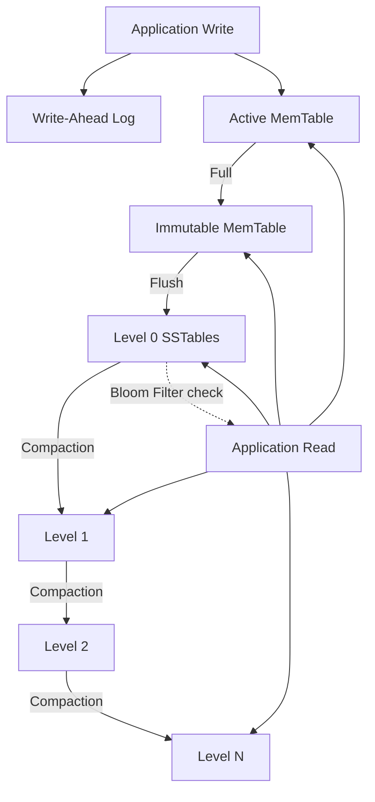

# RocksDB Storage Engine: Architectural Details and System Design

## 1. Background and Design Context

Google's LevelDB, released in 2011, introduced an embeddable key-value store structured around the Log-Structured Merge Tree (LSM-tree). It optimized write performance by converting random I/O operations into sequential disk writes. Facebook forked LevelDB in 2012 to develop RocksDB, re-engineering the database engine to run efficiently on multi-core processors and fast SSD storage. Facebook later introduced MyRocks, integrating RocksDB as a MySQL storage engine. This replaced InnoDB for their core user databases and reduced disk footprints by roughly 62%.

The core goal of RocksDB is to handle high-frequency write operations while maintaining tunable read performance on modern SSDs and traditional disks, avoiding the random I/O overhead typical of B-Tree database engines.

---

## 2. Global Architecture & Pipeline



### Write Path Flow

1. Write entries are written sequentially to the Write-Ahead Log (WAL) on disk for durability.
2. The key-value pairs are stored in the active MemTable, an in-memory sorted skip list.
3. Once the active MemTable matches its size limits, it freezes into an immutable MemTable, and a new active MemTable is opened.
4. Background worker processes flush the frozen MemTable to disk as a sorted, immutable Level 0 SSTable file.
5. Background compaction merges and reorganizes SSTables, promoting data across levels (L0 → L1 → ... → Ln).

### Read Path Flow

1. Query the active MemTable.
2. Scan any frozen, immutable MemTables.
3. Query SSTable files from L0 downwards. For each level, Bloom filters exclude files that do not contain the target key.
4. Extract the newest version of the key found.

---

## 3. Subsystem Internals

### MemTable Structure

The MemTable buffers incoming writes in memory in sorted order, providing O(log n) insertions and lookups.

- When the active MemTable matches `write_buffer_size` (defaulting to 64 MB), it freezes and a new buffer is created.
- Multiple immutable MemTables can queue in memory waiting to be flushed (`max_write_buffer_number`).
- Because the skip list structure maintains sorted order, flushing generates a sorted SSTable without sorting overhead.

### Write-Ahead Log (WAL)

Incoming writes are recorded in the WAL before hitting the MemTable. If the host process terminates abruptly before a MemTable flush, RocksDB recovers state by replaying the log. The engine discards WAL files once the corresponding MemTable has been successfully flushed to an SSTable.

This Write-Ahead Logging pattern aligns with the durability strategies utilized by InnoDB (redo logs) and PostgreSQL (WAL).

### SSTables (Sorted String Tables)

SSTables are sorted, immutable files that serve as persistent storage on disk. Each SSTable contains:

- Data blocks - Compressed, sorted key-value structures.
- Index blocks - Map key intervals to data blocks to enable binary searches.
- Bloom filter block - A probabilistic layout to filter out non-existent keys.
- Metadata block & Footer - Stores checksums, properties, and compression statistics.

Since SSTables are immutable, updates and deletions write new entries or tombstones rather than modifying data in-place. Obsolete records are cleaned up during background compaction.

### LSM Levels (L0 → Ln)

- Level 0: Holds recently flushed SSTables. Since L0 files are direct dumps of MemTables, their key ranges can overlap.
- Levels 1 to N: Files at each level contain non-overlapping key ranges. Each level is configured to be exponentially larger than the preceding one (typically using a 10x ratio).

Because L0 files can contain overlapping ranges, a point lookup must check all L0 files. From Level 1 downwards, a binary search identifies the single target file per level.

### Compaction Strategies

Compaction runs in the background to merge SSTables, discard tombstones and old versions, and promote keys down the hierarchy.

| Compaction Style | Operation Detail | Write Amp | Read Amp | Space Amp |
|----------|-------------|-----------|----------|-----------|
| Leveled (default) | Merges overlapping files from Level L(n) into L(n+1). Files within a level have non-overlapping ranges. | High (~10–30x) | Low | Low |
| Universal (tiered) | Merges runs of similar file sizes. Focuses on minimizing rewrites. | Low (~5–10x) | High | High |
| FIFO | Discards the oldest SSTables once storage exceeds a threshold. No merges. | Low | N/A | Low |

Without compaction, deleted keys (tombstones) and older versions would consume disk space, Level 0 files would accumulate, and read latency would degrade.

### Bloom Filters

Each SSTable includes a Bloom filter. This probabilistic structure has a 0% false negative rate ("definitely not present") but a small false positive rate ("potentially present").

Point lookups query the Bloom filter before reading blocks from disk. A 10-bit-per-key Bloom filter keeps false positives around 1%. This reduces negative lookups from multiple disk read operations to memory-based filter checks.

### Concurrency and Column Families

- Concurrency is managed via write batching. A group commit protocol batches concurrent operations into a single sequential WAL write.
- Read paths are lock-free, using snapshots to query static states.
- Column Families partition a database logically. Each family maintains independent MemTables and SSTable levels while sharing a single WAL. This enables customized configurations (like compaction type or compression) for different data groups.

---

## 4. Architectural Trade-offs

### The LSM Amplification Triangle

LSM-trees balance three competing parameters. Optimizing for one introduces overheads in the other two:

| Amplification Type | Definition | LSM (RocksDB) | B-Tree (InnoDB) |
|--------------|-----------|----------------|-----------------|
| Write | Bytes written to disk vs bytes written by application | High (~10–30x due to compaction) | Low (~2–4x for WAL and page updates) |
| Read | Disk block reads per user read operation | High (searching across multiple levels) | Low (~1–3 block reads via index tree) |
| Space | Physical storage footprint vs raw data size | Low (1.1–1.5x under leveled compaction) | High (~1.5–2x due to fragmentation) |

RocksDB trades write amplification to achieve sequential write operations. B-Trees prioritize read latency, accepting higher random I/O overhead on write paths.

### LSM-Trees vs. B-Trees: Comparison

| Attribute | RocksDB (LSM) | InnoDB / PostgreSQL (B-Tree) |
|--------|--------------|---------------------------|
| Primary Optimizations | Write throughput, space efficiency | Point-read latencies |
| Write Pattern | Sequential, append-only disk writes | In-place random page updates |
| Target Workloads | Write-heavy ingestion, logging, time-series | Read-heavy transactional OLTP workloads |
| Garbage Collection | Background compaction cycles | InnoDB purge processes / Postgres VACUUM |
| Reads & Locks | Lock-free reads via snapshots | Snapshot isolation and shared/exclusive locking |
| Space Reclamation | Reorganized via file rewriting | Page-level block recycling |

### Leveled vs. Universal Compaction Choice

- Leveled Compaction is optimal for balanced workloads: it keeps read and space amplification low at the cost of higher write amplification.
- Universal Compaction is suited for write-heavy ingestion workloads, prioritizing minimal write amplification over read latency.
- FIFO Compaction fits transient cache data with TTL expirations, where old entries are dropped without merging.

### Write Stalling

If write volumes exceed compaction throughput, RocksDB throttles incoming writes to prevent Level 0 file accumulation. While this protects system stability, it can introduce latency spikes in production.

---

## 5. db_bench Benchmarks & Observations

### db_bench Operations

RocksDB provides `db_bench` to test storage configurations:

```bash
# Evaluate sequential write speeds
./db_bench --benchmarks=fillseq --num=1000000 --value_size=1024

# Evaluate random write performance
./db_bench --benchmarks=fillrandom --num=1000000 --value_size=1024

# Evaluate random read latencies
./db_bench --benchmarks=readrandom --num=1000000 --use_existing_db=1

# Evaluate mixed read and write concurrency
./db_bench --benchmarks=readwhilewriting --num=1000000 --threads=8
```

### Performance Observations

| Performance Metric | Sequential Write | Random Write | Random Read |
|--------|-----------------|-------------|-------------|
| System Throughput | High | High (comparable to sequential writes) | Moderate (due to multi-level searches) |
| Performance Bottleneck | Disk write limits | Compaction CPU / IO | Bloom filter accuracy, L0 file count |

Unlike B-Tree engines where random writes are slower due to page searches and splits, RocksDB handles random and sequential writes at similar speeds by converting all operations into sequential disk flushes.

### Compaction Profiling

Switching compaction style from Leveled to Universal:
- Increases write throughput (fewer write cycles).
- Increases disk space usage (longer retention of duplicate versions).
- Increases read latency (requires checking more runs).

You can evaluate these behaviors using `db_bench` with `--compaction_style=0` (leveled) and `--compaction_style=1` (universal).

---

## 6. Synthesis & Key Takeaways

1. **Sequential writes optimize throughput.** By buffering writes in memory and writing sorted blocks sequentially, RocksDB handles write-heavy workloads that saturate traditional B-Tree engines, trading off read amplification and background compaction cycles.

2. **Amplification limits are structural.** Write, read, and space amplification compete directly. Leveled compaction targets low space and read overhead, whereas universal compaction targets low write overhead. No configuration optimizes all three.

3. **Bloom filters are necessary.** Without Bloom filters, every read operation would search every level on disk. A 10-bit-per-key filter resolves ~99% of negative lookups in memory, preventing unnecessary disk I/O.

4. **Compaction requires resource allocation.** Compaction cycles consume CPU and disk I/O, which can trigger write stalls. Selecting the right compaction style is critical to aligning RocksDB with your workload requirements.

5. **Storage engine selection depends on workload.** RocksDB is designed for write-heavy key-value storage. B-Tree systems (like InnoDB and PostgreSQL) are optimized for transactional, read-heavy OLTP workloads.

---